# 3.OpsWorks 第二部分:数据库和缩放

现在我们有了一个正常工作的应用堆栈，我们可以开始真正地构建功能了。首先，我们必须将应用连接到数据库，这样我们就可以开始存储和检索内容。其次，我们将在堆栈中添加一个负载平衡器。最后，我们将为我们的应用设置一些自动伸缩行为，以便应用可以自动伸缩以满足需求的增长，具有弹性。

您应该还记得上一章中的内容，OpsWorks 堆栈中包含一个或多个层。在第 2 章中，我们创建了一个单层:应用服务器。我们将在本章中添加额外的层，这将完善设置 OpsWorks 的主要任务。我们将通过配置和附加一个高可用性的托管 MySQL 数据库来创建数据库层。我们还将在堆栈上附加一个负载平衡器，在多个 EC2 实例之间分配 web 流量。虽然我们将多次返回 OpsWorks 仪表板，但我们将与其他 AWS 服务一起构建我们应用的核心组件。

## 关系数据库服务

RDS 是 AWS 数据库服务产品之一，也是我们在这个项目中的选择。RDS 支持 MySQL，性价比高，可以作为服务层集成到 OpsWorks 中。与 EC2 类似，RDS 实例可以进行伸缩、克隆和性能问题监控。

敏锐的观察者会想，为什么我们不能创建一个新的 OpsWorks 层，并在一些 EC2 实例上运行 MySQL。OpsWorks 里不是有 MySQL 层类型吗？是的，有，你可以很容易地做到这一点。然而，RDS 不仅仅具有原始的计算能力。RDS 有一些很棒的特性，我们将在本章中进一步探讨。

如果您在 OpsWorks 的 MySQL 层中创建了一个 EC2 实例，那么您只是安装了必要的软件来在该实例上运行 MySQL 数据库。仍然由您来执行所有管理任务，最重要的是备份您的数据。您还可以根据需要安装软件更新。如果 MySQL 崩溃，或者实例出错，您将不得不手动恢复。

这些听起来都不吸引人，不是吗？幸运的是，RDS 可以为您自动完成所有这些任务！如果我们不得不做这么多的维护工作，我们就不会充分利用云或者利用我在过去两章中提到的优势。当您使用 RDS 实例时，您不必担心所有这些维护工作。对应用性能最重要的是错误恢复。当您创建 RDS 数据库时，您以与 EC2 实例相同的方式提供资源。您的数据库托管在特定区域内的特定可用性区域中。如果数据库层出现故障，而您正尝试手动恢复，这可能会导致整个应用长时间停机。RDS 不仅最大限度地减少了停机时间，还允许您在主实例停机时保持备份实例随时可用，这是一种称为多 AZ 部署的特性。

### 多 AZ 部署

当您的应用依赖于单个 RDS 数据库实例时，这自然会在您的应用中产生一个故障点:如果该可用性区域(或实例)出现故障，可能会导致您的堆栈出现全局故障。为了缓解这个问题，您可以使用多 AZ 部署。当您启用多 AZ 部署时，RDS 会自动在另一个可用性区域中提供备用数据库(参见图 [3-1](#Fig1) )，并通过同步过程将数据复制到备用实例。每次在数据库上执行写或提交操作时，在事务完成之前，也会在备用数据库上执行该操作。缺点是，与单个可用性区域部署相比，这会导致延迟略有增加。如果您的应用要求每秒进行数千次数据库写入，这种微小的延迟差异可能会变得很明显。请记住，这可能会在您的应用中构成有形的性能成本。多 AZ 部署的成本也更高，因为您实际上使用的资源是其他方式的两倍。

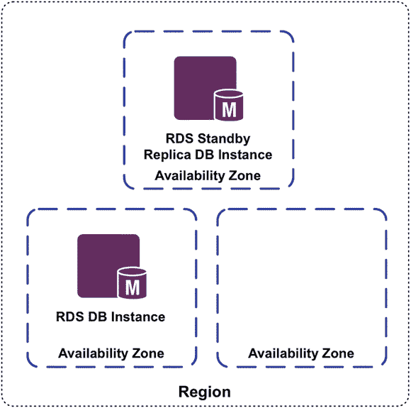

图 3-1。

Multi-AZ deployments

显然，多 AZ 部署需要进行成本效益分析。一方面，您不必担心通过手动启动数据库的备份副本来应对停机。任何不得不在周五晚上 11 点上班的工程师都知道这一点的价值。拥有一个完全最新的备份副本来运行您的应用并在几分钟内可用，这是一个技术奇迹，但一般人对此并不欣赏。另一方面，使用 Multi-AZ 会损失一点点写入速度，而且成本更高。如果 Multi-AZ 不值得花费，AWS 承诺 RDS 实例每月 99.95%的正常运行时间。如果您选择使用单个实例，您的应用将面临中断的风险。

然而，在我们这样的应用中，我们甚至可能不会注意到延迟的差异。我们的数据库模式很简单，查询也很简单。用户不太可能一次对每个用户执行大量的写操作，所以在我们的例子中，这似乎不是一个主要问题。事实是，虽然多 AZ 的好处可能是普遍的，但多 AZ 部署的性能成本取决于应用的性质以及预计的用户群规模和行为。

### 读取副本

正如刚才所讨论的，我们预计我们的数据库操作是读取密集型的。如果我们数据库上的大量读取操作(用 MySQL 术语来说，任何`SELECT`查询)成为我们数据库的瓶颈，这将对整个应用产生连锁反应。幸运的是，有一种方法可以将部分工作转移到另一个数据库实例，即读取副本。您可以创建这种类型的 RDS 实例(最多五个)，指定一个主数据库并为您的读取副本选择一个区域和可用性。从术语“副本”可以推断，这些实例应该与原始数据库拥有相同的资源。

在图 [3-2](#Fig2) 中，您可以看到读取副本是如何工作的。数据库读取可以路由到读取副本，读取副本以较低的查询量从主实例读取。任何写操作都会绕过读复制副本，转到应用堆栈的原始可用性区域中的主实例。使用读取副本可以将大量工作从主数据库实例转移到副本。如果主数据库只需要处理少量的读操作和所有的写操作，会有很大的好处。

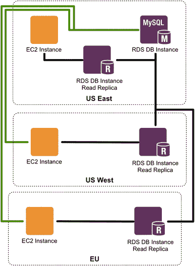

图 3-2。

Cross-Region Read Replica behavior. The green lines represent write operations, and the black lines represent read operations

正如您可能从图 [3-2](#Fig2) 中推测的那样，RDS 实际上支持在其他区域创建读取副本，具有一个称为跨区域读取副本的特性。灾难恢复场景有一个好处。如果由于某种原因，整个 AWS 区域发生了中断，您必须在另一个区域快速重新部署整个堆栈。为此，您可以将堆栈克隆到不同的区域，并将先前存在的读取副本之一提升为新的主数据库。否则，从区域性中断中恢复是可能的，但是这个特性只是使它变得更容易。

如果您只想将堆栈移动到不同的区域，跨区域读取副本在非灾难场景中也很有用。假设我们的应用在美国很失败，但在德国却很受欢迎。有理由将堆栈移动到离我们的用户群更近的地理区域。

由于 OpsWorks 旨在让您在单个区域部署堆栈，并使用其他服务来提高您在其他区域的性能，因此我们不会从跨区域读取副本中获得太多好处，除非我们计划应对区域性灾难。您将很快了解到有助于我们提高性能的其他服务，但不管怎样，了解一下这项功能还是有好处的。

PRICING

有了这些额外的功能，你可能会立即怀疑 RDS 的可负担性。的确，它比 EC2 定价要简单一些，你可以在这里看到: [`http://aws.amazon.com/rds/pricing/`](http://aws.amazon.com/rds/pricing/) 。主要区别在于:除了为处理器和内存(也就是实例的计算能力)付费之外，还需要为数据存储和数据传输付费。数据存储是指存储在实例中的原始数据量，数据传输是从数据库到应用层的输入/输出。与其他服务类似，这是一种按需付费的模式，但这里有很大的偏差空间。

### 调配 IOPS 存储

尽管我们已经选择了实例大小，但我们没有向 Amazon 提供我们想要执行多少输入/输出操作的信息，I/O 速度和容量是衡量数据库性能的关键指标。如果我们的流量在一个小时内从五个用户激增到五千个用户，每秒钟进行一次数据库查询，我们将依赖 AWS 来动态地自动提供额外的 I/O 容量。

如果您考虑一下查询数据库时会发生什么，这是有意义的。当突然出现超过数据库 I/O 容量的请求时，它们会被放入一个队列中，而 RDS 则试图跟上流量。与此同时，RDS 试图为您的实例增加 I/O 资源，这完全发生在 AWS 数据中心的幕后(也称为云中)。但是，分配额外的容量很可能需要一秒钟以上的时间，请求留在队列中的每一秒钟都是用户等待所请求数据的额外一秒钟。当流量减少时，资源会被取消分配，并且会对您使用的资源进行收费。

如果我们要管理性能预期，这似乎不是生产中的最佳想法。幸运的是，您可以使用调配的 IOPS 存储预留 I/O 资源(每秒输入/输出操作数)。当您使用调配的 IOPS 存储时，您会按存储卷和每秒 I/O 操作数来保留 IOPS 资源。虽然这比随用随付更昂贵(如果您不使用您提供的资源)，但提前预留资源可以保证在高流量期间保持一致的速度和性能。

让我们想象一下与之前相同的场景，只是使用了调配的 IOPS 存储。这一次，您保留了 10，000 IOPS 和 10GB 的存储空间。同样，您的流量从 5000 个用户激增到 5000 个用户，每秒钟进行一次数据库查询。在这种情况下，我们已经有足够的资源来处理双倍的 I/O 流量。当然，如果我们的流量翻倍，我们将再次陷入困境，但我们也可以为这种可能性做好准备。

### 数据库安全组

在创建数据库之前，我们必须创建一个 DB 安全组。如果我们的数据库在虚拟私有云中，公共访问将受到限制。因为我们没有使用 VPC，所以我们希望将数据库访问限制在应用堆栈中的 EC2 实例。因为我们也想在本地工作，我们将允许从我们的 IP 地址访问数据库。虽然您会从我们在身份和访问管理方面所做的工作中认识到这些概念，但我们实际上将在 RDS 中配置我们的安全组。

首先返回您的登录 URL，以您在第 1 章中创建的 photoadmin IAM 用户身份登录。从 AWS 控制台主页(或菜单)中，选择 RDS。您应该会看到类似于图 [3-3](#Fig3) 中的视图，其中显示了 RDS 仪表板最左边的两列。和往常一样，右边有一个专栏，其中有这里没有显示的其他链接和资源。

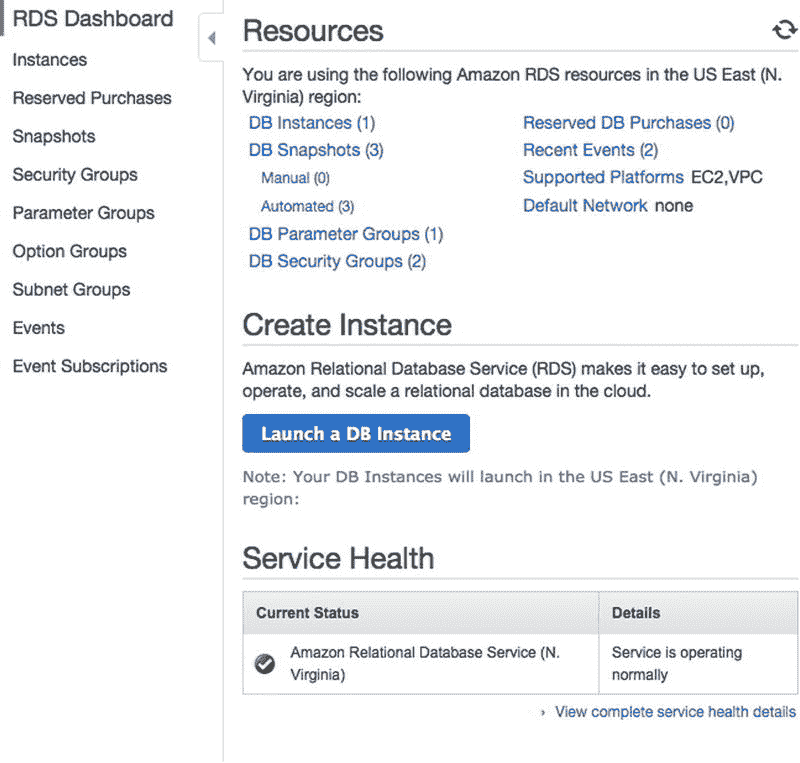

图 3-3。

The RDS dashboard

在左侧列中，单击安全组。在右侧，您会看到一个蓝色的大按钮，上面写着 Create DB Security Group。第一种观点很简单。您为您的安全组提供一个名称和描述(参见图 [3-4](#Fig4) )。

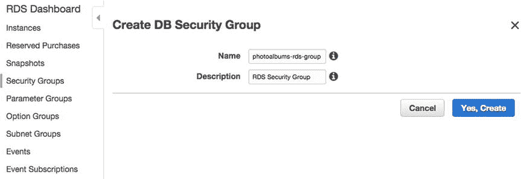

图 3-4。

Create DB Security Group view in the RDS dashboard

您可以将该组命名为 photoalbums-rds-group。描述可以是以后对你有用的任何东西。然后，单击是，创建。您将返回到 RDS 安全组视图，并且您应该看到您的组出现在表格中，如图 [3-5](#Fig5) 所示。

图 3-5。

Your RDS security groups

您会注意到状态栏中的红色文本“无授权”这意味着尽管该安全组已经创建并可以分配给 RDS 实例，但该组目前不提供对任何实例的访问。这是一个方便的警告，说明你在这里的工作还没有完成。

为您的安全组选择表行，您将能够创建一个新的连接类型，以便在您的安全组中进行授权。这两种类型是 CIDR/IP 和 EC2 安全组。我们将分别创建一个。

当您授权一个 CIDR/IP 时，您将列出一个特定的 IP 地址来连接到您的数据库。这对于开发来说是理想的，因为我们可以列出自己的 IP 地址来连接 RDS 实例。默认情况下，您将在字段中看到您当前的 IP 地址。如果你使用代理/防火墙，你必须禁用它，或者如果你在公司网络上，与网络管理员合作。如果您没有代理或在防火墙后面，请保留 CIDR/IP 地址不变，然后点按“授权”。否则，确定正确的 IP 并相应地更改值。请记住，如果您有一个动态 IP，您将不得不在每次 IP 地址刷新时重复这个过程。

您将在您的安全组旁边看到一个活动指示器，并且会出现一个新表，其中包含您的安全组的授权连接(参见图 [3-6](#Fig6) )。接下来，我们将创建一个 EC2 安全组类型的新连接。就像 RDS 一样，EC2 也有自己的安全组。事实上，我们的应用服务器层中的所有实例都是它们自己的安全组的一部分。

图 3-6。

DB Security Group, authorizing connections

从连接类型下拉列表中选择 EC2 安全组。您会注意到，除了您自己的帐户之外，您还可以选择另一个 AWS 帐户。在撰写本文时，Amazon 正在推出跨帐户连接，从而允许另一个 AWS 帐户上的 EC2 实例连接到您的数据库。保持此帐户处于选中状态，并在 EC2 安全组下拉列表中选择 AWS-OpsWorks-nodejs-AppServer，然后单击授权。现在，您应该在安全组的连接表中看到第二行。

### 创建 RDS 数据库

现在您有了一个 RDS 安全组，它将允许来自您的本地机器、您在 OpsWorks 中的应用服务器层的连接，而不允许来自其他地方的连接！事不宜迟，让我们继续创建我们的数据库层。在 RDS 主页屏幕上，您将看到一个蓝色的大按钮，邀请您启动一个 DB 实例。单击该按钮将带您进入多步实例设置。如图 [3-7](#Fig7) 所示，第一步是选择数据库引擎，在撰写本文时，它包括四个选项:MySQL、PostgreSQL、Oracle 和 SQL Server。这是显而易见的，因为我已经讨论过在我们的应用中使用 MySQL。单击选择并继续。

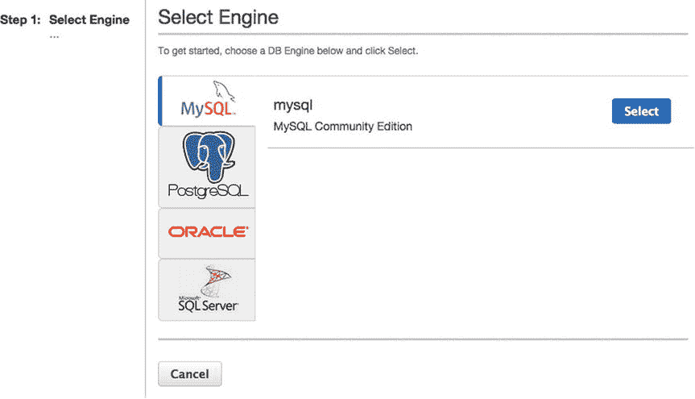

图 3-7。

RDS database engine selection

第 2 步很有趣，因为这是 AWS 就如何配置生产环境和开发环境给出明确建议的罕见场景之一。如图 [3-8](#Fig8) 所示，步骤 2 的标题是“生产？”对我们来说，答案是肯定的！

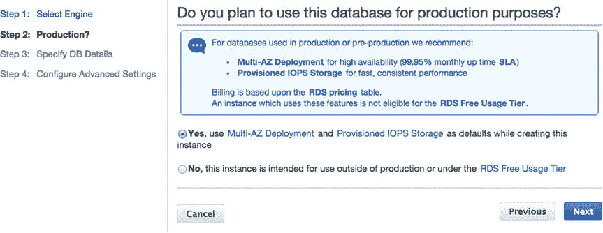

图 3-8。

Choosing to use an RDS instance in a production environment

如您所见，Amazon 强烈建议在生产环境中使用多 AZ 部署和调配的 IOPS 存储功能。我们会听从他们的建议，选择“是”，然后单击“下一步”。在第 3 步中，我们将配置我们的数据库细节(参见图 [3-9](#Fig9) )。

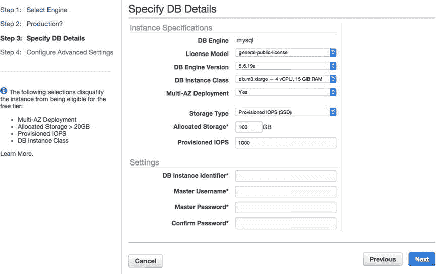

图 3-9。

RDS database details

#### 实例规格

License Model 字段可以保留为 general-public-license，也可以保留 DB 引擎版本。如果你需要一个特定的 MySQL 版本，你可以在这里选择。接下来，在 DB Instance Class 字段中选择实例的大小。出于我们的目的，db.t1.micro 应该可以工作。让我们保留多 AZ 部署和调配的 IOPS (SSD)。您可以现在选择磁性存储以节省资金，以后再切换到调配的 IOPS，但转换将需要不确定的时间。在这种情况下，AWS 控制台将显示一条消息，通知您在应用更改时，多 AZ 备份实例将正常工作。我艰难地认识到情况并不总是这样。

如果您听取了我的建议并选择了“已调配 IOPS ”,您必须选择您希望分配多少存储和多少 IOPS。当您选择“调配的 IOPS”作为存储类型时，将选择 100GB 存储和 1000 调配的 IOPS。亚马逊推荐 IOPS 与存储的比率在 3:1 到 10:1 之间。我们可以暂时不考虑这个设置。随着时间的推移，我们将为我们的应用建立一个操作历史，并根据我们对收集的指标的分析来扩大或缩小这些资源。

Note

在现实世界的应用中，在 AWS 提供的最小实例中使用所有这些 RDS 特性有点傻。我们选择 db.t1.micro 只是为了经济高效的实践。

#### 设置

如果您以前曾经建立过数据库，这些设置会很熟悉。您将为您的数据库设置唯一的标识符、用户名和密码。在数据库实例标识符中，输入 photoalbums。为了便于讨论，我们将主用户名命名为 admin。你实际上可以设置任何你想要的用户名和密码，只要你记住它！设置好凭据后，单击下一步。

#### 高级设置

步骤 4 将我们带到高级设置，您可以在图 [3-10](#Fig10) 中看到。在网络安全中，您将无法选择 VPC 或可用性区域。选择 photoalbums-rds-group 作为您的数据库安全组。在数据库选项中，您可以命名您的数据库相册。同样，数据库端口、参数组和选项组也不必更改。

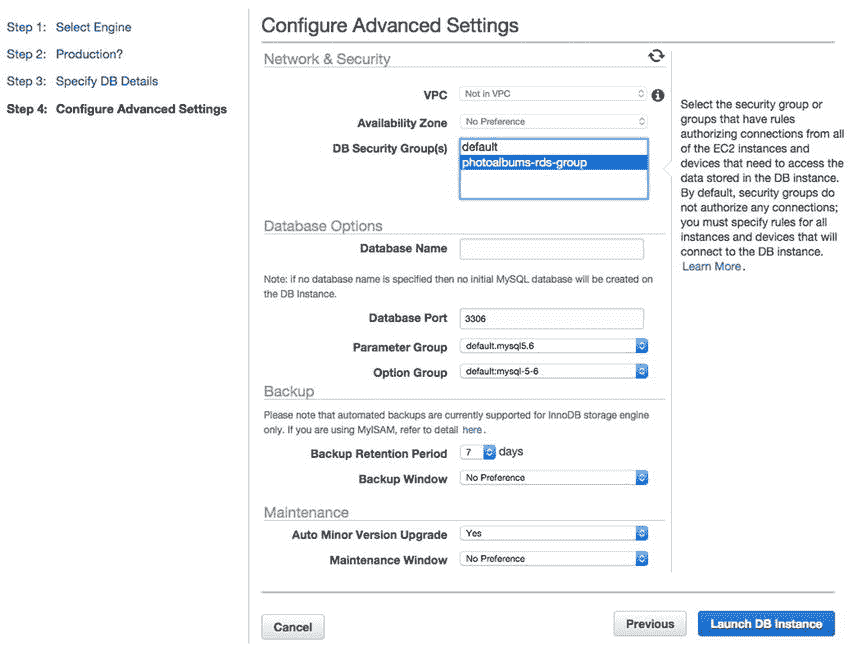

图 3-10。

RDS advanced settings

下一小节的标题是“备份”,从中可以为实例选择自动备份计划。RDS 将自动对您的实例进行每日备份(快照),您可以指定进行这些备份的窗口以及保留备份的时间长度。首先，选择一个备份保留期，默认为 7 天。这是亚马逊将保留备份的天数，从 0 到 35。如果选择 35，您将能够将您的实例恢复到过去 35 天拍摄的任何每日快照。万一发生灾难，有这些备份是很方便的。但是，如果您需要更多的长期备份，您将不得不手动生成它们(或者使用 AWS API 以编程方式)。

您还可以为您的数据库选择一个备份窗口。您可能希望在特定时间创建备份，例如在预期流量激增之前或之后。如果您没有偏好，它们将默认为深夜，此时流量预计会减少。没有首选项也可以，您同样可以将维护设置保留为默认值。单击启动数据库实例，这将带您到一个中间屏幕。单击以返回 RDS 仪表板，在这里您将看到您的数据库首先处于创建状态，然后是修改状态，然后是备份状态，最后是可用状态。

### 数据库导入

创建 RDS 实例时，让我们准备将本地数据库模式导入到 RDS 实例中。在第 1 章的[中，您看到在`/setup/photoalbums.sql`有一个 MySQL 数据库与示例项目打包在一起。我们将使用 MySQL Workbench 连接到 RDS 实例，并将该文件导入数据库。如果您喜欢使用另一个接口来连接 MySQL 数据库，那很好。我们使用 MySQL Workbench 只是因为它很简单。](1.html)

为了唤起您的记忆，我们创建了一个 RDS 安全组，该组只允许访问我们指定的 EC2 实例和您的个人 IP 地址。(如果您在多个地点工作，您必须向安全组添加更多 IP。)我们在该安全组中创建了一个 RDS 实例，我们将确保可以连接到该实例，此时我们将知道一切都按计划进行。打开 MySQL Workbench，或者你正在使用的任何 MySQL 客户端。在左上角，您应该会看到一个+按钮，单击它可以创建一个新的连接。您应该会看到如图 [3-11](#Fig11) 所示的窗口。将连接命名为相册 RDS。连接方法可以保持为 TCP/IP。我们将不得不参考 RDS 来填写剩余的字段。

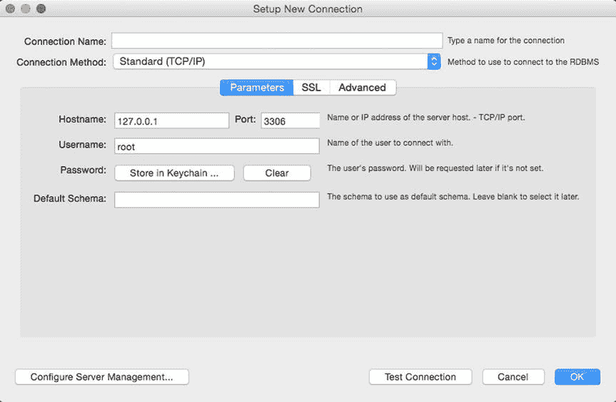

图 3-11。

Setting up a new connection in MySQL Workbench

成功创建实例后，RDS 将生成您的主机名。让我们回到控制台找到它。在 RDS dashboard 中，您应该在表视图中看到您的实例，其状态为绿色的 available。点击该行显示该实例的详细信息，如图 [3-12](#Fig12) 所示。

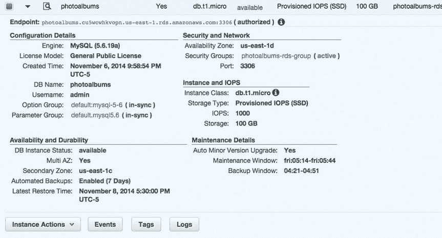

图 3-12。

RDS instance details

在正上方，您应该会看到端点。这是您可以在端口 3306 上连接到实例的 URL。只接受来自你的 IP 地址的连接。复制这个 URL 并将其粘贴到 MySQL Workbench 的 Hostname 字段中(粘贴时记得去掉`:3306`)。输入您之前选择的用户名和密码，然后单击确定。

MySQL Workbench 将自动打开到数据库的连接。我们现在准备从示例项目中运行 SQL 导出脚本。在文件菜单下，选择运行 SQL 脚本并导航到`.sql`文件。将出现一个窗口，显示 SQL 脚本的内容，让您选择更改默认模式名或默认字符集。在默认模式名称下拉列表中，选择相册。将字符集留空，然后单击运行。窗口应该将其副标题更改为 Output，输出应该如下所示:

`Preparing...`

`Importing photoalbums.sql...`

`Finished executing script`

`Operation completed successfully`

单击关闭按钮，并在左侧导航的 SCHEMAS 标题下找到相册数据库。按住 Control 键点按(或在 PC 上右键点按)相册，然后选择“全部刷新”。过一会儿，您应该能够展开 photoalbums 下的表格，并看到您已经在本地使用过的表格:相册、照片和用户(参见图 [3-13](#Fig13) )。我们很快就让它运行起来了，不是吗？现在，如果我们的应用也能连接到它就好了！

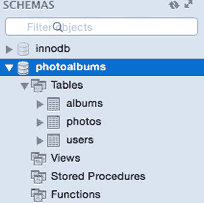

图 3-13。

The tables created on your RDS instance

### OpsWorks RDS 层

您应该记得，我在前面的第 2 章中讨论过 RDS 层。现在我们有了一个 RDS 实例，我们将把它注册到应用中。在 AWS 控制台中，返回到 OpsWorks 仪表板。选择您的堆栈，并从导航菜单中选择层。

您应该在列表中只看到一个层:Node.js App Server。下面，点击+层按钮。我们回到添加层视图，这一次，我们必须单击 RDS 选项卡来创建一个 RDS 层。该设置与您看到的应用服务器层略有不同，如图 [3-14](#Fig14) 所示。

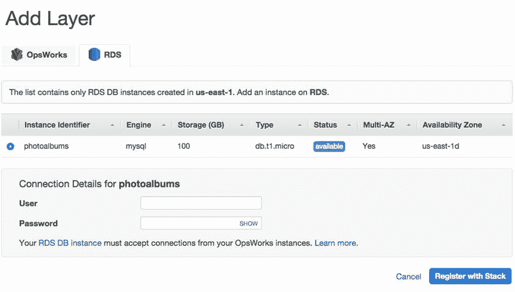

图 3-14。

Adding the RDS layer

相册实例被自动检测到，因为它在同一区域。你所要做的就是输入你的用户名和密码，然后点击注册堆栈。您将返回到 Layers 视图，现在您将看到在 App Server 层下面的 RDS 层，如图 [3-15](#Fig15) 所示。但是上面说没有 app 连接！

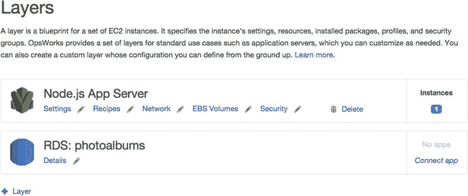

图 3-15。

Layers in our stack, with RDS layer added

为了将我们的应用连接到 RDS 层，我们必须将数据库设置为应用服务器的数据源。首先，单击连接应用，这将带您进入堆栈中的应用列表。在相册的操作列中，单击编辑，这将允许您编辑应用的一些设置。

第二个标题是数据源。您会注意到，目前数据源类型被设置为 None。单击 RDS 旁边的单选按钮；选择相册(mysql)作为数据库实例；并输入 photoalbums 作为您的数据库名称。它看起来应该与图 [3-16](#Fig16) 一模一样。暂时不要离开这个屏幕；我们在这里还有一件事要做。

图 3-16。

RDS selected as data source for the app

### 环境和环境变量

如前所述，我们的目标之一是将数据库凭证移出源代码。在第 1 章的[中，我讨论了如果团队成员离开或他/她的电脑被盗，将这些凭证存储在源文件中会带来怎样的安全风险。还有另一个需要考虑的原因，那就是交换我们堆栈中的数据库。到目前为止，您已经看到从头开始创建 RDS 实例是多么容易。将来，您将能够从现有的数据库实例中创建新的数据库实例，这将使您能够在出现严重故障时运行堆栈中的备份数据库。这还将使克隆整个堆栈和维护用于生产和开发的独立堆栈变得非常容易，这是一种强烈推荐的做法。通过遵循这些后续步骤，您将能够维护在所有这些场景下工作的代码，而不必部署代码更改或管理凭据。](1.html)

到目前为止，我主要讨论了两个环境:本地环境和生产环境。现实情况是，您的工作流可能包括在本地环境中编写和测试代码，然后在开发堆栈上部署和测试，最后部署到生产环境中。这涉及到要管理的三组凭证！如果我们在存储库的不同分支中保存不同的凭证，管理起来会很麻烦，并且很容易出现开发人员错误。相反，我们将使用环境变量来告诉我们的应用它在哪里运行。

如果你已经精通 Node.js，你会知道有一个名为`process.env`的全局对象，它存储了 Node.js 中关于用户环境的一些信息，你可以在这里找到关于这个的信息: [`http://nodejs.org/api/process.html#process_process_env`](http://nodejs.org/api/process.html#process_process_env) 。文档中的属性似乎都没有那么有用。还好我们可以给他们加！

在编辑应用时，向下滚动到环境变量标题，如图 [3-17](#Fig17) 所示，您会看到您可以在这里添加自己的键值属性。

图 3-17。

App Environment Variables

添加一个名为`ENVIRONMENT`的变量，并赋予其值`production`。如果/当你创建一个开发栈，你将改变这个值。继续并点击右下角的保存。我们现在已经设置了应用的数据源和环境变量`ENVIRONMENT`。

这个环境变量和`process.env`有什么联系？这是 Chef 的底层技术在幕后工作以使事情变得更简单的微妙方式之一，仅在 Chef 11.10 中可用。当您的应用部署到应用服务器层中的实例时，您设置的环境变量(最多 20 个)将包含在实例的部署脚本中。因为我们的应用是 Node.js，所以在部署过程中会将环境变量添加到`process.env`中。如果我们运行一个 PHP 应用，环境变量将可以通过`getenv($variableName)`访问。无论如何，应用设置中的这个接口为我们提供了一个简单的方法来动态设置所有实例中的环境变量，而无需进入服务器配置，也不会破坏我们应用的弹性。

接下来，在耽搁了很久之后，我们不得不回到我们的源代码。目前，源代码被硬编码到本地数据库中。如前所述，我们必须支持三种不同的环境。首先，打开您的代码编辑器到`/lib/globals.js`。找到`database`属性，它有本地主机的凭证。我们不想返回一个静态对象，而是想把`database`变成一个函数(嘿，因为它是 JavaScript，所以并不难！).因为这个文件中还没有其他内容，所以您会希望用清单 [3-1](#FPar3) 替换整个文件，但是要准备好您的本地凭证，因为我们不会完全丢弃它们。

Listing 3-1\. `/lib/globals.js`

`module.exports = {`

`applicationPort  : 80,`

`database : function(){`

`if(process.env.ENVIRONMENT){`

`var opsworks = require('./../opsworks');`

`var opsWorksDB = opsworks.db;`

`var rdsConnection = {`

`host : opsWorksDB.host,`

`port : opsWorksDB.port,`

`database : opsWorksDB.database,`

`user : opsWorksDB.username,`

`password : opsWorksDB.password`

`};`

`return rdsConnection;`

`} else {`

`var local = require('./../config/local');`

`var localConnection = local.db;`

`return localConnection;`

`}`

`}`

`}`

好了，这里发生了很多事情，我们来分解一下。首先，我们不是返回静态对象，而是检查`process.env.ENVIRONMENT`是否存在。如果是，我们不关心它是什么，我们将尝试从 OpsWorks 加载数据库凭证，因此出现了行`var opsworks = require('./../opsworks');`。

您会注意到我们的项目中没有这样的文件。在部署期间运行的`Configure` stack 命令动态编译我们项目根目录中的一个`opsworks.js`文件。当我们将 RDS 层连接到 Photoalbums 应用时，它会自动开始在该文件中存储数据库的凭据。这意味着，即使我们更改了该层使用的数据库实例，我们也可以通过在堆栈上运行`Configure`命令来更新凭证，稍后我们将回到这个问题。在`opsworks.js`文件中，数据库凭证存储在一个名为`db`的公共变量中。事实上，整个文件看起来有点像清单 [3-2](#FPar4) 。

Listing 3-2\. Sample `opsworks.js` file

`exports.db = {"adapter":"mysql",`

`"database":"ops_db",`

`"password":"AsdFGh3k",`

`"port":3306,`

`"reconnect":true,`

`"username":"opsuser",`

`"data_source_provider":"rds",`

`"host":"opsinstance.ccdvt3hwog1a.us-east-1.rds.amazonaws.com"`

`}`

`exports.memcached = {"port":11211,`

`"host":null}`

在理想情况下，`db`变量的语法应该与我们在`mysql` Node.js 模块中需要的语法相匹配。可悲的是，这两者略有不同。为此，我们实例化了一个名为`rdsConnection`的变量，并将值重新映射到它。然后，返回`rdsConnection`变量。

在没有设置`process.env.ENVIRONMENT`的情况下，我们希望保留我们的本地数据库凭证。在您的项目中，创建一个名为`config`的目录和一个名为`local.js`的空文件。使用您的本地数据库凭据，将以下内容粘贴到其中:

`module.exports = {`

`db : {`

`host : 'localhost',`

`port  : 8889,`

`database : 'photoalbums',`

`user : 'root',`

`password  : 'root'j`

`}`

`}`

我希望这有意义。我们将本地凭证移动到一个单独的文件中，只有在没有找到`process.env.ENVIRONMENT`的情况下，我们才会从`globals.js`中读取这个文件。现在，因为我们把`globals.database`改成了`globals.database()`，我们将不得不在几个地方修复它。在`server.js`中，导航到文件的底部，并在这一行中进行更改:

`var connection  = mysql.createConnection(globals.database());`

保存更改，然后我们必须更改所有三个模型文件顶部的声明:`model-users`、`model-photos`和`model-albums`。在所有三个文件中，将第 3 行改为:

`var connection = mysql.createConnection(globals.database());`

为了强调这一点，我们所做的只是在`database`后面加上一个“`()`”。

现在，我们将对凭据管理进行最后的收尾工作。我们将让我们的代码库忽略我们的本地凭证，这样它们就不会被推送到 repo，不会与其他开发人员共享，也不会被部署到应用服务器。如果您使用 Git，打开文件`.gitignore`并添加下面一行:

`/config/local.js`

保存此更改。如果您使用的是 SVN，您同样希望忽略该文件。将所有这些更改提交到您的存储库中，并返回到 OpsWorks。在保存了最后的更改后，您应该会返回到应用的详细视图。您应该会在右上角看到一个蓝色按钮，上面写着部署应用。点击按钮，进入部署应用视图。这里你唯一需要改变的是添加对你有用的注释(见图 [3-18](#Fig18) )。

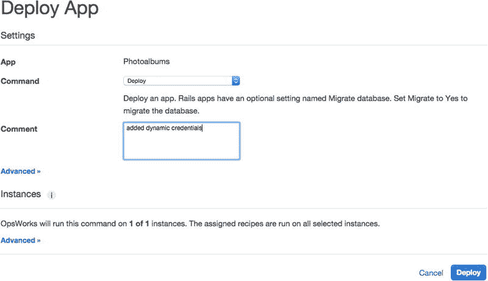

图 3-18。

The Deploy App view

单击右下角的 Deploy，等待部署完成。如果几分钟后失败，请点按“日志”栏中的“显示”,看看是否能发现错误。如果您的主机名旁边有一个绿色的复选标记，那么您应该有一个应用现在连接到您的数据库。单击 nodejs-app1，向下滚动到 Network Security，找到您的实例的公共 IP。点击它，你应该回到你的 Hello World 屏幕。现在将`/users/`添加到 URL 中。

如果你看到一对空括号，恭喜你！您请求了所有用户，但收到的都是零。这意味着您的应用服务器能够连接到 RDS 实例，查询数据库，并返回结果。如果您看到的是一条错误消息，那么很遗憾，一定有什么地方出错了。检查打字错误，如果你没有发现，试着追溯你的步骤。

### 堆栈命令:备份场景

我简要讨论了堆栈命令的概念，这是一个 OpsWorks 工具，用于在堆栈中的所有实例上运行命令。这些命令本质上抽象了 Chef 的底层技术，让我们可以控制所有实例，如果我们必须单独管理实例，这将更加困难。我们将使用一个数据库场景来更深入地探讨这个问题。

#### RDS 快照

假设您的数据库处于错误状态，并且您无法让它重新联机。随着时间的推移，您的用户无法访问您的应用。您的多 AZ 备份没有按预期工作，从应用服务器到 RDS 层的每个查询都返回一个错误。您和您的团队一致认为，最好的做法是部署一个备份数据库，让您的应用重新上线。在传统的堆栈中，完成这一任务所涉及的管理任务可能是一场噩梦，会导致应用长时间停机。幸运的是，我们可以通过使用 OpsWorks 节省大量的时间和精力。

我们要做的第一件事是获取数据库的快照，我们将用它来生成新的实例。如果实例中的实际数据没有问题，我们现在就可以拍摄快照；否则，您最好使用 RDS 生成的自动快照。导航到 RDS 仪表板并选择 DB Instances 选项卡。从表中选择您的实例，单击“实例操作”按钮以显示“操作”菜单，然后选择“拍摄数据库快照”。

系统将提示您命名快照。自动快照前面有 rds:前缀。将快照命名为 photo albums-Snapshot-[YYYYMMDD]，然后单击是，拍摄快照(参见图 [3-19](#Fig19) )。

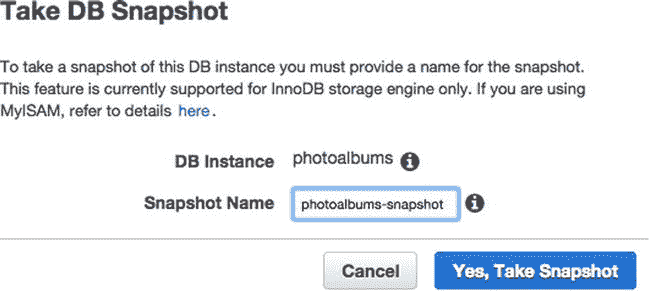

图 3-19。

Taking an RDS DB snapshot

您将进入快照视图，在该视图中，您的快照将处于正在创建状态。您还可以在此视图中看到一些自动备份。在我们继续本课之前，您需要等待快照完成。

快照完成后，我们将创建一个新实例。从列表中选择快照，然后单击顶部的恢复快照。您将看到一个名为 Restore DB Instance 的视图，尽管您会认出最初创建 RDS 实例时的界面。因为我们只是运行一个练习，所以您可以使用另一个 db.t1.micro 实例并禁用多 AZ 部署。您可以将实例命名为 photoalbums-failover，然后单击启动数据库实例(参见图 [3-20](#Fig20) )。

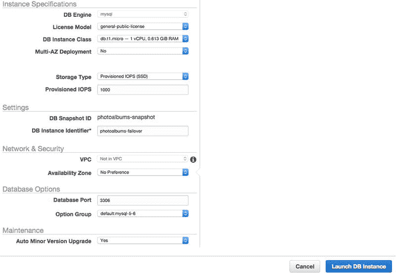

图 3-20。

Restoring a DB instance from a snapshot

同样，我们需要等待一段时间来创建实例。当状态变为可用时，我们可以开始将其部署到堆栈中。

#### 创建新的 RDS 层

返回 OpsWorks，访问相册堆栈。打开导航菜单并选择层。单击 RDS photoalbums 图层查看该图层的详细信息。在我们将备份数据库添加到堆栈之前，我们将取消注册这一层。在右上角，单击“取消注册”按钮。系统将提示您确认是否要取消注册该层。单击红色的取消注册按钮后，您将被带到 Resources 视图，此时该视图为空。

在 Resources 标题下，有一个按类型筛选资源的子菜单:卷、弹性 IP 和 RDS。单击 RDS，您将在您的资源中看到一个空的 RDS 实例表。在右上角，单击注册 RDS 数据库实例。这似乎与我们之前创建图层的方式相反，但我们只是在 OpsWorks 的指导下通过不同的工作流程完成相同的流程。之前，我们创建了一个 RDS 层，然后添加了一个 RDS 资源。这一次，我们将添加一个 RDS 资源，然后自动生成一个层。

您将在一个表中看到您的两个 RDS 实例。选择 photoalbums-failover，在表格下方的连接细节面板中输入您的数据库凭证，如图 [3-21](#Fig21) 所示。这些应该与原始数据库的凭据相同，因为该实例是从该实例的快照创建的。然后，单击向堆栈注册。

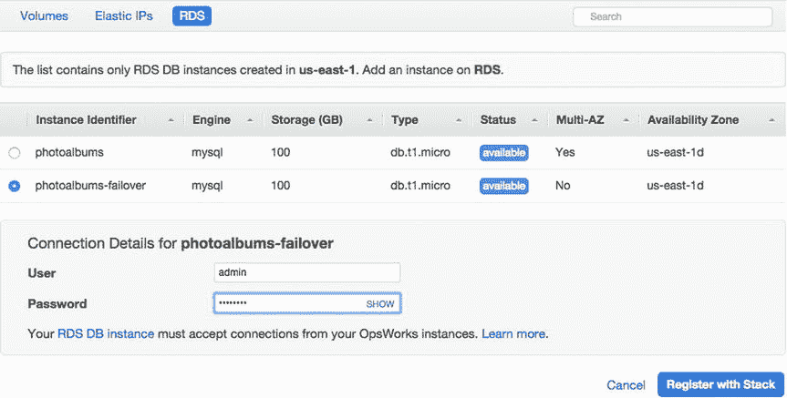

图 3-21。

Adding an RDS resource to the stack

#### 将新数据库层连接到应用

再次打开导航菜单，并选择层。您应该会看到一个新的 RDS 层已添加到您的堆栈中，这一次名为 RDS: photoalbums-failover。您会再次注意到，您有一个未连接到任何应用的 RDS 图层。单击连接到应用，这将再次将您带到应用表。在相册旁边的行中，单击编辑。

同样，您必须为您的应用设置数据源。将数据源类型从 None 更改为 RDS。当您这样做时，您应该会看到 photoalbums-failover(mysql)出现在一个下拉列表中，并且有一个数据库名称的空字段。在数据库名称字段中键入 photoalbums，然后单击右下角的保存。

#### 运行堆栈命令

我们从数据库的快照中创建了一个新的 RDS 实例，一个新的 OpsWorks 层，并将其连接到我们的应用。您还记得，在部署的配置阶段，RDS 层的凭证被复制到我们的 EC2 实例中。为了更新我们的凭证，我们必须在实例上再次运行`Configure`命令，然后部署以将新凭证推送到实例。

打开导航菜单，并选择堆栈。您将返回到堆栈的详细视图。在右上角，您将看到一个标题为“运行命令”的按钮，您可以单击它。在“运行命令”视图中，您可以从命令列表中进行选择，向命令添加注释，并选择在哪些实例上运行命令。从命令下拉菜单中选择配置，如图 [3-22](#Fig22) 所示。在“注释”字段中，键入给自己的消息，如“已配置的 RDS 故障转移实例凭据”在视图的右下角，单击配置以运行命令。

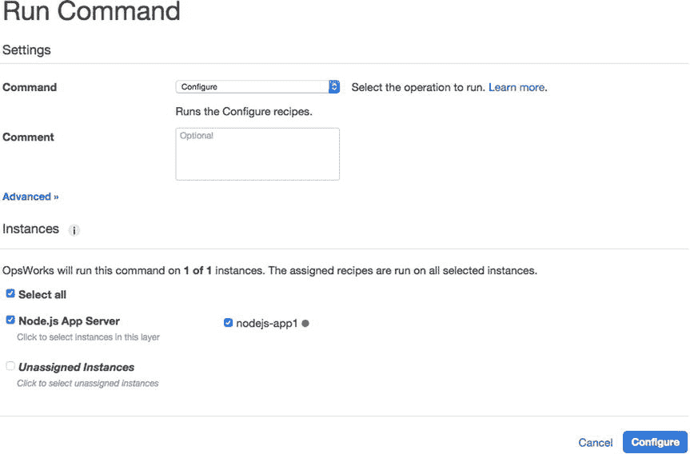

图 3-22。

Running the `Configure` command

您将看到一个标题为运行命令 configure 的视图，在该视图中，当命令正在执行时，您可以在 EC2 实例旁边看到一个活动指示器。一旦命令完成，应用源代码根目录中的`opsworks.js`文件将会使用新的凭证进行更新。接下来，运行`deploy`命令将代码更改部署到实例中，并重启应用。

你可以想象这个工作流程有多有用。我们能够在几分钟内将应用移动到备份数据库，而无需修改任何代码。当然，这样做也意味着您的应用要在您要换出的数据库上运行几分钟，因此，如果您的数据库包含时间敏感的信息，这在理想情况下不是您需要使用的过程。

看待该特性的另一种方式是，它为您提供了两种执行数据库维护的方式。如果您必须增加数据库存储、转换存储类型或进行一些其他重大配置更改，您的应用可能会出现一些中断。一方面，您可以对现有数据库进行更改(总是先拍摄快照)，并让 AWS 使用多 AZ 特性在维护过程中自动使用故障转移数据库。

或者，您可以创建一个快照，并使用您想要的配置更改从快照创建一个新的数据库。然后，您必须将数据库实例添加到 OpsWorks 堆栈中，然后运行`Configure`和`deploy`命令。

既然本教程已经完成，让我们回到原来的数据库。在 OpsWorks 中，导航到图层并单击 RDS 图层的标题。在右上角，单击“取消注册”,并确认从堆栈中分离数据库。再次从层屏幕，点击+层。选择 RDS 选项卡，并从下面的 RDS 实例列表中选择相册。重新输入数据库凭据，然后单击向堆栈注册。当您返回“层”屏幕时，再次点按“连接应用”，然后点按应用服务器旁边的“编辑”。向下滚动到数据源，并将数据源类型更改为 RDS。选择原始数据库实例和数据库名称。单击保存。

从导航菜单中选择堆栈，然后在右上角单击运行命令。将命令更改为 Configure，然后单击右下角的按钮。最后，导航到应用，然后单击相册旁边的部署。然后单击右下角的 Deploy，让部署运行。现在，我们连接回了原始数据库，如果需要，您可以删除故障转移。

## 弹性负载平衡(ELB)

此时，我们的应用运行在一个 EC2 实例上。我们知道，虽然我们的实例可以扩展到更大的规模，但这可能不足以处理应用的传入流量。此外，更改 EC2 实例的大小会导致服务中断，这是我们希望避免的。

如果您曾经广泛使用 Node.js，您会知道许多服务器端错误会使您的应用崩溃，这需要重新启动应用。虽然 OpsWorks 会自动重启你的应用，但一个错误就让你的整个应用离线，哪怕只有几秒钟，都是一种耻辱。

这两个问题的解决方案是在多个实例上运行我们的应用。用 AWS 术语来说，这可以通过负载平衡器或弹性负载平衡(ELB)来实现。借助 ELB，流量可以在多个 EC2 实例之间和多个可用性区域之间自动重定向。如果一个实例崩溃，或者处于所谓的不健康状态，ELB 将停止向该实例发送流量，直到它恢复健康。这种自动化的便利性不能被夸大。如果一个实例变得不健康，您不必担心手动将其从堆栈中删除，以免流量被路由到处于错误状态的服务器。

在图 [3-23](#Fig23) 中，您可以看到负载平衡器将如何在我们的应用堆栈中工作。流量将被路由到 ELB，然后它将流量定向到各个实例，并将响应转发回请求者。

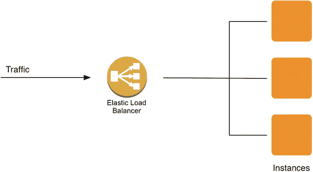

图 3-23。

An ELB routing traffic to three EC2 instances Note

ELB 还可以用来调节应用两层之间的内部流量，而不仅仅是 Web 和应用服务器之间的流量。

此外，使用 ELB 为我们提供了另一种评估应用健康状况的有用方法。我将在稍后讨论监控，但目前，我们可以对云中的服务器健康问题进行概念性分析。如果您的应用堆栈中有 10 台服务器，那么随时监控所有实例的健康状况将是一项相当艰巨的任务。如果一个实例离线，是否会立即引起重大关注？如果你在一百台服务器上运行这个应用会怎么样？如您所见，随着移动部件的增多，需要分析的信息也越来越多。我们可以监视 ELB 的各种指标，而不是单独监视每个实例。

### 创建负载平衡器

ELB 在 AWS 中没有自己的控制面板。相反，它们在 EC2 的一个子部分中进行管理。返回 AWS 控制台并导航到 EC2。在左侧导航中的网络和安全标题下，单击负载平衡器。然后，在屏幕顶部，单击创建负载平衡器。创建负载平衡器向导将在一个模态窗口中打开，如图 [3-24](#Fig24) 所示。

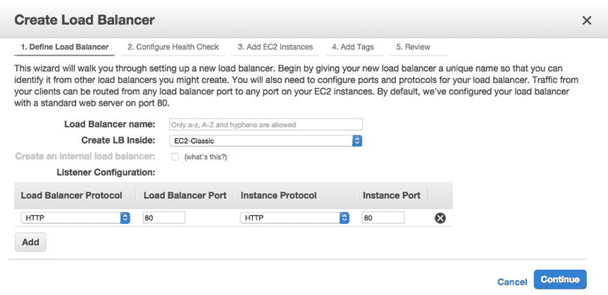

图 3-24。

Create Load Balancer wizard

#### 定义负载平衡器

在向导的第一个屏幕上，您可以将负载平衡器命名为 photoalbums-elb。“创建 LB 内部”下拉列表可以保留为 EC2-Classic。只有在虚拟专用云中创建 ELB 时，才需要更改此字段。接下来，您必须打开端口，负载平衡器可以通过这些端口处理流量。默认情况下，端口 80 在选择 HTTP 协议的情况下打开。如果您还记得，这也是您的应用正在侦听的端口。您可以离开并继续，然后单击“继续”继续。

#### 配置运行状况检查

之前，您第一次听到健康和不健康这两个术语来描述实例。这些都不是经验性的术语，事实上，要由我们来定义。在下一步中，我们将确定 EC2 实例在什么条件下可以被认为是健康的，什么时候可以被认为是不健康的。ELB 将对分配给它的每个实例执行常规运行状况检查。

我们将为这些健康检查定义参数，这将包括 ELB 将从每个实例请求的相对路径。您可以在图 [3-25](#Fig25) 中看到健康检查参数。

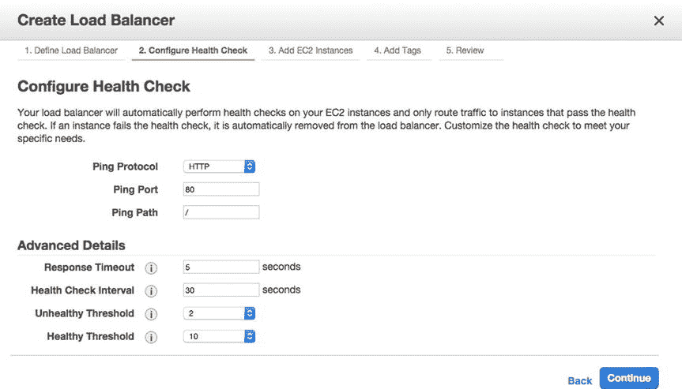

图 3-25。

Configuring an ELB health check

首先，我们配置 URL 请求，或 ping。Ping 协议应该是 HTTP，Ping 端口应该是 80，和我们的 app 监听的一样。最后，Ping 路径是在每个实例上发送请求的路径。将此更改为`/`，这将请求我们应用的 Hello World 页面。`/index.html`的默认值将从我们的应用返回一个 404 错误。

高级细节是运行状况检查的更主观的参数。首先，我们有响应超时。每次对 EC2 实例执行 pinged 操作时，负载平衡器都会测量从实例接收响应所需的时间。如果实例响应缓慢或完全没有响应，它将无法通过一次运行状况检查。默认响应超时是五秒。对于我们的 Hello World 页面，预计它的生成时间不到五秒钟似乎是合理的。事实上，我们可能会进一步减少，但 5 是安全的。

接下来，我们必须确定运行状况检查的执行频率，或者运行状况检查的时间间隔。默认值为 30 秒，这意味着当实例在线时，运行状况检查将每 30 秒执行一次。

一个健康的实例可能偶尔无法通过一次健康检查。由于多种因素，它可能会响应缓慢。我们没有必要因为一个缓慢的响应就从池中删除一个实例。相反，我们希望设置一个不健康的阈值，在这个点上，实例实际上被认为处于不健康状态。默认情况下，该阈值为 2，健康阈值为 10。这些阈值如此不同的原因是为了谨慎起见。一旦一个实例变得不健康，我们不想过早地认为它是健康的。如果负载平衡器过早地认为实例是健康的，就会有更多用户收到错误响应或根本没有响应的风险。

最后，我们的健康检查规则是这样的:

*   确定实例不正常最多需要 70 秒。
    *   五秒响应超时，每 30 秒两次
*   确定实例再次正常运行需要 350 秒。
    *   五秒响应超时，每 30 秒，十次

当然，这些只是默认值。如果您想更积极地响应某个实例的缓慢性能，您可以改为每十秒运行一次健康检查。您还可以在五次而不是十次成功检查后，决定将实例安全地放回池中。决定您的策略是一门独立的科学，由您的应用的性质、您的应用堆栈的架构以及您的应用的操作历史决定，这意味着随着时间的推移评估您的堆栈的性能可以帮助您做出更好的决策。

单击继续进入下一个屏幕，在这里您将向负载平衡器添加实例。

#### 添加 EC2 实例

现在，我们只添加我们之前创建的单个 EC2 实例。选择实例，并确保启用了“启用跨区域负载平衡”。如果启用，您的负载平衡器可以将流量路由到多个可用性区域中的实例。我们已经讨论了跨可用性区域分配资源的优势，因此我们肯定希望跨不同可用性区域中的 EC2 实例平衡流量。单击继续并继续添加标签步骤。

#### 添加标签

到目前为止，您可能已经意识到，您可以在 AWS 中非常快速地积累大量资源，其中一些是由 AWS 自动命名的，另一些则遵循您自己的命名约定。很难跟踪所有的移动部件。AWS 帮助缓解这个问题的一个方法是通过使用标签。标签只是可以在 AWS 中为许多资源创建的键值对。

Note

可标记资源的完整列表可在 [`http://docs.aws.amazon.com/AWSEC2/latest/UserGuide/Using_Tags.html#tag-restrictions`](http://docs.aws.amazon.com/AWSEC2/latest/UserGuide/Using_Tags.html#tag-restrictions) 获得。

每个资源，无论是 EC2 还是 RDS 实例，等等。，最多可以有十个标签。这可以帮助您组织您的资源，并使您的账单更易于组织。例如，如果您在 AWS 帐户上为多个客户端托管基础设施，那么您可以按照客户端名称或客户端项目来标记您的资产，从而为每个客户端生成计费摘要。

也许您正在运行一个生产和开发堆栈，并且您想要确定为长期开发周期生成额外开发环境的成本。您可以用“环境”=“生产”来标记您的生产资源，用“环境”=“开发”来标记您的开发资源，以预测额外开发环境的成本。

这只是几个例子。虽然 AWS 计费管理超出了本书的范围，但是最好解释一下标签是什么，而不是完全忽略它们。为了熟悉它们，让我们给我们的 ELB 添加两个标签。在第一个 tag 字段中，键入 Environment 作为键，Production 作为值，如图 [3-26](#Fig26) 所示。然后单击 Create Tag 并添加值为 Photoalbums 的密钥堆栈。单击继续进入查看步骤。

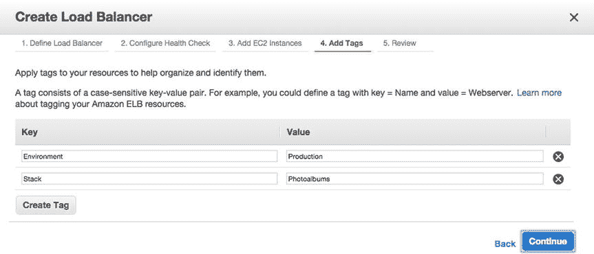

图 3-26。

Add ELB tags

#### 回顾

Amazon 方便地允许我们在创建负载平衡器之前回顾所有的选择(见图 [3-27](#Fig27) )。花一点时间检查所有的东西，确保它看起来是正确的。如果你犯了一个错误，有一个编辑按钮，可以带你回到每个单独的步骤来解决问题。完成审阅后，单击创建。几秒钟后，您将看到一条确认消息，表明您的负载平衡器已创建，当您关闭它时，您将在一个表中看到您的负载平衡器。

图 3-27。

Load balancer details

当您选择负载平衡器时，列表下方会出现一个选项卡式详细视图，如图 [3-27](#Fig27) 所示。“描述”选项卡提供了负载平衡器的概述。在前面和中间，您会看到一个 Status 字段，它会快速告诉您有多少实例在使用中。它应该显示为“服务中的 1 个实例中的 1 个”如果您的实例变得不健康，这将从 1 变为 0，要点是服务中是健康的委婉说法。您还可以重新访问您对负载平衡器所做的任何定制。您可以添加/编辑标签，打开/关闭端口，以及更改运行状况检查的配置。

您还可以在“实例”选项卡中管理连接到负载平衡器的实例。但是，我们不会在这里这样做。如果我们要在 OpsWorks 堆栈中使用负载平衡器，我们不希望在 EC2 仪表板中手动添加/删除负载平衡器的实例。相反，我们希望像处理数据库一样处理负载平衡:在 OpsWorks 中添加一个 ELB 层。

### OpsWorks ELB 层

返回 OpsWorks 并打开相册堆栈。使用导航菜单，转到 Layers 视图并选择 Node.js 应用服务器层。在层子导航中，选择网络。在顶部，您应该会看到一个弹性负载平衡标题，在它下面，您会看到没有添加 ELB。单击添加 ELB 将 ELB 附加到应用服务器图层。

页面将刷新，弹性负载平衡器字段现在将显示一个下拉列表，您可以从中选择 photoalbums-elb。当您这样做时，将出现一个警告，通知您 OpsWorks 配置现在将取代在 EC2 仪表板中所做的更改。这意味着如果您返回 EC2 并添加更多实例，这些更改将被忽略，因为 OpsWorks 命令将优先。单击保存提交您的更改，这将再次重新加载页面。

打开导航菜单并返回到层视图。你会看到一个 ELB 层已经自动生成，现在如图 [3-28](#Fig28) 所示。

图 3-28。

ELB, App Server, and RDS layers

点击 ELB 层(ELB:相册-elb)，你会看到该层的详细视图(见图 [3-29](#Fig29) )。首先，您将在 DNS 名称旁边看到一个公共 URL。如果你点击这个，你将被带到我们应用的 Hello World 页面！您还会看到一条警告，提示您的所有实例都在一个可用性区域中。如前所述，最佳实践是在其他可用性区域中复制资源。在这种情况下，这是一个有争议的问题，因为我们现在在应用服务器层只有一个实例。

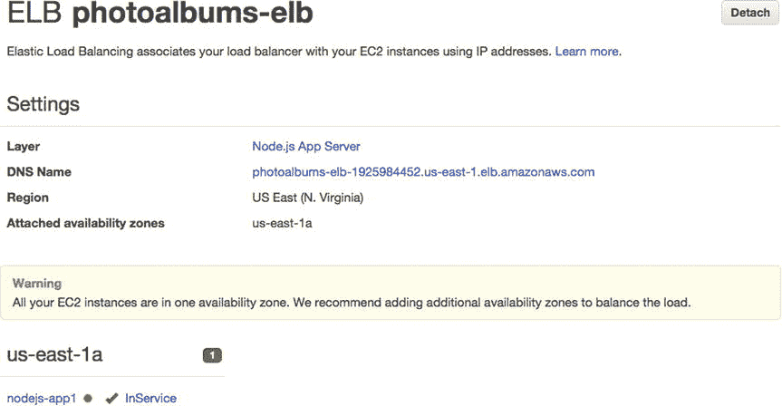

图 3-29。

ELB layer view in OpsWorks

在页面的底部，您将看到一个表，其中列出了向负载平衡器注册的所有实例，这些实例按可用性区域组织，每个实例的右侧都有状态指示器。因为我们在一个可用性区域中只有一个实例(在本例中是 us-east-1a)，所以这里没有太多信息。但是，一旦我们添加了更多的实例和可用性区域，这一部分将为您提供应用服务器状态的鸟瞰图，以及评估性能问题的起点。

Note

在过去的几分钟里，我们已经看到 EC2 实例被描述为健康的、服务中的和正在服务中的。这些都是同一个意思的变体。

到目前为止，我们已经通过应用服务器层中 EC2 实例的静态 IP 地址访问了我们的应用。这只是我们应用发展过程中的一个临时步骤，因为我们永远不希望用户在使用我们的应用时能够控制他们连接到哪个实例。接下来，我们将向堆栈中添加一个实例，并通过负载平衡器与两个实例进行交互。

### 添加新实例

打开导航菜单，单击实例返回实例视图。单击左下角的+Instance 按钮打开实例创建对话框。您可以创建一个新实例或将现有实例添加到该层。后一种情况不允许您在 AWS 帐户中添加任何实例。相反，您只能添加已经属于 OpsWorks 层的现有实例。如果您愿意，您可以在多个层之间共享计算资源，并在一个共享实例上托管两个或更多层。因为我们的堆栈只有一个应用服务器层，所以我们不会探索这个选项，但知道它在那里是很好的。

将新实例大小更改为 t1.micro(或任何较小的大小),并选择不同于您为第一个实例选择的可用性区域(参见图 [3-30](#Fig30) )。然后单击添加实例。

图 3-30。

Adding a new instance to a layer

现在你会在实例表中看到你的新实例，如图 [3-31](#Fig31) 所示。它不会自动启动，也不会分配 IP 地址，因为公共 IP 仅在实例联机时保留。

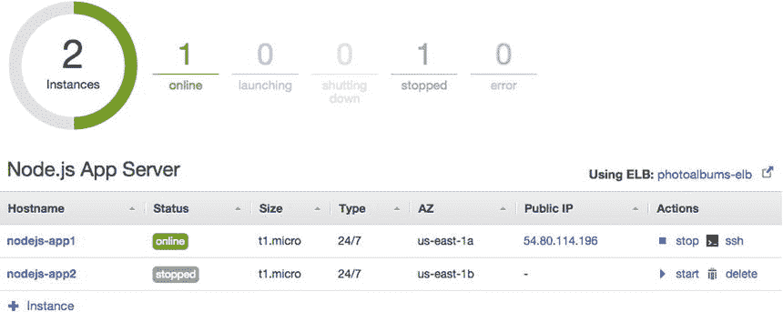

图 3-31。

App Server Instances overview

既然应用中有多个实例，这个视图开始变得更加有用。您可以看到左上角的圆圈实际上是一个圆形图，描述了处于五种可能状态之一的实例的百分比。您还可以快速链接到活动实例的公共 IP 以及 ELB。您可以启动或删除停止的实例，并通过 SSH 停止或连接到在线实例。

如果您回想一下关于 RDS 的课程，您可能会认为在将源代码部署到新实例之前必须运行`Configure`命令。事实并非如此。因为在连接 RDS 实例之后，您已经在堆栈上运行了`Configure`命令，所以将部署到新实例的凭证是最新的。你所要做的就是点击开始。

Note

有时，AWS 不允许在特定的可用性区域中分配新的实例。如果 us-east-1b 已满，并且您遇到此错误，只需选择 us-east-1c 或 us-east-1d 即可。

您的实例将在该视图中自动运行多个状态，从 requested 开始，到 online 结束。单击相册-elb 导航回负载平衡器图层。关于您的实例位于单个可用性区域的警告应该已经消失了，现在您应该在底部看到第二列，列出了您在 us-east-1b 中的实例。单击 DNS 名称旁边的 URL，您将看到 Hello World 页面在一个新窗口中打开。您现在直接连接到您的负载平衡器，它将请求路由到您在单独的可用性区域中的两个实例！

既然我们已经走了这么远，让我们继续前进，踢踢轮胎。您应该能够通过向您的负载平衡器 URL 上的注册路径提交一个`POST`请求来注册一个新用户。打开您的 REST 客户端，粘贴 ELB DNS 名称，添加`/users/register`。添加用户名、密码和电子邮件`POST`参数并发送请求。您应该会收到以下响应:

`{"message":"Registration successful!"}`

您的用户似乎已经成功注册，并且在 RDS 实例上创建了记录。如果你还记得[第 1 章](1.html)中关于示例应用的一些细节，你会记得在应用中有一个列出注册用户的 API。在您的 REST 客户端中，更改为一个`GET`请求，并从 URL 中删除`register`，或者在您的浏览器中打开该 URL。您应该会收到注册用户的 JSON 列表，如下所示:

`[{"username":"admin","userID":1}]`

## 摘要

在这一章里，我已经讲了很多内容。您了解了 Amazon RDS 的一些重要特性，创建了一个实例，并从该实例创建了一个 OpsWorks 层。然后，我们将 OpsWorks 配置为在我们的应用服务器实例上打包 RDS 凭证，并修改了访问这些凭证的源代码，而不是使用存储在我们的存储库中的硬编码凭证。我们还运行了几个场景，在这些场景中，我们可以使用 RDS 和 OpsWorks 的功能来妥善处理数据库故障或快速部署备份数据库。

您还了解了弹性负载平衡，这是亚马逊的负载平衡服务。我们创建了第一个负载平衡器，并配置了健康检查来识别不健康的 EC2 实例，并调节健康实例的流量。我们使用这个负载平衡器在 OpsWorks 中生成一个 ELB 层，并在 ELB 的多个可用性区域中添加实例。最后，我们通过在 ELB 的公共 URL 注册一个用户来测试我们的进展。

在某些方面，这是最困难的一章，因为我们终于创建了一个真正基于云的应用，不依赖于单一资源。当然，虽然我们在两个实例上运行我们的应用，但这并不意味着它有很强的容错能力，也不意味着它可以供公众使用。在接下来的几章中，您将了解如何赋予这种基础架构弹性，通过扩展我们的资源来满足需求，从而响应繁忙的流量。您还将了解更多关于我们的应用堆栈中的各种指标和故障点的信息，并了解如何使用其他 AWS 服务来提供缓存和加速内容分发，以减少我们的应用服务器和 RDS 层的工作负载。