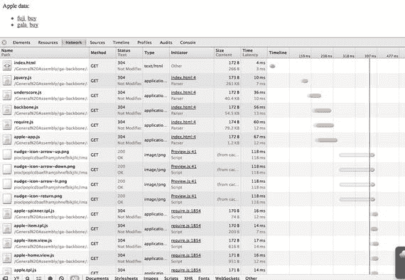
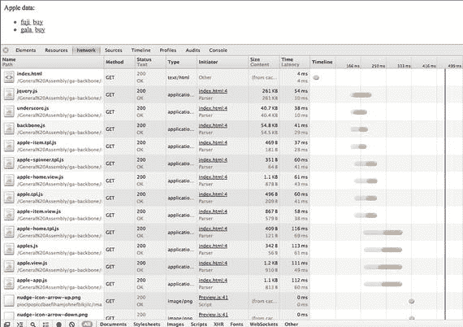
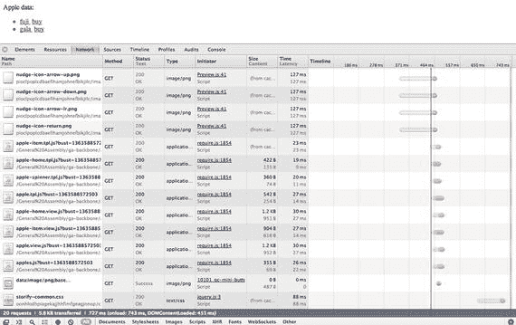

# 四、Backbone.js 简介

代码不是资产。这是一种责任。写的越多，以后要维护的就越多。—未知

本章将演示:

*   从头开始设置 Backbone.js 应用并安装依赖项
*   使用 Backbone.js 集合
*   Backbone.js 事件绑定
*   Backbone.js 视图和带有下划线的子视图
*   重构 Backbone.js 代码
*   AMD 和 Require.js 进行 Backbone.js 开发
*   Backbone.js 产品需要. js
*   一个简单的 Backbone.js 初学者工具包

Backbone.js 已经存在了一段时间，所以它非常成熟，可以被信任用于严肃的前端开发项目。这个框架绝对是极简主义和非个人化的。您可以将 Backbone.js 与许多其他库和模块一起使用。我认为 Backbone.js 是构建一个定制框架的基础，这个框架将非常适合您的特定用例。

有些人对 Backbone.js 的非个性化和极简主义感到厌恶。他们更喜欢能为他们做更多事情的框架，并执行一种特定的做事方式(例如，Angular 最佳实践([https://github . com/John papa/Angular-style guide](https://github.com/johnpapa/angular-styleguide)))。这对我来说完全没问题，您可以继续研究更复杂的前端框架。它们都非常适合 Node.js 堆栈和生态系统。就本书的目的而言，Backbone.js 是理想的，因为它为普通的非框架 jQuery 代码提供了一些急需的理性，同时它没有陡峭的学习曲线。你需要知道的只是一些类和方法，我们在这本书里会讲到。其他的都是 JavaScript，不是特定领域的语言。

## 从头开始设置 Backbone.js 应用

我们将使用 Backbone.js 和模式-视图-控制器(MVC)架构构建一个典型的 starter Hello World 应用。在开始时，这听起来可能有点过头了，但是随着我们的发展，我们会增加越来越多的复杂性，包括模型、子视图和集合。

Hello World 应用的完整源代码可以在`05-backbone/hello-world`下和 GitHub ( [`https://github.com/azat-co/fullstack-javascript/tree/master/05-backbone/hello-world`](https://github.com/azat-co/fullstack-javascript/tree/master/05-backbone/hello-world) )上找到。

### Backbone.js 依赖项

引导您完成实施并演示项目的补充视频: [`http://bit.ly/1O7xRCY`](http://bit.ly/1O7xRCY) 。

下载以下库:

*   jQuery 2 . 1 . 4 开发源文件 [`http://code.jquery.com/jquery-2.1.4.js`](http://code.jquery.com/jquery-2.1.4.js)
*   underscript . js v 1 . 8 . 3 开发源文件 [`http://underscorejs.org/underscore.js`](http://underscorejs.org/underscore.js)
*   Backbone.js v1.2.3 开发源文件 [`http://backbonejs.org/backbone.js`](http://backbonejs.org/backbone.js)

显然，当这本书出版时，这些版本不会是最新的。我建议坚持使用本书中的版本，因为这是我用来测试所有示例和项目的版本。使用不同的较新版本可能会导致一些意外的冲突。

创建一个`index.html`文件，并将这些框架包含在这个文件中，如下所示:

`<` `!DOCTYPE>`

`<html>`

`<head>`

``

`</head>`

`<body>`

`</body>`

`</html>`

我们也可以将``

`</head>`

`<body>`

`

`

`</body>`

`</html>`

在浏览器中打开`collections/index.html`文件。你应该看到我们数据库中的数据；也就是`Apple data: [{"name":"fuji","url":"img/fuji.jpg"},{"name":"gala","url":"img/gala.jpg"}]`。

现在，让我们在浏览器中转到`collections/index.html#apples/fuji`或`collections/index.html#apples/gala`。我们希望看到一个带标题的图像。这是一个项目的详细视图，在本例中是一个苹果。干得好！

## Backbone.js 事件绑定

引导您完成实施并演示项目的补充视频: [`http://bit.ly/1k0ZnUB`](http://bit.ly/1k0ZnUB) 。

在现实生活中，获取数据并不是瞬间发生的，所以让我们重构代码来模拟它。为了更好的用户体验(UX)，我们还必须向用户显示一个加载图标(spinner 或 ajax-loader ),通知他们信息正在被加载。

在 Backbone 中有事件绑定是一件好事。如果没有它，我们将不得不传递一个呈现 HTML 的函数作为对数据加载函数的回调，以确保在我们有实际数据要显示之前不执行呈现函数。

因此，当用户进入详细视图(`apples/:id`)时，我们只调用加载数据的函数。然后，有了合适的事件监听器，当有新数据时(或者当数据改变时，我们的视图将自动地(这不是一个错误)更新自己；Backbone.js 支持多个甚至自定义事件)。

供您参考，如果您不想输入代码(这是我推荐的)，它在`05-backbone/binding`和 GitHub ( [`https://github.com/azat-co/fullstack-javascript/blob/master/05-backbone/binding/index.html`](https://github.com/azat-co/fullstack-javascript/blob/master/05-backbone/binding/index.html) )中。

让我们更改路由中的代码:

`...`

`loadApple: function(appleName){`

`this.appleView.loadApple(appleName)`

`}`

`...`

其他一切都保持不变，直到我们到达`appleView`类。我们需要添加一个构造函数或一个`initialize`方法，这是 Backbone.js 框架中的一个特殊单词或属性。每次我们创建一个对象的实例，比如`var someObj = new SomeObject()`，它都会被调用。我们还可以向`initialize`函数传递额外的参数，就像我们对视图所做的那样(我们传递了一个带有键`collection`和值`apples`主干集合的对象)。在 [`backbonejs.org/#View-constructor`](http://backbonejs.org/#View-constructor) 阅读更多关于 Backbone.js 构造函数的内容。

`...`

`var appleView = Backbone.View.extend({`

`initialize: function(){`

`// TODO: create and setup model (aka an apple)`

`},`

`...`

我们有我们的`initialize`函数；现在我们需要创建一个代表单个苹果的模型，并在模型上设置适当的事件监听器。我们将使用两种类型的事件，`change`和一个名为`spinner`的自定义事件。为此，我们将使用`on()`函数，它接受这些属性:`on(event, actions, context)`。你可以在 [`backbonejs.org/#Events-on`](http://backbonejs.org/#Events-on) 了解更多。

`...`

`var appleView = Backbone.View.extend({`

`initialize: function(){`

`this.model = new (Backbone.Model.extend({}))`

`this.model.bind(’change’, this.render, this)`

`this.bind(’spinner’, this.showSpinner, this)`

`},`

`...`

`})`

`...`

前面的代码基本上可以归结为两件简单的事情:

Call the `render()` function of the `appleView` object when the model has changed.   Call the `showSpinner()` method of the `appleView` object when event `spinner` has been fired.  

到目前为止，一切顺利，对吧？但是 GIF 图标 spinner 又是怎么回事呢？让我们在`appleView`中创建新的属性:

`...`

`templateSpinner: ’’,`

`...`

还记得路由里的`loadApple`调用吗？这就是我们如何实现`appleView`中的功能:

`...`

`loadApple:function(appleName){`

要显示 spinner GIF 图像，使用`this.trigger`让 Backbone 调用`showSpinner`:

`this.trigger(’spinner’)`

接下来，我们需要访问闭包内部的上下文。有时候我喜欢用一个有意义的名字来代替`_this`或者`self`，所以:

`var view = this`

接下来，您将对服务器进行 XHR 调用(例如，`$.ajax()`)来获取数据。我们将模拟从远程服务器获取数据时的实时延迟:

`setTimeout(function(){`

`view.model.set(view.collection.where({`

`name:appleName`

`})[0].attributes)`

`}, 1000)`

`},`

`...`

`attributes`是一个 Backbone.js 模型属性，它为一个普通的 JavaScript 对象提供了模型属性。总的来说，第一行将触发`spinner`事件(我们仍然需要为其编写函数)。第二行只是用于范围问题(所以我们可以在闭包里使用`appleView`)。

`setTimeout`函数模拟真实远程服务器响应的时间延迟。在其中，我们通过使用一个`model.set()`函数和一个`model.attributes`属性(返回模型的属性)将一个选定模型的属性分配给视图的模型。

现在我们可以从`render`方法中移除一段额外的代码，并实现`showSpinner`函数:

`render: function(appleName){`

`var appleHtml = this.template(this.model)`

`$(’body’).html(appleHtml)`

`},`

`showSpinner: function(){`

`$(’body’).html(this.templateSpinner)`

`}`

`...`

仅此而已！在浏览器中打开`index.html#apples/gala`或`index.html#apples/fuji`，在等待苹果图像加载的同时欣赏加载动画。

下面是`index.html`文件的完整代码(也在`05-backbone/binding/index.html`和 [`https://github.com/azat-co/fullstack-javascript/blob/master/5-backbone/binding/index.html`](https://github.com/azat-co/fullstack-javascript/blob/master/5-backbone/binding/index.html) ):

`<` `!DOCTYPE>`

`<html>`

`<head>`

``

`</head>`

`<body>`

`

`

`</body>`

`</html>`

## Backbone.js 视图和带有下划线的子视图

引导您完成实施并演示项目的补充视频: [`http://bit.ly/1k0ZnUB`](http://bit.ly/1k0ZnUB) 。而这个例子在 [`https://github.com/azat-co/fullstack-javascript/tree/master/05-backbone/subview`](https://github.com/azat-co/fullstack-javascript/tree/master/05-backbone/subview) 都有。

子视图是在另一个主干视图中创建和使用的主干视图。子视图概念是抽象(分离)UI 事件(例如，点击)和类似结构元素(例如，苹果)的模板的好方法。

子视图的用例可能包括表格中的一行、列表中的一项、一个段落或一个新行。

我们将重构我们的主页来显示一个漂亮的苹果列表。每个列表项都有一个苹果名称和一个带有`onClick`事件的购买链接。让我们首先用我们的标准主干`extend()`函数为单个苹果创建一个子视图:

`...`

`var appleItemView = Backbone.View.extend({`

`tagName: ’li’,`

`template: _.template(’’`

`+’<a href="#apples/<%=name%>" target="_blank">’`

`+’<%=name%>’`

`+’</a> <a class="add-to-cart" href="#">buy</a>’),`

`events: {`

`’click .add-to-cart’: ’addToCart’`

`},`

`render: function() {`

`this.$el.html(this.template(this.model.attributes))`

`},`

`addToCart: function(){`

`this.model.collection.trigger(’addToCart’, this.model)`

`}`

`})`

`...`

现在我们可以用`tagName`、`template`、`events`、`render`和`addToCart`属性和方法填充对象。

`...`

`tagName: ’li’,`

`...`

`tagName`自动允许 Backbone.js 创建一个带有指定标签名的 HTML 元素，在本例中是列表项的`<li>`。这将是单个苹果的表示，我们列表中的一行。

`...`

`template: _.template(’’`

`+’<a href="#apples/<%=name%>" target="_blank">’`

`+’<%=name%>’`

`+’</a> <a class="add-to-cart" href="#">buy</a>’),`

`...`

模板只是一个带有下划线. js 指令的字符串。它们被包裹在`<%`和`%>`符号中。`<%=`简单来说就是打印一个值。同样的代码可以用反斜杠转义来编写:

`...`

`template: _.template(’\`

`<a href="#apples/<%=name%>" target="_blank">\`

`<%=name%>\`

`</a> <a class="add-to-cart" href="#">buy</a>\`

`’),`

`...`

每个`<li>`将有两个锚元素(`<a>`)，链接到一个详细的苹果视图(`#apples/:appleName`，和一个购买按钮。现在我们要将一个事件监听器附加到购买按钮上:

`...`

`events: {`

`’click .add-to-cart’: ’addToCart’`

`},`

`...`

语法遵循以下规则:

`event + jQuery element selector: function name`

键和值(由冒号分隔的左右部分)都是字符串。例如:

`’click .add-to-cart’: ’addToCart’`

或者

`’click #load-more’: ’loadMoreData’`

为了呈现列表中的每一项，我们将对`this.$el` jQuery 对象使用 jQuery `html()`函数，该对象是基于我们的`tagName`属性的`<li>` HTML 元素:

`...`

`render: function() {`

`this.$el.html(this.template(this.model.attributes))`

`},`

`...`

`addToCart`将使用`trigger()`函数通知集合，该特定型号(apple)可供用户购买:

`...`

`addToCart: function(){`

`this.model.collection.trigger(’addToCart’, this.model)`

`}`

`...`

下面是`appleItemView`主干视图类的完整代码:

`...`

`var appleItemView = Backbone.View.extend({`

`tagName: ’li’,`

`template: _.template(’’`

`+ ’<a href="#apples/<%=name%>" target="_blank">’`

`+ ’<%=name%>’`

`+ ’</a> <a class="add-to-cart" href="#">buy</a>’),`

`events: {`

`’click .add-to-cart’: ’addToCart’`

`},`

`render: function() {`

`this.$el.html(this.template(this.model.attributes))`

`},`

`addToCart: function(){`

`this.model.collection.trigger(’addToCart’, this.model)`

`}`

`})`

`...`

很简单！但是主视图呢，它应该呈现我们所有的项目(苹果)并为 HTML 元素提供一个包装器`<ul>`容器？我们需要修改和增强我们的`homeView`。

首先，我们可以添加 jQuery 可以理解的额外的`string`类型的属性作为`homeView`的选择器:

`...`

`el: ’body’,`

`listEl: ’.apples-list’,`

`cartEl: ’.cart-box’,`

`...`

我们可以在模板中使用前面的属性，或者只是在`homeView`中硬编码它们(我们稍后将重构我们的代码):

`...`

`template: _.template(’Apple data: \`

`<ul class="apples-list">\`

`</ul>\`

`

’),`

`...`

创建`homeView`(`new homeView()`)时会调用`initialize`函数。在这里，我们呈现我们的模板(使用我们最喜欢的`html()`函数)，并将一个事件监听器附加到集合，集合是一组苹果模型:

`...`

`initialize: function() {`

`this.$el.html(this.template)`

`this.collection.on(’addToCart’, this.showCart, this)`

`},`

`...`

绑定事件的语法在上一节中介绍过。本质上是在调用`homeView`的`showCart()`函数。在这个函数中，我们将`appleName`添加到购物车中(连同一个换行符，一个` `元素):

`...`

`showCart: function(appleModel) {`

`$(this.cartEl).append(appleModel.attributes.name + ’ ’)`

`},`

`...`

最后，这是我们期待已久的`render()`方法，在该方法中，我们遍历集合中的每个模型(每个苹果)，为每个苹果创建一个`appleItemView`，为每个苹果创建一个`<li>`元素，并将该元素附加到 DOM 中带有类`apples-list`的`view.listEl` — `<ul>`元素:

`...`

`render: function(){`

`view = this`

`// So we can use view inside of closure`

`this.collection.each(function(apple){`

`var appleSubView = new appleItemView({model:apple})`

`// Creates subview with model apple`

`appleSubView.render()`

`// Compiles template and single apple data`

`$(view.listEl).append(appleSubView.$el)`

`// Append jQuery object from single`

`// Apple to apples-list DOM element`

`})`

`}`

`...`

让我们确保在`homeView`主干视图中没有遗漏任何东西。以下是没有内联注释的完整代码:

`...`

`var homeView = Backbone.View.extend({`

`el: ’body’,`

`listEl: ’.apples-list’,`

`cartEl: ’.cart-box’,`

`template: _.template(’Apple data: \`

`<ul class="apples-list">\`

`</ul>\`

`

’),`

`initialize: function() {`

`this.$el.html(this.template)`

`this.collection.on(’addToCart’, this.showCart, this)`

`},`

`showCart: function(appleModel) {`

`$(this.cartEl).append(appleModel.attributes.name + ’ ’)`

`},`

`render: function(){`

`view = this`

`this.collection.each(function(apple){`

`var appleSubView = new appleItemView({model: apple})`

`appleSubView.render()`

`$(view.listEl).append(appleSubView.$el)`

`})`

`}`

`})`

`...`

您应该能够点击购买按钮，并在购物车中放入您选择的苹果。查看单个苹果不再需要在浏览器的 URL 地址栏中键入其名称。我们可以单击该名称来打开一个新窗口，其中包含详细视图。

通过使用子视图，我们为所有项目(苹果)重用了模板，并为每个项目附加了一个特定的事件(见图 [4-1](#Fig1) )。这些事件足够智能，可以将关于模型的信息传递给其他对象:视图和集合。

图 4-1。

The list of apples rendered by subviews

为了以防万一，下面是子视图示例的完整代码，也可以在 [`https://github.com/azat-co/fullstack-javascript/blob/master/05-backbone/subview/index.html`](https://github.com/azat-co/fullstack-javascript/blob/master/05-backbone/subview/index.html) 获得:

`<!DOCTYPE>`

`<html>`

`<head>`

``

``

``

``

`</head>`

`<body>`

`

`

`</body>`

`</html>`

到单个项目的链接，例如`collections/index.html#apples/fuji`，也应该通过在浏览器地址栏中键入它而独立工作。

## 重构 Backbone.js 代码

引导您完成实施并演示项目的补充视频: [`http://bit.ly/1k0ZnUB`](http://bit.ly/1k0ZnUB) 。

此时，您可能想知道使用框架并在一个文件中拥有多个具有不同功能的类、对象和元素有什么好处。这样做是为了坚持让事情简单的想法。

你的应用越大，无组织的代码库就越痛苦。让我们将应用分解成多个文件，每个文件都是以下类型之一:

*   视角
*   模板
*   路由
*   募捐
*   模型

让我们编写这些脚本，将标签包含到我们的`index.html`头或主体中，如前所述:

`<script``src="apple-item.view.js"`T2】

`<script``src="apple-home.view.js"`T2】

`<script``src="apple.view.js"`T2】

`<script``src="apples.js"`T2】

`<script``src="apple-app.js"`T2】

名称不必遵循破折号和点号的约定，只要能容易地说出每个文件应该做什么。

现在，让我们将对象和类复制到相应的文件中。

我们的主`index.html`文件应该看起来非常简洁:

`<` `!DOCTYPE>`

`<html>`

`<head>`

`<script``src="jquery.js"`T2】

`<script``src="underscore.js"`T2】

`<script``src="backbone.js"`T2】

`<script``src="apple-item.view.js"`T2】

`<script``src="apple-home.view.js"`T2】

`<script``src="apple.view.js"`T2】

`<script``src="apples.js"`T2】

`<script``src="apple-app.js"`T2】

`</head>`

`<body>`

`

`

`</body>`

`</html>`

其他文件只有与其文件名对应的代码。

`apple-item.view.js`的内容将拥有`appleView`对象:

`var appleView = Backbone.View.extend({`

`initialize: function(){`

`this.model = new (Backbone.Model.extend({}))`

`this.model.on(’change’, this.render, this)`

`this.on(’spinner’, this.showSpinner, this)`

`},`

`template: _.template(’<figure>\`

`"/>\`

`<figcaption><%= attributes.name %></figcaption>\`

`</figure>’),`

`templateSpinner: ’’,`

`loadApple:function(appleName){`

`this.trigger(’spinner’)`

`var view = this`

`// We’ll need to access that inside of a closure`

`setTimeout(function(){`

`// Simulates real time lag when fetching`

`// data from the remote server`

`view.model.set(view.collection.where({`

`name: appleName`

`})[0].attributes)`

`}, 1000)`

`},`

`render: function(appleName){`

`var appleHtml = this.template(this.model)`

`$(’body’).html(appleHtml)`

`},`

`showSpinner: function(){`

`$(’body’).html(this.templateSpinner)`

`}`

`})`

`apple-home.view.js`文件具有`homeView`对象:

`var homeView = Backbone.View.extend({`

`el: ’body’,`

`listEl: ’.apples-list’,`

`cartEl: ’.cart-box’,`

`template: _.template(’Apple data: \`

`<ul class="apples-list">\`

`</ul>\`

`

’),`

`initialize: function() {`

`this.$el.html(this.template)`

`this.collection.on(’addToCart’, this.showCart, this)`

`},`

`showCart: function(appleModel) {`

`$(this.cartEl).append(appleModel.attributes.name + ’ ’)`

`},`

`render: function(){`

`view = this // So we can use view inside of closure`

`this.collection.each(function(apple){`

`var appleSubView = new appleItemView({model:apple})`

`// Create subview with model apple`

`appleSubView.render()`

`// Compiles template and single apple data`

`$(view.listEl).append(appleSubView.$el)`

`// Append jQuery object from`

`// single apple to apples-list DOM element`

`})`

`}`

`})`

`apple.view.js`文件包含主苹果列表:

`var appleView = Backbone.View.extend({`

`initialize: function(){`

`this.model = new (Backbone.Model.extend({}))`

`this.model.on(’change’, this.render, this)`

`this.on(’spinner’,this.showSpinner, this)`

`},`

`template: _.template(’<figure>\`

`"/>\`

`<figcaption><%= attributes.name %></figcaption>\`

`</figure>’),`

`templateSpinner: ’’,`

`loadApple:function(appleName){`

`this.trigger(’spinner’)`

`var view = this`

`// We’ll need to access that inside of a closure`

`setTimeout(function(){`

`// Simulates real time lag when`

`// fetching data from the remote server`

`view.model.set(view.collection.where({`

`name:appleName`

`})[0].attributes)`

`}, 1000)`

`},`

`render: function(appleName){`

`var appleHtml = this.template(this.model)`

`$(’body’).html(appleHtml)`

`},`

`showSpinner: function(){`

`$(’body’).html(this.templateSpinner)`

`}`

`})`

`apples.js`是一个空集合:

`var Apples = Backbone.Collection.extend({`

`})`

`apple-app.js`是包含数据、路由和启动命令的主应用文件:

`var appleData = [`

`{`

`name: ’fuji’,`

`url: ’img/fuji.jpg’`

`},`

`{`

`name: ’gala’,`

`url: ’img/gala.jpg’`

`}`

`]`

`var app`

`var router = Backbone.Router.extend({`

`routes: {`

`’’: ’home’,`

`’apples/:appleName’: ’loadApple’`

`},`

`initialize: function(){`

`var apples = new Apples()`

`apples.reset(appleData)`

`this.homeView = new homeView({collection: apples})`

`this.appleView = new appleView({collection: apples})`

`},`

`home: function(){`

`this.homeView.render()`

`},`

`loadApple: function(appleName){`

`this.appleView.loadApple(appleName)`

`}`

`})`

`$(document).ready(function(){`

`app = new router`

`Backbone.history.start()`

`})`

现在让我们尝试打开应用。它应该与前面的子视图示例完全一样。

这是一个好得多的代码组织，但它仍然远非完美，因为我们仍然在 JavaScript 代码中直接使用 HTML 模板。问题是设计人员和开发人员不能处理同一个文件，对表示的任何更改都需要更改主要代码库。

我们可以在我们的`index.html`文件中再添加几个 JS 文件:

`<script``src="apple-item.tpl.js"`T2】

`<script``src="apple-home.tpl.js"`T2】

`<script``src="apple-spinner.tpl.js"`T2】

`<script``src="apple.tpl.js"`T2】

通常，一个主干视图有一个模板，但是在我们的`appleView`——一个单独窗口中的苹果的详细视图——中，我们还有一个旋转器，一个“加载”GIF 动画。

文件的内容只是被赋予一些字符串值的全局变量。稍后，当我们调用下划线. js 辅助方法`_.template()`时，我们可以在视图中使用这些变量。

下面是`apple-item.tpl.js`文件:

`var appleItemTpl = ’\`

`<a href="#apples/<%=name%>" target="_blank">\`

`<%=name%>\`

`</a> <a class="add-to-cart" href="#">buy</a>\`

`’`

这是`apple-home.tpl.js`文件:

`var appleHomeTpl = ’Apple data: \`

`<ul class="apples-list">\`

`</ul>\`

`

’`

下面是`apple-spinner.tpl.js`文件:

`var appleSpinnerTpl = ’’`

这是`apple.tpl.js`文件:

`var appleTpl = ’<figure>\`

`"/>\`

`<figcaption><%= attributes.name %></figcaption>\`

`</figure>’`

现在尝试启动应用。完整代码在 [`https://github.com/azat-co/fullstack-javascript/tree/master/05-backbone/refactor`](https://github.com/azat-co/fullstack-javascript/tree/master/05-backbone/refactor) 。

正如你在前面的例子中看到的，我们使用了全局范围的变量(没有关键字`window`)。

在全局名称空间中引入大量变量时要小心(`window`关键字)。可能会有冲突和其他不可预测的后果。例如，如果您编写了一个开源库，而其他开发人员开始直接使用这些方法和属性，而不是使用接口，那么当您最终决定删除或反对这些全局泄漏时，会发生什么呢？为了防止这种情况，正确编写的库和应用使用了 [JavaScript 闭包](https://developer.mozilla.org/en-US/docs/JavaScript/Guide/Closures) ( [`https://developer.mozilla.org/en-US/docs/Web/JavaScript/Closures`](https://developer.mozilla.org/en-US/docs/Web/JavaScript/Closures) )。

下面是一个使用闭包和全局变量模块定义的例子:

`;(function() {`

`var apple= function() {`

`...// Do something useful like return apple object`

`}`

`window.Apple = apple`

`}())`

如果我们需要访问 app 对象(这会创建对该对象的依赖):

`;(function() {`

`var app = this.app`

`// Equivalent of window.appliation`

`// in case we need a dependency (app)`

`this.apple = function() {`

`...`

`// Return apple object/class`

`// Use app variable`

`}`

`// Equivalent of window.apple = function(){...}`

`}())`

如您所见，我们已经创建了函数并立即调用了它，同时还将所有内容括在括号`()`中。

## AMD 和 Require.js 进行 Backbone.js 开发

引导您完成实施并演示项目的补充视频: [`http://bit.ly/1k0ZnUB`](http://bit.ly/1k0ZnUB) 。

AMD 允许我们将开发代码组织成模块，管理依赖关系，并异步加载它们。这篇文章很好地解释了为什么 AMD 是个好东西:[为什么是 AMD？](http://requirejs.org/docs/whyamd.html)

启动您的本地 HTTP 服务器，例如 MAMP([https://www . mamp . info/en](http://www.smartface.io/))或 node-static ( [`https://github.com/cloudhead/node-static`](https://github.com/cloudhead/node-static) )。

让我们通过使用 Require.js 库来增强我们的代码。

我们的`index.html`会缩水更多:

`<` `!DOCTYPE>`

`<html>`

`<head>`

`<script``src="jquery.js"`T2】

`<script``src="underscore.js"`T2】

`<script``src="backbone.js"`T2】

`<script``src="require.js"`T2】

`<script``src="apple-app.js"`T2】

`</head>`

`<body>`

`

`

`</body>`

`</html>`

我们在应用中只包含了库和一个 JavaScript 文件。该文件具有以下结构:

`require([...],function(...){...})`

以一种更具解释性的方式:

`require([`

`’name-of-the-module’,`

`...`

`’name-of-the-other-module’`

`],function(referenceToModule, ..., referenceToOtherModule){`

`...// Some useful code`

`referenceToModule.someMethod()`

`})`

基本上，我们告诉浏览器从文件名数组中加载文件——`require()`函数的第一个参数——然后将这些文件中的模块作为变量传递给匿名回调函数(第二个参数)。在 main 函数(匿名回调)内部，我们可以通过引用那些变量来使用我们的模块。因此，我们的`apple-app.js`倏然变成:

`require([`

`’apple-item.tpl’, // Can use shim plug-in`

`’apple-home.tpl’,`

`’apple-spinner.tpl’,`

`’apple.tpl’,`

`’apple-item.view’,`

`’apple-home.view’,`

`’apple.view’,`

`’apples’`

`],function(`

`appleItemTpl,`

`appleHomeTpl,`

`appleSpinnerTpl,`

`appleTpl,`

`appelItemView,`

`homeView,`

`appleView,`

`Apples`

`){`

`var appleData = [`

`{`

`name: ’fuji’,`

`url: ’img/fuji.jpg’`

`},`

`{`

`name: ’gala’,`

`url: ’img/gala.jpg’`

`}`

`]`

`var app`

`var router = Backbone.Router.extend({`

`// Check if need to be required`

`routes: {`

`’’: ’home’,`

`’apples/:appleName’: ’loadApple’`

`},`

`initialize: function(){`

`var apples = new Apples()`

`apples.reset(appleData)`

`this.homeView = new homeView({collection: apples})`

`this.appleView = new appleView({collection: apples})`

`},`

`home: function(){`

`this.homeView.render()`

`},`

`loadApple: function(appleName){`

`this.appleView.loadApple(appleName)`

`}`

`})`

`$(document).ready(function(){`

`app = new router`

`Backbone.history.start()`

`})`

`})`

我们将所有代码放在函数中，该函数是`require()`的第二个参数，通过文件名提到模块，并通过相应的参数使用依赖关系。现在我们应该定义模块本身。这就是我们如何使用`define()`方法实现的:

`define([...],function(...){...})`

其含义类似于`require()`函数:依赖项是数组中作为第一个参数传递的文件名(和路径)的字符串。第二个参数是 main 函数，它接受其他库作为参数(数组中参数和模块的顺序很重要):

`define([’name-of-the-module’],function(nameOfModule){`

`var b = nameOfModule.render()`

`return b`

`})`

注意，不需要在文件名后添加`.js`。Require.js 会自动完成。Shim 插件用于导入 HTML 模板等文本文件。

让我们从模板开始，将它们转换成 Require.js 模块。

下面是新的`apple-item.tpl.js`文件:

`define(function() {`

`return ’\`

`<a href="#apples/<%=name%>" target="_blank">\`

`<%=name%>\`

`</a> <a class="add-to-cart" href="#">buy</a>\`

`’`

`})`

这是`apple-home.tpl`文件:

`define(function(){`

`return ’Apple data: \`

`<ul class="apples-list">\`

`</ul>\`

`

’`

`})`

下面是`apple-spinner.tpl.js`文件:

`define(function(){`

`return ’’`

`})`

这是`apple.tpl.js`文件:

`define(function(){`

`return ’<figure>\`

`"/>\`

`<figcaption><%= attributes.name %></figcaption>\`

`</figure>’`

`})`

下面是`apple-item.view.js`文件:

`define(function() {`

`return ’\`

`<a href="#apples/<%=name%>" target="_blank">\`

`<%=name%>\`

`</a> <a class="add-to-cart" href="#">buy</a>\`

`’`

`})`

在`apple-home.view.js`文件中，我们需要声明对`apple-home.tpl`和`apple-item.view.js`文件的依赖:

`define([’apple-home.tpl’, ’apple-item.view’], function(`

`appleHomeTpl,`

`appleItemView){`

`return  Backbone.View.extend({`

`el: ’body’,`

`listEl: ’.apples-list’,`

`cartEl: ’.cart-box’,`

`template: _.template(appleHomeTpl),`

`initialize: function() {`

`this.$el.html(this.template)`

`this.collection.on(’addToCart’, this.showCart, this)`

`},`

`showCart: function(appleModel) {`

`$(this.cartEl).append(appleModel.attributes.name + ’ ’)`

`},`

`render: function(){`

`view = this // So we can use view inside of closure`

`this.collection.each(function(apple){`

`var appleSubView = new appleItemView({model:apple})`

`// Create subview with model apple`

`appleSubView.render()`

`// Compiles template and single apple data`

`$(view.listEl).append(appleSubView.$el)`

`// Append jQuery object from`

`// a single apple to apples-list DOM element`

`})`

`}`

`})`

`})`

`apple.view.js`文件依赖于两个模板:

`define([`

`’apple.tpl’,`

`’apple-spinner.tpl’`

`], function(appleTpl,appleSpinnerTpl){`

`return  Backbone.View.extend({`

`initialize: function(){`

`this.model = new (Backbone.Model.extend({}))`

`this.model.on(’change’, this.render, this)`

`this.on(’spinner’,this.showSpinner, this)`

`},`

`template: _.template(appleTpl),`

`templateSpinner: appleSpinnerTpl,`

`loadApple:function(appleName){`

`this.trigger(’spinner’)`

`var view = this`

`// We’ll need to access that inside of a closure`

`setTimeout(function(){`

`// Simulates real time lag when`

`// fetching data from the remote server`

`view.model.set(view.collection.where({`

`name:appleName`

`})[0].attributes)`

`}, 1000)`

`},`

`render: function(appleName){`

`var appleHtml = this.template(this.model)`

`$(’body’).html(appleHtml)`

`},`

`showSpinner: function(){`

`$(’body’).html(this.templateSpinner)`

`}`

`})`

`})`

这是`apples.js`文件:

`define(function(){`

`return Backbone.Collection.extend({})`

`})`

我希望你现在能看到这个模式。我们所有的代码都根据逻辑(例如，视图类、集合类、模板)被分割成单独的文件。主文件用`require()`函数加载所有的依赖项。如果我们需要非主文件中的某个模块，那么我们可以在`define()`方法中请求它。通常，在模块中我们想要返回一个对象；例如，在模板中我们返回字符串，在视图中我们返回主干视图类和对象。

尝试启动位于 [`https://github.com/azat-co/fullstack-javascript/blob/master/05-backbone/amd/`](https://github.com/azat-co/fullstack-javascript/blob/master/05-backbone/amd/) 的示例。目测应该不会有什么变化。如果您在开发工具中打开“网络”选项卡，您可以看到文件加载方式的不同。

图 [4-2](#Fig2) ( [`https://github.com/azat-co/fullstack-javascript/tree/master/05-backbone/refactor/index.html`](https://github.com/azat-co/fullstack-javascript/tree/master/05-backbone/refactor/index.html) )所示的旧文件以串行方式加载我们的 JavaScript 脚本，而图 [4-3](#Fig3) ( [`https://github.com/azat-co/fullstack-javascript/blob/master/05-backbone/amd/index.html`](https://github.com/azat-co/fullstack-javascript/blob/master/05-backbone/amd/index.html) )所示的新文件以并行方式加载它们。

图 4-3。

The new 05-backbone/amd/index.html file

图 4-2。

The old 05-backbone/refactor/index.html file

Require.js 有很多配置选项，这些选项是通过 HTML 页面顶层的`requirejs.config()`调用定义的。更多信息请访问 [`requirejs.org/docs/api.html#config`](http://requirejs.org/docs/api.html#config) 。

让我们在示例中添加一个半身像参数。bust 参数将被附加到每个文件的 URL，防止浏览器缓存文件。这对开发来说是完美的，对生产来说是可怕的。

将此内容添加到其他内容之前的`apple-app.js`文件中:

`requirejs.config({`

`urlArgs: ’bust=’ +  (new Date()).getTime()`

`})`

`require([`

`...`

注意在图 [4-4](#Fig4) 中，每个文件请求现在的状态是 200 而不是 304(未修改)。

图 4-4。

Network tab with bust parameter added

## Backbone.js 产品需要. js

我们将使用Node包管理器(NPM)来安装`requirejs`库(这不是打字错误；名称中没有句号)。在项目文件夹中，在终端中运行以下命令:

`$ npm init`

那就跑

`$ npm install requirejs`

或添加`-g`进行全球安装:

`$ npm install -g requirejs`

创建一个名为`app.build.js`的文件:

`({`

`appDir: "./js",`

`baseUrl: "./",`

`dir: "build",`

`modules: [`

`{`

`name: "apple-app"`

`}`

`]`

`})`

将脚本文件移动到`js`文件夹(`appDir`属性)。生成的文件将被放在`build`文件夹中(`dir`参数)。有关构建文件的更多信息，请查看 [`https://github.com/jrburke/r.js/blob/master/build/example.build.js`](https://github.com/jrburke/r.js/blob/master/build/example.build.js) 提供的带有注释的广泛示例。

现在，构建一个巨大的 JavaScript 文件的一切都应该准备好了，这个文件将包含我们所有的依赖项和模块:

`$ r.js -o app.build.js`

或者

`$ node_modules/requirejs/bin/r.js -o app.build.js`

您应该会得到一个 r.js 已处理文件的列表，如图 [4-5](#Fig5) 所示。

图 4-5。

A list of the r.js processed files

从浏览器窗口的构建文件夹中打开`index.html`，检查网络选项卡是否显示任何改进，现在只需加载一个请求或文件(图 [4-6](#Fig6) )。

图 4-6。

Performance improvement with one request or file to load

如需了解更多信息，请访问 [`requirejs.org/docs/optimization.html`](http://requirejs.org/docs/optimization.html) 查看 r.js 官方文档。

示例代码可从 [`https://github.com/azat-co/fullstack-javascript/tree/master/05-backbone/r`](https://github.com/azat-co/fullstack-javascript/tree/master/05-backbone/r) 获得

还有 [`https://github.com/azat-co/fullstack-javascript/tree/master/05-backbone/r/build`](https://github.com/azat-co/fullstack-javascript/tree/master/05-backbone/r/build) 。

对于 JS 文件的丑化(减小文件大小)，我们可以使用[丑化 2](https://github.com/mishoo/UglifyJS2) 模块。要使用 NPM 安装它，请使用:

`$ npm install uglify-js`

然后用`optimize: "uglify2"`属性更新`app.build.js`文件:

`({`

`appDir: "./js",`

`baseUrl: "./",`

`dir: "build",`

`optimize: "uglify2",`

`modules: [`

`{`

`name: "apple-app"`

`}`

`]`

`})`

使用以下命令运行 r.js:

`$ node_modules/requirejs/bin/r.js -o app.build.js`

您应该得到这样的结果:

`define("apple-item.tpl",[],function(){return’ <a href="#apples/<%=name%>" target="_blank"> <%=name%> </a> <a class="add-to-cart" href="#">buy</a>’}),define("apple-home.tpl",[],function(){return’Apple data:<ulclass="apples-list"></ul>

’}),define("apple-spinner.tpl",[],function(){return’’}),define("apple.tpl",[],function(){return’<figure>"/><figcaption><%= attributes.name %></figcaption></figure>’}),define("apple-item.view",["apple-item.tpl"],function(e){return Backbone.View.extend({tagName:"li",template:_.template(e),events:{"click .add-to-cart":"addToCart"},render:function(){this.$el.html(this.template(this.model.attributes))},addToCart:function(){this.model.collection.trigger("addToCart",this.model)}})}),define("apple-home.view",["apple-home.tpl","apple-item.view"],function(e,t){return Backbone.View.extend({el:"body",listEl:".apples-list",cartEl:".cart-box",template:_.template(e),initialize:function(){this.$el.html(this.template),this.collection.on("addToCart",this.showCart,this)},showCart:function(e){$(this.cartEl).append(e.attributes.name+" ")},render:function(){view=this,this.collection.each(function(e){var i=new t({model:e});i.render(),$(view.listEl).append(i.$el)})}})}),define("apple.view",["apple.tpl","apple-spinner.tpl"],function(e,t){return Backbone.View.extend({initialize:function(){this.model=new(Backbone.Model.extend({})),this.model.on("change",this.render,this),this.on("spinner",this.showSpinner,this)},template:_.template(e),templateSpinner:t,loadApple:function(e){this.trigger("spinner");var t=this;setTimeout(function(){t.model.set(t.collection.where({name:e})[0].attributes)},1e3)},render:function(){var e=this.template(this.model);$("body").html(e)},showSpinner:function(){$("body").html(this.templateSpinner)}})}),define("apples",[],function(){return Backbone.Collection.extend({})}),requirejs.config({urlArgs:"bust="+(new Date).getTime()}),require(["apple-item.tpl","apple-home.tpl","apple-spinner.tpl","apple.tpl","apple-item.view","apple-home.view","apple.view","apples"],function(e,t,i,n,a,l,p,o){var r,s=[{name:"fuji",url:"img/fuji.jpg"},{name:"gala",url:"img/gala.jpg"}],c=Backbone.Router.extend({routes:{"":"home","apples/:appleName":"loadApple"},initialize:function(){var e=new o;e.reset(s),this.homeView=new l({collection:e}),this.appleView=new p({collection:e})},home:function(){this.homeView.render()},loadApple:function(e){this.appleView.loadApple(e)}});$(document).ready(function(){r=new c,Backbone.history.start()})}),define("apple-app",function(){});`

该文件故意没有格式化以显示 uglify 2([https://github . com/mishoo/uglifyjs 2](https://github.com/mishoo/UglifyJS2))是如何工作的。如果没有换行符，代码就在一行上。还要注意变量和对象的名字被缩短了。

## 超级简单的 Backbone.js 初学者工具包

为了快速启动您的 Backbone.js 开发，可以考虑使用[超级简单的 Backbone 初学者工具包](https://github.com/azat-co/super-simple-backbone-starter-kit) ( [`https://github.com/azat-co/super-simple-backbone-starter-kit`](https://github.com/azat-co/super-simple-backbone-starter-kit) )或类似的项目:

*   [骨干样板](http://backboneboilerplate.com/)可用 [`http://backboneboilerplate.com/`](http://backboneboilerplate.com/)
*   [带主干的样本 App。js 和 Twitter 自举](http://coenraets.org/blog/2012/02/sample-app-with-backbone-js-and-twitter-bootstrap/)在 [`http://coenraets.org/blog/2012/02/sample-app-with-backbone-js-and-twitter-bootstrap/`](http://coenraets.org/blog/2012/02/sample-app-with-backbone-js-and-twitter-bootstrap/) 可用
*   更多 Backbone.js 教程请访问 [`github.com/documentcloud/backbone/wiki/Tutorials%2C-blog-posts-and-example-sites`](https://github.com/documentcloud/backbone/wiki/Tutorials%2C-blog-posts-and-example-sites)

## 摘要

到目前为止，我们已经讲述了如何:

*   从头开始构建一个 Backbone.js 应用。
*   使用视图、集合、子视图、模型和事件绑定。
*   在苹果数据库应用的例子中使用 AMD 和 Require.js。

在这一章中，你已经对 Backbone.js 有了足够的了解，可以开始在你的网络或移动应用中使用它。如果没有像 Backbone 这样的框架，随着代码的增长，它将会变得更加复杂。另一方面，使用 Backbone 或类似的 MVC，您可以更好地扩展代码。