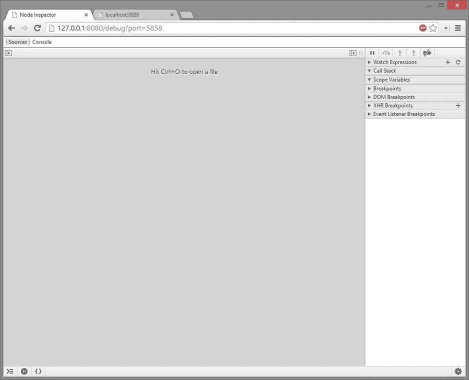
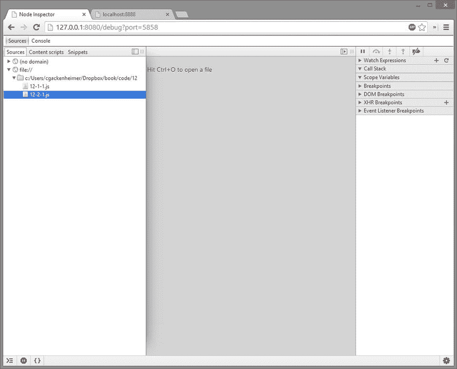
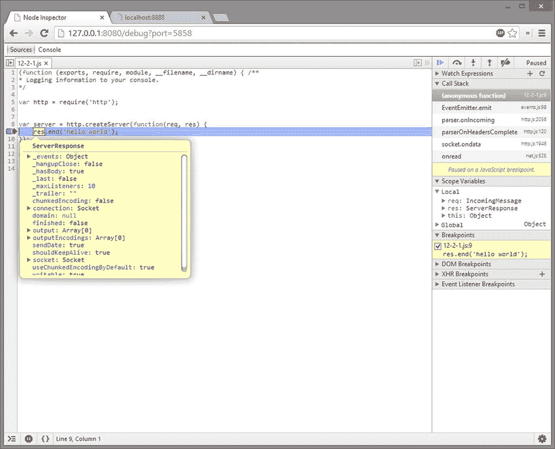

# 十二、调试和部署应用

在这本书里，你已经看到了很多你能够用 Node.js 产生的东西，你已经创建了一个应用，或者你正在设想一个你想要发布的应用。这意味着您需要熟悉将代码部署到多个目的地的过程。除了部署您的代码，当遇到 V8 调试模块时，您将重温并扩展第 7 章中的一些调试技术。

作为 Node.js 开发人员，您可以使用多种方法和平台来部署代码。在本章中，您将研究各种技术，从在您自己的机器上进行自我部署，到在基于云的平台上部署服务解决方案。您还将学习如何向 npm 发布您的模块。

在撰写本文时，有大量基于云的平台作为 Node.js 应用的服务托管解决方案。本章并不是所有可能的托管解决方案的目录，而是着眼于您可以用来托管 Node.js 应用的几种常见且实用的方法。

12-1.将信息记录到控制台

问题

您需要能够通过将信息记录到控制台窗口来收集有关应用的重要信息。

解决办法

调试代码时将信息记录到命令行的最简单方法是使用 Node.js 自带的控制台模块，在这个解决方案中，你可以看到有各种方法可以用来通过使用这个模块将数据记录到控制台，如[清单 12-1](#list1) 所示。

***[清单 12-1](#_list1)*** 。记录到控制台

```js
/**
* Logging information to your console.
*/

console.time('timer');
console.log('hey %s', 'there');
console.info('info');
console.warn('warn');
console.error('error');
console.dir(console);
console.trace(console.error('traced'));
console.assert(true !== false, 'true equals false');
console.timeEnd('timer');
```

它是如何工作的

控制台模块依赖 Node.js 对`stdout`和`stderr`的使用。js 源代码中的控制台对象是通过接受这两个流作为参数来创建的(参见[清单 12-2](#list2) )。

***[清单 12-2](#_list2)*** 。实例化控制台

```js
function Console(stdout, stderr) {
  if (!(this instanceof Console)) {
    return new Console(stdout, stderr);
  }
  if (!stdout || !util.isFunction(stdout.write)) {
    throw new TypeError('Console expects a writable stream instance');
  }
  if (!stderr) {
    stderr = stdout;
  }
  var prop = {
    writable: true,
    enumerable: false,
    configurable: true
  };
  prop.value = stdout;
  Object.defineProperty(this, '_stdout', prop);
  prop.value = stderr;
  Object.defineProperty(this, '_stderr', prop);
  prop.value = {};
  Object.defineProperty(this, '_times', prop);

  // bind the prototype functions to this Console instance
  Object.keys(Console.prototype).forEach(function(k) {
    this[k] = this[k].bind(this);
  }, this);
}
```

一旦对象被实例化，`stderr`和`stdout`属性通过使用`Object.defineProperty()`方法被转换成控制台对象本身的属性。

在您的解决方案中，您利用了控制台对象上公开的每个核心方法。首先，也是最常见的，是`console.log()`方法。这个方法接受任意数量的参数，使用清单 12-3 中的[模块将它们格式化，并将结果写入`stdout`。`console.info`方法与`console.log`方法相同，并以同样的方式格式化参数。](#list3)

***[清单 12-3](#_list3)*** 。Console.log 作为 stdout.write

```js
Console.prototype.log = function() {
  this._stdout.write(util.format.apply(this, arguments) + '\n');
};

Console.prototype.info = Console.prototype.log;
```

您将遇到的下一个控制台方法是`console.error()`方法 。这与`console.warn()`法法相同。这些方法类似于`console.log()`和`console.info()`方法，不同之处在于它们写入`stderr`而不是`stdout,`，如[清单 12-4](#list4) 所示。

***[清单 12-4](#_list4)*** 。控制台.错误和控制台.警告

```js
Console.prototype.warn = function() {
  this._stderr.write(util.format.apply(this, arguments) + '\n');
};

Console.prototype.error = Console.prototype.warn;
```

接下来你利用`console.dir()`方法 。这个函数使用`util.inspect()`方法来描述传递给它的对象(见[清单 12-5](#list5) )。在这种情况下，您检查控制台对象本身。

***[清单 12-5](#_list5)*** 。Console.dir()

```js
Console.prototype.dir = function(object) {
  this._stdout.write(util.inspect(object, { customInspect: false }) + '\n');
};
```

调用`console.dir(console);`的输出如清单 12-6 中的[所示。](#list6)

***[清单 12-6](#_list6)*** 。Console.dir(控制台)；

```js
{ log: [Function],
  info: [Function],
  warn: [Function],
  error: [Function],
  dir: [Function],
  time: [Function],
  timeEnd: [Function],
  trace: [Function],
  assert: [Function],
  Console: [Function: Console] }
```

接下来，运行`console.trace()` 将任何错误记录到`stderr`堆栈跟踪中。该方法的源代码如清单 12-7 所示。您可以看到，一旦更改了名称以证明它是一个“跟踪”，就会通过`console.error()`方法记录错误；。

***[清单 12-7](#_list7)*** 。Console.trace()源

```js
Console.prototype.trace = function() {
  // TODO probably can to do this better with V8's debug object once that is
  // exposed.
  var err = new Error;
  err.name = 'Trace';
  err.message = util.format.apply(this, arguments);
  Error.captureStackTrace(err, arguments.callee);
  this.error(err.stack);
};
```

您将使用的最后一个控制台方法是`console.assert()`方法。这个方法利用 assert 模块来记录`assert.ok()`方法的结果。你可以在[清单 12-8](#list8) 中看到它的内部工作原理。

***[清单 12-8](#_list8)*** 。Console.assert()

```js
Console.prototype.assert = function(expression) {
  if (!expression) {
    var arr = Array.prototype.slice.call(arguments, 1);
    require('assert').ok(false, util.format.apply(this, arr));
  }
};
```

12-2.使用图形调试工具

问题

您希望使用一种工具，这种工具允许您在类似集成开发环境(IDE)的调试工具中调试 Node.js 应用。这意味着您希望对 Node.js 调试环境进行图形化访问。

解决办法

Node.js 应用最基本也是最一致的跨平台调试工具之一是名为 node-inspector 的`npm`包。这个包用来绑定基于 Blink 的浏览器自带的调试器，比如 Google Chrome 或者最新版本的 Opera。然后，您将可以访问这些浏览器的本机调试工具，但它将允许您在类似 IDE 的设置中导航代码和调试 Node.js 应用。

要开始使用 node-inspector，通过`npm`全局安装它。这使您可以访问 Node 检查器命令，这将允许您启动调试器监听您机器上的任何目录，如清单 12-9 所示。

***[清单 12-9](#_list9)*** 。Node 检查器的安装和实现

```js
$ npm install -g node-inspector

$ node-inspector
Node Inspector v0.3.1
   info  - socket.io started
Visit http://127.0.0.1:8080/debug?port=5858 to start debugging.
```

检查器运行后，您可以开始 Node.js 应用的新实例。对于这个例子，假设一个简单的 HTTP 服务器用文本“hello world”进行响应。当您启动这个 Node.js 应用时，您需要通过向命令传递参数–debug 来启用调试挂钩。这看起来就像你在清单 12-10 中看到的一样。

***[清单 12-10](#_list10)*** 。通过创建服务器开始 Node 检查

```js
$ node --debug 12-2-1.js
debugger listening on port 5858
```

它是如何工作的

现在您已经有了一个调试器监听正确的端口，并且 inspector 正在运行，您可以通过导航到`http://127.0.0.1:8080/debug?port=5858`来体验使用图形调试器的乐趣。这是 Node 检查器打开 Blink 开发工具的地方，允许您调试代码。这个初始界面将类似于图 12-1 中的[所示。](#Fig1)



[图 12-1](#_Fig1) 。Node 检查器初始状态

现在，您可以从这里打开 Sources 面板，查看可用的源文件。这在 [图 12-2](#Fig2) 中显示；您可以选择要调试的文件。



[图 12-2](#_Fig2) 。Node 检查器中的“源”面板

一旦你选择了你的文件，你现在可以在 Node.js 中看到为该文件运行的整个源代码。这一点已经打破，检查器为您提供了调用堆栈和范围变量以及其他重要信息，可以通过调试器界面访问这些信息。


[图 12-3](#_Fig3) 。Node 检查器查看源文件

最后，node-inspector 还通过提供悬停信息，让您能够访问源代码中对象的更多细节。这些信息为您提供了被检测物体的更多细节(见[图 12-4](#Fig4) )。



[图 12-4](#_Fig4) 。使用 Node 检查器将鼠标悬停在对象上

12-3.在生产环境中调试应用

问题

您有一个运行在生产服务器上的 Node.js 应用，它的行为方式会提示您进入代码并查看发生了什么。为了调试你的应用，你需要在生产过程中附加一个调试器。

解决办法

连接到当前正在运行的 Node.js 进程内置于 Node.js 调试功能中。这将把 V8 调试器附加到您的应用，就像用 debug 标志启动您的应用一样。

首先需要运行 Node.js 流程。对于这个例子，您可以启动一个简单的 HTTP 服务器，它是您在 12-2 节中为调试而创建的。一旦运行了这个，就需要在运行这个 Node.js 进程的操作系统上找到进程标识符。您可以通过活动监视器、Windows 上的任务管理器或使用 grep `- $ ps ax | grep node.`的 shell 来实现这一点

一旦你有了进程标识符，你就可以告诉调试器连接到进程，如清单 12-11 所示。

***[清单 12-11](#_list11)*** 。将调试器连接到 Node.js 进程

```js
$ node debug -p 6284
connecting... ok
debug>
```

现在您有了 V8 调试器提示符，它连接到您的 Node.js 进程(显示在您的原始命令行上，如清单 12-12 所示)。

***[清单 12-12](#_list12)*** 。调试器已连接

```js
$ node 12-2-1.js
Starting debugger agent.
debugger listening on port 5858
```

一旦您连接到进程，从`debug>`提示符中，您可能想知道您的应用的当前状态驻留在进程的哪个点上。你可以通过使用`debug> pause`暂停应用，或者进入`debug> s`或者下一个`debug> n`来完成。

现在，您可以在生产环境中调试您的应用，以查明您在应用中遇到问题的地方。

它是如何工作的

使用 Node.js 调试器调试在[第 7 章](07.html)中有详细介绍，使用命令`$ node debug –p <pid>`绑定到 Node.js 进程会让你访问在[第 7 章](07.html)中看到的相同命令。这是运行调试终端的 V8 调试器。

当你开始调试时，如上所述，你可以通过键入`debug> n`看到你在代码中的位置(见[清单 12-13](#list13) )。

***[清单 12-13](#_list13)*** 。V8 调试器的下一步

```js
connecting... ok
debug> n
break in net.js:1153
 1151
 1152 function onconnection(clientHandle) {
 1153   var
handle = this;
 1154   var self = handle.owner;
 1155
```

这个清单只是一个例子，说明您在代码中的位置。在您的情况下，您可能在应用或导入到应用的模块内部的任何地方。然后你可以通过键入`debug> c`继续执行你的程序，如[清单 12-14](#list14) 所示。这个例子表明，通过继续运行，您能够运行代码，直到它遇到`debugger`；命令。这个命令告诉 V8 调试器停止执行并等待。

***[清单 12-14](#_list14)*** 。继续调试

```js
debug> c
break in c:\Users\cgackenheimer\Dropbox\book\code\12\12-2-1.js:7
  5
  6 var server = http.createServer(function(req, res) {
  7     debugger;
  8     res.end('hello world');
  9 });
```

您现在可以调试您的应用了，并且您不需要使用传递给它的`debug`命令来启动 Node.js。您只需要找到正在运行的进程，并使用进程标识符将 V8 调试器绑定到应用。

12-4.永远持续运行您的服务器

问题

您希望确保 Node.js 进程能够持续运行，并且能够在生产机器出现意外故障后重新启动。

解决办法

为了保持 Node.js 进程运行，作为开发人员，您有几种选择。在此解决方案中，您将研究如何利用 forever 模块来保持您的流程的活力和持续运行。

要开始使用，您必须首先安装 forever 模块。模块源位于`https://github.com/nodejitsu/forever`，可以作为全局命令行模块安装，如[清单 12-15](#list15) 所示。

***[清单 12-15](#_list15)*** 。永远安装

```js
$ npm install -g forever
```

从命令行永久安装后，现在就可以利用命令行界面(CLI)运行 Node.js 进程了。为了使用 forever 模块启动 Node.js 进程，必须使用`forever start`命令启动脚本，如[清单 12-16](#list16) 所示。

***[清单 12-16](#_list16)*** 。永远开始

```js
$ forever start app.js
warn:    --minUptime not set. Defaulting to: 1000ms
warn:    --spinSleepTime not set. Your script will exit if it does not stay up for at least 1000ms
info:    Forever processing file: app.js
```

然后，您可以通过使用`forever list`命令来查看任何正在运行的应用的状态(参见[清单 12-17](#list17) )。

***[清单 12-17](#_list17)*** 。永久列表

```js
$ forever list
info:    No forever processes running

# Once a task is running.

$ forever list
info:    Forever processes running
data:        uid  command             script    forever pid   logfile                       uptime
data:    [0] UJVS /usr/local/bin/node 12-2-1.js 41659   41660 /Users/gack/.forever/UJVS.log 0:0:2:46.801
data:    [1] VVX7 /usr/local/bin/node app.js 41757   41758 /Users/gack/.forever/VVX7.log 0:0:0:3.444
```

您可能已经注意到一些警告，指出您没有指定`spinSleepTime`或`minUptime`永久选项。要设置这些标志，必须在告诉 forever 开始之前设置它们。这将类似于[清单 12-18](#list18) 中所示的例子，其中您指定最小正常运行时间和自旋睡眠时间各为 20 毫秒。

***[清单 12-18](#_list18)*** 。设置永久标志

```js
$ forever --minUptime 10 --spinSleepTime 10 start app.js
info:    Forever processing file: app.js
```

它是如何工作的

Forever 是一个 Node.js 模块，它确保您告诉它执行的脚本将持续运行。当您使用 forever 启动一个应用时，您实际上是在创建一个监视器实例，该实例将尝试将您的脚本作为子进程生成。这样做是为了让 forever 能够监控子进程，并在子进程被中断时重新启动进程。启动监视器的过程如[清单 12-19](#list19) 所示，这是监视器的永久来源。

***[清单 12-19](#_list19)*** 。启动永久监视器

```js
Monitor.prototype.start = function (restart) {
  var self = this,
      child;

  if (this.running && !restart) {
    process.nextTick(function () {
      self.emit('error', new Error('Cannot start process that is already running.'));
    });
    return this;
  }

  child = this.trySpawn();
  if (!child) {
    process.nextTick(function () {
      self.emit('error', new Error('Target script does not exist: ' + self.args[0]));
    });
    return this;
  }

  this.ctime = Date.now();
  this.child = child;
  this.running = true;
  process.nextTick(function () {
    self.emit(restart ? 'restart' : 'start', self, self.data);
  });

  function onMessage(msg) {
    self.emit('message', msg);
  }

  // Re-emit messages from the child process
  this.child.on('message', onMessage);

  child.on('exit', function (code, signal) {
    var spinning = Date.now() - self.ctime < self.minUptime;
    child.removeListener('message', onMessage);
    self.emit('exit:code', code, signal);

    function letChildDie() {
      self.running = false;
      self.forceStop = false;
      self.emit('exit', self, spinning);
    }

    function restartChild() {
      self.forceRestart = false;
      process.nextTick(function () {
        self.start(true);
      });
    }

    self.times++;

    if (self.forceStop || (self.times >= self.max && !self.forceRestart)
      || (spinning && typeof self.spinSleepTime !== 'number') && !self.forceRestart) {
      letChildDie();
    }
    else if (spinning) {
      setTimeout(restartChild, self.spinSleepTime);
    }
    else {
      restartChild();
    }
  });

  return this;
};
```

一旦子进程启动，事件侦听器就会绑定到该进程，侦听事件。当发出“退出”事件时，forever 将检查进程是否在旋转，然后重新启动进程。这是 forever 的基础:捕获退出的进程并不断地重新启动它们。

在构建您的解决方案时，您可以看到一些用于操纵 forever 执行方式的参数。可与 forever 一起使用的可用参数和选项的完整列表显示在[表 12-1](#Tab1) 中。

[表 12-1](#_Tab1) 。永久模块的选项和参数

| 名字 | 类型 | 描述 |
| --- | --- | --- |
| 清洁日志 | 行动 | 删除*所有*永久日志文件。 |
| 清除 | 行动 | 遥控 set 键。 |
| 列添加 |<colgroup><col></colgroup>
| 行动 | 将指定列添加到永久列表输出中。 |
| 列 rm |<colgroup><col></colgroup>
| 行动 | 从永久列表输出中移除指定的列。 |
| 列集 |<colgroup><col></colgroup>
| 行动 | 为永久列表输出设置所有列。 |
| 开始 | 行动 | 启动 Node.js 脚本。 |
| 配置 | 行动 | 列出所有永久配置。 |
| 目录 | 行动 | 列出所有正在运行的进程。 |
| 日志 | 行动 | 列出所有永久进程的日志文件。 |
| 日志 |