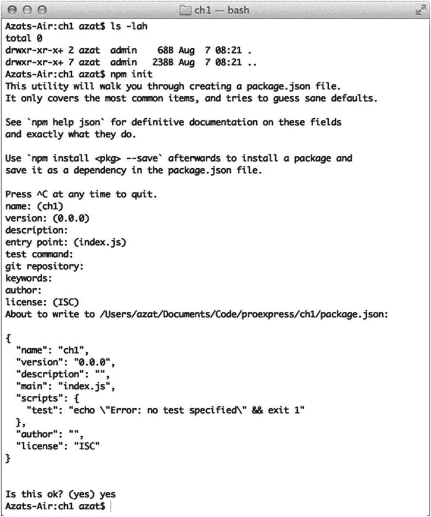
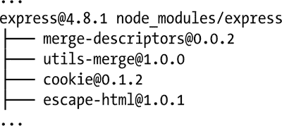
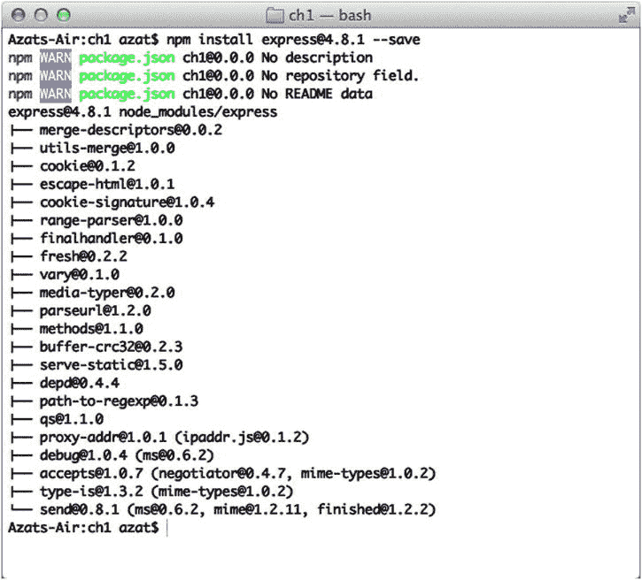
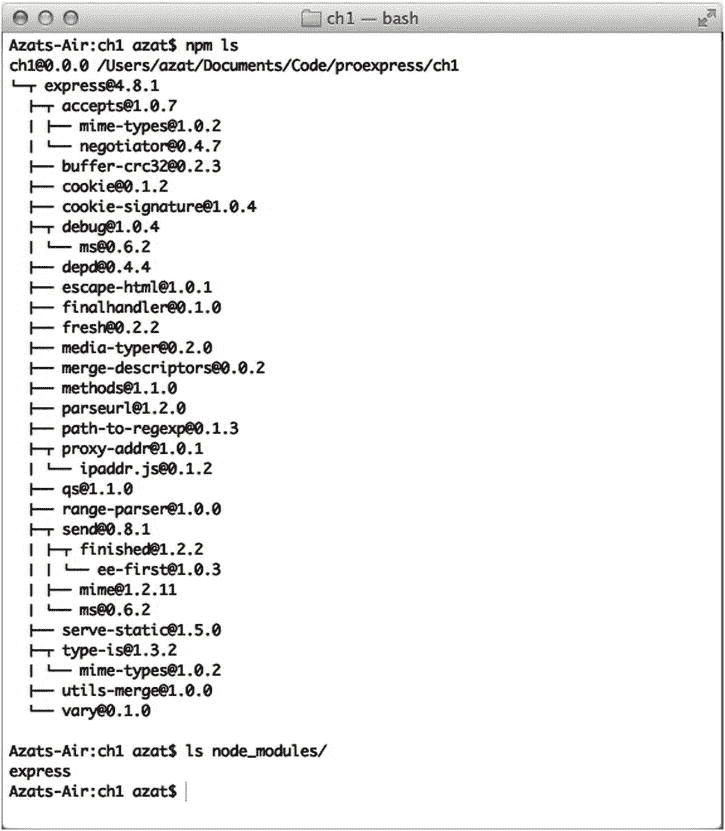
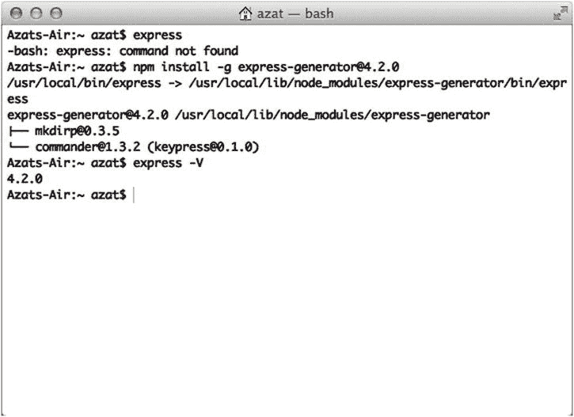

# 一、从 Express.js 开始

Express.js 是基于核心 Node.js `http`模块 [<sup>1</sup>](#Fn1) 并连接 [<sup>2</sup>](#Fn2) 组件的 web 框架。这些组件被称为中间件。它们是框架理念的基石，即*配置优于*约定。一些熟悉 Ruby 的开发人员将 Express.js 与 Sinatra 相比较，后者与 Ruby on Rails 框架有着非常不同的方法，后者更倾向于*约定而不是配置。*换句话说，开发人员可以自由选择他们需要的特定项目的库。这种方法为他们提供了高度定制项目的灵活性和能力。

如果您只使用核心 Node.js 模块编写过任何严肃的应用，您很可能会发现自己在重复编写相同的代码来完成类似的任务，例如:

*   解析 HTTP 请求正文
*   解析 cookies
*   管理会话
*   根据请求的 URL 路径和 HTTP 方法，用一系列`if`条件组织路由
*   基于数据类型确定正确的响应头
*   处理错误
*   提取 URL 参数(如`/messages/3233`)

后来，您可能创建了自己的库来重用代码，但是您的库不会像社区支持的最好的库那样经过彻底的测试。此外，维护将完全由您和您的团队承担。因此，我的建议是使用社区模块，如果它适合你的需要。这个建议同样适用于使用小型库和 web 框架。

Express.js 解决了这些和其他许多问题。它提供了优雅地重用代码的方法，并为您的 web 应用提供了类似于模型-视图-控制器(MVC) 的结构。模型(M)部分需要由一个额外的数据库驱动库提供(例如，mongose[<sup>3</sup>](#Fn3))。这些应用可以是各种各样的，从准系统、仅后端 REST APIs 到成熟的、全栈的、实时的 web 应用，还有额外的库，如`jade-browser` ( `https://npmjs.org/package/jade-browser`)和`socket.io` ( `http://socket.io`)。

为了让你快速开始使用 Express.js，并且不要太深入地钻研它的 API，我们将在本章中讨论这些主题:

*   Express.js 如何工作
*   Express.js 安装
*   Express.js 发电机安装

Express.js 如何工作

Express.js 是一个 Node 包管理器(NPM 或`npm`)模块，它依赖于您的应用。这意味着每个用/on Express.js 构建的项目都需要在本地`node_modules`文件夹中有框架的源文件(不是全局的！).为此，您可以像安装任何其他 NPM 模块一样安装 Express.js，使用`$ npm install`，例如`$ npm install express@4.2.0`。

现在，我们可以概述一个 Express.js 应用的典型结构。假设您的应用在一个`server.js`文件中，您计划用`$ node server.js`启动您的应用。在这种情况下，您需要在`server.js`文件中要求并配置 Express.js。该文件通常包含完成以下任务的语句:

1.  包括第三方依赖项以及您自己的模块，如控制器、实用程序、助手和模型
2.  Express.js 对象和其他对象的实例化
3.  连接到 MongoDB [<sup>4</sup>](#Fn4) 、Redis [<sup>5</sup>](#Fn5) 或 MySQL [<sup>6</sup>](#Fn6) 等数据库
4.  配置 Express.js 应用设置，例如模板引擎及其文件扩展名
5.  定义中间件，如错误处理程序、静态文件夹、cookies 和其他解析器
6.  定义路由及其请求处理程序
7.  启动将在特定主机和端口上启动服务器的应用

当然，如果您的应用很大，您将有多个文件来配置您的 Express.js 应用，而不仅仅是单个的`server.js`或`app.js`文件。原因是更好的代码组织。例如，在一个文件中，您将配置会话，在另一个身份验证中，在另一个路由中，等等。

 **提示**在应用开发的高级阶段(通常导致部署到生产环境中)，您可能希望使用`forever` ( `https://npmjs.org/package/forever` `)`模块和 Upstart 来实现更好的应用正常运行时间。你也可以利用[第 13 章](13.html)中概述的`cluster`模块来产生多个工人。

第三方依赖关系

定义第三方依赖关系很简单:

```js
var name = require('name');

```

依赖关系通常包括 Express.js 库本身，以及必要的中间件，如`body-parser`。定义多个依赖项的另一种方法是在每个定义后面跟一个逗号:

```js
var express = require('express'),
  compression = require('compression'),
  bodyParser = require('body-parser'),
  mongo = require('mongoskin');

```

实例化

要使用 Express.js，需要实例化它。同时，实例化任何其他对象也是一个很好的做法:

```js
var app = express();
var db = mongo.db('mongodb://localhost:27017/integration_tests', {native_parser: true});

```

 **提示**你不必命名 Express.js 模块`express`或者命名 Express.js 应用`app`。变量名可以是任意的。然而，本书中的大多数例子都使用了`express`和`app`来避免混淆。

连接到数据库

连接到数据库的语句不必在开头，只要它们在第 7 步“启动应用”之前(来自本节前面的列表)——除非我们将数据库用作会话存储。例如:

```js
var session = require('express-session');
var RedisStore = require('connect-redis')(session);
app.use(session({
  store: new RedisStore(options),
  secret: 'Pro Express.js rocks!'
}));

```

大部分数据库驱动，如 Mongoskin [<sup>7</sup>](#Fn7) 和 mongose[<sup>8</sup>](#Fn8)都支持查询的缓冲；这样，如果服务器在连接建立之前正在运行，数据库查询将被缓冲以供以后执行(当数据库连接建立时)。

配置 Express.js 应用设置

简单来说，配置 Express.js app 设置就是用`app.set()`给字符串键设置一些值。其中一些键由 Express.js 使用并增强其行为，而其他键是任意的。例如，如果您正在使用 Jade 模板引擎和`*.jade`文件，使用`'view engine'`让 Express.js 知道它需要寻找`*.jade`文件:

```js
app.set('view engine', 'jade');

```

在接下来的章节中，你会发现更多关于配置设置的信息。

有时我们希望在服务器对象上存储一个自定义值，以供将来参考。例如，我们可以将`port`赋给环境变量`PORT`中的一个值，或者，如果没有定义，赋给`3000`，这样我们就可以在所有源代码中使用这个值:

```js
app.set('port', process.env.PORT || 3000);

```

定义中间件

中间件是一个特殊的功能，允许更好的代码组织和重用。一些中间件被打包成第三方(NPM)模块，可以开箱即用。其他时候，我们可以编写自己的自定义中间件。在这两种情况下，语法都是`app.use()`:

```js
app.use(bodyParser.json());

```

定义路线

路由可以是好的旧网页，也可以是 REST API 端点。在这两种情况下，语法是相似的:我们使用`app.VERB()`，其中`VERB()`是一个 HTTP 方法，比如 GET、POST、DELETE、PUT、OPTIONS 或 PATCH。例如，我们可以将主页(根)路由定义为

```js
app.get('/', renderHomePage);

```

启动应用

最后，在配置好一切之后，我们可以用`server.listen(portNumber)`启动服务器，其中`server`是用`app`对象创建的核心`http server`对象:

```js
var server = http.createServer(app);
var boot = function () {
  server.listen(app.get('port'), function(){
    console.info('Express server listening on port ' + app.get('port'));
  });
};
var shutdown = function() {
  server.close();
};

```

如果这个文件包含在另一个文件中(例如，一个测试)，我们可能想要导出服务器对象，而不是引导它。我们执行检查的方式是使用`require.main === module`；如果这是真的，那么这个文件没有被其他任何东西包含。测试将使用我们导出的方法`boot()`自动启动服务器。我们还出口`shutdown()`和`port`:

```js
if (require.main === module) {
  boot();
} else {
  console.info('Running app as a module');
  exports.boot = boot;
  exports.shutdown = shutdown;
  exports.port = app.get('port');
}

```

当 Express.js 应用运行时，它会监听请求。每个传入的请求都根据定义的中间件链和路由进行处理，从上到下进行处理。这一点很重要，因为它允许您控制执行流程。

例如，我们可以有多个函数来处理每个请求，其中一些函数位于中间(因此被称为中间件):

1.  解析 cookie 信息，完成后进入下一步。
2.  解析 URL 中的参数，完成后进入下一步。
3.  如果用户被授权(cookie/session)，则根据参数值从数据库中获取信息，如果匹配，则进入下一步。
4.  显示数据并结束响应。

Express.js 安装

Express.js 是一个依赖模块，应该安装在本地(项目)`node_modules`文件夹:`$ npm install express@4.8.1`。

 **提示** NPM 查找`node_modules`文件夹或`package.json`文件。如果这是一个全新的文件夹，既没有文件夹也没有文件，你可以用`$ mkdir node_modules`创建`node_modules`，或者用`$ npm init`创建`package.json`。

对于作为依赖项的本地 Express.js 模块安装，让我们创建一个新文件夹，`$ mkdir proexpressjs`。这将是本书的项目文件夹。现在，我们可以用`$ cd proexpressjs`打开它。

 **提示**为了方便起见，大部分示例都位于 GitHub 资源库 azat-co/proexpressjs ( `http://github.com/azat-co/proexpressjs`)中。但是，我强烈建议您键入书中的代码，并使用您的文本、名称和自定义逻辑对其进行修改。不要复制/粘贴代码，甚至更糟——只需运行我们的 GitHub 示例。使用书中提供的完整源代码，GitHub 仅在您遇到困难或在您阅读完这本书后需要为您的项目使用一些 reciepe 时作为参考。这个建议是基于大量的研究，这些研究表明写作或打字的人比那些只看内容的人记忆和学习更有效。还要做笔记！

一旦我们进入项目文件夹，我们可以在文本编辑器中手动创建`package.json`或者使用`$ npm init`终端命令。当你使用这个命令时，会要求你提供项目名称、描述等细节，如图[图 1-1](#Fig1) 所示。



[图 1-1](#_Fig1) 。运行$ npm init 的结果

这是[图 1-1](#Fig1) 中带有普通`$ npm init`选项的`package.json`文件示例:

```js
{
  "name": "ch1",
  "version": "0.0.1",
  "description": "",
  "main": "index.js",
  "scripts": {
    "test": "echo \"Error: no test specified\" && exit 1"
  },
  "author": "",
  "license": "ISC"
}

```

最后，要使用 NPM 安装模块:

```js
$ npm install express

```

前面的命令将获取 Express.js 的最新版本。但是，对于本书，建议您使用指定的版本，因此改为运行以下命令:

```js
$ npm install express@4.8.1 --save

```

`--save`标志是可选的。它在`package.json`中为这个模块创建一个条目。

如果您想为现有项目安装 Express.js 并将依赖关系保存到`package.json`文件中(聪明的做法！)—已经存在于该项目的文件夹中—运行:

```js
 $ npm install express --save.

```

 **注意**如果你试图在没有`package.json`文件或`node_modules`文件夹的情况下运行前面提到的`$ npm install express`命令，*智能* NPM 将遍历目录树找到有这两个文件的文件夹。这种行为有点模仿 Git 的逻辑。有关 NPM 安装算法的更多信息，请参考`https://npmjs.org/doc/folders.html`的官方文档。

如果你的项目是空白的，使用`$ npm init`然后`$ npm install express@4.8.1 --save`的方法是好的。因此，该命令将下载 express 及其依赖项，并列出它们(如图[图 1-2](#Fig2) ):





[图 1-2](#_Fig2) 。运行 npm install express@4.8.1 的结果-保存

信息`express@4.8.1 node_modules/express`很重要，因为它告诉我们`the express`被放置在哪里(在`node_modules`)。

或者，如果项目不为空，并且`package.json`已经包含了所有有用的信息，我们可以在`package.json`文件中添加我们的新依赖项及其版本号或一些意外的组合(不推荐生产应用使用)，例如`"express": "4.8.x"`或`"express": "4.8.1", or "*"`，然后运行`$ npm install`。

添加了 Express.js v4.8.1 依赖项的`package.json`文件如下所示:

```js
{
  "name": "proexpress",
  "version": "0.0.1",
  "description": "",
  "main": "index.js",
  "scripts": {
    "test": "echo \"Error: no test specified\" && exit 1"
  },
  "dependencies": {
    "express": "4.8.1"
  },
  "author": "",
  "license": "BSD"
}

$ npm install

```

为了仔细检查 Express.js 的安装及其依赖项，我们可以运行一个`$ npm ls`命令(参见[图 1-3](#Fig3) ，它列出了这个本地项目中的所有模块:




[图 1-3](#_Fig3) 。运行$ npm ls 和$ ls node_modules 的结果

命令`$ npm ls`列出了这个项目(当前文件夹)的本地依赖项。此时，我们至少应该看到`express@4.8.1`(如图[图 1-3](#Fig3) )。另一种检查方法是使用`$ ls node_modules`(也显示在[图 1-3](#Fig3) 中)，它列出了`node_modules`中的文件夹。

Express.js 发电机安装

Express.js 生成器(`express-generator`)是一个独立的模块(从 express . js 4 . x 版开始，之前都是捆绑的)。它允许快速创建应用，因为它的脚手架机制接受命令行选项并基于它们生成 Express.js 应用。

要安装 Express.js Generator，一个用于搭建的命令行工具，从 Mac/Linux 机器上的任何地方运行`$ npm install -g express-generator`。(对于 Windows 用户，路径会有所不同。检查`NODE_PATH`环境变量，如果您想要一个不同的全局位置，请更新它。)安装命令将下载并链接`$ express`终端命令到正确的路径，以便我们以后创建新应用时可以访问它的命令行界面(CLI)。

当然，我们可以更具体一点，告诉 NPM 使用`$ npm install -g` `express@4.2.0` `.`版本安装 4.2.0 版本的`express`和`express-generator`模块不必(通常也不会)匹配，因为它们是独立的模块。因此，您需要根据变更日志和 GitHub 自述文件来了解什么是兼容的。

 **提示**当将`–g`标志与`npm install`一起使用时，一个好的经验法则是将其用于命令行工具(例如，`node-dev`、`mocha`、`supervisor`、`grunt`)，而不是用于项目的依赖项。Node.js 中的依赖项必须本地安装到项目的`node_modules`文件夹中。

在[图 1-4](#Fig4) 中，我们尝试了`express`命令没有成功，然后安装`express-generator`，进入`express`命令行工具。



[图 1-4](#_Fig4) 。用-g 和$ express -V 运行 NPM 的结果

 **注意**最有可能的情况是，您的系统需要 root/administrator 权限才能写入该文件夹。在这种情况下，您将需要`$ sudo npm install -g express-generator`。

注意[图 1-4](#Fig4) 中的路径`/usr/local/lib/node_modules/express-generator`。这与本地安装的`express`路径截然不同。这是发现错误的方法之一，如果你试图安装某个东西，但它不可用——检查位置！

是的，对于一些精通 Node.js 的读者来说，这可能是微不足道的，但我见过太多次了，一些来自 Python、Ruby 和 Java 背景的人试图全局安装`express`(依赖项)，以便他们可以在所有项目中使用它。请不要这样做。

摘要

本章为理解 Express.js 的工作原理奠定了基础。通过讲述一个典型的 Express.js 应用结构，您已经了解了配置、中间件和路由等概念，我们将在整本书中更深入地讨论这些概念。最重要的是，您学习了如何将 Express.js 本地安装到一个空白文件夹和现有项目中，以及如何安装 Express.js Generator。

在下一章中，我们将构建我们的第一个 Express.js 应用，典型的 Hello World，并探索生成器/脚手架选项。

________________

[<sup>1</sup>](#_Fn1)T0】

[<sup>2</sup>](#_Fn2)T0】

[<sup>3</sup>](#_Fn3)T0】

[<sup>4</sup>](#_Fn4)T0】

[<sup>5</sup>](#_Fn5)T0】

[<sup>6</sup>](#_Fn6)T0】

[<sup>7</sup>](#_Fn7)T0】

[<sup>8</sup>](#_Fn8)T0】