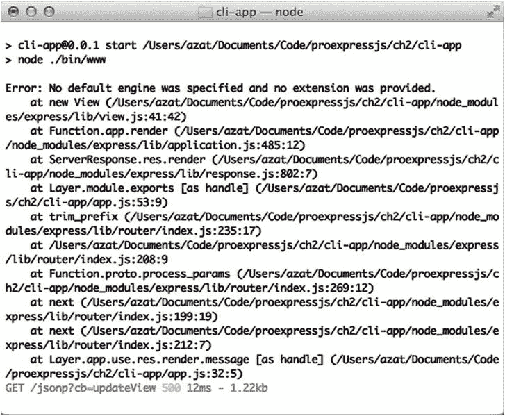
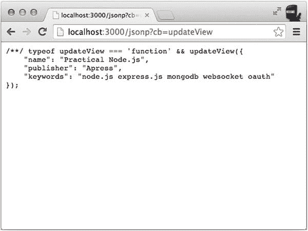
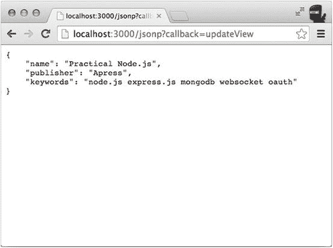
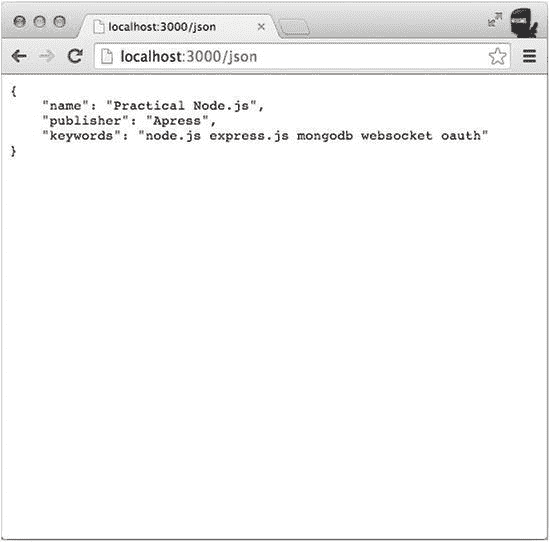
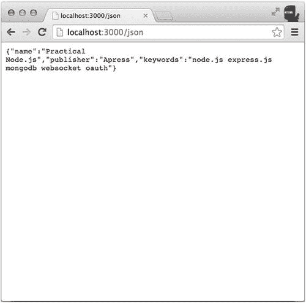
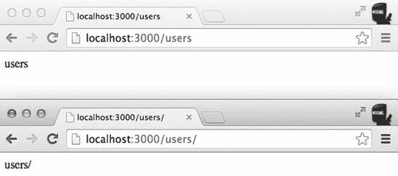
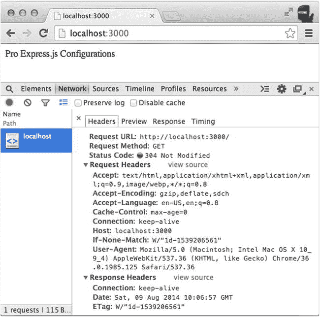

第三章


配置、设置和环境

本章介绍了配置 Express.js 设置的不同方法。正如在第一章中提到的，Express.js 将自己定位为一个超越常规框架的*配置。因此，当谈到 Express.js 中的配置时，您几乎可以配置任何东西！为此，您需要使用配置语句并了解设置。*

有哪些设定？可以将设置视为通常以全局或应用程序范围的方式起作用的键值对。设置可以增强服务器的行为，将信息添加到响应中，或者在以后用作参考。

有两种类型的设置:框架在后台使用的 Express.js 系统设置，以及开发人员为自己的代码使用的任意设置。前者有默认值，所以如果你不配置它们，应用程序仍然可以正常运行！所以，如果你不知道或者不使用 Express.js 的一些设置，也没什么大不了的。出于这个原因，不要觉得你必须记住所有的设置才能构建快速应用程序。如果您对特定方法或系统设置有任何疑问，请随时参考本章内容。

为了从简单到复杂，本章组织如下:

*   *配置* :设定设定值和获取设定值的方法
*   *设置* :设置的名称、默认值、影响以及如何增加值的示例
*   环境 :确定一个环境并将应用程序置于该模式是任何严肃应用程序的一个重要方面。

本章的例子可以在`ch3/app.js`项目中找到，该项目位于`http://github.com/azat-co/proexpressjs`的 GitHub 存储库中。

配置

在使用设置之前，您需要了解如何在 Express.js 应用程序上应用它们。最常见和最通用的方法是使用`app.set`定义一个值，并使用`app.get`根据设置的键/名称检索该值。

其他配置方法不太通用，因为它们仅适用于基于其类型(布尔值)的某些设置:`app.enable()`和`app.disable()`。

app.set()和 app.get()

方法`app.set(name, value)`接受两个参数:`name`和`value`。正如您可能猜到的，它设置了名称的值。例如，我们经常想要存储我们计划启动服务器的端口的值:

```js
app.set('port', 3000);

```

或者，对于一个更高级和更现实的用例，我们可以从系统环境变量`PORT (process.env.PORT)`中获取端口。如果`PORT`环境变量未定义，我们就回到硬编码的值`3000`:

```js
app.set('port', process.env.PORT || 3000);

```

前面的代码更短，相当于使用了一个`if else`语句:

```js
if (process.env.PORT) {
  app.set(process.env.PORT);
} else {
  app.set(3000);
}

```

`name`值可以是 Express.js 设置或任意字符串。要获得该值，我们可以使用带有单个参数的`app.set(name)`，或者我们可以使用更显式的方法`app.get(name)`，如下例所示:

```js
console.log('Express server listening on port ' + app.get('port'));

```

`app.set()`方法还将变量暴露给应用程序范围内的模板；例如，

```js
app.set('appName', 'HackHall');

```

将在*所有*模板中可用，这意味着该示例在 Jade 模板布局中有效:

```js
doctype 5
html
  head
    title= appName
  body
    block content

```

app.enable()和 app.disable()

有些 system Express.js 设置的类型为布尔值 true 和 false，而不是字符串类型，它们只能设置为布尔值 false 或 true。对于这样的标志，有简写版本；例如，作为`app.set(name, true)`和`app.set(name, false)`函数的替代，您可以相应地使用简洁的`app.enable(name)`和`app.disable(name)`调用。我推荐使用`app.set()`,因为不管设置的类型是什么，它都能保持代码的一致性。

例如，`etag` Express.js 设置是一个布尔值。它为浏览器缓存打开和关闭 ETag 头(稍后将详细介绍`etag`)。要用`app.disable()`关闭缓存，写一个语句:

```js
app.disable('etag');

```

app.enabled()和 app.disabled()

为了检查上述值是真还是假，我们可以调用方法`app.enabled(name)`和`app.disabled(name)`。例如，

```js
app.disable('etag');
console.log(app.disabled('etag'));

```

会在 Express.js app 的上下文中输出`true`。

设置

有两类设置:

*   *Express.js 系统设置* :这些设置被框架用来确定某些配置。它们中的大多数都有默认值，所以省略了配置这些设置的基本应用程序将会工作得很好。
*   *自定义设置* :您可以存储任意名称作为设置，以备后用。这些设置是为您的应用程序定制的，您首先需要定义它们来使用。

系统设置的范围是 Express.js 文档中最难理解的部分之一，因为有些设置根本没有文档记录(在撰写本文时)。Express.js 足够灵活，你不必为了写应用程序而知道**所有的设置**。但是当你了解了所有的设置并开始使用你需要的设置后，你会对配置你的服务器更有信心。您将更好地理解框架的内部工作方式。

在本节中，您将了解以下设置:

*   `env`
*   `view cache`
*   `view engine`
*   `views`
*   `trust proxy`
*   `jsonp callback name`
*   `json replacer`和`json spaces`
*   `case sensitive routing`
*   `strict routing`
*   `x-powered-by`
*   `etag`
*   `query parser`
*   `subdomain offset`

为了说明实际的设置，我们写了一个`ch3/app.js`例子。为了避免混淆，我们现在不展示整个文件，而是在本节末尾提供源代码以供参考。

包封/包围（动词 envelop 的简写）

这个变量用于存储这个特定 Node.js 进程的当前环境模式。该值由 Express.js 从`process.env.NODE_ENV`开始自动设置(通过执行机器上的环境变量提供给 Node.js ),如果没有设置，则设置为`development`值。

`env`设置的其他最常见值如下:

*   `development`
*   `test`
*   `stage`
*   `preview`
*   `production`

Express.js 使用“`production`”和“`development`”值作为某些设置的默认值(`view cache`就是其中之一)。其他值只是约定俗成的，意味着只要保持一致，你可以随意使用。例如，你可以用`qa`代替`stage`。

我们可以通过在代码中添加`app.set('env', 'preview');`或`process.env.NODE_ENV=preview`来增加`env`的设置。不过，更好的方法是用`$ NODE_ENV=preview node app`启动一个 app，或者在机器上设置`NODE_ENV`变量。

了解应用程序运行的模式非常重要，因为与错误处理、样式表编译和模板呈现相关的逻辑可能会有很大的不同。显然，数据库和主机名因环境而异。

`app.get('env')`设置在`ch3/app.js`示例中显示为

```js
console.log(app.get('env'));

```

这一行输出

```js
"development"

```

当我们用`$ NODE_ENV=development node app.js`启动过程时，如果`NODE_ENV`被设置为`development`，或者当`NODE_ENV`未被设置时，前面的行被打印。在后一种情况下，使用“`development`”值的原因是 Express.js 在未定义时默认设置为“`development`”。

查看缓存

这个标志，如果设置为`false`，允许无痛开发，因为每次服务器请求模板时都会读取它们。另一方面，如果`view cache`被设置为`true`，它有助于模板编译缓存，这是生产中期望的行为。如果`env`设置为`production`，则`view cache` 默认开启。否则设置为`false`。

查看引擎

`view engine` 设置保存模板文件扩展名(例如，`'ext'`或`'jade'`)，以便在文件扩展名未被传递给请求处理器内部的`res.render()`函数时使用。

例如，如图 3-1 中的[所示，如果我们从上一章的`ch2/cli-app/app.js`示例中注释掉这一行:](#Fig1)

```js
// app.set('view engine', 'ejs');

```



[图 3-1](#_Fig1) 。没有合适的模板扩展集的结果

服务器将无法定位该文件，因为我们在`cli-app/routes/index.js`中的指令太不明确:

```js
exports.index = function(req, res){
  res.render('index', { title: 'Express' });
};

```

我们可以通过给`cli-app/routes/index.js`文件添加扩展名来解决这个问题:

```js
exports.index = function(req, res){
  res.render('index.ejs', { title: 'Express' });
};

```

有关如何应用不同模板引擎的更多信息，请参考[第 5 章](05.html)。

视图

`views` 设置有一个指向模板目录的绝对路径(在 Mac 和 Unix 上以/开头)。该设置默认为项目根目录下`views`文件夹的绝对路径(主应用程序文件，如`app.js`所在的位置)。

正如在第 2 章的[的“MVC 结构和模块”一节中提到的，改变模板文件夹名是很简单的。通常，当我们在`app.js`中为`views`设置自定义值时，我们使用`path.join()`和`__dirname`全局变量——这给了我们`app.js`所在文件夹的绝对路径。例如，如果你想使用文件夹`templates`使用这个配置语句:](02.html)

```js
app.set('views', path.join(__dirname, 'templates'));

```

信任代理

如果您的 Node.js 应用程序在 Varnish 或 Nginx 等反向代理后面工作，请将`trust proxy` 设置为`true`。这将允许信任`X-Forwarded-*`报头，例如`X-Forwarded-Proto` ( `req.protocol`)或`X-Forwarder-For` ( `req.ips`)。默认情况下，`trust proxy`设置被禁用。

如果您想打开它(当您有代理服务器时)，您可以使用以下语句之一:

```js
app.set('trust proxy', true);
app.enable('trust proxy');

```

jsonp 回调名称

如果您正在构建一个应用程序(REST API 服务器),为来自托管在不同域上的前端客户端的请求提供服务，那么在进行 XHR/AJAX 调用时，您可能会遇到跨域限制。换句话说，浏览器请求仅限于同一个域(和端口)。解决方法是在服务器上使用跨源资源共享(CORS) 头。

如果您不想将 CORS 头文件应用到您的服务器上，那么带前缀的 JavaScript 对象文字符号(JSONP)是一个不错的选择。Express.js 有一个`res.jsonp()`方法，使得使用 JSONP 变得轻而易举。

 **提示**要了解更多关于 CORS 的信息，请前往`http://en.wikipedia.org/wiki/Cross-origin_resource_sharing`。

默认的回调名称是 JSONP 响应的前缀，通常在请求的查询字符串中提供，名称为`callback`；比如`?callback=updateView`。但是，如果你想使用不同的东西，只需将设置`jsonp callback name`设置为该值即可；例如，对于带有查询字符串 param `?cb=updateView`的请求，我们可以使用这个设置:

```js
app.set('jsonp callback name', 'cb');

```

这样，我们的响应将被包装在`updateView` JavaScript 代码中(当然，带有适当的`Content-Type`头)，如图[图 3-2](#Fig2) 所示。



[图 3-2](#_Fig2) 。使用 cb 作为回调的查询字符串名称

在大多数情况下，我们不想改变这个值，因为默认的`callback`值在某种程度上被 jQuery *$标准化了。ajax* JSONP 函数。

如果我们在 Express.js 设置配置中将`jsonp callback name`设置为`cb`，但是用不同的属性进行请求，比如`callback`，那么路由不会输出 JSONP。它会默认为 JSON 格式，如图[图 3-3](#Fig3) 所示，没有函数调用的前缀，我们在[图 3-2](#Fig2) 中看到。



[图 3-3](#_Fig3) 。如果没有合适的回调参数，JSONP 默认为 JSON

json 替换器和 json 空间

同样，当我们使用 Express.js 方法`res.json()`时，我们可以应用特殊的参数:`replacer`和`spaces`。这些参数被传递给应用范围内的所有`JSON.stringify()`功能 [<sup>1</sup>](#Fn1) 。`JSON.stringify()`是一个广泛使用的函数，用于将原生 JavaScript/Node.js 对象转换成字符串。

`replacer`参数就像一个过滤器。这个函数有两个参数:键和值。如果返回`undefined`，那么该值被省略。为了让键值对成为最终的字符串，我们需要返回值。你可以在 Mozilla 开发者网络(MDN)上阅读更多关于`replacer`的内容。[2<sup>2</sup>T7】](#Fn2)

Express.js 使用`null`作为`json replacer`的默认值。当我需要打印漂亮的 JSON 时，我经常使用`JSON.stringify(obj, null, 2)`。

`spaces`参数本质上是一个缩进尺寸。它的值在开发中默认为`2`，在生产中默认为`0`。在大多数情况下，我们不去管这些设置。

在我们的示例应用程序`ch3/app.js`中，我们有一个`/json`路由，它向我们发回一个包含一本书信息的对象。我们将一个`replacer`参数定义为一个从对象中省略折扣代码的函数(我们不想公开这个信息)。并且`spaces`参数被设置为`4`，这样我们可以看到 JSON 被很好地格式化，而不是一些混乱的代码。`/json`路线的最终响应如图 3-4 中的[所示。](#Fig4)



[图 3-4](#_Fig4) 。设置了替换符和空格的 JSON 输出

以下是示例应用程序中使用的语句:

```js
app.set('json replacer', function(key, value){
  if (key === 'discount')
    return undefined;
  else
    return value;
});
app.set('json spaces', 4);

```

如果我们移除`json spaces`，应用程序将产生图 3-5 中[所示的结果。](#Fig5)



[图 3-5](#_Fig5) 。未设置空格的 JSON 输出

区分大小写的路由

`case sensitive routing` 标志应该是不言自明的。当它是默认值`false`时，我们不考虑 URL 路径的大小写，当该值设置为 true 时，我们不考虑大小写。比如我们有`app.enable('case sensitive routing');`，那么`/users`和`/Users`就不一样了。为了避免混淆，最好禁用此选项。

严格路由

下一个设置(或者一个标志，因为它有布尔意义)*严格路由*处理 URL 中尾部斜杠的情况。在`strict routing` 使能的情况下，比如`app.set('strict routing', true');`，路径会被区别对待；例如，`/users`和`/users/`将是完全独立的航线。在示例`ch3/app.js`中，我们有两条相同的路由，但其中一条有一个尾随斜杠。它们发回不同的字符串:

```js
app.get('/users', function(request, response){
  response.send('users');
})
app.get('/users/', function(request, response){
  response.send('users/');
})

```

因此，浏览器对于`/users`和`/users/`会有不同的消息，如图[图 3-6](#Fig6) 所示。



[图 3-6](#_Fig6) 。启用严格路由时，/users 和 users/是不同的路由

默认情况下，该参数设置为`false`，这意味着尾部斜杠被忽略，带有尾部斜杠的路由将被视为与不带尾部斜杠的路由相同。我的建议是保留默认值；也就是说，将带斜线的路由视为与不带斜线的路由相同。如果您的 API 架构要求区别对待它们，那么这个建议就不适用。

x 供电的

`x-powered-` `by` 选项将 HTTP 响应报头`X-Powered-By`设置为`Express`值。该选项默认启用，如图 3-7 中的[所示。](#Fig7)


[图 3-7](#_Fig7) 。X-Powered-By Express 已启用(默认)

如果你想禁用`x-powered-by`(从响应中删除它)——这是出于安全原因推荐的，因为如果你的平台未知，就更难找到漏洞——那么应用`app.set('x-powered-by', false)`或`app.disable('x-powered-by')`，这将删除 X-Powered-By 响应头(如示例`ch3/app.js`和图 3-8 所示的[)。](#Fig8)



[图 3-8](#_Fig8) 。X-Powered-By Express 被禁用，没有响应头

电子标签

ETag [<sup>3</sup>](#Fn3) (或实体标签)是一个缓存工具。它的工作方式类似于给定 URL 上内容的唯一标识符。换句话说，如果特定 URL 上的内容没有变化，ETag 将保持不变，浏览器将使用缓存。[图 3-7](#Fig7) 和[图 3-8](#Fig8) 包括一个 ETag 响应头的例子。这个例子的代码可以在`ch3/app.js`中找到。

如果有人不知道 etag 是什么，也不知道如何使用它，那么最好让 Express.js 默认的 ETag 设置保持原样，即 on (boolean true)。否则，要禁用 ETag，请使用`app.disable('etag');`，这将消除 ETag HTTP 响应头。

默认情况下，Express.js 使用“弱”ETag。其他可能的值有`false`(无 ETag)`true`(弱 ETag)`strong`(强 ETag)。Express.js 提供的最后一个选项(对于高级开发人员)是使用您自己的 ETag 算法:

```js
app.set('etag', function (body, encoding) {
  return customEtag(body, encoding); // you define the customEtag function
})

```

如果您不熟悉弱或强的含义，下面是这些类型的 ETag 之间的差异的简短解释:相同的强 ETag 保证响应是完全相同的，而相同的弱 ETag 表示响应在语义上是相同的。因此，对于弱 ETags 和强 ETags，您将获得不同级别的缓存。当然，这是一个非常简短和模糊的解释。如果这个主题对你的项目很重要，请自己做研究。

查询分析器

一个*查询字符串*是在 URL 中问号后面发送的数据(例如，`?name=value&name2=value2`)。这种格式需要解析成 JavaScript/Node.js 对象格式才能使用。为了方便起见，Express.js 自动包含了这个查询解析。这是通过启用`query parser`设置来实现的。

`query parser` 的默认值是`extended`，它使用了`qs`模块的功能。 [<sup>4</sup>](#Fn4) 其他可能值有

*   `false`:禁用解析
*   `true`:使用`qs`
*   `simple`:使用核心`querystring`模块的功能(`http://nodejs.org/api/querystring.html`)

可以将您自己的函数作为参数传递，在这种情况下，您的自定义函数将用于解析，而不是解析库。如果您传递自己的函数，那么您的自定义解析函数必须接受一个字符串参数，并返回一个 JavaScript/Node.js 对象，该对象类似于来自核心`querystring`模块的`parse`函数的签名。 [<sup>5</sup>](#Fn5)

以下是我们将`query parser`设置为使用`querystring`、无解析和自定义解析函数的示例:

```js
app.set('query parser', 'simple');
app.set('query parser', false);
app.set('query parser', customQueryParsingFunction);

```

子域偏移

`subdomain offset` 设置控制`req.subdomains`属性返回的值。当应用程序部署在多个子域上时，如`http://ncbi.nlm.nih.gov`，此设置非常有用。

默认情况下，主机名/URL 中的最后两个“子域”(最右边的两个部分)被删除，其余的在`req.subdomains`中以相反的顺序返回；所以对于我们的`http://ncbi.nlm.nih.gov`的例子，得到的`req.subdomains`是`['nlm', 'ncbi']`。

但是，如果 app 已经通过`app.set('subdomain offset', 3);`将`subdomain offset`设置为`3`，`req.subdomains`的结果将只是`['ncbi']`，因为 Express.js 会从右边开始丢弃三(3)个部分(`nlm`，`nih`，`gov`)。

环境

正如你们许多人所知，大多数应用程序不能在单一环境中运行。这些环境通常至少包括开发、测试和生产。每种环境都对应用程序提出了不同的要求。例如，在开发中，应用程序的错误消息需要尽可能详细，而在生产中，它需要对用户友好，并且不会将任何系统或用户的个人身份信息(PII [<sup>6</sup>](#Fn6) )数据泄露给黑客。

代码需要适应不同的环境，而不需要我们这些开发人员在每次部署到不同的环境时都必须修改它。

当然，我们可以根据`process.env.NODE_ENV`值写一些`if else`语句；例如:

```js
if ('development' === process.env.NODE_ENV) {

```

如果上面的那行对你来说很奇怪，请记住它与`process.env.NODE_ENV === 'development'`完全相同。或者，您可以使用`process.env.NODE_ENV == 'development'`，它会在比较之前将`NODE_ENV`转换为字符串(如果由于某种原因它还不是字符串)。

```js
  *// Connect to development database*
} else if ('production' === process.env.NODE_ENV) {
  *// Connect to production database*
 }; *// Continue for staging and preview environments*

```

或者使用 Express.js `env` param(参考本章前面的“env”部分):

```js
*// Assuming that app is a reference to Express.js instance*
if ('development' === app.get('env')) {
  *// Connect to development database*
} else if ('production' === app.get('env')) {
  *// Connect to production database*
 }; *// Continue for staging and preview environments*

```

`app.get('env')`的另一个例子是 skeleton Express.js Generator 应用程序中的一个。与生产或任何其他环境相比，它为开发环境应用了更详细的错误处理程序(从`err`对象发送整个 stacktrace ):

```js
if (app.get('env') === 'development') {
    app.use(function(err, req, res, next) {
        res.status(err.status || 500);
        res.render('error', {
            message: err.message,
            error: err
        });
    });
}

```

如果环境不是`development`，Express.js 将使用这个没有向用户泄露堆栈跟踪的错误处理程序，而不是上面的错误处理程序:

```js
app.use(function(err, req, res, next) {
    res.status(err.status || 500);
    res.render('error', {
        message: err.message,
        error: {}
    });
});

```

APP。配置

允许更优雅的环境配置的`app.configure()`方法在 Express.js 4.x 中被*弃用*，但是，您应该仍然知道它是如何工作的，因为您可能会在旧项目中遇到它。

当用一个参数调用 app.configure()方法时，它会将回调应用到**所有的**环境。例如，如果您想要为任何环境设置一个作者电子邮件和应用程序名称，那么您可以编写:

`app.configure(function(){`
`app.set('appName', 'Pro Express.js Demo App');`
`app.set('authorEmail', 'hi@azat.co');`

但是，如果我们传递两个(或更多)参数，第一个是环境，最后一个仍然是函数，那么只有当应用程序处于这些环境模式(例如，开发、生产)时，才会调用代码。

例如，您可以为开发设置不同的`dbUri`值(数据库连接字符串),并使用这些回调进行准备:

`app.configure('development', function() {`
`app.set('dbUri', 'mongodb://localhost:27017/db');`
`});`
`app.configure('stage', 'production', function() {`
`app.set('dbUri', process.env.MONGOHQ_URL);`

 **提示** Express.js 经常使用输入参数数量和类型的差异来指导函数的行为。因此，请密切注意如何调用方法。

现在您已经熟悉了设置，下面是演示厨房水槽应用程序。在其中，我们收集了所有上述设置来说明示例。在检查代码时，请注意文件中配置语句的顺序！它们必须在`var app`实例化之后，但在中间件和路由之前。下面是示例服务器`ch3/app.js`的完整源代码:

```js
var book = {name: 'Practical Node.js',
  publisher: 'Apress',
  keywords: 'node.js express.js mongodb websocket oauth',
  discount: 'PNJS15'
}
var express = require('express'),
  path = require('path');

var app = express();

console.log(app.get('env'));

app.set('view cache', true);
app.set('views', path.join(__dirname, 'views'));
app.set('view engine', 'jade');
app.set('port', process.env.PORT || 3000);

app.set('trust proxy', true);
app.set('jsonp callback name', 'cb');
app.set('json replacer', function(key, value){
  if (key === 'discount')
    return undefined;
  else
    return value;
});
app.set('json spaces', 4);

app.set('case sensitive routing', true);
app.set('strict routing', true);
app.set('x-powered-by', false);
app.set('subdomain offset', 3);
// app.disable('etag')

app.get('/jsonp', function(request, response){
  response.jsonp(book);
})
app.get('/json', function(request, response){
  response.send(book);
})
app.get('/users', function(request, response){
  response.send('users');
})
app.get('/users/', function(request, response){
  response.send('users/');
})
app.get('*', function(request, response){
  response.send('Pro Express.js Configurations');
})

if (app.get('env') === 'development') {
    app.use(function(err, req, res, next) {
        res.status(err.status || 500);
        res.render('error', {
            message: err.message,
            error: err
        });
    });
}
var server = app.listen(app.get('port'), function() {
  console.log('Express server listening on port ' + server.address().port);
});

```

摘要

在本章中，我们介绍了如何使用 app.set()、app.disable()和 app.enable()等方法配置 Express.js 系统设置。您学习了如何使用 app.get()和 app.enabled()和 app.disabled()获取设置值。然后，我们讨论了所有重要的 Express.js 设置，它们的意义和价值。您还看到，设置可以是任意的，并用于存储特定于应用程序的自定义信息(例如，端口号或应用程序名称)。

如果你还记得第一章中的应用结构，中间件在主 Express.js 应用文件的配置部分之后。第三方中间件和定制中间件都可以与 Express.js 一起使用。当你编写自己的中间件时，这是一种重用和组织代码的方法。

NPM 上有大量的第三方 Express.js 中间件模块。它们可以完成从解析到认证的许多任务。通过使用第三方中间件，您可以增强和定制应用程序的行为。所以中间件可以被认为是它自己的一种配置(类固醇上的配置！).继续阅读，掌握最常用的中间件！

________________

[<sup>1</sup>](#_Fn1)T0】

[<sup>2</sup>](#_Fn2)T0】

[<sup>3</sup>](#_Fn3)T0】

[<sup>4</sup>](#_Fn4)T0】

[<sup>5</sup>](#_Fn5)T0】

[<sup>6</sup>](#_Fn6)T0】