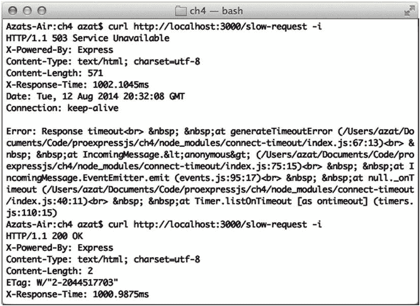
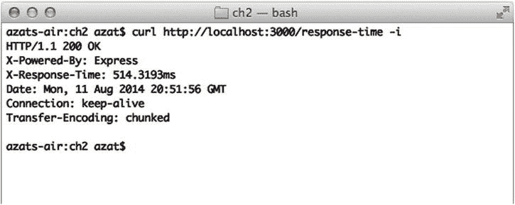
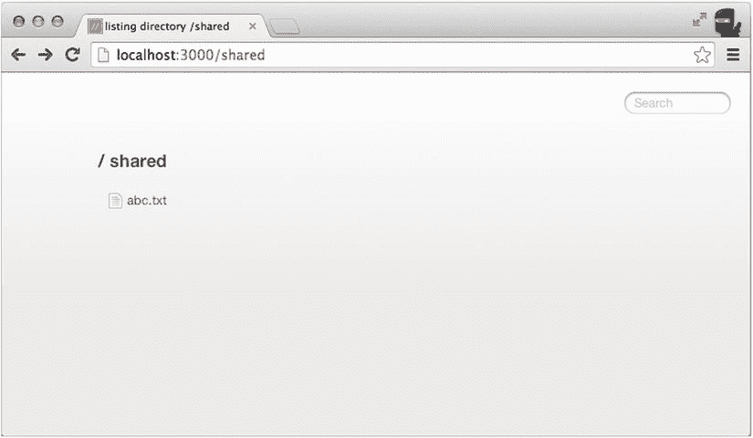
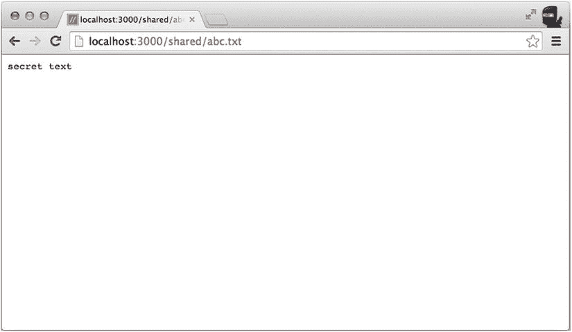

# 四、使用中间件

中间件是一种非常有用的模式，它允许开发人员在他们的应用中重用代码，甚至以 NPM 模块的形式与他人共享。*中间件*的本质定义是一个有三个自变量的函数:`request`(或`req`)、`response` ( `res`)、`next`。如果您正在编写自己的中间件，您可以使用任意的名称作为参数，但是最好坚持通用的命名约定。下面是一个如何定义自己的中间件的例子:

```js
var myMiddleware = function (req, res, next) {
  // Do something with req and/or res
  next();
};

```

自己写中间件的时候，别忘了调用`next()`回调函数。否则，请求将挂起并超时。对于后续的中间件，请求(`req`)和响应(`res`)对象是相同的，因此您可以向它们添加属性(例如`req.user = 'Azat'`)以便以后访问它们。

在本章中，我们将讨论以下主题:

*   *应用中间件*:如何在 Express.js 应用中使用中间件
*   *必备中间件*:最常用的中间件，Connect.js 中间件，4.x 版本之前是 Express.js 一部分的中间件
*   *其他中间件*:最有用最流行的第三方中间件

与描述如何构建一个大型项目的传统技术书籍章节不同，本章广泛描述了最流行和最常用的中间件模块。类似于[第三章](03.html)，这一章有点类似于参考。为了向您演示中间件的特性，在`ch4`文件夹中有一个厨房水槽，这意味着它有许多不同的东西。像往常一样，代码将在书中列出，并在`https://github.com/azat-co/proexpressjs`的 GitHub repo 中提供。

应用中间件

为了设置中间件，我们使用来自 Express.js API 的`app.use()`方法。这适用于第三方中间件和内部中间件。

方法`app.use()`有一个可选的字符串参数路径和一个强制的函数参数回调。例如，为了实现一个带有日期、时间、请求方法和 URL 的日志记录器，我们使用了`console.log()`方法:

```js
*// Instantiate the Express.js app*
app.use(function(req, res, next) {
  console.log('%s %s — %s', (new Date).toString(), req.method, req.url);
  return next();
});
*// Implement server routes*

```

另一方面，如果我们想要给中间件加上前缀，也称为 *mounting* ，我们可以使用`path`参数，该参数将这个特定中间件的使用限制为只有具有这样前缀的路由。例如，为了将日志记录限制为仅管理仪表板路由`/admin`，我们可以编写

```js
*// Instantiate the Express.js app*
app.use('/admin', function(req, res, next) {
  console.log('%s %s — %s', (new Date).toString(), req.method, req.url);
  return next();
});
*// Actually implement the /admin route*

```

从头开始编写所有的东西，甚至像静态文件的日志记录和服务这样琐碎的事情，显然不是很有趣。因此，我们可以利用`express.static()`和`morgan`中间件功能，而不是实现我们自己的模块。这里有一个使用`express.static()`和`morgan`中间件的例子:

```js
var express = require('express');
var logger = require('morgan');
*// Instantiate and configure the app*
app.use(logger('combined'));
app.use(express.static(__dirname + '/public'));
*// Implement server routes*

```

 **注意**在 Express.js 3 . x 版及更早版本(即 4.x 版之前)中，logger 是 express . js 的一部分，可以用`express.logger()`调用。

Static 是唯一一个仍然捆绑在 Express.js version 4.x 中的中间件，它的 NPM 模块是`serve-static`。静态中间件支持对静态资产的直通请求。这些资产通常存储在`public`文件夹中(有关推荐文件夹结构的更多信息，请参考[第 2 章](02.html))。

下面是一个更高级的静态中间件示例，它将资产限制在各自的文件夹中。这称为挂载，通过向`app.use()`提供两个参数来实现:路由路径和中间件功能；

```js
app.use('/css', express.static(__dirname + '/public/css'));
app.use('/img', express.static(__dirname + '/public/images'));
app.use('/js', express.static(__dirname + '/public/javascripts'));

```

全局路径避免了歧义，这就是我们使用`__dirname`的原因。

当您编写自己的中间件时，静态中间件在幕后使用的模式是另一个很好的技巧。它是这样工作的:如果你仔细观察，`express.static()`接受一个文件夹名作为参数。这使得中间件能够动态地改变其行为或模式。这种模式被称为单子，尽管熟悉函数式编程的人可能会认为单子是不同的东西。总之，这里的主要思想是，我们有一个存储数据并返回另一个函数的函数。

这种模式在 JavaScript/Node.js 和类似于`serve-static`的模块中的实现方式是使用`return`关键字。这里有一个例子，一个定制的`myMiddleware`函数接受一个参数，根据参数 deep 是否等于(`===`)到 A，返回不同的中间件 A 或者默认的中间件:

```js
var myMiddleware = function (param) {
  if (param === 'A') {
    return function(req, res, next) { // <---Middleware A
      // Do A stuff
      return next();
    }
  } else {
    return function(req, res, next) { // The default middleware
      // Do default stuff
      return next();
  }
}

```

接下来显示的`ch4/app.js`示例演示了如何应用(`app.use()`)中间件`static`、`morgan`和其他。示例中使用的每个中间件的参数和路由都包含在各自的章节中。

`ch4/app.js`的完整源代码，演示如何应用中间件(并为您提供其他中间件模块的工作内容):

```js
// Import and instantiate dependencies
var express = require('express'),
  path = require('path'),
  fs = require('fs'),
  compression = require('compression'),
  logger = require('morgan'),
  timeout = require('connect-timeout'),
  methodOverride = require('method-override'),
  responseTime = require('response-time'),
  favicon = require('serve-favicon'),
  serveIndex = require('serve-index'),
  vhost = require('vhost'),
  busboy = require('connect-busboy'),
  errorhandler = require('errorhandler');

var app = express();
// Configure settings
app.set('view cache', true);
app.set('views', path.join(__dirname, 'views'));
app.set('view engine', 'jade');
app.set('port', process.env.PORT || 3000);
app.use(compression({threshold: 1}));
app.use(logger('combined'));
app.use(methodOverride('_method'));
app.use(responseTime(4));
app.use(favicon(path.join('public', 'favicon.ico')));
// Apply middleware
app.use('/shared', serveIndex(
  path.join('public','shared'),
  {'icons': true}
));
app.use(express.static('public'));
// Define routes
app.use('/upload', busboy({immediate: true}));
app.use('/upload', function(request, response) {
  request.busboy.on('file', function(fieldname, file, filename, encoding, mimetype) {
    file.on('data', function(data){
      fs.writeFile('upload' + fieldname + filename, data);
    });
    file.on('end', function(){
      console.log('File' + filename + 'is ended');
    });

  });
 request.busboy.on('finish', function(){
    console.log('Busboy is finished');
   response.status(201).end();
 })
});

app.get(
  '/slow-request',
  timeout('1s'),
  function(request, response, next) {
    setTimeout(function(){
      if (request.timedout) return false;
      return next();
    }, 999 + Math.round(Math.random()));
  }, function(request, response, next) {
    response.send('ok');
  }
);

app.delete('/purchase-orders', function(request, response){
  console.log('The DELETE route has been triggered');
  response.status(204).end();
});

app.get('/response-time', function(request, response){
  setTimeout(function(){
    response.status(200).end();
  }, 513);
});

app.get('/', function(request, response){
  response.send('Pro Express.js Middleware');
});
app.get('/compression', function(request, response){
  response.render('index');
})
// Apply error handlers
app.use(errorhandler());
// Boot the server
var server = app.listen(app.get('port'), function() {
  console.log('Express server listening on port' + server.address().port);
});

```

既然您已经知道如何应用第三方和内部中间件，下一步就是确定哪一个第三方中间件是必不可少的。以及开发人员可以获得什么，并允许他们将自己和队友从实现、维护和测试 NPM 模块提供的功能的“乐趣”中解救出来。

基本中间件

正如您在上一节中看到的，中间件只不过是一个接受`req`和`res`对象的函数。express . js 4 . x 版只提供了一个现成的中间件功能:`express.static()`。大多数中间件需要安装和导入。本质中间件通常源于 Sencha 的 Connect 库:`http://www.senchalabs.org/connect/`(NPM:`https://npmjs.org/package/connect`；GitHub: `https://github.com/senchalabs/connect`)。

使用中间件时要记住的主要事情是，中间件函数应用于`app.use()`函数的顺序关系到*，因为这是它们执行的顺序*。换句话说，开发人员需要小心中间件语句的顺序(在`app.js`中)，因为这个顺序将决定每个请求通过相应中间件功能的顺序。

你已经困惑了吗？看看这个例子:一个会话(`express-session`)必须跟随一个 cookie ( `cookie-parser`)，因为任何 web 会话都依赖 cookie 来存储会话 ID(它是由`cookie-parser`提供的)。如果我们移动它们，会议将无法进行！另一个例子是需要`express-session`的跨站点请求伪造中间件`csurf`。

为了使这一点完全清楚，出于完全相同的原因，中间件语句放在路由之前。如果您将静态(`express.static()`或`serve-static`)中间件放在路由定义之后，那么框架将通过响应来完成请求流，静态资产(例如，来自`/public`)将不会被提供给客户端。

让我们更深入地了解以下中间件:

*   `compression`
*   `morgan`
*   `body-parser`
*   `cookie-parser`
*   `express-session`
*   `csurf`
*   `express.static`或`serve-static`
*   `connect-timeout`
*   `errorhandler`
*   `method-override`
*   `response-time`
*   `serve-favicon`
*   `serve-index`
*   `vhost`
*   `connect-busboy`

压缩

`compression` 中间件(NPM: `http://npmjs.org/compression` ) gzips 传输数据。Gzip 或 GNU zip 是一个压缩工具。要安装`compression` v1.0.11，在您的终端项目的根文件夹中运行这个命令:

```js
$ npm install compression@1.0.11 --save

```

您还记得中间件语句的顺序很重要吗？这就是为什么`compression`中间件通常被放在 Express.js 应用配置的最开始，这样它就在其他中间件和路由之前。利用`compression()`方法进行压缩:

```js
var compression = require('compression');
// ... Typical Express.js set up...
app.use(compression());

```

 **提示**您需要将压缩 NPM 模块安装在项目(即本地)`node_modules`文件夹中。你可以通过`$ npm install compression@1.0.10 --save`或者将行`"compression": "1.0.10"`放入`package.json`文件并运行`$ npm install`来实现。

`compression()`方法不需要任何额外的参数，但是如果您是一名高级 Node.js 程序员，您可能希望使用 gzip 选项进行压缩:

*   `threshold`:以千位为单位的开始压缩的大小(即可以解压缩的最小大小，以千位为单位)
*   `filter`:过滤出要压缩的内容的功能；默认过滤器是`compressible`，可在`https://github.com/expressjs/compressible`获得。

Gzip 使用核心 Node.js 模块 zlib ( `http://nodejs.org/api/zlib.html#zlib_options`)并将这些选项传递给它:

*   `chunkSize`:要使用的块的大小(默认:`16*1024`)
*   `windowBits`:窗口大小
*   `level`:压缩等级
*   `memLevel`:要分配多少内存
*   `strategy`:应用什么 gzip 压缩算法
*   `filter`:默认测试`Content-Type`表头为`json`、`text`或`javascript`的功能

有关这些选项的更多信息，请参见位于`http://zlib.net/manual.html#Advanced`的 zlib 文档。

在`ch4`项目中，我们用一些虚拟文本创建了一个`index.jade`文件，然后将以下内容添加到`app.js file`中:

```js
var compression = require('compression');
// ... Configurations
app.use(compression({threshold: 1}));

```

`views/index.jade`文件将使用一些 Lorem Ipsum 文本呈现`h1`和`p` HTML 元素，如下所示:

```js
h1 hi
p Lorem Ipsum is simply dummy text of ...

```

 **提示**要获得完整的 Jade 模板引擎教程，请查阅 *Practical Node.js* (Apress，2014)。

作为应用`compression`的结果，在 Chrome 浏览器开发者工具控制台，可以看到`Content-Encoding: gzip`响应头，如图[图 4-1](#Fig1) 所示。


[图 4-1](#_Fig1) 。内容编码是 gzip，使用压缩中间件

摩根

`morgan` 中间件(`https://www.npmjs.org/package/morgan`)根据指定的输出格式跟踪所有请求和其他重要信息。要安装`morgan`1 . 2 . 2 版，请使用

```js
$ npm install morgan@1.2.2 --save

```

Morgan 要么接受一个选项对象，要么接受一个格式字符串(`common`、`dev`等)。);例如，

```js
var logger = require('morgan');
// ... Configurations
app.use(logger('common'));

```

或者

```js
var logger = require('morgan');
// ... Configurations
app.use(logger('dev'));

```

或者

```js
var logger = require('morgan');
// ... Configurations
app.use(logger(':method :url :status :res[content-length] - :response-time ms'));

```

传递给 morgan 函数的支持选项(上例中的`logger()`)如下:

*   `format`:有输出格式的字符串；查看即将发布的令牌字符串和预定义格式列表。
*   `stream`:要使用的输出流默认为`stdout`，但也可以是其他任何东西，比如一个文件或另一个流。
*   `buffer`:缓冲间隔的毫秒数；如果未设置或不是数字，则默认为 1000 毫秒。
*   `immediate`:布尔值，当设置为`true`时，使记录器(`morgan`)根据请求而不是响应写日志行。

以下是可用的格式字符串参数或标记:

*   `:req[header]`(例如`:req[Accept]`)
*   `:res[header]`(例如`:res[Content-Length]`)
*   `:http-version`
*   `:response-time`
*   `:remote-addr`
*   `:date`
*   `:method`
*   `:url`
*   `:referrer`
*   `:user-agent`
*   `:status`

以下是 Morgan 附带的预定义格式/标记:

*   `combined`:同`:remote-addr - :remote-user [:date] ":method :url HTTP/:http-version" :status :res[content-length] ":referrer" ":user-agent"`
*   `common`:同`:remote-addr - :remote-user [:date] ":method :url HTTP/:http-version" :status :res[content-length]`
*   `short`:同`:remote-addr :remote-user :method :url HTTP/:http-version :status :res[content-length] - :response-time ms`
*   `tiny`:同`:method :url :status :res[content-length] - :response-time ms`
*   `dev`:简短彩色开发输出，带响应状态，同`:method :url :status :response-time ms - :res[content-length]`

你也可以定义你自己的格式。有关更多信息，请参考位于`https://www.npmjs.org/package/morgan`的`morgan`文档。

正文分析器

`body-parser`模块 ( `https://www.npmjs.org/package/body-parser`)可能是所有第三方中间件模块中最本质的。它允许开发人员将传入的数据(如主体有效负载)处理成可用的 JavaScript/Node.js 对象。要安装`body-parser` v1.6.1，运行以下命令:

```js
$ npm install body-parser@1.6.1

```

`body-parser`模块有以下独特的中间件:

*   `json()`:处理 JSON 数据；例如`{"name": "value", "name2": "value"}`
*   `urlencoded()`:处理 URL 编码的数据；例如`name=value&name2=value2`
*   `raw()`:返回主体作为缓冲类型
*   `text()`:以字符串类型返回正文

如果请求的 MIME 类型为`application/json`，那么`json()`中间件将尝试将请求有效负载解析为 JSON。结果将被放入`req.body`对象中，并传递给下一个中间件和路由。

我们可以将以下选项作为属性传递:

*   `strict`:布尔型`true`或`false`；如果是`true`(默认)，那么当第一个字符不是`[`或`{`时，400 状态错误(错误请求)将被传递给`next()`回调。
*   `reviver`:转换输出的`JSON.parse()`函数的第二个参数；更多信息请访问 MDN。 [<sup>1</sup>](#Fn1)
*   `limit`:最大字节大小；默认情况下禁用。
*   `inflate`:给瘪了的身体充气；默认为`true`。
*   `type`:要解析的内容类型；默认为`json`。
*   `verify`:验证身体的功能。

例如，如果您需要跳过私有方法/属性(按照惯例，它们以下划线符号`_`开头)，应用非严格解析，并且限制为 5，000 个字节，您可以输入以下内容:

```js
var bodyParser = require('body-parser');
// ... Express.js app set up
app.use(bodyParer.json({
  strict: false,
  reviver: function(key, value) {
    if (key.substr(0,1) === '_') {
      return undefined;
    } else {
      return value;
    }
  },
  limit: 5000
}));
// ...Boot-up

```

urlencoded（）

这个`body-parser`模块的`urlencoded()`中间件只解析*带有`x-ww-form-urlencoded`头的*请求。它利用 qs 模块的(`https://npmjs.org/package/qs` `) querystring.parse()`)函数，并将结果 JS 对象放入`req.body`。

除了`limit`、`type`、`verify`、`inflate`、`urlencoded()`带一个`extended`布尔选项。`extended`选项是一个*强制*字段。当设置为`true`(默认值)时，`body-parser`使用`qs`模块(`https://www.npmjs.org/package/qs`)解析查询字符串。

如果将`extended`设置为`false`，body-parser 将使用核心 Node.js 模块`querystring`解析 URL 编码的数据。我建议将`extended`设置为`true`(即使用`qs`)，因为它允许从 URL 编码的字符串中解析对象和数组。

如果您忘记了 URL 编码的字符串是什么样子，它是 URL 中问号(`?`)后面的`name=value&name2=value2`字符串。

我们也可以将`limit`参数传递给`urlencoded()` 。`limit`选项的工作方式类似于`bodyParser.json()`中间件中的`limit`，您可以在前面的代码片段中看到。例如，要将`limit`设置为 10，000:

```js
var bodyParser = require('body-parser');
// ... Express.js set up
app.use(bodyParser.urlencoded({limit: 10000});

```

 **注意**在旧版本中，众所周知，bodyParser.multipart()中间件在处理大文件上传时容易出现故障。安德鲁·凯利在文章《不要将 bodyParser 与 Express.js 一起使用》中描述了确切的问题 [<sup> 2 </sup>](#Fn2) 当前版本的 Express.js v 4.x 对 bodyParser.multipart()的非捆绑支持。而是 Express.js 团队推荐使用卫生员、 [<sup> 3 </sup>](#Fn3) 威猛、 [<sup> 4 </sup>](#Fn4) 或者多方。 [<sup>5</sup>](#Fn5) 

cookie 分析器

`cookie-parser` 中间件(`https://www.npmjs.org/package/cookie-parser`)允许我们从请求处理程序中的`req.cookie`对象访问用户 cookie 值。该方法采用一个字符串，该字符串用于对 cookies 进行签名。通常是一些巧妙的伪随机序列(如`very secret string`)。要安装`cookie-parser` v1.3.2，运行以下命令:

```js
$ npm install cookie-parser@1.3.2

```

像这样使用它:

```js
var cookieParser = require('cookie-parser');
// ... Some Express.js set up
app.use(cookieParser());

```

或者用秘密字符串(任意的随机字符串，通常存储在环境变量中):

```js
app.use(cookieParser('cats and dogs can learn JavaScript'));

```

 **注意** *避免*在 cookies 中存储任何敏感信息，尤其是与用户相关的信息(个人身份信息)，比如凭据，或者他们的偏好。在大多数情况下，仅使用 cookies 来存储与服务器上的值相匹配的唯一且难以猜测的密钥(会话 ID)。这使您能够在后续请求中检索用户会话。

除了 secret 之外，cookieParser()还将这些选项作为第二个参数:

*   `path`:一个 cookie 路径
*   `expires`:cookie 的绝对截止日期
*   `maxAge`:cookie 的相对最长时间
*   `domain`:cookie 的网站域
*   `secure`:布尔值，表示 cookie 是否安全
*   `httpOnly`:布尔值，表示是否只有 HTTP

cookie-parser 有一些额外的方法:

*   `JSONCookie(string)`:将字符串解析成 JSON 数据格式
*   `JSONCookies(cookies)`:与`JSONCookie(string)`相同，但对象不同
*   `signedCookie(string, secret)`:将 cookie 值解析为签名的 cookie
*   `signedCookies(cookies, secret)`:与`signedCookie(string, secret)`相同，但对象不同

快速会话

`express-session` 中间件(`https://www.npmjs.org/package/express-session`)允许服务器使用 web 会话。这个中间件*必须在其定义之前启用* `cookie-parser`(在`app.js`文件中更高)。要安装`express-session` v1.7.6，运行以下命令:

```js
$ npm install express-session@1.7.6 --save

```

1.7.6 版中间件采用了这些选项:

*   `key` : Cookie 名称，默认为`connect.sid`
*   `store`:会话存储实例，通常是一个 Redis 对象(在[第 12 章](12.html)中有详细介绍)
*   `secret`:用于对会话 cookie 进行签名，防止篡改；通常只是一个随机字符串
*   `cookie`:会话 cookie 设置，默认为`{ path: '/', httpOnly: true, maxAge: null }`
*   `proxy`:布尔值，表示在设置安全 cookies 时(通过`"X-Forwarded-Proto"`)是否信任反向代理
*   `saveUninitialized`:强制保存新会话的布尔值(默认为真)
*   `unset`:用可能的值`keep`和`destroy`(默认为`keep`)控制在取消设置会话后是否要将会话保留在存储中
*   `resave`:强制保存未修改会话的布尔值(默认值为 true)
*   `rolling`:布尔值，在每次请求时设置一个新的 cookie，以重置到期时间(默认值为 false)
*   `genid`:生成会话 ID 的函数(默认为`uid2` : `https://www.npmjs.org/package/uid2`，`https://github.com/coreh/uid2`)

默认情况下，会话存储在内存中。然而，我们可以使用 Redis 来实现持久性，并在多台机器之间共享会话。有关 Express.js 会话的更多信息，请参考第 3 部分，尤其是第 12 章[。](12.html)

-是吗

跨站点请求伪造(CSRF) 当客户端仍然拥有来自受保护网站(如银行网站)的会话信息，并且恶意脚本代表客户端提交数据(甚至可能是资金转账)时，就会发生这种情况。攻击之所以成功，是因为银行的服务器无法区分客户来自银行网站的有效请求和来自一些受损或不可信网站的恶意请求。浏览器有正确的会话，但用户不在银行网站的页面上！！！

为了防止 CSRF，我们可以通过在每个请求中使用一个令牌并根据我们的记录验证该令牌来启用 CSRF 保护。通过这种方式，我们知道我们服务了页面或资源，带有提交数据的后续请求来自该页面或资源。更多信息，请参考维基百科 CSRF 条目`http://en.wikipedia.org/wiki/Cross-site_request_forgery`。

Express.js 通过在会话(`req.session._csrf`)中放置一个`_csrf`令牌并对照`req.body`、`req.query`和`X-CSRF-Token`头中的值验证该值，来处理`csurf`模块(`https://www.npmjs.org/package/csurf`)的 CSRF 保护。如果值不匹配，则返回 403 禁止的 HTTP 状态代码，这意味着资源被禁止(例如，参见`http://en.wikipedia.org/wiki/HTTP_403`)。默认情况下,`csurf`中间件不检查 GET、HEAD 或 OPTIONS 方法。要安装`csurf` v1.6.0，运行以下命令:

```js
$ npm install csurf@1.6.0 --save

```

使用`csurf` v1.6.0 最简单的例子如下:

```js
var csrf = require('csurf');
// ... Instantiate Express.js application
app.use(csrf());

```

`csurf` v1.6.0 采用以下附加参数:

*   `value`:将 request ( `req`)作为参数的函数，检查令牌是否存在，并返回值 true(找到)或 false(未找到)。看看下面的例子。
*   `cookie`:指定使用基于 cookie 的存储，而不是默认的基于会话的存储(不推荐)
*   `ignoreMethods`:在检查请求中的 CSRF 令牌时要忽略的 HTTP 方法的数组(默认值为`['GET', 'HEAD', 'OPTIONS']`)

您可以通过在`value`属性中传递回调函数来覆盖检查标记值存在的默认函数；例如，要使用不同的名称并只检查*和*请求体，您可以使用

```js
var csrf = require('csurf');
// ... Instantiate Express.js application
app.use(express.csrf({
  value: function (req) {
    return (req.body && req.body.cross_site_request_forgery_value);
  }
}));

```

*csrf* 中间件必须在 express- *会话*、 *cookie 解析器*之后，并且可选地(如果你计划在请求体中支持令牌)在*体解析器*之后中间件:

```js
var bodyParser = require('body-parser');
var cookieParser = require('cookie-parser');
var session = require('express-session');
var csrf = require('csurf');
// ... Instantiate Express.js application
app.use(bodyParser.json());
app.use(cookieParser());
app.use(session());
app.use(csrf());

```

express.static()

作为独立模块(`https://www.npmjs.org/package/serve-static`)的`express.static()`或`serve-static`是 express . js 4 . x 版唯一附带的中间件，所以你不必安装它。换句话说，在引擎盖下，`express.static()`是一个`serve-static`模块:`https://github.com/expressjs/serve-static`。我们已经介绍了`express.` `static` `(path, options)`方法，该方法从指定的根路径向文件夹提供文件，例如:

```js
app.use(express.static(path.join(__dirname, 'public')));

```

或者(不推荐，因为这可能在 Windows 上不起作用):

```js
app.use(express.static(__dirname + '/public'));

```

相对路径也是一个选项:

```js
app.use(express.static('public'));

```

`express.static(path, options)` v1.5.0(对于 Express.js v4.8.1)方法采用这些选项:

*   `maxAge`:为浏览器缓存 maxAge 设置的毫秒数，默认为`0`
*   `redirect`:布尔型`true`或`false`(默认为`true`)表示当 URL 路径名为目录时，是否允许重定向到结尾斜杠(/)
*   `dotfiles`:表示如何处理隐藏的系统文件夹/文件(例如`gitignore`)；可能的值有`ignore`(默认)、`allow`和`deny`
*   `etag`:布尔值，表示是否使用 ETag 缓存(默认为`true`)
*   `extensions`:布尔值，表示是否使用默认文件扩展名(默认为`false`)
*   `index`:标识索引文件；默认为`index.html`；一个数组、一个字符串和`false`(禁用)都是可能的值
*   `setHeaders`:设置自定义响应头的功能

下面是 express.static()高级用法的一个示例，其中包含一些任意值:

```js
app.use(express.static(__dirname + '/public', {
  maxAge: 86400000,
  redirect: false,
  hidden: true,
  'index': ['index.html', 'index.htm']
}));

```

连接超时

`connect-timeout`模块 ( `https://www.npmjs.org/package/connect-timeout`)设置超时。建议仅在您怀疑可能比一般路线慢的特定路线(如`'/slow-route'`)上使用该中间件。要使用`connect-timeout` v1.2.2，请安装:

```js
$ npm install connect-timeout@1.2.2 --save

```

在您的服务器文件中，编写这些语句，如示例`ch4/app.js`所示:

```js
var timeout = require('connect-timeout');
// ... Instantiation and configuration
app.get(
  '/slow-request',
  timeout('1s'),
  function(request, response, next) {
    setTimeout(function(){
      if (request.timedout) return false;
      return next();
    }, 999 + Math.round(Math.random()));
  }, function(request, response, next) {
    response.send('ok');
  }
);
// ... Routes and boot-up

```

用`$ node app`运行服务器。然后，从单独的终端，用 CURL 发送几个 GET 请求:

```js
$ curl http://localhost:3000/slow-request -i

```

响应应该超时大约一半时间，并显示 503 服务不可用状态代码。好的响应返回状态代码 200。两者如[图 4-2](#Fig2) 所示。可以在错误处理程序中定制消息。



[图 4-2](#_Fig2) 。超时中间件运行和不运行时的响应

errorhandler(错误处理程序)

errorhandler 中间件(`https://www.npmjs.org/package/errorhandler`)可以用于基本的错误处理。这在开发和原型制作中特别有用。这个模块不会做任何您自己不能用定制的错误处理中间件做的事情。然而，它会节省你的时间。对于生产环境，请考虑根据您的需要定制错误处理。

使用以下 NPM 命令完成`errorhandler` v1.1.1 模块安装:

```js
$ npm install errorhandler@1.1.1 --save

```

我们在服务器文件中应用它，如下所示:

```js
var errorHandler = require('errorhandler');
// ... Configurations
app.use(errorHandler());

```

或者，仅适用于开发模式:

```js
if (app.get('env') === 'development') {
  app.use(errorhandler());
}

```

编写自己的错误处理程序是微不足道的。事实上，你已经在第二章第一节和第三章第三节中看到过了，在第一章中我们检查了由生成器生成的代码。例如，这是一个基本处理程序，它呈现一个带有错误消息的错误模板:

```js
app.use(function(err, req, res, next) {
    res.status(err.status || 500);
    res.render('error', {
        message: err.message,
        error: {}
    });
});

```

如您所见，方法签名类似于请求处理程序或中间件，但它有四个参数，而不是像中间件那样有三个参数，或者像 core Node.js 请求处理程序那样有两个参数。这就是 Express.js 如何确定这是一个错误处理程序而不是中间件——函数定义中的四个参数:`error` ( `err`)、`request` ( `req`)、`response` ( `res`)和`next`。

通过用错误对象调用`next()`从另一个中间件内部触发该错误处理程序；比如`next(new Error('something went wrong'))`。如果我们不带参数地调用`next()`，Express.js 会认为没有错误，并继续处理链中的下一个中间件。

方法覆盖

方法覆盖中间件(`https://www.npmjs.org/package/method-override`)使您的服务器能够支持客户机可能不支持的 HTTP 方法——例如，请求被限制为 GET 和 POST 的系统(比如浏览器中的 HTML 表单)。要安装`method-override` v2.1.3，运行:

```js
$ npm install method-override@2.1.3 --save

```

`method-override`模块可以使用来自传入请求的`X-HTTP-Method-Override=VERB`报头:

```js
var methodOverride = require('method-override');
// ... Configuratoins
app.use(methodOverride('X-HTTP-Method-Override'));

```

除了头，我们可以使用一个查询字符串。例如，用`?_method=VERB`支持请求:

```js
var methodOverride = require('method-override');
// ... Configuratoins
app.use(methodOverride('_method'));

```

在`ch4/app.js`中，在我们使用查询字符串方法和`_method`名称安装、导入和应用方法覆盖中间件之后，我们可以像这样定义一个删除路径:

```js
app.delete('/purchase-orders', function(request, response){
  console.log('The DELETE route has been triggered');
  response.status(204).end();
});

```

在我们用$ node app 启动应用后，我们在一个单独的终端窗口中用 CURL 提交*POST*请求。在 URL 中，我们将`_method`指定为`DELETE`:

```js
$ curl http://localhost:3000/purchase-orders/?_method=DELETE -X POST

```

Express.js 将这个 CURL 请求视为删除 HTTP 方法请求，我们将在服务器上看到以下消息:

```js
The DELETE route has been triggered

```

对于 Windows 用户，CURL 可以从`http://curl.haxx.se/download.html`开始安装。或者，你可以使用 Chrome 开发者工具中的 jQuery 的`$.ajax()`函数。

响应时间

`response-time` 中间件(`https://www.npmjs.org/package/response-time`)在`X-Response-Time`报头中添加了从请求进入该中间件开始的时间(以毫秒为单位)。

要安装`response-time` v2.0.1，运行

```js
$ npm install response-time@2.0.1 --save

```

*response-time()* 方法在需要包含在结果中的点之后取一些数字( *3* 是缺省值)。让我们要求 4 位数:

```js
var responseTime = require('response-time');
// ... Middleware
app.use(responseTime(4));

```

为了演示这个中间件的运行，用$ node app 运行`ch4/app.js`。服务器有这些关于响应时间中间件的陈述:

```js
app.use(responseTime(4));
// ... Middleware
app.get('/response-time', function(request, response){
  setTimeout(function(){
    response.status(200).end();
  }, 513);
});

```

preceding /response-time 路线背后的想法是将响应延迟 513 ms。然后，在一个单独的终端窗口中，运行带有`-i`的`curl`命令，以发出 GET 请求并输出响应信息:

```js
$ curl http://localhost:3000/response-time -i

```

如[图 4-3](#Fig3) 所示，该标题出现在响应中:

```js
X-Response-Time: 514.3193ms

```



[图 4-3](#_Fig3) 。带有显示响应时间的 X-Response-Time 标头的 HTTP 响应

serve-favicon

serve-favicon 中间件(`https://www.npmjs.org/package/serve-favicon`)可以让你把浏览器中默认的收藏夹图标改成自定义图标。

要安装`static-favicon` v2.0.1 模块，运行:

```js
$ npm install serve-favicon@2.0.1 --save

```

要包含和应用中间件，运行

```js
var favicon = require('serve-favicon');
// ... Instantiations
app.use(favicon(path.join(__dirname, 'public', 'favicon.ico')));

```

`serve-favicon` v2.0.1 模块有两个参数:

*   `path`:收藏图标文件的路径，或者图标数据的缓冲区(缓冲区是 Node.js 二进制类型)
*   `options` : maxAge 以毫秒为单位——缓存收藏图标多长时间；默认值为 1 天

当你运行`ch4/app.js`时，你会在标签上看到 webapplog.com 的标志，如图[图 4-4](#Fig4) 所示。


[图 4-4](#_Fig4) 。使用 serve-favicon 中间件时最喜欢的图标

发球指数

`serve-index` 中间件(`https://www.npmjs.org/package/serve-index`)使您能够基于特定文件夹的内容创建目录列表。可以把它想象成一个终端`$ ls`命令(或者 Windows 上的`dir`)。您甚至可以用自己的模板和样式表定制外观(选项将在本节稍后讨论)。

要安装`serve-index` v1.1.6，运行:

```js
$ npm install serve-index@1.1.6 --save

```

要应用中间件，请在您的服务器文件中写入以下几行:

```js
var serveIndex = require('serve-index');
// ... Middleware
app.use('/shared', serveIndex(
  path.join('public','shared'),
  {'icons': true}
));
app.use(express.static('public'));

```

在`serveIndex`语句中，指定`'/shared'`文件夹，并将`path.join('public', 'shared');`路径传递给项目目录中的`public` / `shared`文件夹。图标值`true`(`icons: true`)表示显示图标。需要静态中间件来显示实际的文件。

这几行代码取自`ch4/app.js`，如果你运行它并导航到`http://localhost:3000/shared`，你会看到一个带有文件夹名(`shared`)和文件名(`abc.txt`)的网络界面，如图[图 4-5](#Fig5) 所示。



[图 4-5](#_Fig5) 。带有文件夹和文件的默认服务器索引 web 界面

如果你把浏览器的尺寸调整到足够窄，界面应该会改变——响应性！此外，由于默认的`serve-index`界面，还有搜索栏。

点击文件名`abc.txt`应该会打开显示消息“秘密文本”的文件，如图[图 4-6](#Fig6) 所示。这是使用`expsess.static()`中间件而不是`serve-index`的结果。



[图 4-6](#_Fig6) 。由静态中间件服务的文本文件

`serve-index`中间件将 options 对象作为第二个参数(第一个是路径)。这些选项可以具有以下属性:

*   `hidden` : Boolean 表示是否显示隐藏(点)文件；默认为`false`
*   `view`:显示模式(`tiles`或`details`)；默认为`tiles`
*   `icons` : Boolean 表示是否在文件名/文件夹名旁边显示图标；默认为`false`
*   `filter`:过滤功能；默认为`false`
*   `stylesheet`:CSS 样式表的路径(可选)；默认为内置样式表
*   `template`:HTML 模板的路径(可选)；默认为内置模板

在模板中，您可以使用:`{directory}`作为目录名，`{files}`作为文件链接的无序列表(`<ol>`)的 HTML，`{linked-path}`作为目录链接的 HTML，以及`{style}`作为指定的样式表和嵌入的图像。

 **注意**不要在系统文件夹和机密文件上随意使用 serve-index。最好将其限制在某个子文件夹中，比如`public`。

甚么东西

vhost 中间件(`https://www.npmjs.org/package/vhost`)使您能够基于域使用不同的路由逻辑。例如，我们可以有两个 Express.js 应用，`api`和`web`，分别根据域、api.hackhall.com 或`www.hackhall.com`来组织不同路线的代码:

```js
var app =express()
var api = express()
var web = express()
// ... Configurations, middleware and routes
app.use(vhost('www.hackhall.com', web))
app.use(vhost('api.hackhall.com', api))
app.listen(3000)

```

要安装`vhost` v2.0.0，运行:

```js
$ npm install vhost@2.0.0 --save

```

`vhost` v2.0.0 中间件有两个参数(如前面的例子所示):

*   `domain` : String 或 RegExp 例如，`*.webapplog.com`
*   `server`:服务器对象(`express`或`connect`)；比如`api`或者`web`

连接-餐馆工

`connect-busboy`模块 ( `https://www.npmjs.org/package/connect-busboy`)是 connect.js/Express.js 中间件，被构建用于`busboy`表单解析器(`https://www.npmjs.org/package/busboy`)。`busboy`表单解析器基本上接受传入的 HTTP(S)请求的多部分主体，并允许我们使用它的字段、上传的文件等等。要安装已经包含 busboy 的中间件 v0.0.1，运行

```js
$ npm install connect-busboy@0.0.1 --save

```

然后，在您的服务器文件(`app.js`)中，编写类似下面的内容，以在`/upload`路径上实现文件上传功能:

```js
var busboy = require('connect-busboy');
// ... Configurations
app.use('/upload', busboy({immediate: true }));
app.use('/upload', function(request, response) {
  request.busboy.on('file', function(fieldname, file, filename, encoding, mimetype) {
    file.on('data', function(data){
      fs.writeFile('upload' + fieldname + filename, data);
    });
    file.on('end', function(){
      console.log('File' + filename + 'is ended');
    });

  });
 request.busboy.on('finish', function(){
    console.log('Busboy is finished');
   response.status(201).end();
 })
});

```

前面的示例将文件写入磁盘，并在完成后向客户端输出 201。在终端中，我们应该会看到带有“ended”字样的文件名。

要模拟没有网页表单的文件上传，我们可以使用我们的老朋友 CURL(一行命令):

```js
$ curl -X POST -i -F name=icon -F filedata=@./public/favicon.ico http://localhost:3000/upload

```

我们上传的文件在`ch4/public/favicon.ico`中。这是早期 serve-favicon 示例中最受欢迎的图标。因此，项目文件夹中应该有一个名为`uploadfiledatafavicon.ico`的文件。并且在您的终端服务器窗口上，您应该看到消息:

```js
File favicon.ico is ended
Busboy is finished

```

在你的终端客户端上(即 curl 窗口)，你会看到 201 被创建。

 **注**除了`ch4`的例子，请参见[第 4 部分](pt4.html)的章节，了解更多关于中间件的高级例子。

其他中间件

还有很多其他值得注意的模块兼容 Connect.js 和 Express.js，下面只是简单列举了一些目前比较流行的模块；每个月都会有更多的作品问世，其中一些已经停产或被放弃，所以请定期查看 NPM 的更新。您可以在`https://www.npmjs.org/package/ package` *名称*中找到这些模块中的每一个，其中*包名称*是下面列表中模块的名称。

*   `cookies`和`kegrip` :替代`cookie-parser` ( `https://www.npmjs.org/package/cookies`、`https://www.npmjs.org/package/keygrip`、`https://www.npmjs.org/package/cookie-parser`)
*   `cookie-session` :基于 Cookie 的会话存储(`https://www.npmjs.org/package/cookie-session`)
*   `raw-body` :针对作为缓冲器的请求(`https://www.npmjs.org/package/raw-body`)
*   `connect-multiparty` :使用`mutliparty`，替代`connect-busboy` ( `https://www.npmjs.org/package/connect-multiparty`、`https://www.npmjs.org/package/multiparty`、`https://www.npmjs.org/package/connect-busboy`)
*   `qs`:替代查询和查询字符串 ( `https://www.npmjs.org/package/qs`，`https://www.nodejs.org/api/querystring.html`)
*   `st`、`connect-static`、`static-cache`:静态资产缓存 ( `https://www.npmjs.org/package/st`、`https://www.npmjs.org/package/connect-static`、`https://www.npmjs.org/package/static-cache`)
*   `express-validator` :传入数据验证/清理(`https://www.npmjs.org/package/express-validator`)
*   `everyauth`和`passport`T4:认证授权中间件(`https://www.npmjs.org/package/everyauth`和`https://www.npmjs.org/package/passport`
*   `oauth2-server` : OAuth2 服务器中间件(`https://www.npmjs.org/package/oauth2-server`)
*   `helmet` :安全中间件集合(`https://www.npmjs.org/package/helmet`)
*   `connect-cors` :支持 Express.js 服务器的跨产地资源共享(CORS)(`https://www.npmjs.org/package/connect-cors`)
*   `connect-redis`:express . js 会话的 Redis 会话存储(`https://www.npmjs.org/package/connect-redis`)

摘要

本章讲述了如何创建和应用您自己的定制中间件，以及如何安装和应用来自 NPM 的第三方中间件。您了解了最基本的中间件是如何工作的，它们的功能需要哪些参数，以及它们的行为方式。您可能已经注意到，在`ch4`示例项目中，我们为错误页面和压缩页面使用了一个小模板。

下一章是配置和中间件主题的延续。这些几乎是任何 Express.js 应用的不同部分，正如我们在第一章[(或`server.js`或`index.js`，意思是主 Express.js 文件)中讨论的高级`app.js`结构。下一个主题是关于配置由模板支持的视图。第 4 章](01.html)深入探讨了我们如何使用不同的模板引擎。我们探索如何利用 Express.js 中最流行的选项，比如 Jade 和 Handlebars 以及其他库。

_________________

[<sup>1</sup>](#_Fn1)T0】

[<sup>2</sup>](#_Fn2)T0】

[<sup>3</sup>](#_Fn3)T0】

[<sup>4</sup>](#_Fn4)T0】

[<sup>5</sup>](#_Fn5)T0】