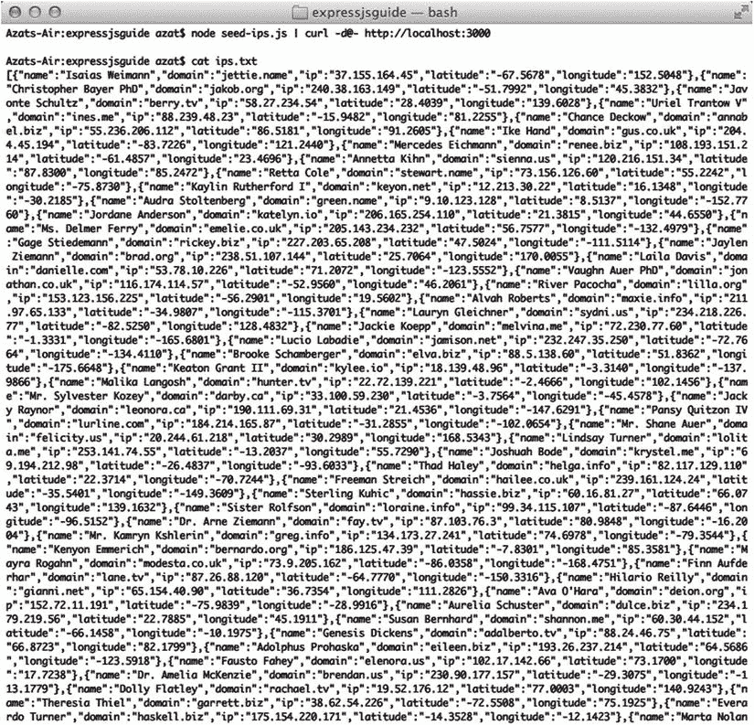

第十一章


数据库、密钥和流提示

本章延续了上一章的主题，即在 Express.js 应用中更好地组织代码。本章提供了关于如何从另一个模块连接到数据库、访问应该保密的密钥和密码以及数据流的技巧。

在模块中使用数据库

本节讨论代码组织模式。这不是一个关于数据库和 Express.js 的详细教程。关于这方面的内容，请参考第 20 章到[第 22 章](22.html)。

在我向您展示如何从另一个模块访问数据库连接之前，如果您将路由抽象到单独的`app.js` / `server.js`文件中，可能会用到这个模块，让我们先复习一些基础知识。

对于本机 Node.js MongoDB 驱动程序，Express.js 服务器需要等待连接被创建，然后才能使用数据库:

```js
// ... Modules importing
var routes = require('routes');
var mongodb = require('mongodb');
var Db = mongodb.Db;
var db = new Db('test', new Server(dbHost, dbPort, {}));
// ... Instantiation
db.open(function(error, dbConnection){
  var app = express();
  app.get('/', routes.home);
  // ... Other routes
  app.listen(3000);
});

```

我们可以通过将路由和配置移到数据库回调之外来做得更好:

```js
// ... Modules importing
var routes = require('routes');
var mongodb = require('mongodb');
var Db = mongodb.Db;
var db = new Db('test', new Server(dbHost, dbPort, {}));
// ... Instantiation
var app = express();
app.get('/', routes.home);
// ... Other routes

db.open(function(error, dbConnection){
app.listen(3000);
});

```

但是在数据库连接建立之后，仍然需要调用`app.listen()` 调用。

多亏了更高级的库，比如 Mongoskin、Monk 和 Mongoose，它们可以缓冲数据库请求，我们不需要将`app.listen()`调用放在`db`回调中。开发人员的任务可以像这样简单:

```js
var express = require('express'),
  mongoskin = require('mongoskin'),
  bodyParser = require('body-parser');

var app = express();
app.use(bodyParser.json());
// ... Configurations and middleware

var db = mongoskin.db('localhost:27017/test', {safe:true});
app.get('/', function(req, res) {
  res.send('please select a collection, e.g., /collections/messages')
});
// ... Routes
app.listen(3000);

```

如果路由需要访问数据库对象，例如连接、模型等等，但是这些路由不在主服务器文件中，那么我们需要做的就是使用定制中间件将所需的对象附加到请求(即`req`)上:

```js
app.use(function(req, res, next) {
  req.db = db;
  next();
});

```

这样在刚刚展示的自定义中间件之后声明的所有中间件和路由都会有`req.db`对象；`req`对象是`Request`对象的同一个实例。

或者，在导入或导出模块时，我们可以将需要的变量传递或接受到构造函数中。在 JavaScript/Node.js 中，对象是通过引用传递的，所以我们将在模块中处理原始对象。`routes.js`模块的例子如下:

```js
module.exports = function(app){
  console.log(app.get('db')); *// app has everything we need!*
  // ... Initialize other objects as needed
  return {
    findUsers: function(req, res) {
    // ...
    },
    createUser: function(req, res) {
    // ...
    }
  } // for "return"
}

```

这是主文件:

```js
var app = express();
// ... Configuration
app.set('db', db);
routes = require('./routes.js')(app);
// ... Middleware
app.get('/users', routes.findUser);
// ... Routes

```

或者，我们可以在变量中重构:

```js
var app = express();
// ... Configuration
app.set('db', db);
Routes = require('./routes.js');
routes = Routes(app);
// ... Middleware
app.get('/users', routes.findUser);
// ... Routes

```

您可以尝试使用`proexpressjs/ch11`文件夹中的示例将数据传递给模块本身。为此，只需运行以下命令:

```js
$ node -e "require('./routes-module-exports').FindStories('databases');"

```

从`proexpressjs/ch11`文件夹运行它。该命令只是导入模块并从中调用一个方法。结果，您将看到在终端中打印出单词“databases”(或者您传递给`FindStories`的任何其他字符串)。

关于通过一个`req`对象将一个 Mongoose 数据库对象传递给 routes 的真实例子，请看一下[第 22 章](22.html)。

密钥和密码

对于数据库，典型的 web 服务可能需要通过用户名和密码连接到其他服务，对于第三方 API，则需要 API 密钥和秘密/令牌。正如您可能猜到的，将这些敏感数据存储在源代码中并不是一个好主意！解决这个问题的两种最普遍的方法是

*   JSON 文件
*   环境变量

 **注意**这一节我们说的是 Node.js，不是浏览器 JavaScript。通常，您不希望在前端暴露您的密码和 API 密钥。

JSON 文件

JSON 文件方法 听起来很简单。我们只需要一个 JSON 文件。例如，假设我们在`conf/keys.json`中有一个本地数据库和两个外部服务，比如 HackHall 和 Twitter:

```js
{
  "db": {
    "host": "http://localhost",
    "port": 27017,
    "username": "azat",
    "password": "CE0E08FE-E486-4AE0-8441-2193DF8D5ED0"
  },
  "hackhall": {
    "api_key": "C7C211A6-D8A7-4E41-99E6-DA0EB95CD864"
  },
  "twitter": {
    "consumer_key": "668C68E1-B947-492E-90C7-F69F5D32B42E",
    "consumer_secret": "4B5EE783-E6BB-4F4E-8B05-2A746056BEE1"
  }
}

```

Node.js 的最新版本允许开发者用`require()`函数导入 JSON 文件。为没有乱搞`fs`模块而欢呼！因此，主应用文件可能会使用这些语句:

```js
var configurations = require('/conf/keys.json');
var twitterConsumerKey = configurations.twitter.consumer_key;

```

或者，我们可以用`fs`模块手动读取文件，并将流解析成 JavaScript 对象。自己试试这个。

至于对`configurations`的访问，如果我们可以使用`app.set(name, value)`全局共享这个配置对象就更好了:

```js
app.set('configurations', configurations);

```

或者，使用中间件，传播到以下每个请求:

```js
app.use(function(req, res, next) {
  req.configurations = configurations;
});

```

将`conf/keys.json`添加到。`gitignore`防止跟踪和暴露文件。要添加它，只需创建一个新的系统文件`.gitignore`,并添加这一行:

```js
conf/keys.json

```

如果您将您的密钥提交给 Git 一次，那么即使您删除了该文件，它们也会保留在历史记录中。从 Git 历史中删除敏感数据的解决方案很棘手。最好重新生成密钥以避免暴露。

将 JSON 配置文件传送到服务器时，问题仍然存在。这可以通过 SSH 和`scp`(安全复制)命令来完成:

```js
$ scp [options] username1@source_host:directory1/filename1 username2@destination_host:directory2/filename2

```

比如`$ scp ./keys.json azat@webapplog:/var/www/conf/keys.json`。

或者，您可以使用`rsync`，因为它只传输增量。例如:

```js
$ rsync -avz ./keys.json azat@webapplog:var/www/conf

```

环境变量

第二种方法涉及到环境变量 (env vars)的使用。说明 env 变量最简单的方法是用前缀`key=value`开始脚本，例如`$ NODE_ENV=test node app`。这将填充`process.env.NODE_ENV`。试试这个脚本，它会将`NODE_ENV`打印出来:

```js
$ NODE_ENV=test node -e 'console.log(process.env.NODE_ENV)'

```

为了将这些 var 交付/部署到远程服务器中，我们可以使用 Ubuntu 的`/etc/init/nodeprogram.conf`。凯文·范·松内维尔德的这篇简洁的教程提供了更多的细节:“在 Ubuntu 上运行 Node.js 作为服务”[<sup>1</sup>T4】](#Fn1)

此外，还有一个 Nodejitsu 工具(`http://www.nodejitsu.com`)可以永远守护Node流程(`http://npmjs.org/forever`)；GitHub: `https://github.com/nodejitsu/forever`。

对于 Heroku 来说，将 env 变量与云同步的过程甚至更简单:在本地，我们将变量放入。`env`为工头 [<sup>2</sup>](#Fn2) (自带 Heroku toolbelt)在项目文件夹中归档，然后用`heroku-config` ( `https://github.com/ddollar/heroku-config`推送到云端。更多信息在 Heroku 发展中心。 [<sup>3</sup>](#Fn3)

对于一个工作示例(显然没有敏感信息)，看一看第 22 章。

流

Express.js 请求和响应对象分别是可读和可写的 Node.js 流。Streams 是在特定进程(读取、接收、写入、发送)实际结束之前处理大块数据的强大工具。这使得流在处理大量数据(如音频或视频)时非常有用。流的另一个例子是在执行大型数据库迁移时。

 **提示**关于如何使用 streams 的更多信息，substack 的 James Halliday ( `http://substack.net/`)提供了一些惊人的资源:stream-handbook ( `https://github.com/substack/stream-handbook`)和 stream-adventure ( `https://npmjs.org/package/stream-adventure`)。

下面是一个从`proexpressjs/ch11/streams-http-res.js`到普通响应的管道流的例子:

```js
var http = require('http');
var fs = require('fs');
var server = http.createServer(function (req, res) {
    fs.createReadStream('users.csv').pipe(res);
});
server.listen(3000);

```

来自终端的带有 CURL 的 GET 请求如下所示:

```js
$ curl http://localhost:3000

```

前面一行将导致服务器输出文件`users.csv`的内容；例如:

```js
...
Stanton Botsford,Raina@clinton.name,619
Dolly Feeney,Aiden_Schaefer@carmel.tv,670
Oma Beahan,Mariano@paula.tv,250
Darrion Johnson,Miracle@liliana.com,255
Garth Huels V,Patience@leda.co.uk,835
Chet Hills II,Donna.Lesch@daniela.co.uk,951
Margarette Littel,Brenda.Prosacco@heber.biz,781
Alexandrine Schiller,Brown.Kling@jason.name,779
Concepcion Emmerich,Leda.Hudson@cara.biz,518
Mrs. Johnpaul Brown,Conrad.Cremin@tavares.tv,315
Aniyah Barrows,Alexane@daniela.tv,193
Okey Kohler PhD,Cordell@toy.biz,831
Bill Murray,Tamia_Reichert@zella.com,962
Allen O'Reilly,Jesus@joey.name,448
Ms. Bud Hoeger,Ila@freda.us,997
Kathryn Hettinger,Colleen@vincenza.name,566
...

```

结果也显示在[图 11-1](#Fig1) 中。


[图 11-1](#_Fig1) 。从 users.csv 文件运行流响应的结果

如果想创建自己的测试文件如`users.csv`，可以安装 faker . js(`https://npmjs.org/package/Faker`；GitHub: `https://github.com/marak/Faker.js/`)并重新运行`seed-users.js`文件:

```js
$ npm install Faker@0.7.2
$ node seed-users.js

```

Express.js 实现在`proexpressjs/ch11/stream-express-res.js`中惊人地相似:

```js
var fs = require('fs');
var express = require('express');

var app = express();

app.get('*', function (req, res) {
    fs.createReadStream('users.csv').pipe(res);
});

app.listen(3000);

```

请记住，请求是一个可读的流，而响应是一个可写的流，我们可以实现一个服务器，将 POST 请求保存到一个文件中。下面是`proexpressjs/ch11/stream-http-req.js`的内容:

```js
var http = require('http');
var fs = require('fs');
var server = http.createServer(function (req, res) {
    if (req.method === 'POST') {
        req.pipe(fs.createWriteStream('ips.txt'));
    }
    res.end('\n');
});
server.listen(3000);

```

我们调用 Faker.js 来生成由名称、域、IP 地址、纬度和经度组成的测试数据。这一次，我们不会将数据保存到文件中，而是通过管道将它发送到 CURL。

下面是 Faker.js 脚本的一部分，它从`proexpressjs/ch11/seed-ips.js`向 stdout 输出 1000 条记录的 JSON 对象:

```js
var Faker = require('Faker');
var body = [];

for (var i = 0; i < 1000; i++) {
  body.push({
    'name': Faker.Name.findName(),
    'domain': Faker.Internet.domainName(),
    'ip': Faker.Internet.ip(),
    'latitude': Faker.Address.latitude(),
    'longitude': Faker.Address.longitude()
  });
}
process.stdout.write(JSON.stringify(body));

```

为了测试我们的`stream-http-req.js`，让我们跑吧

```js
$ node seed-ips.js | curl -d@- http://localhost:3000.

```

结果是一个 IP 数组，如图[图 11-2](#Fig2) 所示。



[图 11-2](#_Fig2) 。Node.js 服务器编写的文件的开头

让我们再一次将这个例子转换成一个 Express.js 应用:

```js
var http = require('http');
var express = require('express');
var app = express();

app.post('*', function (req, res) {
   req.pipe(fs.createWriteStream('ips.txt'));
   res.end('\n');
});
app.listen(3000);

```

 **提示**在某些情况下，拥有不消耗太多资源的直通逻辑是很好的。为此，请通过(`https://npmjs.org/package/through`)查看模块；GitHub: `https://github.com/dominictarr/through`)。另一个有用的模块是 concat-stream(`https://npmjs.org/package/concat-stream`；GitHub: `https://github.com/maxogden/node-concat-stream`)。它允许流的连接。

摘要

到目前为止，我们已经介绍了从其他非`app.js` / `server.js`文件实现数据库连接的方法。我们还对我们的源库隐藏敏感信息，并流式传输数据。这些概念和方法在处理[第 19 章](19.html)到[第 22 章](22.html)中的例子时会派上用场。

下一章将给出一些使用 Redis 和实现认证模式的 Express.js 技巧。

_________________

[<sup>1</sup>](#_Fn1)T0】

[<sup>2</sup>](#_Fn2)T0】

[<sup>3</sup>](#_Fn3)T0】