# 二十二、HackHall

HackHall app 是一款真正的 MVC 应用。它有 REST API 服务器，前端客户端用 Backbone.js 和下划线编写。出于本章的目的，我们将通过 mongose ORM/ODM(对象-关系映射/对象-文档映射)为后端 REST API 服务器演示如何使用 Express.js 和 MongoDB。此外，该项目直接使用 OAuth，并通过 Passport、sessions 和 Mocha 进行 TDD。它托管在 Heroku 上，正在积极开发中(见附近的注释)。

 **注**本章使用的 HackHall 源代码可以在 3.1.0 版本下的公共 GitHub 资源库(`https://github.com/azat-co/hackhall`)中获得(`https://github.com/azat-co/hackhall/releases/tag/v3.1.0`、`https://github.com/azat-co/hackhall/tree/v3.1.0`、`https://github.com/azat-co/hackhall/archive/v3.1.0.zip`)。未来的版本可能与本章的例子不同，可能会有更多的特性。

本章结构如下:

*   什么是 HackHall？
*   跑步俱乐部
*   结构
*   Package.json
*   Express.js app
*   路线
*   猫鼬模型
*   摩卡测试

什么是 HackHall？

HackHall 是一个面向在线社区的开源项目。它在`http://hackhall.com`的实现是一个为黑客、潮人、设计师、企业家和盗版者(开玩笑)策划的社交网络/会员社区和协作工具。HackHall 社区类似于 Reddit、Hacker News 和脸书团体与监管的结合。可以在`http://hackhall.com`申请成为会员。

HackHall 项目正处于早期阶段，大致处于测试阶段。我们计划在未来扩展代码库，并引入更多的人来分享技能、智慧和编程热情。您可以在`http://youtu.be/N1UILNqeW4k`观看 HackHall.com 的快速演示视频。

在这一章中，我们将介绍 3.1.0 版本，它有以下特性:

*   带有`oauth`模块(`https://www.npmjs.org/package/oauth`)和 AngelList API ( `https://angel.co/api`)的 OAuth 1.0
*   电子邮件和密码验证
*   密码哈希
*   猫鼬模型和模式
*   模块中带有路线的 Express.js 结构
*   JSON REST API
*   Express.js 错误处理
*   前端客户端 Backbone.js app(关于 Backbone.js 的更多信息，请下载或在线阅读我的*快速原型制作 JS* 教程，在`http://rapidprototypingwithjs.com/` `)`
*   工头的`.env`环境变量
*   摩卡的 TDD 测试
*   基本 Makefile 设置
*   SendGrid 电子邮件通知
*   GitHub 登录

跑步大厅

要获得 HackHall 的源代码，您可以导航到`hackhall`文件夹或从 GitHub 克隆它:

```js
$ git clone https://github.com/azat-co/hackhall.git
$ git checkout v3.1.0
$ npm install

```

如果你计划测试一个 AngelList，或者 GitHub 集成(可选)，那么你应该作为开发者注册他们的 API 密匙。这样做之后，您需要通过环境变量将值传递给应用。HackHall 对这些敏感的 API 键使用 Heroku 和 Foreman ( `http://ddollar.github.io/foreman`)设置方法(`.env`文件)。Foreman gem 是一个命令行工具，用于管理基于 Procfile 的应用。Heroku toolbelt 包含它。要在环境变量中存储键，只需像这样添加一个`.env`文件(用您自己的值替换`=`后面的值):

```js
ANGELLIST_CLIENT_ID=254C0335-5F9A-4607-87C0
ANGELLIST_CLIENT_SECRET=99F5C1AC-C5F7-44E6-81A1-8DF4FC42B8D9
GITHUB_CLIENT_ID=9F5C1AC-C5F7-44E6
GITHUB_CLIENT_SECRET=9F5C1AC-C5F7-44E69F5C1AC-C5F7-44E6
GITHUB_CLIENT_ID_LOCAL=9F5C1AC-C5F7-44E1
GITHUB_CLIENT_SECRET_LOCAL=9F5C1AC-C5F7-44E69F5C1AC-C5F7-44E6
...

```

注意等号(`=`)前后没有空格。

有了`.env`文件和值之后，使用`foreman`和`nodemon`:

```js
$ foreman run nodemon server

```

如果您对`foreman`感到困惑或者不想安装它，那么您可以用您的环境变量创建一个 shell 文件，并用它来启动服务器。

在您创建了一个 AngelList 应用并注册它之后，您可以在`https://angel.co/api`获得 AngelList API 密钥。同样，对于 GitHub，你需要注册成为一名开发者，才能创建一个应用并获得 API 密钥。SendGrid 通过 Heroku 插件工作，因此您可以从 Heroku web 界面获得用户名和密码。

下面是我的`.env`寻找 v3.1.0 的样子(键被占位符代替)，其中我有两组 GitHub 键，一组用于本地 app，一组用于生产(`hackhall.com` ) app，因为每一组的回调 URL 都不一样。当你注册应用时，在 GitHub 上设置回调 URL。

```js
ANGELLIST_CLIENT_ID=AAAAAAAAAAAAAA
ANGELLIST_CLIENT_SECRET=AAAAAAAAAAAAAA
GITHUB_CLIENT_ID=AAAAAAAAAAAAAA
GITHUB_CLIENT_SECRET=AAAAAAAAAAAAAA
GITHUB_CLIENT_ID_LOCAL=AAAAAAAAAAAAAA
GITHUB_CLIENT_SECRET_LOCAL=AAAAAAAAAAAAAA
SENDGRID_USERNAME=AAAAAAAAAAAAAA@heroku.com
SENDGRID_PASSWORD=AAAAAAAAAAAAAA
COOKIE_SECRET=AAAAAAAAAAAAAA
SESSION_SECRET=AAAAAAAAAAAAAA
ANGELLIST_CLIENT_ID_LOCAL=AAAAAAAAAAAAAA
ANGELLIST_CLIENT_SECRET_LOCAL= AAAAAAAAAAAAAA
EMAIL=AAAAAAAAAAAAAA

```

cookie 和会话密码用于加密 Cookie(浏览器)和会话(存储)数据。

将敏感信息放入环境变量允许我将整个 HackHall 源代码公之于众。我还在 Heroku web 界面中为这个应用设置了一个变量(您可以使用 Heroku config [ `https://devcenter.heroku.com/articles/config-vars` ]将`.env`同步到云或从云同步，或者使用 web 界面)。这个变量就是`NODE_ENV=production`。当我需要确定要使用的 GitHub 应用时，我会使用它(本地应用与主要的实时应用)。

如果您还没有 MongoDB，请下载并安装它。数据库和第三方库超出了本书的范围。然而，你可以在网上找到足够的资料(例如，见`http://webapplog.com`)和之前提到的*用 JS* 快速成型。在启动应用之前，我建议运行`seed-script.js`文件或`seed.js`文件，用信息填充数据库，如下所述。

要通过运行`seed-script.js` MongoDB 脚本用默认管理员用户播种数据库`hackhall`,请输入

```js
$ mongo localhost:27017/hackhall seed-script.js

```

随意修改`seed-script.js` 到你喜欢的程度(注意这样做会删除所有以前的数据！).例如，使用您的`bcryptjs`散列密码(跳到种子数据自动散列的`seed.js`指令)。稍后您将看到一个散列的例子。

首先，我们清理数据库:

```js
db.dropDatabase();

```

然后，我们用用户信息定义一个对象:

```js
var seedUser ={
  firstName: 'Azat',
  lastName: 'Mardan',
  displayName: 'Azat Mardan',
  password: 'hashed password',
  email: '1@1.com',
  role: 'admin',
  approved: true,
  admin: true
};

```

最后，使用 MongoDB shell 方法 将对象保存到数据库:

```js
db.users.save(seedUser);

```

鉴于`seed-script.js`是一个 MongoDB shell 脚本，`seed.js`是一个迷你 Node.js 应用，用于播种数据库。您可以使用以下命令运行 Node.js 数据库播种程序:

```js
$ node seed.js

```

`seed.js`程序更全面(它有密码哈希！)比 MongoDB shell 脚本`seed-script.js`。我们从导入模块开始:

```js
var bcrypt = require('bcryptjs');
var async = require('async');
var mongo = require ('mongodb');
var objectId = mongo.ObjectID;

```

与`seed-script.js`中类似，我们定义用户对象，只是这次密码是明文/未加密的:

```js
seedUsers = [{...},{...}];

```

数组对象可能看起来像这样(添加你自己的用户对象！):

```js
{
  firstName: "test",
  lastName: "Account",
  displayName: "test Account",
  password: "hashend password",
  email: "1@1.com",
  role: "user",
  admin: false,
  _id: objectId("503cf4730e9f580200000003"),
  photoUrl: "https://s3.amazonaws.com/photos.angel.co/users/68026-medium_jpg?1344297998",
  headline: "Test user 1",
  approved: true
}

```

这是将散列我们的普通密码的异步函数:

```js
var hashPassword = function (user, callback) {

```

`bcryptjs`模块将 salt 存储在哈希密码中，所以不需要单独存储 salt；`10`是哈希复杂度(越高越好):

```js
  bcrypt.hash(user.password, 10, function(error, hash) {
    if (error) throw error;
    user.password = hash;
    callback(null, user);
  });
};

```

在这里，我们定义了稍后会用到的变量:

```js
var db;
var invites;
var users;
var posts;

```

我们用本地驱动程序连接到 MongoDB:

```js
var dbUrl = process.env.MONGOHQ_URL || 'mongodb://@127.0.0.1:27017/hackhall';
mongo.Db.connect(dbUrl, function(error, client){
  if (error) throw error;
    else {
        db=client;

```

接下来，我们将集合分配给对象并清理所有用户，以防万一:

```js
invites = new mongo.Collection(db, "invites");
users = new mongo.Collection(db, "users");
posts = new mongo.Collection(db, "posts");
invites.remove(function(){});
users.remove(function(){});

```

如果希望该脚本也删除帖子，可以取消对该行的注释:

```js
// posts.remove();
 invites.insert({code:'smrules'}, function(){});

```

插入一个虚拟帖子(在此随意发挥创意):

```js
posts.insert({
          title:'test',
          text:'testbody',
          author: {
           name:seedUsers[0].displayName,
           id:seedUsers[0]._id
           }
}, function(){});

```

我们使用异步函数，因为散列可能会很慢(这是一件好事，因为较慢的散列更难用暴力破解):

```js
    async.map(seedUsers, hashPassword, function(error, result){
      console.log(result);
      seedUsers = result;
      users.insert(seedUsers, function(){});
      db.close();
    });
  }
});

```

要启动 MongoDB 服务器，打开一个新的终端窗口并运行:

```js
$ mongod

```

当 MongoDB 在默认端口为 27017 的 localhost 上运行后，返回到项目文件夹并运行`foreman`(该命令从 Procfile 中读取):

```js
$ foreman start

```

或者，可以用`nodemon`(`http://nodemon.io`；GitHub: `https://github.com/remy/nodemon`)带有更明确的`foreman`命令:

```js
$ foreman run nodemon server

```

如果你打开浏览器到`http://localhost:3000`，你应该看到一个类似于[图 22-1](#Fig1)(3 . 1 . 0 版)所示的登录屏幕。

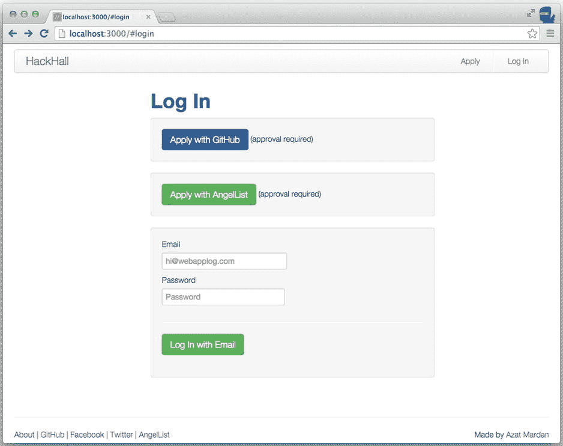

[图 22-1](#_Fig1) 。本地运行的 HackHall v3.1.0 登录页面

输入您的用户名和密码(来自您的`seed.js`或`seed-script.js`文件)以获得访问权限。使用无哈希(即普通)版本的密码。

认证成功后，用户被重定向到帖子页面，如图[图 22-2](#Fig2) (你的数据，比如帖子名称，会有所不同；“测试”帖子是运行 Mocha 测试的副产品)。

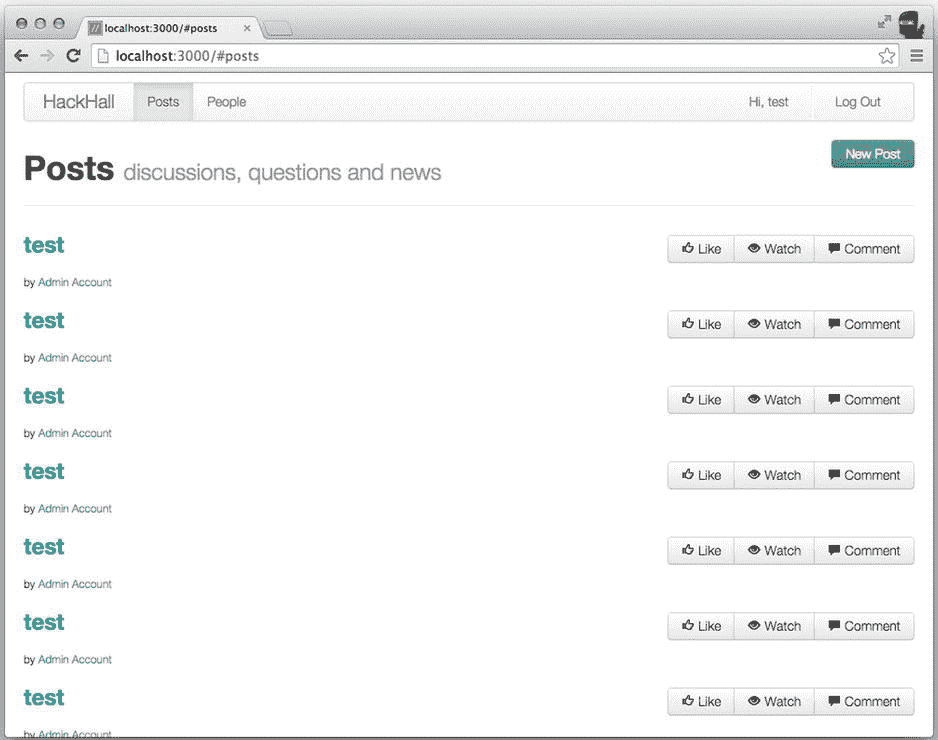

[图 22-2](#_Fig2) 。HackHall 帖子页面

如果你点击一个帖子的“喜欢”按钮，就会出现“你现在喜欢这个帖子了！”应显示消息，该岗位上的类似计数器应增加，如图[图 22-3](#Fig3) 所示。手表按钮也是如此。作者可以编辑和删除他们自己的帖子。管理员可以编辑和删除任何帖子。有人员和个人资料页面，您将在本章后面看到。

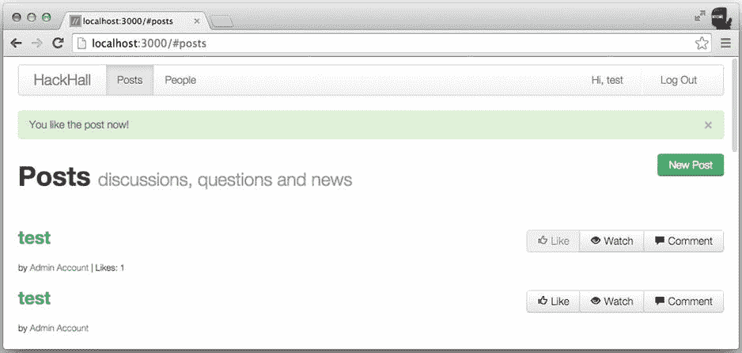

[图 22-3](#_Fig3) 。HackHall 发布了一个有赞帖子的页面

现在，您已经看到了 HackHall v3.1.0 在本地机器上开箱后的样子。下面几节将带您了解实现该应用时使用的一些概念和模式。这一章没有前几章详细，因为我假设你已经熟悉了那些章节的主题；重复所有的细节会占用太多的空间，可能会让你感到厌烦。

结构

以下是 HackHall 的结构以及每个文件夹和文件所包含内容的简要描述:

*   `/api` : App 共享路线
*   `/models`:猫鼬模型
*   `/public`:主干 app，静态文件，如前端 JavaScript、CSS、HTML
*   `/routes`:休息 API 路线
*   `/tests`:摩卡测试
*   内部(内部)图书馆
*   `.gitignore`:应该被`git`忽略的文件列表
*   `Makefile`:运行测试的生成文件
*   Heroku 部署所需的 Cedar 堆栈文件
*   `package.json` : NPM 依赖和 HackHall 元数据
*   `readme.md`:项目描述
*   `server.js`:主黑客大厅服务器文件
*   不想与他人分享或泄露的秘密价值

我的项目文件夹内容如图[图 22-4](#Fig4) 所示。前端应用是用 Backbone.js 编写的，带有下划线模板引擎(HTML 在客户端呈现)，它非常广泛，其覆盖范围超出了本书的范围，因为 Backbone.js 有许多替代方案(Angular.js 是最受欢迎的选择之一)。你可以随时从`public`文件夹:`https://github.com/azat-co/hackhall/tree/v3.1.0/public`中查找浏览器 app 的源代码。

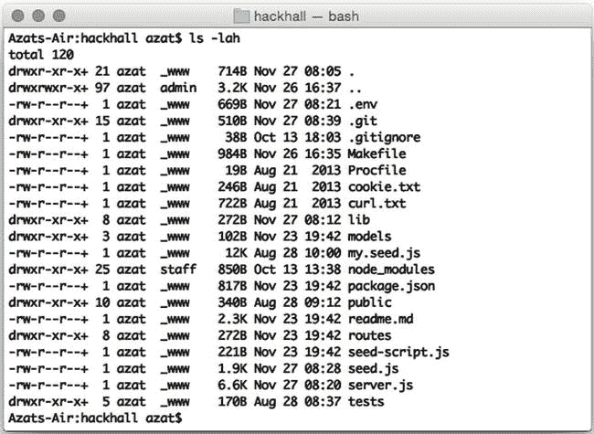

[图 22-4](#_Fig4) 。HackHall 基本文件夹的内容

Package.json

和往常一样，让我们从`package.json`文件和依赖项开始。我们在本书之前没有使用的“新”库是`passport` (OAuth 集成)`sendgrid`(电子邮件通知)`mongoose` (MondoDB ORM/ODM)和`bcryptjs`(密码散列)。其他的都应该是你熟悉的。我们将使用 Express.js 中间件模块和实用程序(`async`、`mocha`)。

这就是`package.json`的样子(自行决定使用新版本):

```js
{
  "name": "hackhall",
  "version": "3.1.0",
  "private": true,
  "main": "server",
  "scripts": {
    "start": "node server",
    "test": "make test"
  },
  "dependencies": {
    "async": "0.9.0",
    "bcryptjs": "2.0.2",
    "body-parser": "1.6.6",
    "cookie-parser": "1.3.2",
    "csurf": "1.5.0",
    "errorhandler": "1.1.1",
    "express": "4.8.1",
    "express-session": "1.7.6",
    "method-override": "2.1.3",
    "mongodb": "1.4.9",
    "mongoose": "3.8.15",
    "mongoose-findorcreate": "0.1.2",
    "mongoskin": "1.4.4",
    "morgan": "1.2.3",
    "oauth": "0.9.12",
    "passport": "0.2.0",
    "passport-github": "0.1.5",
    "sendgrid": "1.2.0",
    "serve-favicon": "2.1.1"
  },

```

`devDependencies`类别是生产中不需要的模块:

```js
  "devDependencies": {
    "mocha": "1.21.4",
    "superagent": "0.18.2"
  },
  "engines": {
    "node": "0.10.x"
  }
}

```

Express.js App

让我们直接跳到`server.js`文件，看看它是如何实现的。首先，我们声明依赖关系:

```js
var express = require('express'),
  routes = require('./routes'),
  http = require('http'),
  util = require('util'),
  path = require('path'),
  oauth = require('oauth'),
  querystring = require('querystring');

```

接下来，我们对 Express.js 中间件模块做同样的事情(不需要单独的`var`，除了显示模块目的的不同):

```js
var favicon = require('serve-favicon'),
  logger = require('morgan'),
  bodyParser = require('body-parser'),
  methodOverride = require('method-override'),
  cookieParser = require('cookie-parser'),
  session = require('express-session'),
  csrf = require('csurf');

```

接下来，我们有一个内部电子邮件库，它通过一个 Heroku 附件使用 SendGrid:

```js
var hs = require(path.join(__dirname, 'lib', 'hackhall-sendgrid'));

```

具有不同字体颜色的日志消息很好，但当然是可选的。我们用`lib/colors.js`中的转义序列来完成这种着色:

```js
var c = require(path.join(__dirname, 'lib', 'colors'));
require(path.join(__dirname, 'lib', 'env-vars'));

```

护照(`http://passportjs.org`、`https://www.npmjs.org/package/passport`、`https://github.com/jaredhanson/passport`)是给 GitHub OAuth 的。使用`passport`是比使用`oauth:`更高级的实现 OAuth 的方法

```js
var GitHubStrategy = require('passport-github').Strategy,
  passport = require('passport');

```

然后，我们初始化应用并配置中间件。环境变量`process.env.PORT`由 Heroku 填充，并且在本地设置的情况下，依赖于`3000`。其余的配置你应该从《T2》第 4 章中熟悉了。

```js
app.set('port', process.env.PORT || 3000 );
app.use(favicon(path.join(__dirname,'public','favicon.ico')));
app.use(logger('dev'));
app.use(bodyParser.json());
app.use(bodyParser.urlencoded({extended: true}));
app.use(methodOverride());

```

认证需要传递给`cookieParser`和会话中间件的值。显然，这些秘密应该是私人的:

```js
app.use(cookieParser(process.env.COOKIE_SECRET));
app.use(session({
  secret: process.env.SESSION_SECRET,
  key: 'sid',
  cookie: {
    secret: true,
    expires: false
  },
  resave: true,
  saveUninitialized: true
}));

```

这就是我们如何提供前端客户端 Backbone.js 应用和其他静态文件，如 CSS:

```js
app.use(express.static(__dirname + '/public'));

```

错误处理分为三个函数，其中`clientErrorHandler()`专用于来自 Backbone.js 应用的 AJAX/XHR 请求(用 JSON 响应)。现在，我们只声明函数。稍后我们将使用`app.use()`来应用它们。

第一个方法`logErrors()`，检查`err`是否是一个字符串，如果是，创建一个`Error`对象。然后，执行到下一个错误处理程序。

```js
function logErrors(err, req, res, next) {
  if (typeof err === 'string')
    err = new Error (err);
  console.error('logErrors', err.toString());
  next(err);
}

```

如前所述，`clientErrorHandler`通过检查`req.xhr`专用于来自 Backbone.js 应用的 AJAX/XHR 请求(用 JSON 响应)，它将发送一个 JSON 消息返回或转到下一个处理程序:

```js
function clientErrorHandler(err, req, res, next) {
  if (req.xhr) {
    console.error('clientErrors response');
    res.status(500).json({ error: err.toString()});
  } else {
    next(err);
  }
}

```

最后一个错误处理程序`errorHandler()`，将假设请求不是 AJAX/XHR(否则`clientErrorHandler()`将会捕获它，但是这个顺序将在后面用`app.use()`定义)，并将发回一个字符串:

```js
function errorHandler(err, req, res, next) {
  console.error('lastErrors response');
  res.status(500).send(err.toString());
}

```

回想一下，我们使用`||`确定`process.env.PORT`并依靠本地设置值`3000`。我们用 MongoDB 连接字符串做类似的事情。我们从环境变量中提取 Heroku 附件 URI 字符串，或者回退到本地设置:

```js
var dbUrl = process.env.MONGOHQ_URL
  || 'mongodb://@127.0.0.1:27017/hackhall';
var mongoose = require('mongoose');

```

现在，我们创建一个连接:

```js
var connection = mongoose.createConnection(dbUrl);
connection.on('error', console.error.bind(console,
  'connection error:'));

```

有时记录连接`open`事件是个好主意:

```js
connection.once('open', function () {
  console.info('Connected to database')
});

```

猫鼬模型存放在`models`文件夹中:

```js
var models = require('./models');

```

这个中间件将提供对我们路由方法中的两个集合的访问:

```js
function db (req, res, next) {
  req.db = {
    User: connection.model('User', models.User, 'users'),
    Post: connection.model('Post', models.Post, 'posts')
  };
  return next();
}

```

下面几行只是导入的`routes/main.js`文件授权函数的新名称:

```js
var checkUser = routes.main.checkUser;
var checkAdmin = routes.main.checkAdmin;
var checkApplicant = routes.main.checkApplicant;

```

然后，我们转到 AngelList OAuth 路由进行 AngelList 登录。这是一个标准的三足 OAuth 1.0 策略，我们启动 auth ( `/auth/angellist`)，将用户重定向到服务提供商(AngelList)，然后等待用户从服务提供商(`/auth/angellist`):

```js
app.get('/auth/angellist', routes.auth.angelList);
app.get('/auth/angellist/callback',
  routes.auth.angelListCallback,
  routes.auth.angelListLogin,
  db,
  routes.users.findOrAddUser);

```

 **提示**关于 OAuth 和 Node.js OAuth 例子的更多信息，请看我的书*用 Node.js 介绍 OAuth*(2014)，可在`https://gumroad.com/l/oauthnode`获得。

接下来的几行代码处理 Passport 和 GitHub 登录逻辑。使用 Passport 实现 OAuth 比使用 OAuth 模块需要更少的人工工作。

让我们从`app.get('/api/profile')`开始，跳到主要的应用途径。Backbone.js 应用使用`api/profile`,如果用户登录，它将返回一个用户会话。请求通过`checkUser`和`db`传输，前者授权，后者填充数据库信息。

```js
*// MAIN*
app.get('/api/profile', checkUser, db, routes.main.profile);
app.delete('/api/profile', checkUser, db, routes.main.delProfile);
app.post('/api/login', db, routes.main.login);
app.post('/api/logout', routes.main.logout);

```

`Posts`和`Users`收藏路线用于操作帖子和用户:

```js
*// POSTS*
app.get('/api/posts', checkUser, db, routes.posts.getPosts);
app.post('/api/posts', checkUser, db, routes.posts.add);
app.get('/api/posts/:id', checkUser, db, routes.posts.getPost);
app.put('/api/posts/:id', checkUser, db, routes.posts.updatePost);
app.delete('/api/posts/:id', checkUser, db, routes.posts.del);

*// USERS*
app.get('/api/users', checkUser, db, routes.users.getUsers);
app.get('/api/users/:id', checkUser, db,routes.users.getUser);
app.post('/api/users', checkAdmin, db, routes.users.add);
app.put('/api/users/:id', checkAdmin, db, routes.users.update);
app.delete('/api/users/:id', checkAdmin, db, routes.users.del);

```

这些路线适用于尚未获得批准的新成员(即，他们已提交申请):

```js
//APPLICATION
app.post('/api/application', checkAdmin, db, routes.application.add);
app.put('/api/application', checkApplicant, db, routes.application.update);
app.get('/api/application', checkApplicant, db, routes.application.get);

```

以下是无所不包的路线:

```js
app.get('*', function(req, res){
  res.status(404).send();
});

```

我们按照我们希望它们被调用的顺序来应用错误处理程序:

```js
app.use(logErrors);
app.use(clientErrorHandler);
app.use(errorHandler);

```

`require.main === module`是一个聪明的技巧，用来确定这个文件是作为独立的还是作为导入的模块执行的:

```js
http.createServer(app);
if (require.main === module) {
  app.listen(app.get('port'), function(){

```

我们显示蓝色日志消息:

```js
    console.info(c.blue + 'Express server listening on port '
      + app.get('port') + c.reset);
  });
}
else {
  console.info(c.blue + 'Running app as a module' + c.reset)
  exports.app = app;
}

```

为了节省篇幅，我就不列出`hackhall/server.js`的完整源代码了，不过大家可以在`https://github.com/azat-co/hackhall/blob/v3.1.0/server.js`查看。

路线

HackHall routes 位于`hackhall/routes`文件夹中，分为几个模块:

*   `hackhall/routes/index.js`:文件夹中`server.js`与其他路径之间的桥梁
*   `hackhall/routes/auth.js`:处理 OAuth 与 AngelList API“共舞”的路由
*   `hackhall/routes/main.js`:登录、注销和其他路径
*   `hackhall/routes/users.js`:与用户休息 API 相关的路线
*   `hackhall/routes/application.js`:处理成为用户的申请提交的路线
*   `hackhall/routes/posts.js`:与岗位休息 API 相关的路线

index.js

让我们看看`hackhall/routes/index.js`，这里我们已经包含了其他模块:

```js
exports.posts = require('./posts');
exports.main = require('./main');
exports.users = require('./users');
exports.application = require('./application');
exports.auth = require('./auth');

```

auth . jsT1】

在这个模块中，我们用 AngelList API 处理 OAuth 舞蹈。为此，我们依赖于`https`库:

```js
var https = require('https');

```

AngelList API 客户端 ID 和客户端秘密在`https://angel.co/api`获得，并存储在环境变量中。我添加了两个应用:一个用于本地开发，另一个用于生产，如图[图 22-5](#Fig5) 所示。应用会根据环境选择其中之一:

```js
if (process.env.NODE_ENV === 'production') {
  var angelListClientId = process.env.ANGELLIST_CLIENT_ID;
  var angelListClientSecret = process.env.ANGELLIST_CLIENT_SECRET;
} else {
  var angelListClientId = process.env.ANGELLIST_CLIENT_ID_LOCAL;
  var angelListClientSecret = process.env.ANGELLIST_CLIENT_SECRET_LOCAL;
}

```

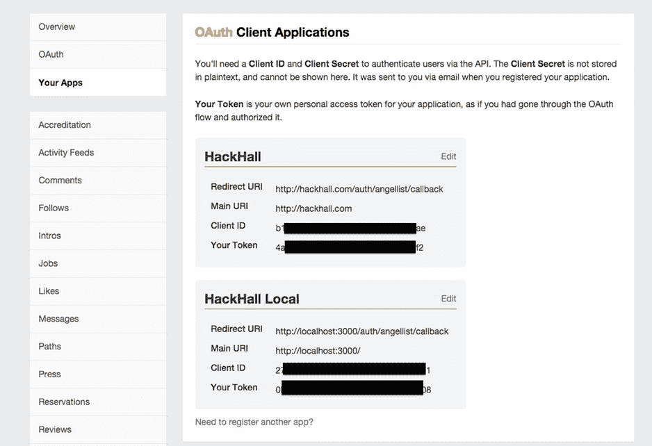

[图 22-5](#_Fig5) 。我的 AngelList 应用

`exports.angelList()`方法将用户重定向到`https://angel.co/api`网站进行身份验证。当我们导航到`/auth/angellist`时，这个方法被调用。在`https://angel.co/api/oauth/faq`的文档中描述了请求的结构。

```js
exports.angelList = function(req, res) {
  res.redirect('https://angel.co/api/oauth/authorize?client_id=' + angelListClientId + '&scope=email&response_type=code');
}

```

在用户允许我们的应用访问他们的信息后，AngelList 将他们发送回此路由，以允许我们发出新的(HTTPS)请求来检索令牌:

```js
exports.angelListCallback = function(req, res, next) {
  var token;
  var buf = '';
  var data;
  var angelReq = https.request({

```

`host`和`path`的值是特定于您的服务提供商的，因此在实现 OAuth 时，您需要查阅提供商的文档。这些是 AngelList API 的值:

```js
    host: 'angel.co',
    path: '/api/oauth/token?client_id=' + angelListClientId +
      '&client_secret=' + angelListClientSecret + '&code=' + req.query.code +
      '&grant_type=authorization_code',
    port: 443,
    method: 'POST',
    headers: {
      'content-length': 0
    }

```

此时，回调应该有带有令牌的响应(或者错误)，所以我们解析响应并检查`access_token`。如果存在，我们在会话中保存令牌，并继续处理`/auth/angellist/callback`中的下一个中间件，即`angelListLogin`。首先，让我们在`buf`中附加一个保存响应的事件监听器:

```js
  }, function(angelRes) {
    angelRes.on('data', function(buffer) {
      buf += buffer;
    });

```

然后，我们为`end`事件附加另一个事件监听器:

```js
    angelRes.on('end', function() {

```

此时的`buf`对象应该有一个`Buffer`类型的完整响应体，所以我们需要将其转换为字符串类型并解析。数据应该只有两个属性，`access_token`和`token_type` ( `'bearer'`):

```js
      try {
        data = JSON.parse(buf.toString('utf-8'));
      } catch (e) {
        if (e) return next(e);
      }

```

让我们检查一下`access_token`是否 100%确定:

```js
      if (!data || !data.access_token) return next(new Error('No data from AngelList'));
      token = data.access_token;

```

现在，我们可以在会话中保存`token`,并调用下一个中间件:

```js
      req.session.angelListAccessToken = token;
      if (token) {
        next();
      }
      else {
        next(new Error('No token from AngelList'));
      }
    });
  });

```

请求代码的其余部分完成请求并处理一个`error`事件:

```js
  angelReq.end();
  angelReq.on('error', function(e) {
    console.error(e);
    next(e);
  });
}

```

因此，用户被授权访问我们的 AngelList 应用，我们拥有令牌(`angelListCallback`)。现在，我们可以用之前中间件的令牌(`angelListLogin`)直接调用 AngelList API 来获取用户概要信息。中间件功能的顺序由路由`/auth/angellist/callback`决定，所以我们从 HTTPS 请求`angelListLogin`开始:

```js
exports.angelListLogin = function(req, res, next) {
  var token = req.session.angelListAccessToken;
  httpsRequest = https.request({
    host: 'api.angel.co',

```

同样，每个服务的确切 URL 也是不同的:

```js
    path: '/1/me?access_token=' + token,
    port: 443,
    method: 'GET'
  },
  function(httpsResponse) {
    var userBuffer = '';
    httpsResponse.on('data', function(buffer) {
      userBuffer += buffer;
    });

```

下一个事件侦听器将缓冲区类型的对象解析为普通的 JavaScript/Node.js 对象:

```js
    httpsResponse.on('end', function(){
      try {
        data = JSON.parse(userBuffer.toString('utf-8'));
      } catch (e) {
        if (e) return next(e);
      }

```

在执行的这一点上，系统应该有填充了用户信息的数据字段(`/1/me?access_token=...`端点)。你可以在[图 22-6](#Fig6) 中看到这种响应数据的例子。

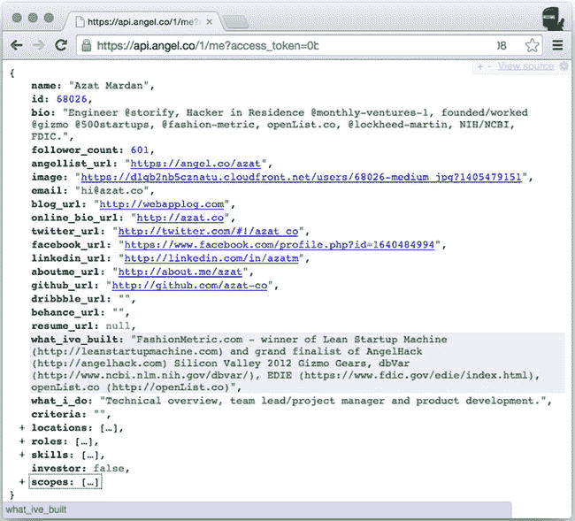

[图 22-6](#_Fig6) 。AngelList 用户信息响应示例

我们仍然需要检查对象是否为空，如果不为空，我们将用户数据保存在请求对象上:

```js
      if (data) {
        req.angelProfile = data;
        next();
      } else
        next(new Error('No data from AngelList'));
      });
    }
  );
  httpsRequest.end();
  httpsRequest.on('error', function(e) {
    console.error(e);
  });
};

```

在撰写本文时，`hackhall/routes/auth.js`文件的完整源代码在`https://github.com/azat-co/hackhall/blob/v3.1.0/routes/auth.js`(随着 HackHall 版本的发展会有所变化)。

main.js

`hackhall/routes/main.js`文件也很有趣，因为它有这些方法:

*   `checkAdmin()`
*   `checkUser()`
*   `checkApplicant()`
*   `login()`
*   `logout()`
*   `profile()`
*   `delProfile()`

`checkAdmin()`函数执行管理员权限的认证。如果会话对象没有携带正确的标志，我们调用带有错误对象的 Express.js `next()`函数:

```js
exports.checkAdmin = function(request, response, next) {
  if (request.session
    && request.session.auth
    && request.session.userId
    && request.session.admin) {
    console.info('Access ADMIN: ' + request.session.userId);
    return next();
  } else {
    next('User is not an administrator.');
  }
};

```

同样，我们可以只检查批准的用户，而不检查管理员权限:

```js
exports.checkUser = function(req, res, next) {
  if (req.session && req.session.auth && req.session.userId
    && (req.session.user.approved || req.session.admin)) {
    console.info('Access USER: ' + req.session.userId);
    return next();
  } else {
    next('User is not logged in.');
  }
};

```

如果应用只是一个未批准的用户对象，我们还可以检查:

```js
exports.checkApplicant = function(req, res, next) {
  if (req.session && req.session.auth && req.session.userId
    && (!req.session.user.approved || req.session.admin)) {
    console.info('Access USER: ' + req.session.userId);
    return next();
  } else {
    next('User is not logged in.');
  }
};

```

在登录功能中，我们搜索电子邮件。因为我们不在数据库中存储普通密码——我们只存储它的加密散列——我们需要使用`bcryptjs`来比较密码散列。匹配成功后，我们将用户对象存储在会话中，将`auth`标志设置为`true` ( `req.session.auth = true`)，然后继续。否则，请求会失败:

```js
var bcrypt = require('bcryptjs');
exports.login = function(req, res, next) {
  console.log('Logging in USER with email:', req.body.email)
  req.db.User.findOne({
      email: req.body.email
    },null, {
      safe: true
    }, function(err, user) {
      if (err) return next(err);
      if (user) {

```

我们使用异步的`bcryptjs`方法`compare()`，如果普通密码与保存的散列密码匹配，它将返回`true`:

```js
        bcrypt.compare(req.body.password, user.password, function(err, match) {
          if (match) {

```

所以，一切都很好:系统分配会话标志并在会话中保存用户信息。这些值将用于所有需要授权(受保护)的路由，以识别用户:

```js
            req.session.auth = true;
            req.session.userId = user._id.toHexString();
            req.session.user = user;

```

管理员有一个单独的布尔值:

```js
            if (user.admin) {
              req.session.admin = true;
            }
            console.info('Login USER: ' + req.session.userId);

```

JSON `{msg: 'Authorized'}`对象是一个您可以定制的任意约定，但是您必须在服务器和客户机上保持它相同(以检查服务器响应):

```js
            res.status(200).json({
              msg: 'Authorized'
            });
          } else {
            next(new Error('Wrong password'));
          }
        });
      } else {
        next(new Error('User is not found.'));
      }
    });
};

```

注销过程会删除所有会话信息:

```js
exports.logout = function(req, res) {
  console.info('Logout USER: ' + req.session.userId);
  req.session.destroy(function(error) {
    if (!error) {
      res.send({
        msg: 'Logged out'
      });
    }
  });
};

```

该路径用于配置文件页面，也由 Backbone.js 用于用户验证:

```js
exports.profile = function(req, res, next) {

```

我们不想公开所有的用户字段，所以我们只将我们想要的字段列入白名单:

```js
  var fields = 'firstName lastName displayName' +
    ' headline photoUrl admin approved banned' +
    ' role angelUrl twitterUrl facebookUrl linkedinUrl githubUrl';

```

这是一个通过 Mongoose 功能创建的自定义方法，因为它具有相当广泛的逻辑，并且被多次调用:

```js
  req.db.User.findProfileById(req.session.userId, fields, function(err, obj) {
    if (err) next(err);
    res.status(200).json(obj);
  });
};

```

允许用户删除他们的个人资料很重要。我们利用`findByIdAndRemove()`方法并删除带有`destroy()`的会话:

```js
exports.delProfile = function(req, res, next) {
  console.log('del profile');
  console.log(req.session.userId);
  req.db.User.findByIdAndRemove(req.session.user._id, {},
    function(err, obj) {
      if (err) next(err);
      req.session.destroy(function(error) {
        if (err) {
          next(err)
        }
      });
      res.status(200).json(obj);
    }
  );
};

```

在`https://github.com/azat-co/hackhall/blob/v3.1.0/routes/main.js`可以获得`hackhall/routes/main.js`文件的完整源代码。

users.js

`routes/users.js`文件负责与用户集合相关的 RESTful 活动。我们有这些方法:

*   `getUsers()`
*   `getUser()`
*   `add()`
*   `update()`
*   `del()`
*   `findOrAddUser()`

首先，我们定义一些变量:

```js
var path = require('path'),
  hs = require(path.join(__dirname, '..', 'lib', 'hackhall-sendgrid'));

var objectId = require('mongodb').ObjectID;

var safeFields = 'firstName lastName displayName headline photoUrl admin approved banned role angelUrl twitterUrl facebookUrl linkedinUrl githubUrl';

```

然后，我们定义方法`getUsers()` ，该方法检索用户列表，其中每一项都只有来自`safeFields`字符串的属性:

```js
exports.getUsers = function(req, res, next) {
  if (req.session.auth && req.session.userId) {
    req.db.User.find({}, safeFields, function(err, list) {
      if (err) return next(err);
      res.status(200).json(list);
    });
  } else {
    return next('User is not recognized.')
  }
}

```

`getUser()`方法用于用户资料页面。对于管理员(当前用户，不是我们获取的用户)，我们添加一个额外的字段`email`，并调用定制的静态方法`findProfileById()`:

```js
exports.getUser = function(req, res, next) {
  var fields = safeFields;
  if (req.session.admin) {
    fields = fields + ' email';
  }
  req.db.User.findProfileById(req.params.id, fields, function(err, data){
    if (err) return next(err);
    res.status(200).json(data);
  })
}

```

要查看`getUser()`方法的运行情况，您可以导航到一个用户资料页面，如图 22-7 中的[所示。管理员可以在个人资料页面上管理用户的帐户。因此，如果您是管理员，您会看到一个额外的角色下拉列表，为该用户设置角色。](#Fig7)

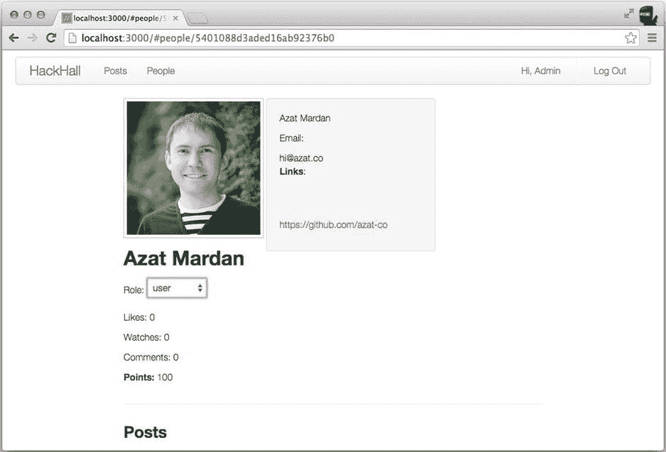

[图 22-7](#_Fig7) 。以管理员身份登录时的 HackHall 个人资料页面

`add()`方法很简单:

```js
exports.add = function(req, res, next) {
  var user = new req.db.User(req.body);
  user.save(function(err) {
    if (err) next(err);
    res.json(user);
  });
};

```

`update()`方法也用于批准新用户(`approvedNow == true`)。如果成功，我们使用内部方法`notifyApproved()`从`lib/hackhall-sendgrid.js`文件发送一封电子邮件:

```js
exports.update = function(req, res, next) {
var obj = req.body;
  obj.updated = new Date();
  delete obj._id;
  var approvedNow = obj.approved && obj.approvedNow;

```

`approvedNow`字段不是 Mongoose 模式中的字段，我们不想存储它。该字段的唯一目的是让系统知道它是常规更新呼叫还是批准:

```js
  delete obj.approvedNow;
  req.db.User.findByIdAndUpdate(req.params.id, {
    $set: obj
  }, {

```

该选项将为我们提供新的对象，而不是原始对象(默认为`true`):

```js
    new: true
  }, function(err, user) {
    if (err) return next(err);
    if (approvedNow && user.approved) {
      console.log('Approved... sending notification!');

```

因此，批准成功，我们可以发送电子邮件:

```js
      hs.notifyApproved(user, function(error, user){
        if (error) return next(error);
        console.log('Notification was sent.');
        res.status(200).json(user);
      })
    } else {

```

如果是定期更新，而不是批准，那么我们只需发回用户对象:

```js
      res.status(200).json(user);
    }
  });
};

```

[图 22-8](#Fig8) 显示了当你以管理员权限登录时，用户界面中的批准是什么样子。管理员可以使用下拉菜单来批准、删除或禁止申请人。

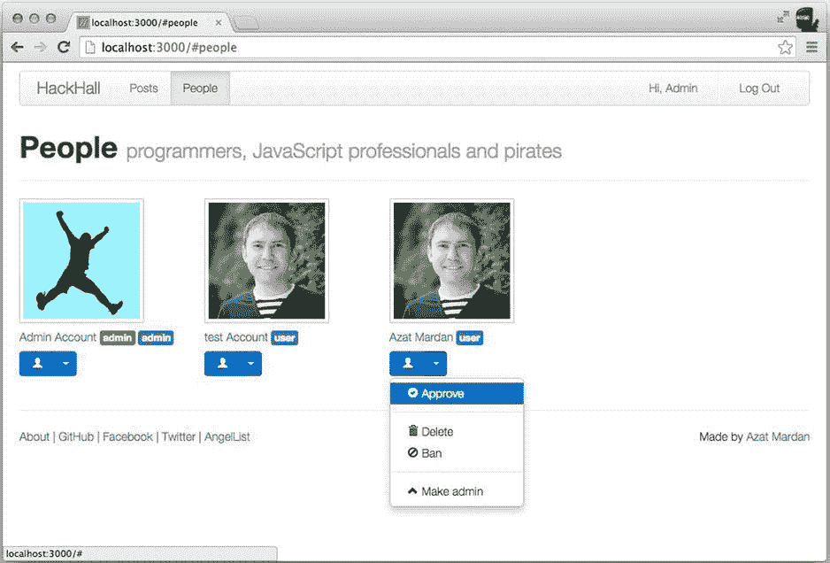

[图 22-8](#_Fig8) 。具有管理员权限的 HackHall 人员页面(以管理员身份登录)

删除一个用户，我们调用`findByIdAndRemove()` :

```js
exports.del = function(req, res, next) {
  req.db.User.findByIdAndRemove(req.params.id, function(err, obj) {
    if (err) next(err);
    res.status(200).json(obj);
  });
};

```

最后，当用户使用 AngelList 登录时，使用`findOrAddUser()`方法。您可以使用插件提供的`findOrCreate`(这就是 GitHub OAuth 流中使用的)，但是为了便于学习，最好知道如何自己实现相同的功能。当您将`findOrCreate`与这个函数进行比较时，它还会强化您的异步思维方式和您对如何重构代码的理解:

```js
exports.findOrAddUser = function(req, res, next) {
  var data = req.angelProfile;
  req.db.User.findOne({
    angelListId: data.id
  }, function(err, obj) {
    console.log('angelList Login findOrAddUser');
    if (err) return next(err);

```

好了，我们在数据库中查询了用户，但是让我们检查用户是否在那里，如果不在，就创建用户:

```js
if (!obj) {
          console.warn('Creating a user', obj, data);
          req.db.User.create({

```

我们将 AngelList 响应中需要的所有字段映射/规范化到用户对象。

```js
angelListId: data.id,

```

我们可以使用这个令牌代表用户发出后续的 API 请求，而无需每次都请求授权和许可:

```js
angelToken: req.session.angelListAccessToken,

```

为了以防万一，我们也将整个 AngelList 对象存储在`angelListProfile` : 中

```js
angelListProfile: data,
email: data.email,

```

`data.name`是全名，所以我们按空格将它分成一个数组，并分别得到第一个和第二个元素:

```js
firstName: data.name.split(' ')[0],
lastName: data.name.split(' ')[1],
displayName: data.name,
headline: data.bio,

```

图像只是文件的 URL，而不是二进制字段:

```js
        photoUrl: data.image,
        angelUrl: data.angellist_url,
        twitterUrl: data.twitter_url,
        facebookUrl: data.facebook_url,
        linkedinUrl: data.linkedin_url,
        githubUrl: data.github_url
}, function(err, obj) {
        if (err) return next(err);
  console.log('User was created', obj);

```

好了，用户文档已经成功创建了。但是系统必须马上让用户登录，所以我们将`session`标志设置为`true`:

```js
req.session.auth = true;

```

我们需要在会话中保存新创建的用户 ID，以便我们可以在来自该客户端的其他请求中使用它:

```js
req.session.userId = obj._id;
req.session.user = obj;

```

该管理员需要由另一个管理员提升。新用户的默认数据库值由 Mongoose 模式负责(默认值为`false`)。但是这里需要设置会话值，所以我们默认认证为普通用户:

```js
      req.session.admin = false;
      res.redirect('/#application');
      }
    );
} else {

```

当用户文档在数据库中时，我们只需登录用户并重定向到帖子或他们的会员申请:

```js
        req.session.auth = true;
        req.session.userId = obj._id;
        req.session.user = obj;
        req.session.admin = obj.admin;
        if (obj.approved) {
          res.redirect('/#posts');
        } else {
          res.redirect('/#application');
        }
      }
    })
}

```

在`https://github.com/azat-co/hackhall/blob/v3.1.0/routes/users.js`可以获得`hackhall/routes/users.js`文件的完整源代码。

`users.js`为人员页面的 REST API routes 提供功能，允许用户访问其他用户的个人资料，如图[图 22-9](#Fig9) 所示。在这个截图中，第一个 Azat 的配置文件来自于播种数据库。第二个 Azat 的简介是我用 GitHub 登录的。


[图 22-9](#_Fig9) 。HackHall 人员页面

application.js

`hackhall/routes/application.js`文件(“应用”是应用的意思，不是 app 里的！)处理申请加入 HackHall 社区的新用户。他们需要得到批准，以确保只有真正和认真的成员加入 HackHall.com。在您的本地版本中，您可能希望禁止有关提交和批准应用的电子邮件通知。

仅仅为了向数据库(电子邮件成员资格应用)添加一个用户对象(默认情况下使用`approved=false`),我们使用以下方法:

```js
exports.add = function(req, res, next) {
  req.db.User.create({
    firstName: req.body.firstName,
    lastName: req.body.lastName,
    displayName: req.body.displayName,
    headline: req.body.headline,
    photoUrl: req.body.photoUrl,
    password: req.body.password,
    email: req.body.email,
    angelList: {
      blah: 'blah'
    },
    angelUrl: req.body.angelUrl,
    twitterUrl: req.body.twitterUrl,
    facebookUrl: req.body.facebookUrl,
    linkedinUrl: req.body.linkedinUrl,
    githubUrl: req.body.githubUrl
  }, function(err, obj) {
    if (err) return next(err);
    if (!obj) return next('Cannot create.')
    res.status(200).json(obj);
  })
};

```

我们让用户用这种方法更新他们应用中的信息:

```js
exports.update = function(req, res, next) {
  var data = req.body;

```

首先需要删除`_id`，因为我们不想改变它:

```js
  delete data._id;

```

在`findByIdAndUpdate()`方法中，我们使用来自会话的用户 ID，而不是来自主体的用户 ID，因为它不可信:

```js
  req.db.User.findByIdAndUpdate(req.session.user._id, {
    $set: data
  }, function(err, obj) {
    if (err) return next(err);
    if (!obj) return next('Cannot save.')

```

大概可以把整个发回去(`obj`)，因为反正是这个用户的信息:

```js
    res.status(200).json(obj);
  });
};

```

使用`get()`功能选择特定对象:

```js
exports.get = function(req, res, next) {
  req.db.User.findById(req.session.user._id,

```

限制我们返回的字段:

```js
    'firstName lastName photoUrl headline displayName'
      + 'angelUrl facebookUrl twitterUrl linkedinUrl'
      + 'githubUrl', {}, function(err, obj) {
      if (err) return next(err);
      if (!obj) return next('cannot find');
      res.status(200).json(obj);
    })
};

```

以下是`hackhall/routes/applications.js`文件的完整源代码:

```js
exports.add = function(req, res, next) {
  req.db.User.create({
    firstName: req.body.firstName,
    lastName: req.body.lastName,
    displayName: req.body.displayName,
    headline: req.body.headline,
    photoUrl: req.body.photoUrl,
    password: req.body.password,
    email: req.body.email,
    angelList: {
      blah: 'blah'
    },
    angelUrl: req.body.angelUrl,
    twitterUrl: req.body.twitterUrl,
    facebookUrl: req.body.facebookUrl,
    linkedinUrl: req.body.linkedinUrl,
    githubUrl: req.body.githubUrl
  }, function(err, obj) {
    if (err) return next(err);
    if (!obj) return next('Cannot create.')
    res.status(200).json(obj);
  })
};

exports.update = function(req, res, next) {
  var data = req.body;
  delete data._id;
  req.db.User.findByIdAndUpdate(req.session.user._id, {
    $set: data
  }, function(err, obj) {
    if (err) return next(err);
    if (!obj) return next('Cannot save.')
    res.status(200).json(obj);
  });
};

exports.get = function(req, res, next) {
  req.db.User.findById(req.session.user._id,
    'firstName lastName photoUrl headline displayName angelUrl facebookUrl twitterUrl linkedinUrl githubUrl', {}, function(err, obj) {
      if (err) return next(err);
      if (!obj) return next('cannot find');
      res.status(200).json(obj);
    })
};

```

[图 22-10](#Fig10) 显示了会员申请页面此时的样子。

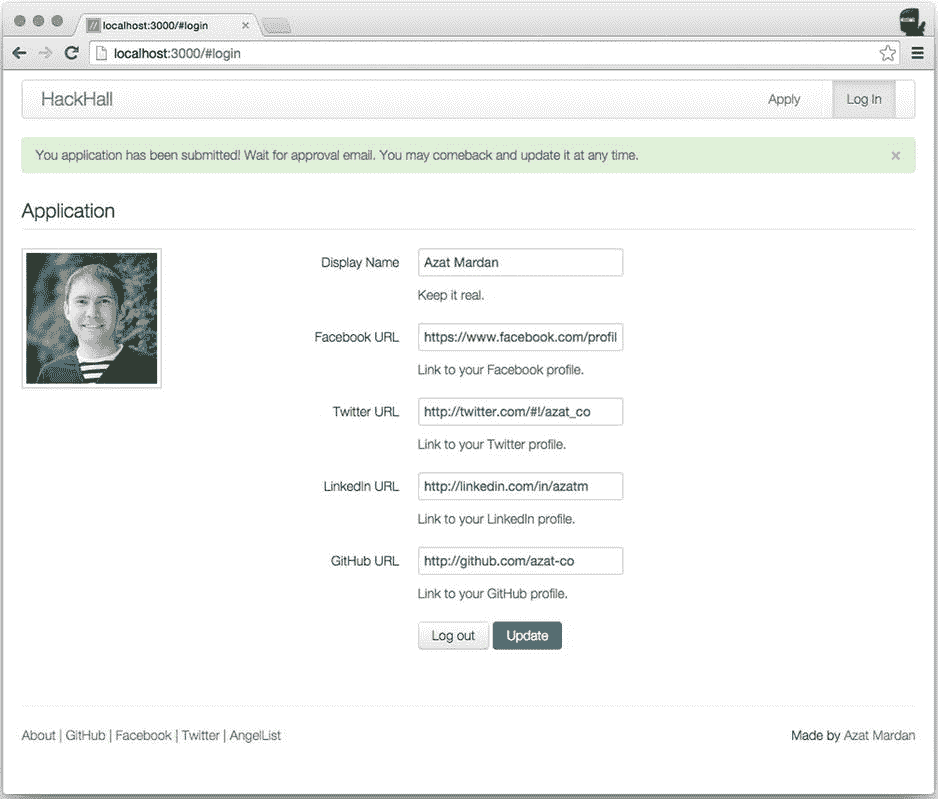

[图 22-10](#_Fig10) 。HackHall 会员申请页面

posts.js

我们需要剖析的最后一个 routes 模块是`hackhall/routes/posts.js`。它负责添加、编辑和删除帖子，以及评论、观看和喜欢。

我们使用对象 ID 将十六进制字符串转换为正确的对象:

```js
objectId = require('mongodb').ObjectID;

```

帖子分页的默认值如下:

```js
var LIMIT = 10;
var SKIP = 0;

```

`add()`函数处理新帖子的创建:

```js
exports.add = function(req, res, next) {
  if (req.body) {

```

这里的`req.db.Post`是可用的，因为定制的`db`中间件用在大多数路线上:

```js
    req.db.Post.create({
      title: req.body.title,
      text: req.body.text || null,
      url: req.body.url || null,

```

我们从用户的会话信息中设置帖子的作者:

```js
      author: {
        id: req.session.user._id,
        name: req.session.user.displayName
      }
    }, function(err, docs) {
      if (err) {
        console.error(err);
        next(err);
      } else {
        res.status(200).json(docs);
      }

    });
  } else {
    next(new Error('No data'));
  }
};

```

为了使用来自请求查询的值`limit`和`skip`或者缺省值来检索文章列表，我们使用下面的代码:

```js
exports.getPosts = function(req, res, next) {
  var limit = req.query.limit || LIMIT;
  var skip = req.query.skip || SKIP;
  req.db.Post.find({}, null, {
    limit: limit,
    skip: skip,

```

我们按 ID 对结果进行排序，ID 通常按时间顺序列出结果(为了获得更精确的结果，我们可以在这里使用`created`字段):

```js
    sort: {
      '_id': -1
    }
  }, function(err, obj) {

```

此时，我们检查在`obj`中是否有任何帖子，然后，我们执行一个循环来添加一些助手标志，如`admin`、`own`、`like`和`watch`:

```js
 if (!obj) return next('There are not posts.');
var posts = [];
docs.forEach(function(doc, i, list) {

```

`doc`对象是一个 Mongoose 文档对象，它有很多魔力，所以最好将数据转换成一个普通的对象:

```js
var item = doc.toObject();

```

现在，我们可以检查用户是否有管理员权限，如果用户有，那么我们将`item.admin`设置为`true`，但是是在新对象`item`的属性上。这是多余的，因为客户端应用在其他地方有`admin`标志，但出于表示的目的，在每个帖子上有这些信息很方便，因为管理员可以编辑和删除任何帖子:

```js
if (req.session.user.admin) {
        item.admin = true;
      } else {
        item.admin = false;
}

```

下一行检查用户是否是这篇文章的作者:

```js
if (doc.author.id == req.session.userId) {
        item.own = true;
} else {
        item.own = false;
}

```

这一行检查这个用户是否喜欢这个帖子:

```js
if (doc.likes && doc.likes.indexOf(req.session.user._id) > -1) {
        item.like = true;
       } else {
        item.like = false;
       }

```

这一行检查这个用户是否观看这个帖子:

```js
        if (doc.watches && doc.watches.indexOf(req.session.user._id) > -1) {
          item.watch = true;
          } else {
            item.watch = false;
          }
          posts.push(item);
});

```

这里是我们形成响应体的地方:

```js
var body = {};
      body.limit = limit;
body.skip = skip;
      body.posts = posts;

```

为了包含文档(文章)的总数以便分页，我们需要这个快速查询:

```js
    req.db.Post.count({}, function(err, total) {
      if (err) return next(err);
      body.total = total;
      res.status(200).json(body);
    });
  });
};

```

对于个人帖子页面，我们需要`getPost()`方法。我们可以传递我们想要的属性，不是像在`users.js`中那样作为字符串，而是作为对象:

```js
exports.getPost = function(req, res, next) {
  if (req.params.id) {
    req.db.Post.findById(req.params.id, {

```

这是限制我们希望从数据库返回的字段的另一种方法:

```js
      title: true,
      text: true,
      url: true,
      author: true,
      comments: true,
      watches: true,
      likes: true
    }, function(err, obj) {
      if (err) return next(err);
      if (!obj) {
        next('Nothing is found.');
      } else {
        res.status(200).json(obj);
      }
    });
  } else {
    next('No post id');
  }
};

```

功能从数据库中删除特定的帖子。这个代码片段使用了 Mongoose 中的`findById()`和`remove()`方法。然而，同样的事情只用`remove()`就可以完成。

```js
exports.del = function(req, res, next) {
  req.db.Post.findById(req.params.id, function(err, obj) {
    if (err) return next(err);

```

以下只是一个完整性检查，以确认客户端是管理员还是我们将要删除的帖子的作者:

```js
    if (req.session.admin || req.session.userId === obj.author.id) {
      obj.remove();
      res.status(200).json(obj);
    } else {
      next('User is not authorized to delete post.');
    }
  })
};

```

为了喜欢这篇文章，我们通过在`post.likes`数组前添加用户 ID 来更新文章条目:

```js
function likePost(req, res, next) {
  req.db.Post.findByIdAndUpdate(req.body._id, {

```

这是一个简单的 MongoDB 操作数，用于向数组中添加值:

```js
    $push: {
      likes: req.session.userId
    }
  }, {}, function(err, obj) {
    if (err) {
      next(err);
    } else {
      res.status(200).json(obj);
    }
  });
};

```

同样，当用户执行观察动作时，系统会向`post.watches`数组添加一个新的 ID:

```js
function watchPost(req, res, next) {
  req.db.Post.findByIdAndUpdate(req.body._id, {
    $push: {
      watches: req.session.userId
    }
  }, {}, function(err, obj) {
    if (err) next(err);
    else {
      res.status(200).json(obj);
    }
  });
};

```

`updatePost()`方法是调用 like 或 watch 函数，基于随请求发送的动作标志(`req.body.action`):

```js
exports.updatePost = function(req, res, next) {
  var anyAction = false;
  if (req.body._id && req.params.id) {

```

此逻辑用于添加 like:

```js
    if (req.body && req.body.action == 'like') {
      anyAction = true;
      likePost(req, res);

```

下一个条件是添加观察器:

```js
    } else if (req.body && req.body.action == 'watch') {
      anyAction = true;
      watchPost(req, res);

```

这一个是给帖子添加评论:

```js
    } else if (req.body && req.body.action == 'comment'
      && req.body.comment && req.params.id) {
      anyAction = true;
      req.db.Post.findByIdAndUpdate(req.params.id, {
        $push: {
          comments: {
            author: {
              id: req.session.userId,
              name: req.session.user.displayName
            },
            text: req.body.comment
          }
        }
      }, {
        safe: true,
        new: true
      }, function(err, obj) {
        if (err) throw err;
        res.status(200).json(obj);
      });

```

最后，当前面的操作条件都不满足时，`updatePost()`处理帖子本身的更改(标题、文本等。)由作者或管理员制作(`req.body.author.id == req.session.user._id || req.session.user.admin`):

```js
    } else if (req.session.auth && req.session.userId && req.body
      && req.body.action != 'comment' &&
      req.body.action != 'watch' && req.body != 'like' &&
      req.params.id && (req.body.author.id == req.session.user._id
      || req.session.user.admin)) {
      req.db.Post.findById(req.params.id, function(err, doc) {

```

在这个上下文中，`doc`对象是一个 mongose 文档对象，因此我们为它的属性分配新值并调用`save()`，这将触发模型中定义的预保存钩子(在下一节“mongose 模型”中讨论):

```js
        if (err) next(err);
        doc.title = req.body.title;
        doc.text = req.body.text || null;
        doc.url = req.body.url || null;
        doc.save(function(e, d) {
          if (e) return next(e);

```

发送回更新的对象是一个规则:

```js
          res.status(200).json(d);
        });
      })
    } else {
      if (!anyAction) next('Something went wrong.');
    }

  } else {
    next('No post ID.');
  }
};

```

在`https://github.com/azat-co/hackhall/blob/v3.1.0/routes/posts.js`可以获得`hackhall/routes/posts.js`文件的完整源代码。

这就完成了新帖子页面的路径编码(见[图 22-11](#Fig11) )，用户可以在这里创建一个帖子(例如，一个问题)。

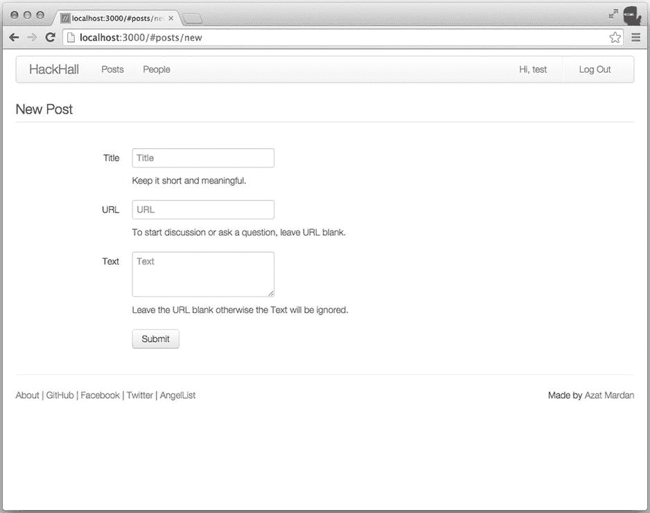

[图 22-11](#_Fig11) 。HackHall 新帖子页面

我们完成了路线文件！你还记得 HackHall 是一个真正的 MVC 应用吗？接下来，我们将覆盖模型。

猫鼬模型

理想情况下，在一个大的应用中，我们应该将每个模型分解到一个单独的文件中。现在，在 HackHall 应用中，我们在`hackhall/models/index.js`中拥有它们。

和往常一样，我们的依赖项在顶部看起来更好:

```js
var mongoose = require('mongoose');

```

该引用将用于 Mongoose 数据类型:

```js
var Schema = mongoose.Schema;

```

此数组将用作枚举类型:

```js
var roles = 'user staff mentor investor founder'.split(' ');

```

帖子模型表示一个帖子及其赞、评论和关注。架构中的每个属性都为该属性设置了特定的行为。例如，`required`表示该属性是必需的，`type`是猫鼬/BSON 数据类型。

 **提示**想了解更多关于猫鼬的信息，请查阅其官方文档(`https://gumroad.com/l/mongoose`)、*实用 Node.js * (Apress，2014)，以及新的在线课程。

我们用操作数定义`Schema`:

```js
var Post = new Schema ({

```

然后，我们有一个必需的`title`字段(`String`的`type`，它会自动删除开头和结尾的空白:

```js
  title: {
    required: true,
    type: String,
    trim: true,

```

RegExp 表示“一个单词、一个空格或任何字符`,.!?`”，长度在 1 到 100 个字符之间:

```js
    match: /^([\w ,.!?]{1,100})$/
  },

```

然后，我们用最多 1000 个字符定义 `url`(对于长 URL 应该足够了吧？)并打开修剪:

```js
  url: {
    type: String,
    trim: true,
    max: 1000
  },

```

我们为`text` 定义类似的字段属性:

```js
  text: {
    type: String,
    trim: true,
    max: 2000
  },

```

`comments` 是这篇文章的评论数组。每个评论对象都有一个`text`和`author`。作者`id`是对`User`模式的引用:

```js
  comments: [{
    text: {
      type: String,
      trim: true,
      max:2000
    },
    author: {
      id: {
        type: Schema.Types.ObjectId,
        ref: 'User'
      },
      name: String
    }
  }],

```

帖子可以被用户观看或喜欢。这些特性是通过使用带有用户 id 的数组`watches` 和`likes`来实现的:

```js
  watches: [{
    type: Schema.Types.ObjectId,
    ref: 'User'
  }],
  likes: [{
    type: Schema.Types.ObjectId,
    ref: 'User'
  }],

```

接下来，我们输入作者信息并使嵌套对象中的每个字段成为必填字段:

```js
  author: {
    id: {
      type: Schema.Types.ObjectId,
      ref: 'User',
      required: true
    },
    name: {
      type: String,
      required: true
    }
  },

```

最后，我们添加了时间和日期字段。最好有事件的时间戳，比如这篇文章是什么时候创建的，最后一次更新是什么时候。为此，我们使用`Date.now`作为默认字段。`updated`属性将由预保存钩子设置，也可以在每个`save()`上手动设置。(预保存钩子代码在这个模式代码之后提供。):

```js
  created: {
    type: Date,
    default: Date.now,
    required: true
  },
  updated: {
    type: Date,
    default: Date.now,
    required: true
  }
});

```

回到`updated`字段，为了确保我们不必在每次更新(`save()`)帖子时手动设置时间戳，我们使用了一个预保存挂钩来检查字段是否被修改(是否有新值)。如果它没有被修改，那么我们用一个新的日期和时间来设置它。这个钩子只有在你呼叫`save()`的时候才起作用；当你使用`update()`或类似的方法时就不会了。回调有一个异步`next()`函数，你可能会在 Express.js 中间件中看到:

```js
Post.pre('save', function (next) {
  if (!this.isModified('updated')) this.updated = new Date;
  next();
})

```

`User`模型也可以作为应用对象(当`approved=false`时)。让我们将模式定义如下:

```js
var User = new Schema({
  angelListId: String,

```

`Mixed`类型允许我们存储任何东西:

```js
  angelListProfile: Schema.Types.Mixed,
  angelToken: String,
    firstName: {
    type: String,
    required: true,
    trim: true
  },
  lastName: {
    type: String,
    required: true,
    trim: true
  },
  displayName: {
    type: String,
    required: true,
    trim: true
  },
  password: String,
  email: {
    type: String,
    required: true,
    trim: true
  },

```

角色是`enum`，因为该值只能是来自`roles`数组 ( `[user, staff, mentor, investor, founder]`)的值之一:

```js
  role: {
    type: String,
    enum: roles,
    required: true,
    default: roles[0]
  },

```

以下是一些必需的布尔标志:

```js
  approved: {
    type: Boolean,
    default: false
  },
  banned: {
    type: Boolean,
    default: false
  },
  admin: {
    type: Boolean,
    default: false
  },

```

现在是简短的简历陈述:

```js
  headline: String,

```

我们不会存储照片二进制文件，只存储它的 URL:

```js
  photoUrl: String,

```

`angelList`是一个松散的类型，将具有 AngelList 配置文件:

```js
  angelList: Schema.Types.Mixed,

```

最好用日志来跟踪文档的创建时间和最后一次更新时间(我们在`users.js`的`update()`方法中手动设置时间):

```js
  created: {
    type: Date,
    default: Date.now
  },
  updated: {
    type: Date,
    default: Date.now
  },

```

我们需要一些社交媒体网址:

```js
  angelUrl: String,
  twitterUrl: String,
  facebookUrl: String,
  linkedinUrl: String,
  githubUrl: String,

```

我们将该用户创作、喜欢、观看和评论的帖子的 id 引用为对象数组(它们将是`ObjectID` s):

```js
  posts: {
    own: [Schema.Types.Mixed],
    likes: [Schema.Types.Mixed],
    watches: [Schema.Types.Mixed],
    comments: [Schema.Types.Mixed]
  }
});

```

为了方便起见，我们应用了`findOrCreate`插件(`https://www.npmjs.org/package/mongoose-findorcreate`):

```js
User.plugin(findOrCreate);

```

Mongoose 插件的行为类似于迷你模块。这允许您向模型添加额外的功能。添加额外功能的另一种方式是编写自己的自定义方法。这种方法可以是静态的(附加到实体的整个类别)或实例(附加到特定的模型)。

在《routes》中，你已经看过两次`findProfileById()`:一次在`main.js`，一次在`users.js`。为了避免重复，代码被抽象为`User`模式的一个 Mongoose 静态方法。它检索信息，如评论、喜欢等。这就是为什么我们有多个嵌套的猫鼬叫声。

`findProfileById()`方法最初看起来可能有点复杂，但是这里没有什么困难——只需要几个嵌套的数据库调用，这样我们就可以获得完整的用户信息。这些信息不仅包括用户名、电子邮件地址等等，还包括用户发表的所有帖子、喜欢、关注和评论。这些信息用于个人资料页面上的游戏化目的，将评论、喜欢和观看的数量转换为点数。但是让我们从第一个基本查询开始，限制我们请求的字段(以避免泄露密码和电子邮件地址):

```js
User.statics.findProfileById = function(id, fields, callback) {
  var User = this;
  var Post = User.model('Post');

  return User.findById(id, fields, function(err, obj) {
    if (err) return callback(err);
    if (!obj) return callback(new Error('User is not found'));

```

找到用户后，我们通过使用`_id`和`displayName`找到用户的帖子。字段选项设置为`null`,这样我们可以传递其他参数，结果按照创建日期排序。在回调中，我们检查错误，如果有错误就退出(`callback(err)`)。

```js
    Post.find({
      author: {
        id: obj._id,
        name: obj.displayName
      }
    }, null, {
      sort: {
        'created': -1
      }
    }, function(err, list) {

```

处理每个嵌套回调的错误是至关重要的:

```js
      if (err) return callback(err);
      obj.posts.own = list || [];

```

现在我们已经将该用户的帖子列表保存到了`obj.posts.own`中，下一个查询将查找该用户喜欢的所有帖子:

```js
      Post.find({
        likes: obj._id
      }, null, {

```

时间顺序由`created`保证:

```js
        sort: {
          'created': -1
        }
      }, function(err, list) {
        if (err) return callback(err);

```

万一这个用户不喜欢任何帖子，我们用一个空数组来解释:

```js
        obj.posts.likes = list || [];

```

此查询获取该用户观看的帖子:

```js
        Post.find({
          watches: obj._id
        }, null, {
          sort: {
            'created': -1
          }
        }, function(err, list) {

```

先前上下文中的 `err`和`list`对象被这个闭包的`err`和`list`所掩盖，但我们并不在乎。这种风格允许变量名重用:

```js
          if (err) return callback(err);
          obj.posts.watches = list || [];

```

最后一个查询查找该用户留下评论的帖子:

```js
          Post.find({
            'comments.author.id': obj._id
          }, null, {
            sort: {
              'created': -1
            }
          }, function(err, list) {
            if (err) return callback(err);
            obj.posts.comments = [];

```

在我们获得该用户留下评论的帖子列表后，可能会有一些帖子中该用户留下了不止一条评论。出于这个原因，我们需要仔细检查帖子列表和每个评论，并将作者 ID 与用户 ID 进行比较。如果它们匹配，那么我们将该注释包含到列表中:

```js
            list.forEach(function(post, key, arr) {
              post.comments.forEach(function(comment, key, arr) {
                if (comment.author.id.toString() == obj._id.toString())
                  obj.posts.comments.push(comment);
              });
            });

```

最后，我们用正确的数据和空错误调用回调:

```js
            callback(null, obj);
          });
        });
      });
    });
  });
}

```

最后，我们导出模式对象，以便可以将它们编译成另一个文件中的模型:

```js
exports.Post = Post;
exports.User = User;

```

`hackhall/models/index.js`的完整源代码可在`https://github.com/azat-co/hackhall/blob/v3.1.0/models/index.js`获得。

摩卡测试

使用 REST API 服务器架构的一个好处是，每条路线以及整个应用都变得非常容易测试。通过测试的保证是开发过程中的一个很好的补充——所谓的测试驱动开发方法在[第 21 章](21.html)中介绍。

HackHall 测试位于`tests`文件夹中，包括:

*   `hackhall/tests/application.js`:未批准用户信息的功能测试
*   `hackhall/tests/posts.js`:岗位功能测试
*   `hackhall/tests/users.js`:用户功能测试

为了运行测试，我们利用一个 Makefile。我喜欢在 Makefile 中有不同的目标，因为这给了我更多的灵活性。以下是本例中的任务:

*   `test`:运行`tests`文件夹中的所有测试
*   `test-w`:每次有文件更改时重新运行测试
*   `users`:对用户相关的路线进行`tests/users.js`测试
*   `posts`:运行`tests/posts.js`岗位相关路线测试
*   `application`:运行`tests/application.js`测试应用相关的路由

Makefile 可能是这样的，从 Mocha 的选项开始:

```js
REPORTER = list
MOCHA_OPTS = --ui tdd

```

然后我们定义一个任务`test`:

```js
test:
        clear
        echo Seeding **********************
        node seed.js
        echo Starting test **********************
        foreman run ./node_modules/mocha/bin/mocha \
        --reporter $(REPORTER) \
        $(MOCHA_OPTS) \
        tests/*.js
        echo Ending test

```

同样，我们还定义了其他目标:

```js
test-w:
        ./node_modules/mocha/bin/mocha \
        --reporter $(REPORTER) \
        --growl \
        --watch \
        $(MOCHA_OPTS) \
        tests/*.js

users:
        clear
        echo Starting test **********************
        foreman run ./node_modules/mocha/bin/mocha \
        --reporter $(REPORTER) \
        $(MOCHA_OPTS) \
        tests/users.js
        echo Ending test

posts:
        clear
        echo Starting test **********************
        foreman run ./node_modules/mocha/bin/mocha \
        --reporter $(REPORTER) \
        $(MOCHA_OPTS) \
        tests/posts.js
        echo Ending test

application:
        clear
        echo Starting test **********************
        foreman run ./node_modules/mocha/bin/mocha \
        --reporter $(REPORTER) \
        $(MOCHA_OPTS) \
        tests/application.js
        echo Ending test

.PHONY: test test-w users posts application

```

因此，我们可以用`$ make`或`$ make test`命令开始测试(要运行示例中的 Makefile，您必须有`foreman`工具和`.env`变量)。

所有 36 个测试都应该通过(在 HackHall v3.1.0 中撰写本文时)，如图 22-12 所示。

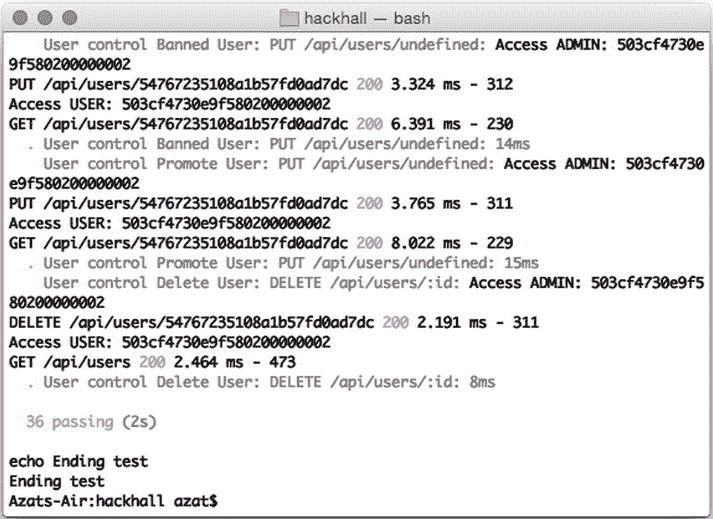

[图 22-12](#_Fig12) 。运行所有摩卡测试的结果

测试使用一个名为`superagent` ( `https://npmjs.org/package/superagent`)的库；GitHub: `https://github.com/visionmedia/superagent`。这些测试在概念上类似于第 21 章中[针对 REST API 的测试。我们登录，然后发出一些请求，同时检查它们的正确响应。](21.html)

例如，这是`hackhall/tests/application.js`的开始，其中我们有一个带有散列密码的虚拟用户对象(`bcrypt.hashSync()`):

```js
var bcrypt = require('bcryptjs');

var user3 = {
  firstName: 'Dummy',
  lastName: 'Application',
  displayName: 'Dummy Application',
  password: bcrypt.hashSync('3', 10),
  email: '3@3.com',
  headline: 'Dummy Application',
  photoUrl: '/img/user.png',
  angelList: {blah:'blah'},
  angelUrl: 'http://angel.co.com/someuser',
  twitterUrl: 'http://twitter.com/someuser',
  facebookUrl: 'http://facebook.com/someuser',
  linkedinUrl: 'http://linkedin.com/someuser',
  githubUrl: 'http://github.com/someuser'
}

var app = require ('../server').app,
  assert = require('assert'),
  request = require('superagent');

```

我们启动服务器:

```js
app.listen(app.get('port'), function(){
  console.log('Express server listening on port ' + app.get('port'));
});

```

下一行将存储客户机对象，以便我们可以作为该用户登录并发出授权请求:

```js
var user1 = request.agent();
var port = 'http://localhost:'+app.get('port');
var userId;

```

我们使用由`seed.js`创建的管理员用户:

```js
var adminUser = {
  email: 'admin-test@test.com',
  password: 'admin-test'
};

```

接下来，我们创建一个测试套件:

```js
suite('APPLICATION API', function (){

```

这是一个测试套件准备(目前为空):

```js
  suiteSetup(function(done){
    done();
  });

```

下面是对`/api/login`的 POST 调用的第一个测试用例定义:

```js
  test('log in as admin', function(done){
    user1.post(port+'/api/login').send(adminUser).end(function(res){
        assert.equal(res.status,200);
      done();
    });
  });

```

让我们检查一下我们是否可以获得受保护的资源`/api/profile`:

```js
  test('get profile for admin',function(done){
    user1.get(port+'/api/profile').end(function(res){
        assert.equal(res.status,200);
      done();
    });
  });
  test('submit application for user 3@3.com', function(done){

```

在这里，我们使用`user3`数据和散列密码创建一个新的成员资格应用:

```js
    user1.post(port+'/api/application').send(user3).end(function(res){
      assert.equal(res.status,200);
      userId = res.body._id;
      done();
    });
  });

```

然后，我们注销`user1`并检查我们是否已经注销:

```js
  test('logout admin',function(done){
    user1.post(port+'/api/logout').end(function(res){
        assert.equal(res.status,200);
      done();
    });
  });
  test('get profile again after logging out',function(done){
    user1.get(port+'/api/profile').end(function(res){
        assert.equal(res.status,500);
      done();
    });
  });

```

现在，我们尝试使用普通密码作为`user3`登录，就像在网页上输入一样(系统将对其进行哈希处理，以便与哈希密码进行比较):

```js
  test('log in as user3 - unapproved', function(done){
    user1.post(port+'/api/login').send({email:'3@3.com', password:'3'}).end(function(res){
        assert.equal(res.status, 200);
      done();
    });
  });

...

```

假设您已经从这个测试用例中获得了一般的想法，那么就没有必要列出所有平凡的测试用例。当然，你可以在`https://github.com/azat-co/hackhall/tree/v3.1.0/tests`获得`hackhall/tests/application.js`、`hackhall/tests/posts.js`、`hackhall/tests/users.js`的全部内容。

 **注意**不要在数据库中存储普通密码/密钥。任何严肃的制作应用至少应该在存储密码 [<sup> 1 </sup>](#Fn1) 之前加盐。用`bcryptjs`代替！

到目前为止，您应该能够在本地运行应用和测试(通过从书中复制或者下载代码)。如果你得到了 API 密匙，你应该可以用 AngelList 和 GitHub 登录，也可以用 SendGrid 收发邮件。至少，您应该能够使用您在数据库播种脚本中指定的电子邮件和密码在本地登录。

摘要

现在你知道了构建 HackHall 所用到的所有技巧和窍门，包括重要的、真实的生产应用组件，比如 REST API 架构、OAuth、Mongoose 及其模型、Express.js 应用的 MVC 结构、环境变量的访问等等。

如本章所述，HackHall 仍在积极开发中，因此代码将继续发展。确保您遵循 GitHub 上的资源库。您可以访问 live HackHall.com 应用，并通过申请会员资格加入社区！当然，您可以通过提交拉取请求来做出贡献。

本章总结了我们对 Express.js 和相关 web 开发主题的研究。涵盖一个不断发展的框架是一项困难的任务，类似于向一个移动的目标射击，所以我在这一章的目标是让你获得最新的信息，最重要的是，向你展示一些更基本的方面，比如代码组织。我还花了很多精力解释和重复中间件模式的例子。如果您面临截止日期的压力，或者只是喜欢即时学习(在需要时学习，而不是为未来学习)，那么您会发现大量代码可以复制并粘贴到您自己的项目中。我知道构建自己的项目比从教程中借用另一个抽象应用更有趣。

我希望你喜欢这些例子和这本书！我想通过推特(`@azat_co`)和电子邮件(`hi@azat.co`)收到你的来信。下面的附录将作为参考。别忘了领取你的两页纸的 Express.js 4 备忘单(下载链接在[附录 C](25.html) )。

__________________

[<sup>1</sup>](#_Fn1)T0】