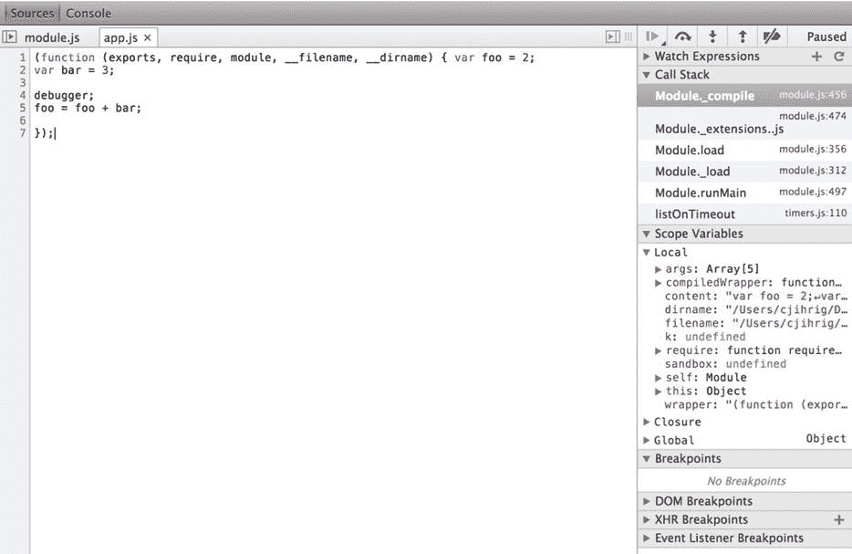
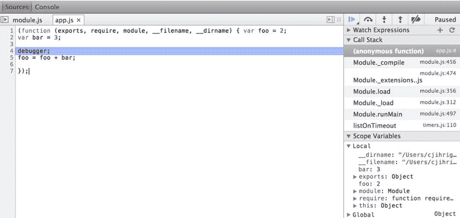

第十五章


日志记录、调试和测试

任何语言的产品代码都必须具有某种玩具或学术程序所缺乏的光泽。本章探讨了日志、调试和测试的主题，这将提高代码质量，同时减少诊断和修复 bug 所需的时间。通过记录有用的信息和错误，您可以更容易地修复出现的错误。调试器是任何程序员工具箱中的一个关键工具，因为它允许用细齿梳子探索代码，检查变量并找到 bug。最后，测试是系统地识别计算机程序中的错误的过程。本章着眼于用于日志记录、调试和测试的几个突出的模块和框架。

记录日志

在第 5 章的[中，您通过`console.log()`和`console.error()`方法](05.html)学习了最基础的日志记录。首先要注意的是，不同类型的消息有不同的日志记录方法。例如，在[清单 15-1](#list1) 中，`fs`模块用于打开一个名为`foo.txt`的文件。如果文件成功打开，则使用`console.log()`向`stdout`打印一条消息。然而，如果出现错误，则使用`console.error()`将其记录到`stderr`中。

***[清单 15-1](#_list1)*** 。包括错误和成功日志的示例

```js
var fs = require("fs");
var path = "foo.txt";

fs.open(path, "r", function(error, fd) {
  if (error) {
    console.error("open error:  " + error.message);
  } else {
    console.log("Successfully opened " + path);
  }
});
```

这种方法的缺点是必须有人监视控制台来检测错误。但是，通常生产应用被部署到一个或多个服务器上，这些服务器与最初开发应用的机器是分开的。这些生产服务器通常位于服务器机房、数据中心或云上，没有人监控终端窗口的错误。即使有人在监控控制台，错误也很容易从屏幕上消失，永远消失。由于这些原因，在生产环境中通常不鼓励打印到控制台。

在生产环境中，记录到文件比控制台记录更可取。不幸的是，`fs`模块并不适合日志记录。理想情况下，日志代码应该像`console.log()`调用一样与应用代码融合在一起。然而，文件操作的异步特性导致代码块包含回调函数和错误处理。回想一下，`fs`模块也为它的许多方法提供了同步等价物。应该避免这些，因为它们会成为应用中的主要瓶颈。

`winston`模块

Node 的核心模块没有提供理想的日志记录解决方案。幸运的是，开发人员社区已经创建了许多有用的第三方日志模块。其中最好的是`winston`，它是一个异步日志库，保持了`console.log()`的简单接口。清单 15-2 展示了`winston`是如何被导入并在一个简单的应用中使用的。当然，你必须首先`npm install winston`才能使用该模块。[清单 15-2](#list2) 展示了如何使用`winston.log()`方法。传递给`log()`的第一个参数是日志级别。默认情况下，`winston`提供日志级别`info`、`warn`和`error`。`log()`的第二个参数是记录的消息。

***[清单 15-2](#_list2)*** 。使用`winston`记录不同级别的信息

```js
var winston = require("winston");

winston.log("info", "Hello winston!");
winston.log("warn", "Something not so good happened");
winston.log("error", "Something really bad happened");
```

清单 15-2 的[输出显示在清单 15-3](#list2) 的[中。请注意，`winston`在输出消息之前显示日志级别。](#list3)

***[清单 15-3](#_list3)*** 。清单 15-2 中[的输出](#list2)

```js
$ node winston-basics.js
info: Hello winston!
warn: Something not so good happened
error: Something really bad happened
```

`winston`还为各种日志级别提供了方便的方法。这些方法(`info()`、`warn()`和`error()`)如[清单 15-4](#list4) 所示。这段代码的输出与清单 15-3 中的[相同。](#list3)

***[清单 15-4](#_list4)*** 。使用日志级方法重写清单 15-2

```js
var winston = require("winston");

winston.info("Hello winston!");
winston.warn("Something not so good happened");
winston.error("Something really bad happened");
```

到目前为止描述的所有日志记录方法都支持使用`util.format()` 占位符的字符串格式化。关于`util.format()`的复习，请参见第 5 章中的[。可以提供一个可选的回调函数作为日志记录方法的最终参数。此外，通过在任何格式占位符后提供参数，可以将元数据附加到日志消息中。清单 15-5 显示了这些功能的实际应用。在本例中，如果出现错误，`winston`会记录一条包含`path`变量](05.html)的值的消息。此外，实际的错误会作为元数据传递给`winston`。文件`foo.txt`不存在时的输出示例如[清单 15-6](#list6) 所示。

***[清单 15-5](#_list5)*** 。包含格式和元数据的日志示例

```js
var winston = require("winston");
var fs = require("fs");
var path = "foo.txt";

fs.open(path, "r", function(error, fd) {
  if (error) {
    winston.error("An error occurred while opening %s.", path, error);
  } else {
    winston.info("Successfully opened %s.", path);
  }
});
```

***[清单 15-6](#_list6)*T5[清单 15-5](#list5) 文件不存在时的结果输出**

```js
$ node winston-formatting.js
error: An error occurred while opening foo.txt. errno=34, code=ENOENT, path=foo.txt
```

`Transports`

`winston`广泛使用*运输工具*。传输本质上是日志的存储设备。`winston`支持的核心运输类型有`Console`、`File`、`Http`。顾名思义，`Console`传输用于将信息记录到控制台。`File`传输用于记录输出文件或任何其他可写流。`Http`传输用于将数据记录到任意 HTTP(或 HTTPS)端点。默认情况下，`winston`记录器只使用`Console`传输，但这是可以改变的。一个记录器可以有多个传输，或者根本没有传输。

使用`add()`方法可以将附加传输附加到记录器上。`add()`接受两个参数，一个传输类型和一个选项对象。支持的选项在[表 15-1](#Tab1) 中列出。值得注意的是，支持的选项因传输类型而异。类似地，使用`remove()`方法移除现有的传输。`remove()`方法接受传输类型作为它唯一的参数。

[表 15-1](#_Tab1) 。winston 核心传输支持的选项

| 

[计]选项

 | 

描述

 |
| --- | --- |
| `level` | 传输使用的日志级别。 |
| `silent` | 用于禁止输出的布尔值。默认为`false`。 |
| `colorize` | 用于使输出丰富多彩的布尔标志。默认为`false`。 |
| `timestamp` | 导致时间戳包含在输出中的布尔标志。默认为`false`。 |
| `filename` | 要记录输出的文件的名称。 |
| `maxsize` | 日志文件的最大大小(以字节为单位)。如果超过该大小，将创建一个新文件。 |
| `maxFiles` | 超过日志文件大小时，可创建的最大日志文件数。 |
| `stream` | 要记录输出的可写流。 |
| `json` | 一个布尔标志，启用时会导致数据被记录为 JSON。默认为`true`。 |
| `host` | 用于 HTTP 日志记录的远程主机。默认为`localhost`。 |
| `port` | 用于 HTTP 日志记录的远程端口。默认为`80`或`443`，取决于使用的是 HTTP 还是 HTTPS。 |
| `path` | 用于 HTTP 日志记录的远程 URI。默认为`/`。 |
| `auth` | 一个对象，如果包含的话，应该包含一个`username`和`password`字段。这用于 HTTP 基本身份验证。 |
| `ssl` | 一个布尔标志，如果启用，将导致使用 HTTPS。默认为`false`。 |

[清单 15-7](#list7) 显示了如何移除传输并将其添加到`winston`记录器中。在本例中，默认的`Console`传输被删除。然后添加一个新的`Console`传输，它只响应错误消息。新的传输还打开了彩色化和时间戳。注意，`remove()`和`add()`方法可以链接在一起。配置完`winston`后，通过调用`info()`和`error()`测试新设置。对于对`error()`的调用，输出将显示带有时间戳的彩色消息，但是对`info()`的调用将不会显示任何内容，因为没有信息级日志的传输。

***[清单 15-7](#_list7)*** 。使用`winston`添加和移除传输

```js
var winston = require("winston");

winston
  .remove(winston.transports.Console)
  .add(winston.transports.Console, {
    level: "error",
    colorize: true,
    timestamp: true
  });

winston.info("test info");
winston.error("test error");
```

`Creating New Loggers`

默认的记录器使用`winston`对象，如前面的例子所示。也可以使用`winston.Logger()`构造函数创建新的日志对象。清单 15-8 中的例子创建了一个带有两个传输的新记录器。第一个传输将彩色输出打印到控制台。第二个传输将错误转储到文件`output.log`。为了测试新的记录器，对`info()`进行一次调用，对`error()`进行另一次调用。两个日志记录调用都将被打印到控制台；但是，只有错误会打印到输出文件中。

***[清单 15-8](#_list8)*** 。使用`winston`创建新的记录器

```js
var winston = require("winston");
var logger = new winston.Logger({
  transports: [
    new winston.transports.Console({
      colorize: true
    }),
    new winston.transports.File({
      level: "error",
      filename: "output.log"
    })
  ]
});

logger.info("foo");
logger.error("bar");
```

调试

调试是定位和修复软件错误的过程。调试器是帮助加速这一过程的程序。除此之外，调试器允许开发人员一步一步地执行指令，一路上检查变量的值。调试器对于诊断程序崩溃和意外值非常有用。V8 带有一个内置的调试器，可以通过 TCP 访问。这允许通过网络调试Node应用。不幸的是，内置调试器的命令行界面并不友好。

要访问调试器，必须用`debug`参数调用 Node。因此，如果你的应用存储在`app.js`中，你需要执行[清单 15-9](#list9) 中所示的命令。

***[清单 15-9](#_list9)*** 。运行应用时启用Node的调试器

```js
node debug app.js
```

 **注意**提供`debug`参数会使 Node 启动一个交互式调试器。但是，您也可以提供一个`--debug`(注意连字符)选项，这将使调试器侦听端口 5858 上的连接。第三个选项`--debug-brk`，让调试器监听端口 5858，同时在第一行设置一个断点。

然后，您可以像在任何其他调试器中一样逐句通过代码。用于单步执行代码的命令如[表 15-2](#Tab2) 所示。

[表 15-2](#_Tab2) 。Node调试器支持的指令步进命令

| 

命令

 | 

描述

 |
| --- | --- |
| `cont`或`c` | 继续执行。 |
| `next`或`n` | 跳到下一条指令。 |
| `step`或`s` | 单步执行函数调用。 |
| `out`或`o` | 跳出函数调用。 |
| `pause` | 暂停正在运行的代码。 |

您可能不希望单步执行整个应用。因此，还应该设置断点。添加断点最简单的方法是在源代码中添加`debugger`语句。这些语句将导致调试器停止执行，但如果调试器不在使用中，这些语句将被忽略。清单 15-10 中[所示的例子将导致调试器在第二次给`foo`赋值之前暂停。](#list10)

***[清单 15-10](#_list10)*** 。包含一个`debugger`语句的示例应用

```js
var foo = 2;
var bar = 3;

debugger;
foo = foo + bar;
```

附加调试器后，发出`cont`或`c`命令继续执行`debugger`语句。此时，`foo`的值为 2，`bar`的值为 3。您可以通过输入`repl`命令来确认这一点，这将调用第 1 章中的[REPL。在 REPL 内，键入`foo`或`bar`检查变量值。接下来，按 Control+C 退出 REPL。发出两次`next`(或`n`)命令，跳过第二条赋值语句。通过再次启动 REPL，您可以验证该值是否已更新为 5。](01.html)

前面的例子展示了使用Node调试器的一般流程。如前所述，调试器不完全是用户友好的。幸运的是，有一个名为`node-inspector` 的第三方模块，它允许 Node 的调试器以一种用户友好的方式与谷歌 Chrome 的开发者工具进行交互。在进入`node-inspector`之前，花点时间回顾一下Node调试器支持的其他一些命令，这些命令在[表 15-3](#Tab3) 中显示。

[表 15-3](#_Tab3) 。Node调试器支持的其他命令

| 

命令

 | 

描述

 |
| --- | --- |
| `setBreakpoint()`或`sb()` | 在当前行设置断点。由于这些都是函数，您还可以传递一个参数来指定要设置断点的行号。可以使用语法`sb("script.js", line)`在特定文件的行号上设置断点。 |
| `clearBreakpoint()`或`cb()` | 清除当前行上的断点。当使用`sb()`时，您可以传递参数来清除特定行上的断点。 |
| `backtrace`或`bt` | 打印当前执行帧的回溯。 |
| `watch(expr)` | 将由`expr`指定的表达式添加到观察列表。 |
| `unwatch(expr)` | 从观察列表中删除由`expr`指定的表达式。 |
| `watchers` | 列出所有观察者及其值。 |
| `run` | 运行脚本。 |
| `restart` | 重新启动脚本。 |
| `kill` | 扼杀了剧本。 |
| `list(n)` | 显示带有`n`行上下文的源代码(当前行之前的`n`行和当前行之后的`n`行)。 |
| `scripts` | 列出所有加载的脚本。 |
| `version` | 显示 v8 的版本。 |

`node-inspector`模块

本节不提供使用 Chrome 开发工具的教程。幸运的是，它们相当简单明了，而且网上有丰富的内容。本节将引导您完成在机器上设置和运行`node-inspector`的过程。你需要在你的机器上安装最新版本的 Chrome。您还需要使用清单 15-11 中的[命令来全局安装`node-inspector`。](#list11)

***[清单 15-11](#_list11)*** 。全局安装`node-inspector`模块

```js
npm install node-inspector -g
```

接下来，使用[清单 15-12](#list12) 中显示的命令启动[清单 15-10](#list10) 中的应用(保存在`app.js`)。注意已经使用了`--debug-brk`标志。这是因为我们不想使用交互式调试器的命令行界面。

***[清单 15-12](#_list12)*** 。使用 *- debug-brk* 标志启动应用

```js
$ node --debug-brk app.js
```

接下来，在一个单独的终端窗口中，使用清单 15-13 中的命令启动`node-inspector`。

***[清单 15-13](#_list13)*** 。启动`node-inspector`应用

```js
$ node-inspector
```

启动`node-inspector`后，应该会看到一些终端输出。该输出将包括访问 URL 的方向。这个 URL 很可能是清单 15-14 中显示的那个。在 Chrome 中访问该 URL。页面应该看起来像[图 15-1](#Fig1) 。

***[清单 15-14](#_list14)*** 。运行`node-inspector`时要访问的 URL

```js
http://127.0.0.1:8080/debug?port=5858
```



[图 15-1](#_Fig1) 。连接到[清单 15-14](#list14) 中的链接时的 Chrome 视图

打开 Chrome 时，执行会在一个断点处暂停。按下窗口右侧面板上的小播放按钮，恢复执行。这将导致应用执行，直到到达下一个断点，此时 Chrome 将看起来像[图 15-2](#Fig2) 。请注意图像右侧的范围变量部分。此部分允许您查看当前范围内的变量及其值。在[图 15-2](#Fig2) 中，可以看到`foo`等于 2，`bar`等于 3。



[图 15-2](#_Fig2) 。Chrome 的视图在调试器语句处停止

然后，在观察变量更新的同时，您可以使用控件单步执行、遍历和跳出指令和函数。此外，您可以单击 Console 选项卡来打开一个交互式控制台，用于检查值和执行代码。

测试

测试是软件开发过程中至关重要的部分。软件公司有专门的测试部门是非常重要的。本节的目标不是提供软件测试的全面覆盖。有许多书籍致力于各种软件测试方法。相反，这一节教你如何使用核心`assert`模块以及灵活的 JavaScript 测试框架 Mocha 编写单元测试。

`assert`模块

是一个核心模块，用于编写简单的单元测试。`assert`提供了将计算值(称为实际值)与预期值进行比较的便利方法，如果结果不是预期的，则抛出异常。清单 15-15 中显示了一个断言示例。在这个例子中，一个值被计算并存储在变量`actual`中。期望值也存储在`expected`变量中。然后将实际值和期望值作为第一个和第二个参数传递给`assert.strictEqual()`方法。正如方法名所暗示的，这两个值使用严格的等式进行比较(`===`操作符)。在这种情况下，断言测试通过，所以什么都不会发生。

***[清单 15-15](#_list15)*** 。使用严格等于断言的示例测试

```js
var assert = require("assert");
var actual = 2 + 3;
var expected = 5;

assert.strictEqual(actual, expected);
```

清单 15-16 检查了断言失败的情况。在本例中，实际值是浮点数 0.1 和 0.2 的和，而预期值是 0.3。基础数学会让你相信断言会被通过。然而，由于浮点数学的工作方式，总和并不正好是 0.3。这会导致断言失败，并抛出如[清单 15-17](#list17) 所示的异常。

***[清单 15-16](#_list16)*** 。一个失败断言的例子

```js
var assert = require("assert");
var actual = 0.1 + 0.2;
var expected = 0.3;

assert.strictEqual(actual, expected);
```

通过检查清单 15-17 中的错误信息，您可以看到实际值包含极少量的误差。这是在 JavaScript 中执行数学运算时必须考虑的事情。

***[清单 15-17](#_list17)*** 。清单 15-16 中的代码导致的异常

```js
AssertionError: 0.30000000000000004 === 0.3
```

基本断言方法还带有一个可选的第三个参数，用于指定自定义错误消息。[清单 15-16](#list16) 在[清单 15-18](#list18) 中被重写，以包含一条自定义消息。当这段代码运行时，您会看到错误消息`"AssertionError: JavaScript math is quirky"`。

***[清单 15-18](#_list18)*** 。创建带有自定义错误消息的断言

```js
var assert = require("assert");
var actual = 0.1 + 0.2;
var expected = 0.3;

assert.strictEqual(actual, expected, "JavaScript math is quirky");
```

除了`strictEqual()`之外，`assert`模块还拥有许多其他方法，用于创建各种类型的断言。这些像`strictEqual()`一样使用的方法在[表 15-4](#Tab4) 中进行了总结。

[表 15-4](#_Tab4) 。附加断言方法

| 

方法

 | 

描述

 |
| --- | --- |
| `equal()` | 使用`==`比较运算符执行简单的相等检查。使用浅层检查，两个对象不会被评估为相等，除非它们实际上是同一个对象。 |
| `notEqual()` | 使用`!=`比较运算符执行不相等的浅层检查。 |
| `deepEqual()` | 对相等性执行深度检查。通过使用深度检查，通过比较对象中存储的键和值来确定是否相等。 |
| `notDeepEqual()` | 对不平等执行深度检查。 |
| `notStrictEqual()` | 使用`!==`比较运算符检查严格不等式。 |
| `ok()` | `ok()`只接受两个参数— `value`和一个可选的`message`。这个方法是`assert.equal(true, !!value, message)`的简写。换句话说，这个方法测试提供的值是否是`truthy`。 |
| `assert()` | 这个功能的用法和`ok()`完全一样。然而，这不是`assert`模块的方法，而是`assert`模块本身的方法。这个函数是`require("assert")`返回的值。 |

`The``throws()``Method`T4】

`assert`模块还提供了`throws()`方法来验证给定的函数是否像预期的那样抛出异常。清单 15-19 中显示了一个`throws()`的例子。`block`参数是测试中的函数，预计会抛出异常。如果`block`没有抛出异常，断言将会失败。稍后将再次讨论`error`的论点。可选的`message`参数的行为方式与之前讨论的断言方法相同。

***[清单 15-19](#_list19)*** 。使用`assert.throws()`

```js
assert.throws(block, [error], [message])
```

可选的`error`参数用于验证是否抛出了正确的异常。该参数可以是构造函数、正则表达式对象或用户定义的验证函数。如果`error`是一个构造函数，那么使用`instanceof`操作符来验证异常对象。如果`error`是一个正则表达式，那么通过测试匹配来执行验证。如果`error`是一个非构造函数，那么如果`error`被验证，该函数应该返回`true`。

举个例子，假设你正在测试一个执行除法的函数。如果出现被零除的情况，那么被测试的函数应该抛出一个异常。否则，该函数应该返回除法运算的商。清单 15-20 显示了这个除法函数的定义，以及几个使用`throws()`的成功断言测试。`bind()`方法创建了`divide()`方法的副本，其`numerator`和`denominator`参数被绑定到特定的值。在每个示例测试用例中，`denominator`被绑定为零，以确保抛出异常。

***[清单 15-20](#_list20)*** 。使用 *assert.throws()* 测试除法函数

```js
var assert = require("assert");

function divide(numerator, denominator) {
  if (!denominator) {
    throw new RangeError("Division by zero");
  }

  return numerator / denominator;
}

assert.throws(divide.bind(null, 1, 0));
assert.throws(divide.bind(null, 2, 0), RangeError);
assert.throws(divide.bind(null, 3, 0), Error);
assert.throws(divide.bind(null, 4, 0), /Division by zero/);
assert.throws(divide.bind(null, 5, 0), function(error) {
  return error instanceof Error && /zero/.test(error.message);
});
```

在清单 15-20 中，所有的断言都是成功的。清单 15-21 包括许多会抛出异常的示例断言。第一个断言失败是因为`denominator`不为零，所以没有抛出异常。第二个断言失败，因为抛出了一个`RangeError`，但是提供了`TypeError`构造函数。第三个断言失败，因为正则表达式`/foo/`与抛出的异常不匹配。第四个断言失败，因为验证函数返回了`false`。

***[清单 15-21](#_list21)*** 。使用 *assert.throws()* 方法的断言无效

```js
var assert = require("assert");

function divide(numerator, denominator) {
  if (!denominator) {
    throw new RangeError("Division by zero");
  }

  return numerator / denominator;
}

assert.throws(divide.bind(null, 1, 1));
assert.throws(divide.bind(null, 2, 0), TypeError);
assert.throws(divide.bind(null, 3, 0), /foo/);
assert.throws(divide.bind(null, 4, 0), function(error) {
  return false;
});
```

`The``doesNotThrow()``Method`T4】

`throws()`的反函数是`doesNotThrow()`，期望一个函数不抛出异常。`doesNotThrow()`功能如清单 15-22 中的[所示。`block`参数是被测函数。如果`block`抛出一个异常，那么断言失败。可选的`message`参数的行为与之前讨论的断言方法一样。](#list22)

***[清单 15-22](#_list22)*** 。使用`assert.doesNotThrow()`

```js
assert.doesNotThrow(block, [message])
```

`The``ifError()``Method`T3】

`ifError()`方法对于测试回调函数的第一个参数很有用，它通常用于传递错误条件。因为错误参数通常是`null`或`undefined`，所以`ifError()`方法检查`falsy`值。如果检测到`truthy`值，则断言失败。例如，[清单 15-23](#list23) 中显示的断言通过，而[清单 15-24](#list24) 中显示的断言失败。

***[清单 15-23](#_list23)*** 。使用`assert.ifError()`成功断言

```js
var assert = require("assert");

assert.ifError(null);
```

***[清单 15-24](#_list24)*** 。使用 *assert.ifError()* 断言失败

```js
var assert = require("assert");

assert.ifError(new Error("error"));
```

Mocha 测试框架

模块对于编写小而简单的单元测试很有用。然而，非常复杂的程序通常有大型的测试套件来验证应用的每个特性。运行全面的测试套件也有助于*回归测试*——现有功能的测试，以确保新代码的添加不会破坏现有代码。此外，当发现新的错误时，可以为它创建一个单元测试，并将其添加到测试套件中。为了管理和运行大型测试套件，您应该求助于测试框架。有许多可用的测试框架，但是这一节主要讨论 Mocha。Mocha 由 Express 的创始人 TJ Holowaychuk 创建，并标榜自己是“一个简单、灵活、有趣的 Node.js 和浏览器 JavaScript 测试框架。”

`Running Mocha`

摩卡必须安装后才能使用。尽管 Mocha 可以逐个项目地安装，但使用清单 15-25 中的命令全局安装更简单。

***[清单 15-25](#_list25)*** 。全球安装 Mocha 框架

```js
$ npm install -g mocha
```

通过全局安装 Mocha，您可以使用`mocha`命令直接从命令行启动它。默认情况下，`mocha`会尝试执行`test`子目录中的 JavaScript 源文件。如果`test`子目录不存在，它将在当前目录中查找名为`test.js`的文件。或者，您可以通过简单地在命令行上提供文件名来指定一个测试文件。清单 15-26 显示了在一个空目录中运行`mocha`的示例输出。输出显示了成功运行的测试数量，以及它们所花费的时间。在这种情况下，没有运行测试，运行`mocha`有 1 毫秒的开销。

***[清单 15-26](#_list26)*** 。在没有测试的情况下运行`mocha`的示例输出

```js
$ mocha

  0 passing (1ms)
```

`Creating Tests`

Mocha 允许在一个 JavaScript 源文件中定义多个测试。理论上，一个项目的整个测试套件可以包含在一个文件中。然而，为了清晰和简单起见，只有相关的测试应该放在同一个文件中。使用`it()`功能创建单独的测试。`it()`接受两个参数，一个描述测试内容的字符串和一个实现测试逻辑的函数。清单 15-27 显示了可能的最简单的测试。该测试实际上不做任何事情，但是当使用`mocha`运行时，它将被报告为通过测试。这个测试通过的原因是因为它没有抛出异常。在 Mocha 中，如果一个测试抛出一个异常，它就被认为是失败的。

***[清单 15-27](#_list27)*** 。微不足道的摩卡测试

```js
it("An example test", function() {
});
```

关于[清单 15-27](#list27) 中的测试用例，另一件值得注意的事情是 Mocha 从未被导入，然而`it()`函数是可用的。如果您要在 Node 中直接执行这个测试，您会看到一个错误，因为没有定义`it()`。然而，通过`mocha`运行测试，`it()`和其他摩卡功能被纳入范围。

`Creating Test Suites`

Mocha 使用`describe()`方法将测试组合成套件。`describe()`需要两个参数。第一个是提供测试套件描述的字符串。第二个参数是包含零个或多个测试的函数。包含两个测试的测试套件的例子如[清单 15-28](#list28) 所示。

***[清单 15-28](#_list28)*** 。包含两个测试的简单测试套件

```js
describe("Test Suite 1", function() {
  it("Test 1", function() {
  });

  it("Test 2", function() {
  });
});
```

 **注意**尽管测试套件对于将相关的测试组合在一起很有用，但它们并不是必需的。如果没有指定测试套件，所有的测试都将被放置在 Mocha 预先存在的、未命名的全局测试套件中。

Mocha 还支持测试套件的嵌套。例如，假设您正在为一个框架中的多个类创建测试。每个类都值得拥有自己的测试套件。然而，如果一个类足够复杂，那么您可能想要为单个功能创建测试套件，比如方法。清单 15-29 提供了一个如何构建测试套件的例子。请注意，该示例使用了嵌套套件。

***[清单 15-29](#_list29)*** 。嵌套测试套件的一个例子

```js
describe("Class Test Suite", function() {
  describe("Method Test Suite", function() {
    it("Method Test 1", function() {
    });

    it("Method Test 2", function() {
    });
  });
});
```

`Testing Asynchronous Code`

Mocha 还使得测试异步代码变得极其容易，这对于使用 Node 是绝对必要的。要创建一个异步测试，只需将一个回调函数传递给`it()`。按照惯例，这个回调函数被命名为`done()`，并作为参数传递给传递给`it()`的函数。当测试完成时，只需调用`done()`，如[清单 15-30](#list30) 所示。

***[清单 15-30](#_list30)*** 。清单 15-27 中的 Mocha 测试被重写为异步的

```js
it("An example asynchronous test", function(done) {
  done();
});
```

定义失败

如果测试没有产生预期的结果，它被认为是失败的。Mocha 将失败定义为任何抛出异常的测试。这使得 Mocha 与本章前面讨论的`assert`模块兼容。[清单 15-31](#list31) 显示了一个练习字符串`indexOf()`方法的示例测试。这个简单的测试验证了当没有找到搜索的字符串时，`indexOf()`返回-1。由于在字符串`"Hello Mocha!"`中没有找到字符串`"World"`和`"Goodbye"`，两个断言都将通过。然而，如果`str`的值被更改为`"Hello World!"`，那么第一个断言将抛出一个异常，导致测试失败。

***[清单 15-31](#_list31)*** 。带有断言的示例测试

```js
var assert = require("assert");

it("Should return -1 if not found", function() {
  var str = "Hello Mocha!";

  assert.strictEqual(str.indexOf("World"), -1);
  assert.strictEqual(str.indexOf("Goodbye"), -1);
});
```

清单 15-32 中显示了一个包含断言的异步测试的例子。在这个例子中，`fs.exists()`方法确定文件是否存在。在这种情况下，我们假设文件确实存在，因此测试将通过。

***[清单 15-32](#_list32)*** 。包含断言的异步测试

```js
var assert = require("assert");
var fs = require("fs");

it("Should return true if file exists", function(done) {
  var filename = "foo.txt";

  fs.exists(filename, function(exists) {
    assert(exists);
    done();
  });
});
```

 **注意** `Error`对象可以在异步测试中直接传递给`done()`。这样做会导致测试失败，就像抛出了异常一样。

`Test Hooks`

Mocha 支持在测试执行前后调用的可选钩子。这些挂钩用于在测试运行前设置测试数据，并在测试完成后清理数据。这些前/后挂钩有两种风格。第一个在整个测试套件运行之前执行，第二个在整个测试套件运行之后执行。这些钩子是使用`before()`和`after()`函数实现的。第二种挂钩在每次单独测试之前和之后运行。要实现这种类型的挂钩，使用`beforeEach()`和`afterEach()`功能。这四个函数都将一个钩子函数作为唯一的参数。如果钩子执行异步代码，那么应该以与`it()`函数相同的方式提供一个`done()`回调。

清单 15-33 展示了如何在 Mocha 测试套件中使用钩子。这个例子包括了所有四种类型的钩子。为了说明执行流程，运行这个测试套件的输出如清单 15-34 所示。注意，首先和最后要执行的是通过`before()`和`after()`提供的钩子。还要注意，`after()`钩子已经用异步方式实现了，尽管钩子函数是同步的。接下来，注意每个单独的测试都是在调用`beforeEach()`和`afterEach()`钩子之间运行的。

***[清单 15-33](#_list33)*** 。包含测试挂钩和两个测试的测试套件

```js
describe("Test Suite", function() {
  before(function() {
    console.log("Setting up the test suite");
  });

  beforeEach(function() {
    console.log("Setting up an individual test");
  });

  afterEach(function() {
    console.log("Tearing down an individual test");
  });

  after(function(done) {
    console.log("Tearing down the test suite");
    done();
  });

  it("Test 1", function() {
    console.log("Running Test 1");
  });

  it("Test 2", function() {
    console.log("Running Test 2");
  });
});
```

***[清单 15-34](#_list34)*** 。运行清单 15-33 中[测试套件的控制台输出](#list33)

```js
$ mocha

  Setting up the test suite
Setting up an individual test
Running Test 1
․Tearing down an individual test
Setting up an individual test
Running Test 2
․Tearing down an individual test
Tearing down the test suite

  2 passing (5ms)
```

`Disabling Tests`

使用`skip()`方法可以禁用单个测试或测试套件。[清单 15-35](#list35) 显示了单个测试是如何被禁用的。注意`skip()`已经应用于第二个测试。如果使用`mocha`来执行这个测试集合，那么只有第一个测试会运行。类似地，可以使用`describe.skip()`跳过整个测试套件。

***[清单 15-35](#_list35)*** 。使用`skip()`方法禁用测试

```js
it("Test 1", function() {
  console.log("Test 1");
});

it.skip("Test 2", function() {
  console.log("Test 2");
});
```

`Running a Single Test Suite`

`only()`方法用于运行单个套件或测试。当您只想运行一个测试时，这消除了注释掉大组测试的需要。使用`only()`和使用`skip()`是一样的，尽管语义不同。当运行清单 15-36 所示的例子时，只执行第二个测试。

***[清单 15-36](#_list36)*** 。使用`only()`运行单一测试

```js
it("Test 1", function() {
  console.log("Test 1");
});

it.only("Test 2", function() {
  console.log("Test 2");
});
```

摘要

本章介绍了与 Node.js 相关的日志记录、调试和测试主题。这三个主题对于诊断和解决 bug 至关重要。调试和测试是开发过程的重要部分，因为它们有助于防止 bug 进入生产代码。另一方面，日志记录有助于跟踪漏洞，并将其投入生产。通过实现日志记录、调试和测试，您可以确保您的代码具有进入生产所需的润色。下一章将探讨如何部署和扩展生产代码。