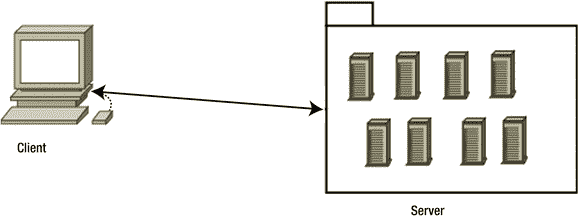
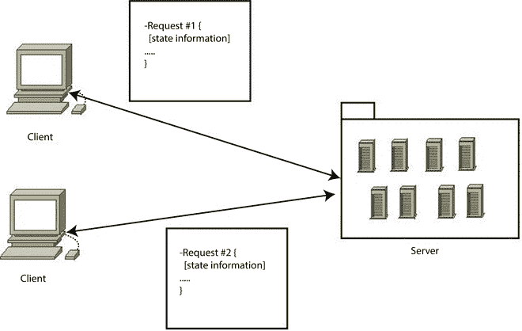
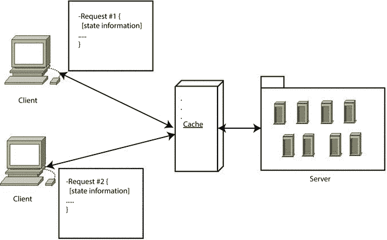
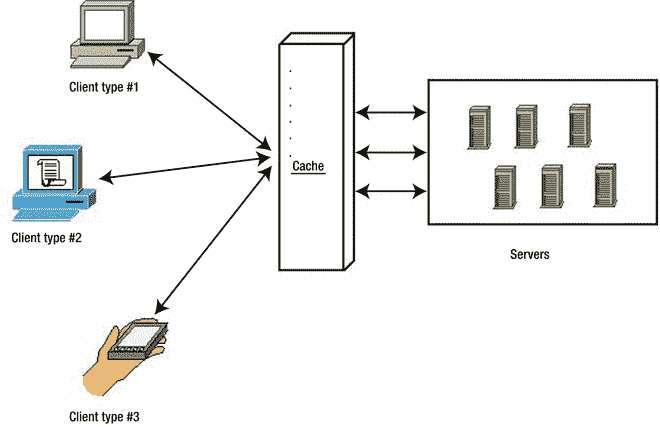
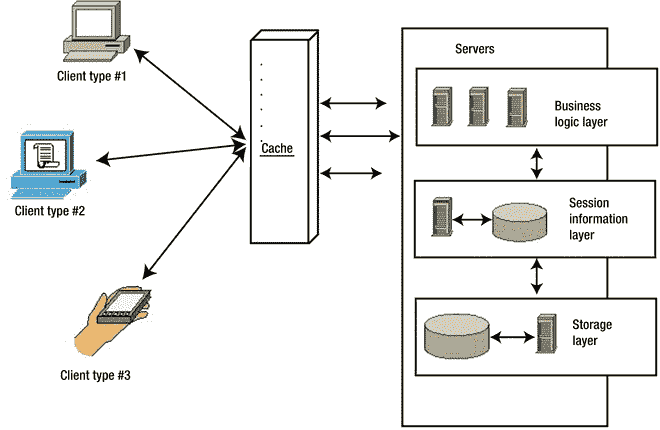
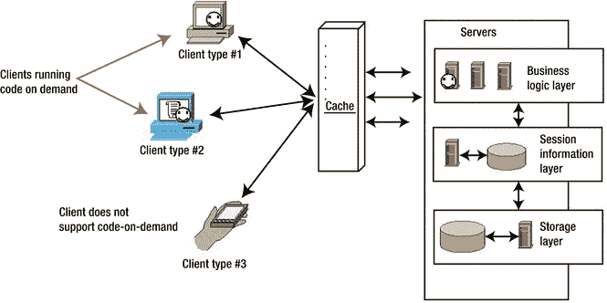
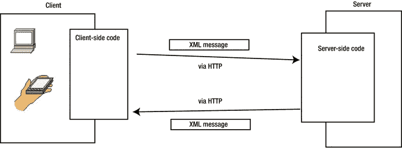
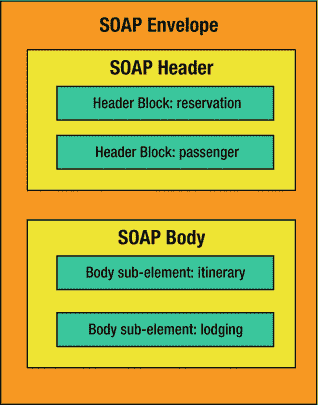

# 一、REST 101

Electronic supplementary material The online version of this chapter (doi: [10.​1007/​978-1-4842-0917-2_​1](http://dx.doi.org/10.1007/978-1-4842-0917-2_1)) contains supplementary material, which is available to authorized users.

如今，缩写 REST 已经成为一个流行词，因此，它被许多技术人员非常不小心地扔进了数字风中，而没有完全理解它的真正含义。仅仅因为您可以使用 HTTP 与系统交互，并来回发送 JSON，并不意味着它是 RESTful 系统。REST远不止这些——这也是我们将在本章讨论的内容。

让我们从罗伊·菲尔丁的论文开始，回顾一下他的观点的主要特征。我将试着解释它的主要方面，他添加的约束和原因。我将回顾一些例子，然后跳回到过去，因为即使 REST 已经被证明是分布式系统互连方面的一个巨大进步，在 Fielding 的论文流行之前，开发人员仍然在寻找问题的解决方案:如何轻松地互连一组非同构系统。

我将快速回顾一下当时开发人员用来互连系统的选项，主要是 SOAP 和 XML-RPC(REST 之前的两个主要参与者)。

最后，我将跳回到我们当前的时代，比较 REST 带给我们的优势，从而展示为什么它在今天如此受欢迎。

但是首先，需要做一个小小的澄清:正如您将在几分钟后读到的，REST 是独立于协议的(只要该协议支持 URI 方案)，但是出于本书的考虑，并且因为我们将重点放在 API 设计上，所以让我们假设我们使用的协议是 HTTP，这将简化解释和示例。只要你记住其他协议(如 FTP)也是如此，你就不会有问题。

## 这一切是从哪里开始的？

这一切都始于 1965 年出生的美国计算机科学家罗伊·菲尔丁。他是 HTTP 协议 [1](#Fn1) (整个 Web 基础设施所基于的协议)的主要作者之一。他也是 Apache Web 服务器 [2](#Fn2) 的合著者之一，并且是 Apache 软件基金会 [3](#Fn3) 成立前三年的主席。

如你所见，Fielding 为 IT 界做出了很多巨大的贡献，尤其是在互联网方面，但我认为他的博士论文最受关注，让他的名字在很多人当中广为人知，否则他们不会听说过他。

在 2000 年，Fielding 提交了他的博士论文，架构风格和基于网络的软件架构的设计。在这本书中，他创造了术语 REST，一种分布式超媒体系统的架构风格。

简而言之，REST(表述性状态转移的缩写)是一种架构风格，旨在帮助创建和组织分布式系统。这个定义的关键词应该是风格，因为 REST 的一个重要方面(这也是像这本书存在的主要原因之一)是它是一种架构风格——不是指南，不是标准，或者任何暗示有一组硬规则要遵循以获得 RESTful 架构的东西。

因为它是一种风格，而且没有征求意见稿(RFC)来定义它，所以它容易被阅读它的人误解。不仅如此，有些人甚至省略了某些部分，并实现了其功能的一个子集，这反过来又导致了一种普遍的、不完整的 REST 理想，省略了那些原本有用的、有助于系统用户的功能。

REST 背后的主要思想是，RESTfully 组织的分布式系统将在以下方面得到改进:

*   性能:REST 提出的通信风格是高效和简单的，允许采用它的系统的性能提升。
*   组件交互的可伸缩性:任何分布式系统都应该能够足够好地处理这一方面，REST 提出的简单交互极大地考虑到了这一点。
*   界面的简单性:一个简单的界面允许系统间更简单的交互，这反过来可以带来前面提到的好处。
*   组件的可修改性:系统的分布式本质，以及 REST 提出的关注点分离(稍后将详细介绍)，允许以最小的成本和风险独立地修改组件。
*   可移植性:REST 是技术和语言不可知的，这意味着它可以被任何类型的技术实现和使用(有一些限制，我稍后会详细介绍，但是没有强制使用特定的技术)。
*   可靠性:REST 提出的无状态约束(稍后将详细介绍)允许系统在故障后更容易地恢复。
*   可见性:同样，所提出的无状态约束具有提高可见性的额外好处，因为任何监控系统都不需要看得比单个请求消息更远，就可以确定所述请求的完整状态(一旦我谈到约束，这一点就变得很清楚了)。

从这个列表中，可以推断出一些直接的好处:

*   以组件为中心的设计允许您创建容错能力很强的系统。一个组件的故障不会影响系统的整体稳定性，这对任何系统都是一大好处。
*   互连组件非常容易，从而在添加新功能或扩大或缩小规模时将风险降至最低。
*   考虑到 REST 而设计的系统，由于其可移植性(如前所述)，将会被更广泛的受众所使用。通过通用接口，该系统可以被更广泛的开发者使用。

为了实现这些属性和好处，REST 中添加了一组约束来帮助定义统一的连接器接口。

## REST约束

根据菲尔丁的说法，有两种方法来定义一个系统。一种是从空白的白板开始，在需求得到满足之前，对正在构建的系统或熟悉组件的使用没有任何初步的了解。第二种方法是从系统的全套需求开始，将约束添加到各个组件，直到影响系统的各种力量能够和谐地相互作用。

REST 遵循第二种方法。为了定义一个 REST 架构，首先定义一个空状态——一个没有任何约束的系统，其中组件差异只是一个神话——然后一个接一个地添加约束。

### 客户端-服务器

要添加的第一个约束是基于网络的体系结构中最常见的约束之一:客户机-服务器。服务器负责处理一组服务，并监听关于所述服务的请求。反过来，请求由需要这些服务之一的客户端系统通过连接器发出(参见图 [1-1](#Fig1) )。

图 1-1。

Client-Server architecture diagram

这个约束背后的主要原则是关注点的分离。它允许将前端代码(信息的表示和可能的 UI 相关处理)从服务器端代码中分离出来，服务器端代码应该负责数据的存储和服务器端处理。

这种约束允许两个组件独立发展，通过让客户端应用在不影响服务器代码的情况下进行改进，提供了很大的灵活性，反之亦然。

### 无国籍的

在前一个约束之上添加的约束是无状态约束(见图 [1-2](#Fig2) )。客户端和服务器之间的通信必须是无状态的，这意味着客户端发出的每个请求都必须包含服务器理解它所需的所有信息，而不利用任何存储的数据。

图 1-2。

Representation of the stateless constraint

这个约束代表了对底层架构的几个改进:

*   可见性:当所有需要的信息都包含在请求中时，监控系统就变得容易了。
*   可伸缩性:由于不必在请求之间存储数据，服务器可以更快地释放资源。
*   可靠性:如前所述，无状态系统比无状态系统更容易从故障中恢复，因为唯一需要恢复的是应用本身。
*   更容易实现:编写不必跨多个服务器管理存储的状态数据的代码要容易得多，因此整个服务器端系统变得更简单。

虽然乍一看这种约束似乎很好，但正如通常发生的那样，这是一种权衡。一方面，系统获得了好处，但另一方面，由于发送重复的状态信息而对每个请求增加了少量的开销，网络流量可能会受到损害。根据所实现的系统类型和重复信息的数量，这可能不是一个可接受的折衷方案。

### 可缓冲的

可缓存约束被添加到当前约束组中(见图 [1-3](#Fig3) )。它建议对请求的每个响应都必须显式或隐式地设置为可缓存的(如果适用)。

图 1-3。

Representation of a client-stateless-cache-server architecture

通过缓存响应，有一些明显的好处被添加到架构中:在服务器端，当内容被缓存时，一些交互(例如，数据库请求)被完全绕过。在客户端，性能有了明显的提高。

这种约束的代价是，由于糟糕的缓存规则，缓存的数据可能会过时。同样，这种限制取决于所实现的系统的类型。

Note

图 [1-3](#Fig3) 显示了缓存作为客户端和服务器之间的外层。这只是它的一种可能的实现。缓存层可以位于客户端(即浏览器缓存)或服务器本身内部。

### 统一界面

与其他替代方案相比，REST 的主要特点和优势之一是统一接口约束。通过在组件之间保持统一的接口，当客户端与您的系统交互时，您简化了客户端的工作(参见图 [1-4](#Fig4) )。这里的另一个主要优点是，客户端的实现独立于您的实现，因此，通过为您的所有服务定义一个标准和统一的接口，您可以通过为独立客户端提供一组清晰的规则来有效地简化它们的实现。

图 1-4。

Different client types can interact seamlessly with servers thanks to the uniform interface

所说的规则不是 REST 风格的一部分，但是有一些约束可以用来为每个单独的情况创建这样的规则。

然而，这种好处不是没有代价的；与许多其他约束一样，这里有一个权衡:当存在更优化的通信形式时，为所有与系统的交互提供标准化和统一的接口可能会损害性能。特别是，REST 风格是为 Web 优化而设计的，所以你离它越远，界面就越低效。

Note

为了实现统一接口，必须向接口添加一组新的约束:资源的标识、通过表示对资源的操作、自描述消息以及作为应用状态引擎的超媒体(也称为 HATEOAS)。我将很快讨论其中的一些约束。

### 分层系统

REST 在设计时就考虑到了互联网，这意味着遵循 REST 的架构有望与 web 中存在的大量流量一起正常工作。

为了实现这一点，引入了层的概念(见图 [1-5](#Fig5) )。通过将组件分成不同的层，并允许每一层只使用下面的一层，并将其输出传递给上面的一层，可以简化系统的整体复杂性，并保持组件的耦合性。这在所有类型的系统中都是很大的好处，尤其是当这种系统的复杂性不断增长时(例如，具有大量客户端的系统、当前正在发展的系统等)。).

图 1-5。

Example of a multilayered architecture

这种限制的主要缺点是，对于小型系统，由于各层之间的交互不同，它可能会给整个数据流增加不必要的延迟。

### 按需编码

按需编码是 REST 强加的唯一可选约束，这意味着使用 REST 的架构师可以选择是否使用该约束，要么获得其优点，要么遭受其缺点。

有了这个约束，客户端就可以下载并执行服务器提供的代码(如 Java 小程序、JavaScript 脚本等。).在 REST APIs 的情况下(这也是本书关注的重点)，这种约束似乎是不必要的，因为 API 客户端要做的正常事情只是从端点获取信息，然后根据需要进行处理；但是对于 REST 的其他用途，比如 web 服务器，客户端(比如浏览器)可能会从这个约束中受益(见图 [1-6](#Fig6) )。

图 1-6。

How some clients might execute the code-on-demand, whereas others might not

所有这些约束提供了一组虚拟的墙，架构可以在其中移动，并且仍然可以获得 REST 设计风格的好处。

但是让我们后退一步。我最初将 REST 定义为表述性状态转移的设计风格；换句话说，你通过使用某种表示来转移事物的状态。但是这些“东西”是什么呢？REST 架构的主要焦点是资源，即您正在转移的状态的所有者。就像在现实状态下(差不多)，都是资源，资源，资源。

## 资源，资源，资源

REST 架构的主要构件是资源。任何可以命名的东西都可以是资源(网页、图像、人、气象服务报告等。).资源定义了服务的内容、要传输的信息类型以及它们的相关动作。资源是万物诞生的主要实体。

资源是任何可以概念化的东西的抽象(从图像文件到纯文本文档)。资源的结构如表 [1-1](#Tab1) 所示。

表 1-1。

Resource Structure Description

<colgroup><col> <col></colgroup> 
| 财产 | 描述 |
| --- | --- |
| 陈述 | 它可以是任何表示数据的方式(二进制、JSON、XML 等。).一个资源可以有多个表示。 |
| 标识符 | 在任何给定时间只检索一个特定资源的 URL。 |
| [计]元数据 | 内容类型、最后修改时间等等。 |
| 控制数据 | 是-可修改的-自，缓存-控制。 |

### 陈述

其核心是一组字节和一些描述这些字节的元数据。一个资源可以有多个表示形式；想象一下气象服务报告(它可以作为一种可能的资源)。

某一天的天气预报可能会返回以下信息:

*   报告引用的日期
*   一天的最高温度
*   一天的最低温度
*   要使用的温度单位
*   湿度百分比
*   表示天气多云程度的代码(例如，高、中、低)

既然已经定义了资源的结构，下面是同一资源的几种可能的表示形式:

`JSON`

`{`

`"date": "2014-10-25",`

`"max_temp": 25.5,`

`"min_temp": 10.0,`

`"temp_unit": "C",`

`"humidity_percentage": 75.0,`

`"cloud_coverage": "low"`

`}`

`XML`

`<?xml version='1.0' encoding='UTF-8' ?>`

`<root>`

`<temp_unit value="C" />`

`<humidity_percentage value="75.0" />`

`<cloud_coverage value="low" />`

`<date value="2014-10-25" />`

`<min_temp value="10.0" />`

`<max_temp value="25.5" />`

`</root>`

自定义管道分隔值:

`2014-10-25|25.5|10.0|C|75.0|low`

可能还有更多。它们都成功地正确表示了资源；由客户机来读取和解析信息。即使当资源有多个表示时，客户机(由于开发的简单性)通常只请求其中的一个。除非您正在对 API 进行某种一致性检查，否则请求同一资源的多个表示是没有意义的，不是吗？

有两种非常流行的方法让客户机请求一个资源上的特定表示，这个资源有不止一个。第一种直接遵循 REST 描述的原则(当使用 HTTP 作为基础时)，称为内容协商，是 HTTP 标准的一部分。第二个是这个的简化版，好处有限。为了完整起见，我将快速浏览一下它们。

#### 内容协商

如前所述，这种方法是 HTTP 标准的一部分， [5](#Fn5) 所以它是 REST 的首选方式(至少当专注于 HTTP 之上的 API 开发时)。它也比其他方法更灵活，并提供更多优势。

它包括客户端发送一个特定的报头，该报头带有所支持的不同内容类型(或表示类型)的信息，还带有一个可选的指示符，指示该格式受支持/首选的程度。让我们来看一个来自维基百科“内容协商”页面的例子:

`Accept: text/html; q=1.0, text/*; q=0.8, image/gif; q=0.6, image/jpeg; q=0.6, image/*; q=0.5, */*; q=0.1`

该示例来自一个浏览器，该浏览器配置为接受各种类型的资源，但更喜欢 HTML 而不是纯文本，更喜欢 GIF 或 JPEG 图像而不是其他类型，但最终还是接受任何其他内容类型作为最后手段。

在服务器端，API 负责读取这个头，并根据客户机的偏好为每个资源找到最佳表示。

#### 使用文件扩展名

尽管这种方法不是 REST 建议的风格的一部分，但它被广泛使用，并且是相对于稍微复杂一些的其他选项的一种相当简单的替代方法，所以我还是会介绍它。

在过去的几年中，使用文件扩展名已经成为一种比使用内容协商更受欢迎的选择；这是一个更简单的版本，它不依赖于发送的标题，而是使用文件扩展名的概念。

文件名的扩展名部分向操作系统和试图使用它的任何其他软件指示内容类型；因此，在下面的例子中，添加到资源的 URL(唯一标识符)的扩展向服务器指示所需的表示类型。

`GET /api/v1/books` `.json`

`GET /api/v1/books` `.xml`

两个标识符引用相同的资源——图书列表，但是它们请求不同的表示。

Note

这种方法可能看起来更容易实现，甚至更容易被人理解，但是它缺乏内容协商所带来的灵活性，只有在不需要复杂的情况下才应该使用这种方法，在这种情况下，可以用相关的首选项指定多种内容类型。

### 资源标识符

资源标识符应该在任何给定时刻提供唯一的标识方式，并且应该提供资源的完整路径。一个典型的错误是假设它是所使用的存储介质上的资源 ID(即数据库上的 ID)。这意味着您不能将简单的数字 ID 视为资源标识符；您必须提供完整的路径，因为我们是基于 HTTP 的 REST，所以访问资源的方式需要提供完整的 URI(唯一资源标识符)。

还有一个方面需要考虑:每个资源的标识符必须能够在任何给定的时刻明确地引用它。这是一个重要的区别，因为像下面这样的 URI 可能会在某段时间引用《哈利·波特与混血王子》,然后在一年后引用《哈利·波特与死亡之谷》。：

`GET /api/v1/books/last`

这使得 URI 成为无效的资源 id。相反，每本书都需要一个独特的 URI，它肯定不会随着时间的推移而改变；例如:

`GET /api/v1/books` `/j-k-rowling/harry-potter-and-the-deathly-hollows`

`GET /api/v1/books` `/j-k-rowling/harry-potter-and-the-half-blood-prince`

这里的标识符是唯一的，因为您可以放心地假设作者不会出版更多同名书籍。

为了提供获取最后一本书的有效示例，您可以考虑这样做:

`GET /api/v1/books?limit=1&sort=created_at`

前面的 URI 引用图书列表，它只要求一本书，按出版日期排序，从而呈现添加的最后一本书。

### 行动

识别资源很容易:您知道如何访问它，甚至知道如何请求特定的格式(如果有多个格式的话)；但这并不是 REST 提出的全部。由于 REST 使用 HTTP 协议作为立足点，后者提供了一组动词，可用于引用在资源上执行的操作类型。

除了访问，客户端应用还可以对 API 提供的资源进行其他操作；这些依赖于 API 提供的服务。这些动作可能是任何东西，就像系统处理的资源类型一样。尽管如此，任何面向资源的系统都应该能够提供一组通用操作:CRUD(创建、检索、更新和删除)操作。

这些所谓的动作可以直接映射到 HTTP 动词，但是 REST 并没有强制采用一种标准化的方式来实现。然而，有一些动作是由动词自然派生出来的，还有一些动作是 API 开发社区多年来已经标准化的，如表 [1-2](#Tab2) 所示。

表 1-2。

HTTP Verbs and Their Proposed Actions

<colgroup><col> <col></colgroup> 
| HTTP 动词 | 提议的行动 |
| --- | --- |
| 得到 | 以只读模式访问资源。 |
| 邮政 | 通常用于向服务器发送新资源(创建动作)。 |
| 放 | 通常用于更新给定的资源(更新操作)。 |
| 删除 | 用于删除资源。 |
| 头 | 不是 CRUD 操作的一部分，但是动词用于询问给定的资源是否存在，而不返回它的任何表示。 |
| 选择 | 不是 CRUD 动作的一部分，但是用于检索给定资源上的可用动词列表(例如，客户端可以用特定资源做什么？). |

也就是说，客户端可能支持也可能不支持所有这些操作；这取决于需要实现什么目标。例如，web 浏览器——REST 客户端的一个明显而常见的例子——只支持页面 HTML 代码中的 GET 和 POST 动词，比如链接和表单(尽管使用 JavaScript 中的`XMLHTTPRequest`对象可以为前面提到的主要动词提供支持)。

Note

动词及其相应动作的列表是建议。例如，有些开发人员喜欢切换 PUT 和 POST，让 PUT 添加新元素，POST 更新它们。

#### 复杂动作

CRUD 操作通常是必需的，但它们只是客户端可以对特定资源或资源集执行的全部操作中非常小的一部分。

例如，采取常见的操作，如搜索、过滤、处理子资源(例如，某个作者的书、某本书的评论等。)、分享博客等等。所有这些动作都无法直接匹配我提到的一个动词。

许多开发人员屈服的第一个解决方案是将所采取的动作指定为 URL 的一部分；因此，您可能会得到如下结果:

`GET /api/v1/blogpost/12342` `/like`

`GET /api/v1/books` `/search`

`GET /api/v1/authors` `/filtering`

这些 URL 违反了 URI 原则，因为它们在任何给定的时间都没有引用唯一的资源；相反，它们引用的是对一个资源(或一组资源)的操作。起初，它们似乎是一个好主意，但从长远来看，如果系统继续增长，将会有太多的 URL，这将增加使用 API 的客户端的复杂性。

所以为了简单起见，使用下面的经验法则:把你行为的复杂性隐藏在？签名。

这条规则可以应用于所有动词，而不仅仅是 GET，并且可以帮助实现复杂的操作，而不会影响 API 的 URL 复杂性。对于前面的示例，URIs 可能会变成这样:

`PUT /api/v1/blogposts/12342` `?action=like`

`GET /api/v1/books` `?q=[SEARCH-TERM]`

`GET /api/v1/authors` `?filters=[COMMA SEPARATED LIST OF FILTERS]`

注意第一个动作是如何从 GET 变成 PUT 的，因为这个动作是通过 like 来更新资源的。

### 超媒体的回应和主要切入点

为了使 REST 的接口统一，必须应用几个约束。其中之一是作为应用状态引擎的超媒体，也称为 HATEOAS。我将介绍这个概念的含义，RESTful 系统如何应用它，最后，您将看到一个伟大的新特性，它允许任何 RESTful 系统客户端在只知道整个系统的一个端点(根端点)的情况下开始交互。

同样，资源的结构包含一个称为元数据的部分；在这个部分中，每个资源的表示应该包含一组超媒体链接，让客户知道如何处理每个资源。通过在响应本身中提供这些信息，任何客户端都可以采取下一步措施，从而在客户端和服务器之间提供更高级别的解耦。

通过这种方法可以提供对资源标识符的改变，或者添加和删除功能，而根本不影响客户端，或者在最坏的情况下，影响最小。

想象一个网络浏览器:它只需要帮助用户浏览一个喜欢的网站的主页 URL 之后，以下动作在表示(HTML 代码)中以链接的形式出现。这些是用户可以采取的唯一合乎逻辑的后续步骤，从那里，新的链接将被呈现，等等。

在 RESTful 服务的情况下，同样的事情也可以说:通过调用主端点(也称为书签或根端点)，客户端将发现所有可能的第一步(通常是资源列表和其他相关端点)。

让我们看看清单 [1-1](#FPar5) 中的一个例子。

根端点:`GET /api/v1/`

Listing 1-1. Example of a JSON Response from the Root Endpoint

{

"元数据":{

"链接":{

“书籍”:{

" uri": "/books "，

"内容类型":"应用/json "

},

"作者":{

" uri": "/authors "，

"内容类型":"应用/json "

}

}

}

}

书籍列表端点:`GET /api/v1/books`

Listing 1-2. Example of Another JSON Response with Hyperlinks to Other Resources

`{`

`"resources": [`

`{`

`"title": "Harry Potter and the Half Blood prince",`

`"description": "......",`

`"author": {`

`"name": "J.K.Rowling",`

`"metadata": {`

`"links": {`

`"data": {`

`"uri": "/authors/j-k-rowling",`

`"content-type": "application/json"`

`},`

`"books": {`

`"uri": "/authors/j-k-rowling/books",`

`"content-type": "application/json"`

`}`

`}`

`}`

`},`

`"copies": 10`

`},`

`{`

`"title": "Dune",`

`"description": "......",`

`"author": {`

`"name": "Frank Herbert",`

`"metadata": {`

`"links": {`

`"data": {`

`"uri": "/authors/frank-herbert",`

`"content-type": "application/json"`

`},`

`"books": {`

`"uri": "/authors/frank-herbert/books",`

`"content-type": "application/json"`

`}`

`}`

`}`

`},`

`"copies": 5`

`}`

`],`

`"total": 100,`

`"metadata": {`

`"links": {`

`"next": {`

`"uri": "/books?page=1",`

`"content-type": "application/json"`

`}`

`}`

`}`

`}`

清单 [1-2](#FPar6) 中突出显示了三个部分；这些是响应中返回的链接。有了这些信息，客户端应用就知道了以下逻辑步骤:

How to get the information from the books authors   How to get the list of books by the authors   How to get the next page of results  

请注意，无法通过此端点访问作者的完整列表；这是因为在这个特定的用例中不需要它，所以 API 不返回它。但是它出现在根端点上；因此，如果客户端在向最终用户显示信息时需要它，它应该仍然可用。

前面示例中的每个链接都包含一个指定该资源表示的内容类型的属性。如果资源有不止一种可能的表示，不同的格式可以作为不同的链接添加到每个资源的元数据元素中，让客户端选择最适合当前用例的，或者类型可以基于客户端的偏好而改变(内容协商)。

注意，早期的 JSON 结构(更具体地说，元数据元素的结构)并不重要。示例的相关部分是响应中提供的信息。每台服务器都可以根据需要自由设计结构。

没有标准的结构可能会损害开发人员在与系统交互时的体验，所以采用一个标准的结构可能是个好主意。REST 当然不会强制执行这一点，但这将是支持您的系统的一个要点。在这种情况下，采用超文本应用语言(Hypertext Application Language，简称 HAL， [6](#Fn6) 是一个很好的标准，它试图在用 XML 和 JSON 表示资源时，为这两种语言创建一个标准。

#### 关于哈尔的几点注记

HAL 试图将一个表示定义为具有两个主要元素:资源和链接。

根据 HAL 的说法，资源有链接、嵌入资源(其他与其父资源相关的资源)和状态(描述资源的实际属性)。另一方面，链接有一个目标(URI)、一个关系和一些其他可选属性来处理弃用、内容协商等等。

清单 [1-3](#FPar7) 显示了前面使用 HAL 格式表示的例子。

Listing 1-3. JSON Response Following the HAL Standard

`{`

`"_embedded": [`

`{`

`"title": "Harry Potter and the Half Blood prince",`

`"description": "......",`

`"copies": 10,`

`"_embedded": {`

`"author": {`

`"name": "J.K.Rowling",`

`"_links": {`

`"self": {`

`"href": "/authors/j-k-rowling",`

`"type": "application/json+hal"`

`},`

`"books": {`

`"href": "/authors/j-k-rowling/books",`

`"type": "application/json+hal"`

`}`

`}`

`}`

`}`

`},`

`{`

`"title": "Dune",`

`"description": "......",`

`"copies": 5,`

`"_embedded": {`

`"author": {`

`"name": "Frank Herbert",`

`"_links": {`

`"self": {`

`"href": "/authors/frank-herbert",`

`"type": "application/json+hal"`

`},`

`"books": {`

`"href": "/authors/frank-herbert/books",`

`"type": "application/json+hal"`

`}`

`}`

`}`

`}`

`}`

`],`

`"total": 100,`

`"_links": {`

`"self": {`

`"href": "/books",`

`"type": "application/json+hal"`

`},`

`"next": {`

`"href": "/books?page=1",`

`"type": "application/json+hal"`

`}`

`}`

`}`

清单 [1-3](#FPar7) 中的主要变化是，实际的书籍被移到了一个名为`"_embedded"`的元素中，正如标准所规定的，因为它们实际上是所表示的资源(即书籍列表)中的嵌入文档(属于资源的唯一属性是`"total"`，表示结果总数)。对于作者来说也是一样，现在在每本书的`"_embedded"`元素里面。

## 状态代码

基于 HTTP 的 REST 可以受益的另一个有趣的标准是 HTTP 状态代码的使用。 [7](#Fn7)

状态代码是一个总结与其相关的响应的数字。有一些常见的错误，比如 404 表示“找不到页面”，200 表示“正常”，500 表示“内部服务器错误”(这是一个讽刺，以防不够清楚)。

状态代码有助于客户端开始解释响应，但在大多数情况下，它不应该是它的替代品。作为 API 所有者，您不能仅仅通过回复数字 500 来真正地在响应中传递到底是什么导致了您这边的崩溃。不过，在某些情况下，一个数字就足够了，比如 404；虽然一个好的响应总是会返回应该帮助客户解决问题的信息(对于 404，到主页的链接或根 URL 是很好的起点)。

这些代码根据其含义分为五组:

*   1xx:信息性的，仅在 HTTP 1.1 下定义。
*   2xx:请求通过，这是您的内容。
*   3xx:资源不知何故被移动到了某个地方。
*   4xx:请求的来源做了一些错误的事情。
*   5xx:服务器由于代码错误而崩溃。

考虑到这一点，表 [1-3](#Tab3) 列出了一些 API 可能使用的经典状态代码。

表 1-3。

HTTP Status Codes and Their Related Interpretation

<colgroup><col> <col></colgroup> 
| 状态代码 | 意义 |
| --- | --- |
| Two hundred | 好的。请求很顺利，请求的内容被返回。这通常用于 GET 请求。 |
| Two hundred and one | 已创建。资源已创建，服务器已确认。这对于响应 POST 或 PUT 请求可能很有用。此外，新资源可以作为响应体的一部分返回。 |
| Two hundred and four | 没有内容。操作成功，但没有返回任何内容。适用于不需要响应正文的操作，如删除操作。 |
| Three hundred and one | 永久移动。该资源被移动到另一个位置，并且该位置被返回。当 URL 随时间变化时(可能是由于版本变化、迁移或一些其他破坏性变化)，这个头特别有用，保留旧的 URL 并返回到新位置的重定向允许旧客户端在自己的时间内更新它们的引用。 |
| four hundred | 错误的请求。发出的请求有问题(例如，可能缺少一些必需的参数)。对 400 响应的一个很好的补充可能是一个错误消息，开发人员可以用它来修复请求。 |
| Four hundred and one | 未经授权。当拥有请求的用户无法访问所请求的资源时，这对于身份验证尤其有用。 |
| Four hundred and three | 禁止。资源不可访问，但与 401 不同，身份验证不会影响响应。 |
| Four hundred and four | 没有找到。提供的 URL 未标识任何资源。对这个响应的一个很好的补充是一组有效的 URL，客户端可以使用它们回到正轨(根 URL、以前使用的 URL 等。). |
| Four hundred and five | 不允许使用方法。不允许在资源上使用 HTTP 谓词。例如，对只读资源执行 PUT 操作。 |
| Five hundred | 内部服务器错误。遇到意外情况且服务器崩溃时的一般错误代码。通常，此响应会伴随一条错误消息，解释发生了什么问题。 |

Note

要查看 HTTP 状态代码的完整列表及其含义，请参考 HTTP 1.1 的 RFC。 [8](#Fn8)

## 安息与过去

在 REST 流行之前，每个企业都希望在服务中为客户提供 RESTful API，对于希望实现系统互联的开发人员来说，还有其他选择。这些仍然被用在旧的服务上，或者被需要它们特定特性的服务使用，但是每年越来越少。

早在 20 世纪 90 年代，软件行业就开始考虑系统互操作性以及两台(或更多)计算机如何实现它。一些解决方案诞生了，比如微软创造的 COM、 [9](#Fn9) ，对象管理组创造的 CORBA、 [10](#Fn10) 。这是当时最早的两个实现，但是它们有一个主要问题:它们彼此不兼容。

其他的解决方案也出现了，比如 RMI，但是它是专门针对 Java 的，这意味着它依赖于技术，并没有真正赶上开发社区。

到 1997 年，微软决定研究将 XML 作为主要传输语言的解决方案，并允许系统通过 HTTP 使用 RPC(远程过程调用)进行互连，从而实现某种程度上与技术无关的解决方案，这将大大简化系统互连。这项研究在 1998 年左右催生了 XML-RPC。

清单 [1-4](#FPar9) 是一个经典的 XML-RPC 请求，摘自维基百科 [11](#Fn11) :

Listing 1-4. Example of an XML-RPC Request

`<?xml version="1.0"?>`

`<methodCall>`

`<methodName>examples.getStateName</methodName>`

`<params>`

`<param>`

`<value><i4>40</i4></value>`

`</param>`

`</params>`

`</methodCall>`

清单 [1-5](#FPar10) 显示了一个可能的响应。

Listing 1-5. Example of an XML-RPC Response

`<?xml version="1.0"?>`

`<methodResponse>`

`<params>`

`<param>`

`<value><string>South Dakota</string></value>`

`</param>`

`</params>`

`</methodResponse>`

从清单 [1-4](#FPar9) 和清单 [1-5](#FPar10) 所示的例子中，很明显消息(请求和响应)过于冗长，这与 XML 的使用直接相关。XML-RPC 的实现目前已经存在于几种操作系统和编程语言中，如 Apache XML-RPC [12](#Fn12) (用 Java 编写)、XMLRPC-EPI [13](#Fn13) (用 C 编写)，以及用于 C 和 C++的 XML-RPC-C [14](#Fn14) (参见图 [1-7](#Fig7) )。

图 1-7。

Diagram showing the basic architecture of an XML-RPC interaction

在 XML-RPC 变得更加流行之后，它变异成了 SOAP， [15](#Fn15) 同一原则的一个更加标准化和形式化的版本。SOAP 仍然使用 XML 作为传输语言，但是消息格式现在更加丰富(因此也更加复杂)。清单 [1-6](#FPar11) 是 W3C 关于 SOAP 的规范页面中的一个例子:

Listing 1-6. Example of a SOAP Request

`<?xml version='1.0' ?>`

`<env:Envelope xmlns:env="`[`http://www.w3.org/2003/05/soap-envelope`](http://www.w3.org/2003/05/soap-envelope)T2】

`<env:Header>`

`<m:reservation xmlns:m="`[`http://travelcompany.example.org/reservation`](http://travelcompany.example.org/reservation)T2】

`env:role="`[`http://www.w3.org/2003/05/soap-envelope/role/next`](http://www.w3.org/2003/05/soap-envelope/role/next)T2】

`env:mustUnderstand="true">`

`<m:reference>uuid:093a2da1-q345-739r-ba5d-pqff98fe8j7d</m:reference>`

`<m:dateAndTime>2001-11-29T13:20:00.000-05:00</m:dateAndTime>`

`</m:reservation>`

`<n:passenger xmlns:n="`[`http://mycompany.example.com/employees`](http://mycompany.example.com/employees)T2】

`env:role="`[`http://www.w3.org/2003/05/soap-envelope/role/next`](http://www.w3.org/2003/05/soap-envelope/role/next)T2】

`env:mustUnderstand="true">`

`<n:name>Åke Jógvan Øyvind</n:name>`

`</n:passenger>`

`</env:Header>`

`<env:Body>`

`<p:itinerary`

`xmlns:p="`[`http://travelcompany.example.org/reservation/travel`](http://travelcompany.example.org/reservation/travel)T2】

`<p:departure>`

`<p:departing>New York</p:departing>`

`<p:arriving>Los Angeles</p:arriving>`

`<p:departureDate>2001-12-14</p:departureDate>`

`<p:departureTime>late afternoon</p:departureTime>`

`<p:seatPreference>aisle</p:seatPreference>`

`</p:departure>`

`<p:return>`

`<p:departing>Los Angeles</p:departing>`

`<p:arriving>New York</p:arriving>`

`<p:departureDate>2001-12-20</p:departureDate>`

`<p:departureTime>mid-morning</p:departureTime>`

`<p:seatPreference/>`

`</p:return>`

`</p:itinerary>`

`<q:lodging`

`xmlns:q="`[`http://travelcompany.example.org/reservation/hotels`](http://travelcompany.example.org/reservation/hotels)T2】

`<q:preference>none</q:preference>`

`</q:lodging>`

`</env:Body>`

`</env:Envelope>`

图 [1-8](#Fig8) 显示了清单 [1-6](#FPar11) 中示例的基本结构。

图 1-8。

Image from the W3C SOAP spec page

SOAP 服务实际上依赖于另一种叫做 Web 服务描述语言(WSDL)的技术。作为一种基于 XML 的语言，它描述了提供给想要使用它们的客户的服务。

清单 [1-7](#FPar12) 是摘自 W3C 网站的一个带注释的 WSDL 示例。 [16](#Fn16)

Listing 1-7. WSDL Example

`<?xml version="1.0"?>`

`<!-- root element wsdl:definitions defines set of related services -->`

`<wsdl:definitions name="EndorsementSearch"`

`targetNamespace="`[`http://namespaces.snowboard-info.com`](http://namespaces.snowboard-info.com/)T2】

`xmlns:es="`[`http://www.snowboard-info.com/EndorsementSearch.wsdl`](http://www.snowboard-info.com/EndorsementSearch.wsdl)T2】

`xmlns:esxsd="`[`http://schemas.snowboard-info.com/EndorsementSearch.xsd`](http://schemas.snowboard-info.com/EndorsementSearch.xsd)T2】

`xmlns:soap="`[`http://schemas.xmlsoap.org/wsdl/soap/`](http://schemas.xmlsoap.org/wsdl/soap/)T2】

`xmlns:wsdl="`[`http://schemas.xmlsoap.org/wsdl/`](http://schemas.xmlsoap.org/wsdl/)T2】

`<!-- wsdl:types encapsulates schema definitions of communication types; here using xsd -->`

`<wsdl:types>`

`<!-- all type declarations are in a chunk of xsd -->`

`<xsd:schema targetNamespace="`[`http://namespaces.snowboard-info.com`](http://namespaces.snowboard-info.com/)T2】

`xmlns:xsd="`[`http://www.w3.org/1999/XMLSchema`](http://www.w3.org/1999/XMLSchema)T2】

`<!-- xsd definition: GetEndorsingBoarder [manufacturer string, model string] -->`

`<xsd:element name="GetEndorsingBoarder">`

`<xsd:complexType>`

`<xsd:sequence>`

`<xsd:element name="manufacturer" type="string"/>`

`<xsd:element name="model" type="string"/>`

`</xsd:sequence>`

`</xsd:complexType>`

`</xsd:element>`

`<!-- xsd definition: GetEndorsingBoarderResponse [.  .  .  endorsingBoarder string  .  .  .] -->`

`<xsd:element name="GetEndorsingBoarderResponse">`

`<xsd:complexType>`

`<xsd:all>`

`<xsd:element name="endorsingBoarder" type="string"/>`

`</xsd:all>`

`</xsd:complexType>`

`</xsd:element>`

`<!-- xsd definition: GetEndorsingBoarderFault [.  .  .  errorMessage string  .  .  .] -->`

`<xsd:element name="GetEndorsingBoarderFault">`

`<xsd:complexType>`

`<xsd:all>`

`<xsd:element name="errorMessage" type="string"/>`

`</xsd:all>`

`</xsd:complexType>`

`</xsd:element>`

`</xsd:schema>`

`</wsdl:types>`

`<!-- wsdl:message elements describe potential transactions -->`

`<!-- request GetEndorsingBoarderRequest is of type GetEndorsingBoarder -->`

`<wsdl:message name="GetEndorsingBoarderRequest">`

`<wsdl:part name="body" element="esxsd:GetEndorsingBoarder"/>`

`</wsdl:message>`

`<!-- response GetEndorsingBoarderResponse is of type GetEndorsingBoarderResponse -->`

`<wsdl:message name="GetEndorsingBoarderResponse">`

`<wsdl:part name="body" element="esxsd:GetEndorsingBoarderResponse"/>`

`</wsdl:message>`

`<!-- wsdl:portType describes messages in an operation -->`

`<wsdl:portType name="GetEndorsingBoarderPortType">`

`<!-- the value of wsdl:operation eludes me -->`

`<wsdl:operation name="GetEndorsingBoarder">`

`<wsdl:input message="es:GetEndorsingBoarderRequest"/>`

`<wsdl:output message="es:GetEndorsingBoarderResponse"/>`

`<wsdl:fault message="es:GetEndorsingBoarderFault"/>`

`</wsdl:operation>`

`</wsdl:portType>`

`<!-- wsdl:binding states a serialization protocol for this service -->`

`<wsdl:binding name="EndorsementSearchSoapBinding"`

`type="es:GetEndorsingBoarderPortType">`

`<!-- leverage off soap:binding document style @@@(no wsdl:foo pointing at the soap binding) -->`

`<soap:binding style="document"`

`transport="`[`http://schemas.xmlsoap.org/soap/http`](http://schemas.xmlsoap.org/soap/http)T2】

`<!-- semi-opaque container of network transport details classed by soap:binding above @@@ -->`

`<wsdl:operation name="GetEndorsingBoarder">`

`<!-- again bind to SOAP? @@@ -->`

`<soap:operation soapAction="`[`http://www.snowboard-info.com/EndorsementSearch`](http://www.snowboard-info.com/EndorsementSearch)T2】

`<!-- furthur specify that the messages in the wsdl:operation "GetEndorsingBoarder" use SOAP? @@@ -->`

`<wsdl:input>`

`<soap:body use="literal"`

`namespace="`[`http://schemas.snowboard-info.com/EndorsementSearch.xsd`](http://schemas.snowboard-info.com/EndorsementSearch.xsd)T2】

`</wsdl:input>`

`<wsdl:output>`

`<soap:body use="literal"`

`namespace="`[`http://schemas.snowboard-info.com/EndorsementSearch.xsd`](http://schemas.snowboard-info.com/EndorsementSearch.xsd)T2】

`</wsdl:output>`

`<wsdl:fault>`

`<soap:body use="literal"`

`namespace="`[`http://schemas.snowboard-info.com/EndorsementSearch.xsd`](http://schemas.snowboard-info.com/EndorsementSearch.xsd)T2】

`</wsdl:fault>`

`</wsdl:operation>`

`</wsdl:binding>`

`<!-- wsdl:service names a new service "EndorsementSearchService" -->`

`<wsdl:service name="EndorsementSearchService">`

`<wsdl:documentation>snowboarding-info.com Endorsement Service </wsdl:documentation>`

`<!-- connect it to the binding "EndorsementSearchSoapBinding" above -->`

`<wsdl:port name="GetEndorsingBoarderPort"`

`binding="es:EndorsementSearchSoapBinding">`

`<!-- give the binding an network address -->`

`<soap:address location="`[`http://www.snowboard-info.com/EndorsementSearch`](http://www.snowboard-info.com/EndorsementSearch)T2】

`</wsdl:port>`

`</wsdl:service>`

`</wsdl:definitions>`

这些类型的服务的主要缺点是所使用的信息量，包括描述它们和使用它们。尽管 XML 提供了对在两个系统之间传输的数据进行编码的技术不可知的方法，但它也明显地掩盖了所发送的消息。

这两种技术(XML-RPC 和 SOAP + WSDL)在需要的时候为系统互连性提供了解决方案。他们提供了一种在所有系统之间使用“通用”语言传输消息的方法，但与当今的领先标准相比，他们也有几个主要问题(见表 [1-4](#Tab4) )。这可以清楚地看到，例如，开发人员对使用 XML 而不是 JSON 的感觉。

表 1-4。

Comparison of XML-RPC/SOAP and REST Services

<colgroup><col> <col></colgroup> 
| XML-RCP / SOAP | REST |
| --- | --- |
| 必须为每种编程语言创建特定的 SOAP 客户端。即使 XML 是通用的，新的客户端也必须编写代码来解析 WSDL，以理解服务是如何工作的。 | REST 完全与技术无关，不需要特殊的客户端，只需要一种能够通过所选协议(例如 HTTP、FTP 等)进行连接的编程语言。). |
| 客户端需要在开始交互之前了解关于服务的一切(因此前面提到了 WSDL)。 | 客户机只需要知道主根端点，有了响应上提供的超媒体，自我发现就成为可能。 |
| 因为服务是从客户机源代码中使用的，并从服务器代码中调用特定的函数或方法，所以这两个系统之间的耦合太大了。服务器代码的重写可能会导致客户端代码的重写。 | 该接口与实现无关；完整的服务器端代码可以重写，API 的接口也不必改变。 |

Note

将 XML-RPC/SOAP 与 REST 进行比较可能不完全公平(或可能)，因为前两者是协议，而后者是架构风格；但是如果你记住这个区别，有些点还是可以比较的。

## 摘要

本章简要概述了 REST 的含义以及遵循 REST 风格会给系统带来什么样的好处。这一章还介绍了一些额外的原则，比如 HTTP 动词和状态代码，它们虽然不是 REST 风格的一部分，但确实是 HTTP 标准的一部分，这是本书所基于的协议。

最后，我讨论了 REST 之前使用的主要技术，您看到了它们与当前领先的行业标准的比较。

在下一章，我将回顾一些好的 API 设计实践，你将看到如何使用 REST 来实现它们。

Footnotes [1](#Fn1_source)

[`https://www.ietf.org/rfc/rfc2616.txt`见](https://www.ietf.org/rfc/rfc2616.txt)。

  [2](#Fn2_source)

[`http://httpd.apache.org/`见](http://httpd.apache.org/)。

  [3](#Fn3_source)

[`http://www.apache.org/`见](http://www.apache.org/)。

  [4](#Fn4_source)

[`http://www.ics.uci.edu/∼fielding/pubs/dissertation/rest_arch_style.htm`见](http://www.ics.uci.edu/%7Efielding/pubs/dissertation/rest_arch_style.htm)。

  [5](#Fn5_source)

[`http://tools.ietf.org/html/rfc7231#section-5.3`见](http://tools.ietf.org/html/rfc7231#section-5.3)。

  [6](#Fn6_source)

[`http://stateless.co/hal_specification.html`见](http://stateless.co/hal_specification.html)。

  [7](#Fn7_source)

[`http://www.w3.org/Protocols/rfc2616/rfc2616-sec10.html`见](http://www.w3.org/Protocols/rfc2616/rfc2616-sec10.html)。

  [8](#Fn8_source)

[`http://tools.ietf.org/html/rfc7231#section-6`见](http://tools.ietf.org/html/rfc7231#section-6)。

  [9](#Fn9_source)

[`http://www.microsoft.com/com/default.mspx`见](http://www.microsoft.com/com/default.mspx)。

  [10](#Fn10_source)

[`http://www.corba.org/`见](http://www.corba.org/)。

  [11](#Fn11_source)

[`http://en.wikipedia.org/wiki/XML-RPC`见](http://en.wikipedia.org/wiki/XML-RPC)。

  [12](#Fn12_source)

[`http://ws.apache.org/xmlrpc/`见](http://ws.apache.org/xmlrpc/)。

  [13](#Fn13_source)

[`http://xmlrpc-epi.sourceforge.net`见](http://xmlrpc-epi.sourceforge.net/)。

  [14](#Fn14_source)

[`http://xmlrpc-c.sourceforge.net/`见](http://xmlrpc-c.sourceforge.net/)。

  [15](#Fn15_source)

[`http://www.w3.org/TR/soap/`见](http://www.w3.org/TR/soap/)。

  [16](#Fn16_source)

[`http://www.w3.org/2001/03/14-annotated-WSDL-examples`见](http://www.w3.org/2001/03/14-annotated-WSDL-examples)。