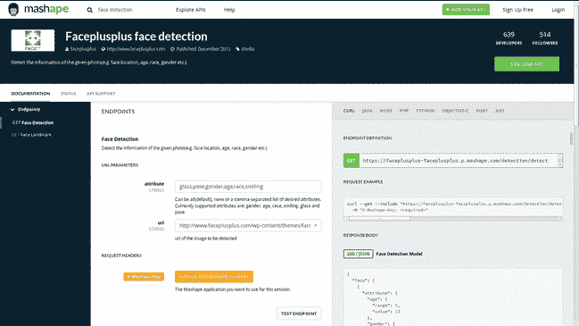
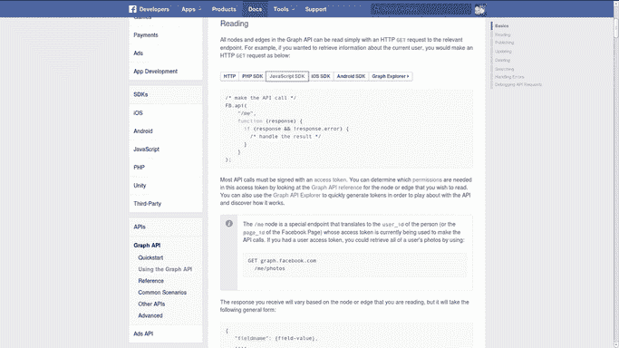
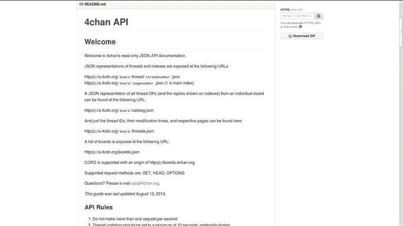
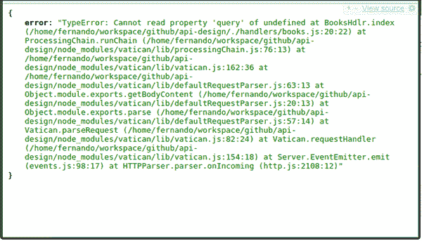
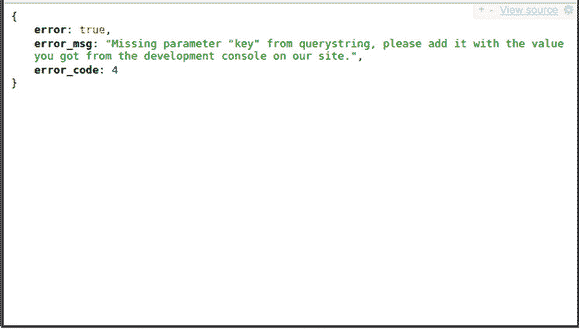
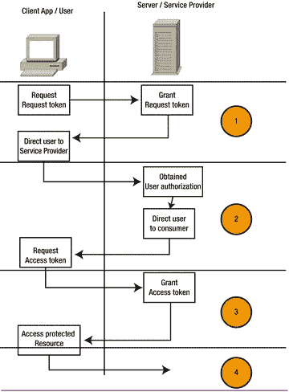
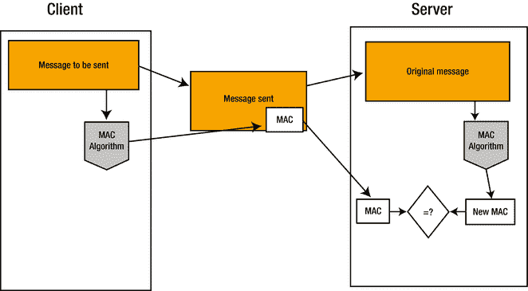
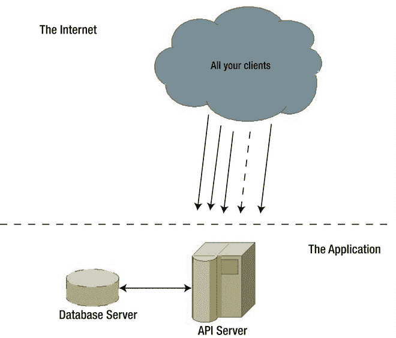
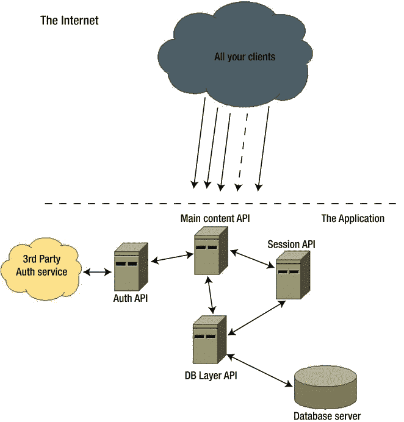

# 二、API 设计最佳实践

API 设计的实践是一件棘手的事情。即使有如此多的选择——使用的工具、应用的标准、遵循的风格——在开始任何类型的设计和开发之前，有一个基本问题需要回答，并且需要在开发人员的头脑中弄清楚……

## 什么定义了一个好的 API？

众所周知，“好”和“坏”的概念是非常主观的(一个人可能会读几本书来讨论这个问题)，因此，不同的人有不同的观点。也就是说，多年来处理不同种类 API 的经验让开发人员社区(以及本文作者)对任何好的 API 都必须具备的特性有了很好的认识。(免责声明:像干净的代码、良好的开发实践和其他内部考虑的事情在这里不会被提及，但是会被假定，因为它们应该是每个软件任务的一部分。)

所以让我们检查一下这个列表。

*   开发者友好:使用你的 API 的开发者在处理你的系统时不应该受到影响。
*   可扩展性:您的系统应该能够在不破坏客户端的情况下处理新特性的添加。
*   最新的文档:好的文档是新开发人员获得 API 的关键。
*   适当的错误处理:因为事情会出错，你需要做好准备。
*   提供多个 SDK/库:您为开发人员简化的工作越多，他们就会越喜欢您的系统。
*   安全:任何全球系统的一个关键方面。
*   可伸缩性:伸缩能力是任何好的 API 都应该具备的正确提供服务的能力。

我将逐一讨论这些要点，并展示它们如何影响 API，以及遵循 REST 风格如何有所帮助。

## 开发者友好

根据定义，API 是一个应用编程接口，关键词是接口。当考虑设计一个除了你自己以外的开发人员使用的 API 时，有一个关键的方面需要考虑:开发人员体验(或 DX)。

即使当 API 将被另一个系统使用时，集成到该系统中也是首先由一个或多个开发人员完成的——将人的因素带入该集成中的人。这意味着您希望 API 尽可能易于使用，这有助于实现出色的 DX，并且应该转化为更多的开发人员和客户端应用使用 API。

然而，这是一种权衡，因为为人类简化事物可能导致界面的过度简化，这反过来可能导致处理复杂功能时的设计问题。

将 DX 作为 API 的主要方面之一来考虑是很重要的(老实说，没有开发人员使用它，API 就没有任何意义)，但是在设计决策中还必须考虑其他一些方面。简单一点，但不要简单到假装。

接下来的部分提供了一些好的诊断指南。

### 通信协议

这是界面最基本的方面之一。在选择通信协议时，使用 API 开发人员熟悉的协议总是一个好主意。有几个标准已经在许多编程语言(例如 HTTP、FTP、SSH 等)中提供了库和模块。).

定制的协议并不总是一个好主意，因为在如此多的现有技术中，你会失去即时的可移植性。也就是说，如果您准备为最常用的语言创建支持库，并且您的定制协议对您的用例更有效，那么它可能是正确的选择。

最后，由 API 设计人员根据他工作的环境来评估最佳解决方案。

在本书中，您假设为 REST 选择的协议是 HTTP。 [1](#Fn1) 这是一个非常知名的协议；任何现代编程语言都支持它，它是整个互联网的基础。你可以放心，大多数开发者对如何使用它有基本的了解。如果没有，有大量的信息可以让你更好地了解它。

总之，没有完美的银弹协议适用于所有场景。考虑你的 API 需求，确保你选择的任何东西都与 REST 兼容，你就没事了。

### 易于记忆的接入点

所有客户端应用和 API 之间的接触点称为端点。API 需要提供它们来允许客户端访问它的功能。这可以通过选择任何通信协议来实现。这些访问点应该有一个简单的名字来帮助开发者理解它们的用途。

当然，名称本身不应该替代详细的文档，但是引用正在使用的资源，并在调用该访问点时提供某种操作指示，通常被认为是一个好主意。

下面是一个命名不当的访问点的好例子(用于列出书店中的书籍):

`GET /books/action1`

这个例子使用 HTTP 协议来指定访问点，即使使用的实体(books)被引用，动作名也不清楚；可能意味着任何事情，甚至更糟的是，这个意思将来可能会改变，但这个名字仍然合适，所以任何现有的客户无疑都会破产。

一个更好的例子——遵循 REST 和第 [1](1.html) 章中讨论的标准——是这样的:

`GET /books`

这将为开发人员提供足够多的信息，让他们理解对资源根(`/books`)的 GET 请求将总是产生这种类型的项目列表；然后，开发人员可以将这种模式复制到其他资源中，只要接口在所有其他端点上保持一致。

### 统一界面

易于记忆的接入点很重要，但是在定义接入点时保持一致也很重要。同样，在使用 API 时，您必须回到人的因素:您拥有它。因此，让他们的生活更容易是必须的，如果你想让任何人使用它，你不能忘记的 DX。这意味着在定义端点名称、请求格式和响应格式时，您需要保持一致。后两者可以有多个(更具体地说，响应格式与资源可以拥有的各种表示直接相关)，但是只要缺省值始终相同，就不会有问题。

不一致接口的一个很好的例子，即使不在 API 上，也可以在编程语言 PHP 中看到。它在大多数函数名上都有下划线符号，但是在一些函数名中没有使用下划线，所以开发人员总是被迫回到文档中检查如何编写这些函数(或者更糟，依靠他/她的记忆)。

例如，`str_replace`是一个使用下划线分隔两个单词(`str`和`replace`)的函数，而`htmlentities`根本没有单词分隔。

API 中糟糕的设计实践的另一个例子是基于所采取的动作而不是所处理的资源来命名端点；例如:

`/getAllBooks`

`/submitNewBook`

`/updateAuthor`

`/getBooksAuthors`

`/getNumberOfBooksOnStock`

这些例子清楚地显示了这个 API 遵循的模式。乍看起来，它们可能没有那么糟糕，但是考虑一下，随着新的特性和资源被添加到系统中，界面会变得多么糟糕(更不用说如果动作被修改)。系统的每一个新增加都会导致 API 接口的额外端点。客户端应用的开发者对于这些新的端点是如何命名的毫无头绪。例如，如果扩展 API 以支持书籍的封面图像，使用当前的命名方案，这些都是可能的新端点:

`/addNewImageToBook`

`/getBooksImages`

`/addCoverImage`

`/listBooksCovers`

这样的例子不胜枚举。因此，对于任何现实世界的应用，您可以放心地假设，遵循这种类型的模式将产生一个非常大的端点列表，增加服务器端代码和客户端代码的复杂性。这也将损害系统捕获新开发者的能力，因为多年来它将具有继承的复杂性。

为了解决这个问题，并在整个 API 中生成一个易于使用的统一接口，您可以将 REST 风格应用于端点。如果你还记得 REST 在第 1 章提出的约束，你会得到一个以资源为中心的接口。多亏了 HTTP，你还可以用动词来表示动作。

表 [2-1](#Tab1) 展示了使用 REST 之前的界面是如何变化的。

表 2-1。

List of Endpoints and How They Change When the REST Style Is Applied

<colgroup><col> <col></colgroup> 
| 旧历法 | REST 风格 |
| --- | --- |
| /getAllBooks | 获取/书籍 |
| /submitNewBook | 邮件/书籍 |
| /updateAuthor | 上传/作者/:id |
| /getBooksAuthors | GET /books/:id/authors |
| /getNumberOfBooksOnStock | GET /books(这个数字很容易作为这个端点的一部分返回。) |
| /addNewImageToBook | PUT /books/:id |
| /getbookimages | 获取/书籍/:id/图像 |
| /addCoverImage | POST/books/:id/封面 _ 图像 |
| /list books 封面 | GET /books(此信息可以使用子资源在此端点中返回。) |

您不必记住九个不同的端点，只需要记住两个，额外的好处是，一旦定义了标准，所有 HTTP 动词在所有情况下都是相同的；现在没有必要记住每种情况下的特定角色(它们总是意味着相同的事情)。

#### 运输语言

接口要考虑的另一个方面是使用的传输语言。多年来，事实上的标准是 XML 它提供了一种与技术无关的方式来表达可以在客户机和服务器之间轻松发送的数据。如今，有一种新的标准正在 XML 之上流行起来——JSON。

##### 为什么是 JSON？

在过去的几年中，JSON 作为标准数据传输格式越来越受欢迎(见图 [2-1](#Fig1) )。这主要是由于它提供的优势。下面列出了几个例子:

图 2-1。

Trend of Google searches for “JSON” vs. “XML” over the last few years

*   它很轻。JSON 文件中很少有数据与正在传输的信息没有直接关系。这是超越 XML 等更冗长格式的一个主要优势。 [2](#Fn2)
*   它是人类可读的。这种格式本身非常简单，人们可以很容易地阅读和书写。考虑到任何好的 API 界面的焦点都是人的因素(也称为 DX)，这一点尤其重要。
*   它支持不同的数据类型。因为不是所有被传输的都是字符串，所以这个特性允许开发人员为被传输的信息提供额外的含义。

这个列表还可以继续下去，但这是帮助 JSON 在开发人员社区中赢得如此多追随者的三个主要方面。

尽管 JSON 是一种很好的格式，并且越来越受欢迎，但它并不是总能解决所有问题的灵丹妙药；所以给客户提供选择也很重要。这就是 REST 发挥作用的地方。

由于 REST 所基于的协议是 HTTP，开发人员可以使用一种叫做内容协商的机制来允许客户端指定他们想要接收的支持格式(如第 [1](1.html) 章所讨论的)。这为 API 提供了更多的灵活性，并且仍然保持了界面的统一性。

回到端点列表，最后一个谈到使用子资源作为解决方案。这可以有多种解释，因为不仅用于传输数据的语言很重要，而且您提供给被传输数据的结构也很重要。我对统一接口的最后建议是标准化所用的格式，或者更好的是，遵循现有的格式，比如 HAL。

这在前一章中已经介绍过了，所以请回头参考它以获取更多信息。

## 展开性

一个好的 API 永远不会完全完成。这可能是一个大胆的主张，但它来自于社区的经验。让我们来看看一些大的。 [3](#Fn3)

*   谷歌 APIs 一天 50 亿次调用[4](#Fn4)；于 2005 年推出
*   脸书 APIs 一天 50 亿个呼叫 [5 个](#Fn5)；于 2007 年推出
*   Twitter APIs 一天 130 亿次调用[6](#Fn6)；于 2006 年推出

这些例子表明，即使当 API 背后有一个伟大的团队时，API 也会不断增长和变化，因为客户端应用开发人员找到了使用它的新方法，API 所有者的商业模式会随着时间的推移而变化，或者只是因为功能的添加和删除。

当发生这种情况时，可能需要扩展或更改 API，添加新的访问点或更改旧的访问点。如果最初的设计是正确的，那么从 v1 到 v2 应该没有问题，但如果不是，那么这种迁移可能会给每个人带来灾难。

### 扩展性是如何管理的？

当扩展 API 时，你基本上是在发布软件的一个新版本，所以你需要做的第一件事就是让你的用户(开发者)知道一旦新版本出来会发生什么。他们的应用还能用吗？这些变化是向后兼容的吗？你会在线维护你的 API 的几个版本，还是只维护最新的一个？

一个好的 API 应该考虑以下几点:

*   添加新端点有多容易？
*   新版本向后兼容吗？
*   在更新代码的同时，客户端可以继续使用旧版本的 API 吗？
*   以新 API 为目标的现有客户端会发生什么？
*   对于客户来说，瞄准 API 的新版本有多容易？

一旦所有这些问题都解决了，那么您就可以安全地发展和扩展 API 了。

通常，通过立即放弃版本 A 并使其脱机以支持版本 B 来从版本 A 升级到版本 B 被认为是一个糟糕的举动，当然，除非只有极少数客户端应用使用该版本。

对于这种情况，更好的方法是允许开发人员选择他们想要使用的 API 版本，将旧版本保留足够长的时间，以便让每个人都迁移到新版本。为了做到这一点，API 会在资源标识符(即每个资源的 URL)中包含其版本号。这种方法使版本号成为 URL 的强制部分，以清楚地显示正在使用的版本。

另一种方法可能不太清楚，就是提供一个指向 API 最新版本的无版本 URL，以及一个可选的 URL 参数来覆盖该版本。这两种方法各有利弊，需要由创建 API 的开发人员来权衡。

表 2-3。

Pros and Cons of Having the API Version Hidden from the User

<colgroup><col> <col></colgroup> 
| 赞成的意见 | 骗局 |
| --- | --- |
| 更简单的网址。 | 隐藏的版本号可能会导致混淆正在使用的版本。 |
| 即时迁移到 API 的最新工作代码。 | 非向后兼容的更改将破坏没有引用特定 API 版本的客户端。 |
| 从客户端的角度来看，从一个版本到下一个版本的简单迁移(只改变属性的值)。 | 使版本选择可用需要复杂的架构。 |
| 根据最新版本轻松测试客户端代码(只是不要发送特定于版本的参数)。 |

表 2-2。

Pros and Cons of Having the Version of the API As Part of the URL

<colgroup><col> <col></colgroup> 
| 赞成的意见 | 骗局 |
| --- | --- |
| 版本号清晰可见，有助于避免混淆正在使用的版本。 | URL 更加冗长。 |
| 从客户端的角度来看，很容易从一个版本迁移到另一个版本(所有的 URL 都改变相同的部分——版本号) | 当从一个版本迁移到另一个版本时，API 代码上的错误实现可能会导致大量的工作(即，如果版本是在端点的 URL 模板上硬编码的，每个端点都有单独的版本)。 |
| 当不止一个版本的 API 需要保持工作时，允许更清晰的架构。 |   |
| 从 API 的角度来看，从一个版本到下一个版本的迁移清晰而简单，因为两个版本可以并行工作一段时间，从而允许较慢的客户端在不中断的情况下进行迁移。 |
| 正确的版本控制方案可以使补丁和向后兼容的新特性立即可用，而不需要在客户端进行更新。 |

请记住，在设置软件产品的版本时，有几种版本化方案可供使用:

Ubuntu 的 [7](#Fn7) 版本号代表发布的年份和月份；所以 14.04 版本意味着是 2014 年 4 月发布的。

在 Chromium 项目中，版本号有四个部分[8](#Fn8):MAJOR . MINOR . build . patch .以下来自 Chromium 项目关于版本的页面:MAJOR 和 MINOR 可能会随着任何重要的 Google Chrome 版本而更新(Beta 或稳定更新)。对于任何向后不兼容的用户数据更改，必须更新 MAJOR(因为该数据在更新后仍然存在)。每当从当前主干构建一个发布候选时，构建必须得到更新(对于开发通道发布候选，至少每周一次)。构建号是一个不断增加的数字，代表 Chromium 主干的一个时间点。每当从构建分支构建一个发布候选时，补丁必须得到更新。

另一种中间方法，被称为语义版本化或 SemVer， [9](#Fn9) 被社区广泛接受。它提供了适量的信息。每个版本都有三个数字:MAJOR.MINOR.PATCH

*   MAJOR 表示不向后兼容的更改。
*   MINOR 表示使 API 向后兼容的新特性。
*   PATCH 代表小的变化，如错误修复和代码优化。

在这种模式下，第一个数字是唯一真正与客户相关的数字，因为这是表示与客户当前版本兼容的数字。

通过始终在 API 上部署最新版本的 MINOR 和 PATCH，您可以为客户提供最新的兼容特性和错误修复，而无需客户更新他们的代码。

因此，使用这个简单的版本控制方案，端点看起来像这样:

`GET /1/books?limit=10&size=10`

`POST /v2/photos`

`GET /books?v=1`

选择版本化方案时，请考虑以下因素:

*   通过使用错误版本的 API，使用错误的版本化方案可能会在实现客户端应用时导致混乱或问题。例如，在你的 API 中使用 Ubuntu 的版本控制方案可能不是交流每个新版本中发生的事情的最佳方式。
*   错误的版本控制方案可能会迫使客户端进行大量更新，比如在部署一个小的补丁或添加一个新的向后兼容特性时。这些变化不需要更新客户端。因此，除非您的方案需要，否则不要强迫客户端指定版本的这些部分。

## 最新文档

不管你的端点有多复杂，你仍然需要文档来解释你的 API 所做的一切。无论是可选参数还是接入点的机制，文档都是获得良好 DX 的基础，这将转化为更多用户。

一个好的 API 需要的不仅仅是解释如何使用一个接入点的几行代码(没有什么比发现你需要一个接入点，但是它根本没有文档更糟糕的了)，而是需要一个完整的参数列表和解释性的例子。

一些提供商给开发人员一个简单的 web 界面，让他们不用写任何代码就可以尝试他们的 API。这对新人特别有用。

有一些在线服务允许 API 开发者上传他们的文档，以及那些提供 web UI 来测试 API 的服务；比如 Mashape 免费提供这个服务(见图 [2-2](#Fig2) )。

图 2-2。

The service provided by Mashape

详细文档的另一个好例子是脸书的开发者网站。 [10](#Fn10) 提供了脸书支持的所有平台的实现和使用示例(见图 [2-3](#Fig3) )。

图 2-3。

Facebook’s API documentation site

图 [2-4](#Fig4) 显示了一个糟糕的文档示例。是 4chan 的 API 文档。 [11](#Fn11)

图 2-4。

Introduction to 4chan’s API documentation

是的，这个 API 看起来不够复杂，不值得写一整本书来介绍它，但是这里没有提供任何例子，只有一个关于如何找到端点和使用什么参数的一般性解释。

新手可能会发现很难理解如何实现一个使用这个 API 的简单客户端。

Note

比较 4chan 和脸书的文件是不公平的，因为团队和公司的规模完全不同。但是你应该注意到 4chan 的文档缺乏质量。

虽然在开发 API 时，这看起来不是最有成效的想法，但是团队需要考虑处理大量的文档。这是确保 API 成功或失败的主要因素之一，原因有两个:

*   它应该可以帮助新手和高级开发人员毫无问题地使用您的 API。
*   如果保持更新，它应该作为开发团队的蓝图。如果有一个关于 API 如何工作的写得很好、解释得很清楚的蓝图，那么进入项目中期开发会更容易。

Note

当 API 发生变化时，这也适用于更新文档。你需要保持更新；否则效果和根本没有文档一样。

## 适当的错误处理

API 上的错误处理非常重要，因为如果处理得当，它可以帮助客户端应用理解如何处理错误；从人的角度来看(DX)，它可以帮助开发人员了解他们做错了什么以及如何修复它。

在 API 客户端的生命周期中，有两个非常明显的时刻需要考虑错误处理:

*   阶段 1:客户端的开发。
*   阶段 2:最终用户实现并使用客户端。

### 阶段 1:客户端的开发

在第一阶段，开发人员实现所需的代码来使用 API。开发人员很可能会在请求中出错(比如缺少参数、错误的端点名称等等。)在这个阶段。

这些错误需要得到适当的处理，这意味着返回足够的信息，让开发人员知道他们做错了什么，以及如何修复它。

一些系统的常见问题是它们的创建者忽略了这个阶段，当请求出现问题时，API 就会崩溃，返回的信息只是一个错误消息，带有堆栈跟踪和状态代码 500。

图 [2-5](#Fig5) 中的响应显示了当您忘记在客户端开发阶段添加错误处理时会发生什么。返回的堆栈跟踪可能会给开发人员一些线索(最好的情况是)关于到底哪里出错了，但是它也显示了许多不必要的信息，所以它最终会令人困惑。这肯定会影响开发时间，毫无疑问，这也是反对 API DX 的主要原因。

图 2-5。

A classic example of a crash on the API returning the stack trace

另一方面，让我们看看图 [2-6](#Fig6) 中相同错误的正确错误响应。

图 2-6。

A proper error response would look like this

图 [2-6](#Fig6) 清楚显示出现了错误，错误是什么，以及错误代码。响应只有三个属性，但它们都很有用:

*   错误指示器为开发人员提供了一种明确的方法来检查响应是否是错误消息(您也可以根据响应的状态代码进行检查)。
*   该错误消息显然是为开发人员准备的，它不仅指出了缺少什么，还解释了如何修复它。
*   如果在文档中解释了自定义错误代码，当这种类型的响应再次发生时，它可以帮助开发人员自动执行操作。

### 阶段 2:最终用户实现并使用客户端

在客户端生命周期的这一阶段，您不会再遇到任何开发人员错误，比如使用错误的端点、缺少参数等等，但是仍然有可能出现由用户生成的数据引起的问题。

向用户请求某种输入的客户端应用总是会出现用户方面的错误，尽管在输入到达 API 层之前总是有方法验证输入，但假设所有客户端都会这样做也是不安全的。因此，对于任何 API 设计者和开发者来说，最安全的做法是假设客户端没有进行任何验证，任何可能出错的地方都是数据出错。从安全性的角度来看，这也是一个安全的假设，因此它提供了一个微小的安全性改进作为副作用。

有了这种心态，实现的 API 应该坚如磐石，能够处理输入数据中的任何类型的错误。

响应应该模仿第 1 阶段的响应:应该有一个错误指示器、一条说明错误的错误消息(如果可能，还有如何修复它)和一个定制的错误代码。自定义错误代码在这一阶段特别有用，因为它将为客户端提供自定义向最终用户显示的错误的能力(甚至显示不同但仍然相关的错误消息)。

## 多个 SDK/库

如果您希望您的 API 在不同的技术和平台上被广泛使用，那么开发并提供对可用于您的系统的库和 SDK 的支持可能是个好主意。

通过这样做，您为开发人员提供了消费您的服务的方法，因此他们所要做的就是使用它们来创建他们的客户端应用。本质上，您正在削减潜在的几周或几个月(取决于系统的大小)的开发时间。

另一个好处是，大多数开发人员会更信任你的库，因为你是这些库所使用的服务的所有者。

最后，考虑开源你的库的代码。如今，开源社区正在蓬勃发展。如果对他们有用，开发人员无疑会帮助维护和改进你的库。

让我们再来看看一些最大的 API:

*   脸书 API 为 iOS、Android、JavaScript、PHP 和 Unity 提供 SDK。 [12](#Fn12)
*   Google Maps API 提供了多种技术的 SDK，包括 iOS、Web 和 Android。 [十三](#Fn13)
*   Twitter API 为他们的几个 API 提供了 SDK，包括 Java、ASP、C++、Clojure、。NET，Go，JavaScript，还有很多其他语言。 [14](#Fn14)
*   亚马逊为他们的 AWS 服务提供 SDK，包括 PHP，Ruby，。NET，还有 iOS。他们甚至在 GitHub 上发布了 SDK，任何人都可以看到。 [十五](#Fn15)

## 安全

保护您的 API 是开发过程中非常重要的一步，它不应该被忽略，除非您构建的足够小，并且没有敏感数据值得花费精力。

在设计 API 时，有两个大的安全问题需要处理:

*   认证:谁将访问 API？
*   授权:一旦登录，他们能够访问什么？

认证处理让合法用户访问 API 提供的特性。授权处理那些经过身份验证的用户在系统内部实际可以做什么。

在详细讨论每个具体问题之前，在处理 RESTful 系统(至少是基于 HTTP 的系统)的安全性时，需要记住一些常见的方面:

*   RESTful 系统应该是无状态的。请记住，REST 将服务器定义为无状态的，这意味着在首次登录后将用户数据存储在会话中并不是一个好主意(如果您想遵守 REST 提供的准则)。
*   记得用 HTTPS。在基于 HTTP 的 RESTful 系统上，应该使用 HTTPS 来确保通道的加密，这使得捕获和读取数据流量更加困难(中间人攻击)。

### 进入系统

有一些广泛使用的身份验证方案可以在用户登录系统时提供不同的安全级别。最常见的有 TSL 基本认证、摘要认证、OAuth 1.0a 和 OAuth 2.0。

我将回顾一下这些，并谈谈它们各自的优缺点。我还将介绍另一种方法，它应该被证明是最 RESTful 的，也就是说它是 100%无状态的。

#### 几乎无状态的方法

OAuth 1.0a、OAuth 2.0、摘要认证和基本认证+ TSL 是目前流行的认证方法。它们工作得非常好，它们已经在所有现代编程语言中实现，并且它们已经被证明是这项工作的正确选择(当用于正确的用例时)。也就是说，正如你将要看到的，他们没有一个是 100%无国籍的。

它们都依赖于让用户将信息存储在服务器端的某种缓存层上。这个小细节，特别是对于纯粹主义者来说，意味着在设计 RESTful 系统时不要去做，因为它违背了 REST 强加的最基本的约束之一:客户机和服务器之间的通信必须是无状态的。

这意味着用户的状态不应该存储在任何地方。

然而，在这种特殊的情况下，你会以另一种方式看待。无论如何，我将涵盖每种方法的基础，因为在现实生活中，你必须妥协，你必须在纯粹性和实用性之间找到平衡。但别担心。我将介绍一种替代设计，它将解决身份验证并保持 REST 的真实性。

#### 与 TSL 的基本授权

由于本书的目的是将 REST 基于 HTTP，所以后者提供了大多数语言都支持的基本认证方法。

但是请记住，这个方法的名字很恰当，因为它非常基本，并且通过 HTTP 发送未加密的用户名和密码。因此，使它安全的唯一方法是通过 HTTPS (HTTP + TSL)的安全连接来使用它。

该认证方法的工作原理如下(参见图 [2-7](#Fig7) ):

图 2-7。

The steps between client and server on Basic Auth First, a client makes a request for a resource without any special header.   The server responds with a 401 unauthorized response, and within it, a WWW-Authenticate header, specifying the method to use (Basic or Digest) and the realm name.   The client then sends the same request, but adds the Authorization header, with the string USERNAME:PASSWORD encoded in base 64.  

在服务器端，需要一些代码来解码身份验证字符串，并从所使用的会话存储(通常是数据库)中加载用户数据。

除了这种方法是众多打破非静态约束的方法之一这一事实之外，它实现起来既简单又快速。

Note

使用此方法时，如果已登录用户的密码被重置，则根据请求发送的登录数据会变旧，并且当前会话会终止。

#### 摘要授权

这种方法是对前一种方法的改进，因为它通过加密登录信息增加了额外的安全层。与服务器的通信以同样的方式工作，来回发送相同的头。

使用这种方法，在接收到对受保护资源的请求时，服务器将用 WWW-Authenticate 头和一些特定的参数进行响应。以下是一些最有趣的例子:

*   Nounce:唯一生成的字符串。这个字符串需要在每个 401 响应中是唯一的。
*   Opaque:由服务器返回的字符串，必须由客户端不加修改地发送回来。
*   Qop:即使是可选的，也应该发送该参数来指定所需的保护质量(在该值中可以发送多个令牌)。发送回`auth`意味着简单的认证，而发送`auth-int`意味着带有完整性检查的认证。
*   算法:该字符串指定用于计算客户端校验和响应的算法。如果不存在，则应假设 MD5。

有关参数和实现细节的完整列表，请参考 RFC。 [16](#Fn16) 以下是一些最有趣的例子:

*   用户名:未加密的用户名。
*   URI:你试图进入的 URI。
*   响应:响应的加密部分。这证明了你就是你所说的那个人。
*   Qop:如果存在，它应该是服务器发送的支持值之一。

为了计算响应，需要应用以下逻辑:

`MD5(HA1:STRING:HA2)`

HA1 的这些值计算如下:

*   如果响应中没有指定算法，那么应该使用`MD5(username:realm:password)`。
*   如果算法是 MD5-less，那么应该是`MD5(MD5(username:realm:password):nonce:cnonce)`

HA2 的这些值计算如下:

*   如果`qop`是`auth`，那么应该使用`MD5(method:digestURI)`。
*   如果`qop`是`auth-int`，那么`MD5(method:digestURI:MD5(entityBody))`

最后，回应如下:

`MD5(HA1:nonce:nonceCount:clientNonce:HA2) //for the case when "qop" is "auth" or "auth-int"`

`MD5(HA1:nonce:HA2) //when "qop" is unspecified.`

这种方法的主要问题是所使用的加密是基于 MD5 的，并且在 2004 年已经证明这种算法是不抗冲突的，这基本上意味着中间人攻击将使攻击者有可能获得必要的信息并生成一组有效的凭证。

对这种方法的一个可能的改进，就像它的“基本”兄弟一样，是增加 TSL；这肯定有助于使它更加安全。

#### oath 1.0a

OAuth 1.0a 是本节描述的四种非静态方法中最安全的。这个过程比之前描述的要繁琐一些(见图 [2-8](#Fig8) )，但是这里的代价是安全级别的显著提高。

图 2-8。

The interaction between client and server

在这种情况下，服务提供商必须允许客户端应用的开发者在提供商的网站上注册应用。通过这样做，开发人员获得了消费者密钥(他的应用的唯一标识密钥)和消费者秘密。完成该过程后，需要执行以下步骤:

*   客户端应用需要请求令牌。目的是接收用户的批准，然后请求访问令牌。要获得请求令牌，服务器必须提供一个特定的 URL 在这个步骤中，使用消费者密钥和消费者秘密。
*   获得请求令牌后，客户端必须在特定的服务器 URL(即 [`http://provider.com/oauth/authorize`](http://provider.com/oauth/authorize) )上使用令牌发出请求，以获得最终用户的授权。
*   在用户授权后，客户端应用向提供商请求访问令牌和令牌密钥。
*   一旦获得访问令牌和秘密令牌，客户端应用就能够通过签署每个请求来代表用户为提供者请求受保护的资源。

有关此方法如何工作的更多详细信息，请参考完整的文档。 [17](#Fn17)

#### OAuth 2.0

OAuth 2.0 是 OAuth 1.0a 的发展；它关注客户端开发人员的简单性。使用 OAuth 1.0 的系统实现的主要问题是最后一步中隐含的复杂性:对每个请求进行签名。

由于其复杂性，最后一步是该算法的关键弱点:如果客户端或服务器犯了一个小错误，那么请求将不会被验证。即使同一个方面使它成为唯一不需要在 SSL(或 TSL)之上工作的方法，这种好处也是不够的。

OAuth 2.0 试图通过一些关键的改变来简化最后一步，主要是:

*   它依靠 SSL(或 TSL)来确保来回发送的信息是加密的。
*   生成令牌后，请求不需要签名。

总而言之，这个版本的 OAuth 试图简化 OAuth 1.0 引入的复杂性，同时牺牲安全性(通过依靠 TSL 来确保数据加密)。如果您处理的设备支持 TSL(计算机、移动设备等),这是优于 OAuth 1.0 的首选方法。);否则，您可能需要考虑使用其他选项。

#### 一个无状态的选择

正如您所看到的，在实现允许用户登录 RESTful API 的安全协议时，您所拥有的选择并不是无状态的，尽管您应该准备好做出这样的承诺，以便获得保护您的应用的可靠方法的好处，但也有一种完全兼容 REST 的方法可以做到这一点。

如果你回到第 1 章，无状态约束基本上意味着客户端和服务器之间的任何和所有通信状态都应该包含在客户端发出的每个请求中。这当然包括用户信息，所以如果您想要无状态认证，您也需要在您的请求中包括这些信息。

如果想确保每个请求的真实性，可以借用 OAuth 1.0a 的签名步骤，通过使用客户端和服务器之间预先建立的密钥，以及 MAC(消息认证码)算法来进行签名，将其应用于每个请求(见图 [2-9](#Fig9) )。

图 2-9。

How the MAC signing process works

由于保持无状态，生成 MAC 所需的信息也需要作为请求的一部分发送，这样服务器就可以重新创建结果并证实其有效性。

在我们的案例中，这种方法有一些明显的优势，主要是:

*   它比 OAuth 1.0a 和 OAuth 2.0 都简单。
*   需要零存储，因为验证加密所需的任何和所有信息都需要在每次请求时发送。

## 可量测性

最后但同样重要的是可伸缩性。

可伸缩性通常是 API 设计中被低估的一个方面，主要是因为在一个 API 发布之前，很难完全理解和预测它将达到的范围。如果团队以前有过类似项目的经验(例如，Google 可能已经很擅长在发布日之前计算新 API 的可伸缩性)，估计这一点可能更容易，但是如果这是他们的第一个项目，那么可能就不那么容易了。

一个好的 API 应该能够伸缩，也就是说，它应该能够处理尽可能多的流量，而不影响其性能。但这也意味着，如果不需要资源，就不应该花费。这不仅反映了 API 所在的硬件(尽管这是一个重要的方面),也反映了 API 的底层架构。

多年来，软件体系结构中的经典单体设计已经迁移到完全分布式设计中，因此将 API 拆分成彼此交互的不同模块是有意义的。

这提供了所需的灵活性，不仅可以扩大或缩小受影响的资源，还可以提供容错能力，帮助开发人员维护更干净的代码库以及其他优势。

下图(图 [2-10](#Fig10) )展示了一个标准的整体设计，将你的应用放在一个服务器中，就像一个单独的实体。

图 2-10。

Simple diagram of a monolithic architecture

在图 [2-11](#Fig11) 中，您可以看到一个分布式设计，如果与之前的设计相比，您可以看到优势来自哪里(更好的资源利用、容错、更容易扩展或缩小，等等)。

图 2-11。

A diagram showing an example of a distributed architecture.

使用 REST 实现分布式架构以确保可伸缩性非常简单。Fielding 的论文提出了一种基于客户机-服务器模式的分布式系统。

因此，将整个系统分割成一组更小的 API，让它们在需要时相互通信将确保前面提到的优势。

例如，让我们看一个书店的内部系统(表 [2-4](#Tab4) )，主要实体是:

表 2-4。

List of Entities and Their Role Inside the System

<colgroup><col> <col></colgroup> 
| 实体 | 描述 |
| --- | --- |
| 书 | 表示商店的库存。它将控制一切，从书籍数据，到副本数量，等等。 |
| 客户 | 客户的联系方式。 |
| 用户 | 内部书店用户，他们将有权访问系统。 |
| 购买 | 记录图书销售的信息。 |

现在，考虑一个小书店的系统，一个刚刚起步并且只有几个员工的书店。采用单片设计是非常有诱惑力的，不会花费太多的资源，而且设计非常简单。

现在，考虑一下，如果这家小书店突然增长如此之快，以至于它扩展到其他几家书店，它们从只有一家书店发展到 100 家，员工人数增加，书籍需要更好的跟踪，购买量上升，会发生什么。

以前的简单系统不足以应对这种增长。它需要改变以支持网络、集中数据存储、分布式访问、更好的存储容量等等。换句话说，扩大规模成本太高，而且可能需要完全重写。

最后，考虑另一个开始，如果您花时间使用基于 REST 的分布式架构创建第一个系统，会怎么样？让每个子系统都成为不同的 API，并让它们相互通信。

然后，您将能够更容易地扩展整个系统，在每个子系统上独立工作，不需要完全重写，系统可能会不断增长以满足新的需求。

## 摘要

本章涵盖了开发人员社区所认为的“好的 API”，其含义如下:

*   记住开发者体验(DX)。
*   能够在不破坏现有客户的情况下成长和提高。
*   拥有最新的文档。
*   提供正确的错误处理。
*   提供多个 SDK 和库。
*   考虑安全问题。
*   能够根据需要向上和向下扩展。

在下一章中，您将了解为什么 Node.js 是实现您在本章中学到的所有内容的完美匹配。

Footnotes [1](#Fn1_source)

[`http://www.w3.org/Protocols/rfc2616/rfc2616.html`见](http://www.w3.org/Protocols/rfc2616/rfc2616.html)。

  [2](#Fn2_source)

严格来说，XML 不是一种数据传输格式，但它正被用作一种数据传输格式。

  [3](#Fn3_source)

来源: [`http://www.slideshare.net/3scale/apis-for-biz-dev-20-which-business-model-15473323`](http://www.slideshare.net/3scale/apis-for-biz-dev-20-which-business-model-15473323) 。

  [4](#Fn4_source)

2010 年 4 月。

  [5](#Fn5_source)

2009 年十月。

  [6](#Fn6_source)

2011 年 5 月。

  [7](#Fn7_source)

[`https://help.ubuntu.com/community/CommonQuestions#Ubuntu_Releases_and_Version_Numbers`见](https://help.ubuntu.com/community/CommonQuestions#Ubuntu_Releases_and_Version_Numbers)。

  [8](#Fn8_source)

[`http://www.chromium.org/developers/version-numbers`见](http://www.chromium.org/developers/version-numbers)。

  [9](#Fn9_source)

参见 semver.org。

  [10](#Fn10_source)

[`https://developers.facebook.com/docs/graph-api/using-graph-api/v2.1`见](https://developers.facebook.com/docs/graph-api/using-graph-api/v2.1)。

  [11](#Fn11_source)

[`https://github.com/4chan/4chan-API`见](https://github.com/4chan/4chan-API)。

  [12](#Fn12_source)

参见[`https://developers.facebook.com`](https://developers.facebook.com/)(SDK 列表见页面底部)。

  [13](#Fn13_source)

[`https://developers.google.com/maps/`见](https://developers.google.com/maps/)。

  [14](#Fn14_source)

[`https://dev.twitter.com/overview/api/twitter-libraries`见](https://dev.twitter.com/overview/api/twitter-libraries)。

  [15](#Fn15_source)

[`https://github.com/aws`见](https://github.com/aws)。

  [16](#Fn16_source)

[`https://www.ietf.org/rfc/rfc2617.txt`见](https://www.ietf.org/rfc/rfc2617.txt)。

  [17](#Fn17_source)

[`http://oauth.net/core/1.0a/`见](http://oauth.net/core/1.0a/)。