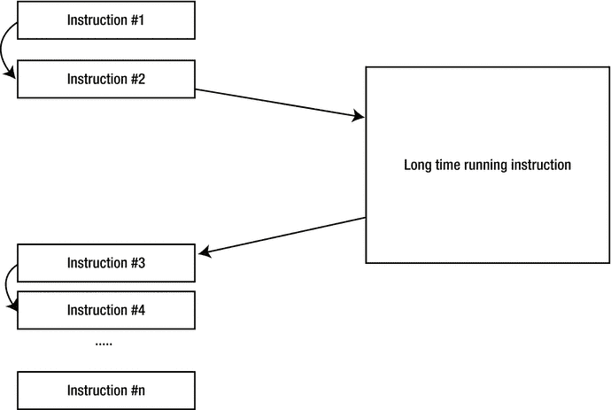
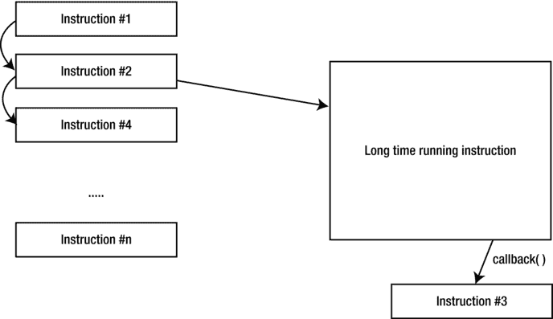
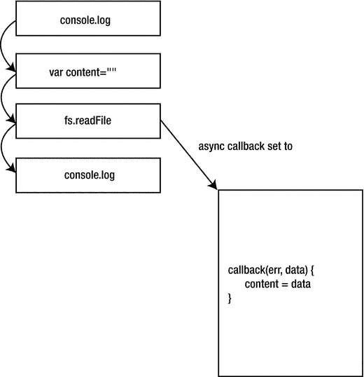
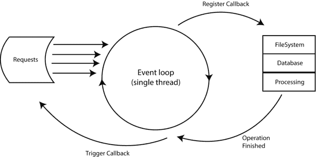
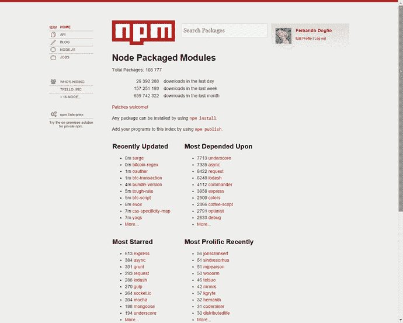

# 三、Node.js 和 REST

目前有太多的技术存在——无论是编程语言、平台还是框架。那么，为什么 node . js——一个在撰写本文时还没有达到 1.0 版本的项目——现在如此受欢迎呢？

硬件的进步使得开发人员有可能减少对代码的过度优化以提高速度，从而让他们更多地关注开发速度；因此，一套新的工具出现了。这些工具使开发新手更容易开发新项目，同时为高级开发人员提供了使用旧工具时获得的相同类型的功能。这些工具是当今新的编程语言和框架(Ruby on Rails、Laravel、Symfony、Express.js、Node.js、Django 等等)。

在这一章中，我将介绍其中最新的一个:Node.js。它是由 Ryan Dahl 在 2009 年创建的，并由 Dahl 工作过的 Joyent 公司赞助。在其核心，Node.js [1](#Fn1) 利用 Google V8 [2](#Fn2) 引擎在服务器端执行 JavaScript 代码。我将介绍它的主要特性，以帮助您理解为什么它是 API 开发的一个非常好的工具。

以下是本章涉及的 Node.js 的一些方面:

*   异步编程:这是 Node.js 的一个很棒的特性。我将讨论如何利用它来获得比使用其他技术更好的结果。
*   异步 I/O:虽然与异步编程有关，但这值得单独提及，因为在输入/输出繁重的应用中，这一特性是选择 Node.js 而不是其他技术的制胜法宝。
*   简单性:Node.js 使入门和编写第一个 web 服务器变得非常容易。你会看到一些例子。
*   与基于 JSON 的服务(如其他 API、MongoDB 等)惊人的集成。).
*   社区和Node包管理器(npm):我将回顾拥有一个使用该技术的大型开发人员社区的好处，以及 npm 是如何提供帮助的。
*   谁在使用它？最后，我将快速浏览一些在其生产平台中使用 Node.js 的大公司。

## 异步编程

异步(async)编程可能同时是 Node.js 最好和最令人困惑的特性之一。

异步编程意味着，对于您执行的每个异步函数，您不能期望它在继续程序流程之前返回结果。相反，您需要提供一个回调块/函数，一旦异步代码完成，就会执行这个回调块/函数。

图 [3-1](#Fig1) 显示了一个规则的非异步流程。

图 3-1。

A synchronous execution flow

图 [3-1](#Fig1) 表示一组以同步方式运行的指令。为了执行指令#4，您需要等待“长时间运行指令”花费的时间，然后等待指令#3 完成。但是如果指令#4 和指令#3 没有真正的联系呢？如果你真的不介意指令#3 和指令#4 的执行顺序，那会怎么样呢？

然后，您可以让“长时间运行指令”以异步方式执行，并提供指令#3 作为对它的回调，从而允许您更快地执行指令#4。图 [3-2](#Fig2) 显示了它的样子。

图 3-2。

An asynchronous execution flow

指令#4 不是等待它完成，而是在指令#2 启动异步“长时间运行指令”后立即执行。

这是异步编程潜在好处的一个非常简单的例子。可悲的是，就像这个数字世界中的大多数情况一样，没有什么是没有代价的，额外的好处也伴随着一个令人讨厌的交易:调试异步代码可能是一件真正令人头疼的事情。

开发人员被训练以他们编写代码的顺序方式来思考他们的代码，所以调试一个不是顺序的代码对新手来说可能是困难的。

例如，清单 [3-1](#FPar1) 和 [3-2](#FPar2) 分别显示了以同步和异步方式编写的同一段代码。

Listing 3-1. Synchronous Version of a Simple Read File Operation

`console.log("About to read the file...")`

`var content = Fs.readFileSync("/path/to/file")`

`console.log("File content: ", content)`

Listing 3-2. Asynchronous Version of a Simple File Read Operation with a Common Mistake

`console.log("About to read the file...")`

`var content = ""`

`fs.readFile("/path/to/file", function(err, data) {`

`content = data`

`})`

`console.log("File content: ", content)`

如果您还没有猜到，清单 [3-2](#FPar2) 将打印如下内容:

`File content:`

其原因与图 [3-3](#Fig3) 所示的图表直接相关。让我们用它来看看有问题的异步版本是怎么回事。

图 3-3。

The error from Listing [3-2](#FPar2)

文件内容没有被写入的原因很清楚:回调是在最后一行`console.log`之后执行的。这是新开发人员非常常见的错误，不仅是 Node.js，更具体地说是前端的 AJAX 调用。他们设置自己的代码，以便在异步调用实际结束之前使用异步调用返回的内容。

为了结束这个例子，清单 [3-3](#FPar3) 展示了需要如何编写代码才能正常工作。

Listing 3-3. Correct Version of the Asynchronous File Read Operation

`console.log("About to read the file...")`

`var content = ""`

`fs.readFile("/path/to/file", function(err, data) {`

`content = data`

`console.log("File content: ", content)`

`})`

很简单。您刚刚将最后一行`console.log`移动到回调函数中，所以您确定`content`变量设置正确。

### 异步高级

异步编程不仅仅是确保正确设置回调函数，它还允许一些有趣的流控制模式，可以用来提高应用的效率。

让我们来看看异步编程的两种截然不同且非常有用的控制流模式:并行流和串行流。

#### 平行流

并行流背后的思想是，程序可以并行运行一组不相关的任务，但只在所有任务执行完毕后调用所提供的回调函数(以收集它们的集体输出)。

基本上，清单 [3-4](#FPar4) 显示了你想要的。

Listing 3-4\.  Signature of the Parallel Function

`//functionX symbols are references to individual functions`

`parallel([function1, function2, function3, function4], function(data) {`

`///do something with the combined output once they all finished`

`})`

为了知道数组中传递的每个函数何时完成执行，它们必须执行一个回调函数，并给出它们的操作结果。回调将是他们收到的唯一属性。清单 [3-5](#FPar5) 显示了并行函数。

Listing 3-5. Implementation of the Parallel Function

`function parallel(funcs, callback) {`

`var results = [],`

`callsToCallback = 0`

`funcs.forEach(function(fn) { // iterate over all functions`

`setTimeout(fn(done), 200) // and call them with a 200 ms delay`

`})`

`function done(data) { // the functions will call this one when they finish and they’ll pass the results here`

`results.push(data)`

`if(++callsToCallback == funcs.length) {`

`callback(results)`

`}`

`}`

`}`

清单 [3-5](#FPar5) 中的实现非常简单，但它完成了它的任务:它以并行的方式运行一组函数(您将看到，由于 Node.js 在单线程中运行，真正的并行是不可能的，所以这是您能得到的最接近的结果)。这种类型的控制流在处理对外部服务的调用时特别有用。

让我们看一个实际的例子。假设您的 API 需要执行几个操作，尽管这些操作彼此不相关，但都需要在用户看到结果之前发生。例如，从数据库加载图书列表，查询外部服务以获取本周新书的新闻，并将请求记录到文件中。如果您要执行一系列任务中的所有任务(参见清单 [3-6](#FPar6) )，在下一个任务运行之前等待一个任务完成，那么用户很可能会遇到响应延迟，因为执行所需的总时间是所有单个时间的总和。

但是，如果您可以并行执行所有这些任务(参见清单 [3-7](#FPar7) ，那么总时间实际上等于执行最慢的任务所花费的时间。[T33](#Fn3)

让我们看看清单 [3-6](#FPar6) 和 [3-7](#FPar7) 中的两种情况。

Listing 3-6. Example of a Serial Flow (takes longer)

`//request handling code...`

`//assume "db" is already initialized and provides an interface to the data base`

`db.query("books", {limit:1000, page: 1}, function(books) {`

`services.bookNews.getThisWeeksNews(function(news) {`

`services.logging.logRequest(request, function() { //nothing returned, but you need to call it so you know the logging finished`

`response.render({listOfBooks: books, bookNews: news})`

`})`

`})`

`})`

Listing 3-7. Example of a Parallel Execution Flow

`//request handling code...`

`parallel([`

`function(callback) { db.query("books", {limit: 1000, page: 1}, callback) }),`

`function(callback) { services.bookNews.getThisWeeksNews(callback) }),`

`function(callback) { services.logRequest(request, callback) })`

`], function(data) {`

`var books = findData(‘books’, data)`

`var news = findData(‘news’, data)`

`response.render({listOfBooks: books, bookNews: news})`

`})`

清单 [3-6](#FPar6) 和 [3-7](#FPar7) 展示了每种方法的样子。`findData`函数只是查看`data`数组，并根据条目的结构返回所需的条目(第一个参数)。在`parallel`的实现中，它是必需的，因为你不能确定函数以什么顺序完成，然后返回结果。

除了代码获得明显的速度提升之外，它还更容易阅读，更容易向并行流程添加新任务——只需向数组添加一个新项目。

#### 串行流

串行流提供了方便地指定需要以特定顺序执行的功能列表的方法。这种解决方案不像并行流那样提供速度提升，但是它提供了编写这样的代码并保持其整洁的能力，远离了通常被称为意大利面条代码的东西。

清单 [3-8](#FPar8) 显示了你应该努力完成的任务。

Listing 3-8. Signature of the Serial Function

`serial([`

`function1, function2, function3`

`], function(data) {`

`//do something with the combined results`

`})`

清单 [3-9](#FPar9) 显示了你不应该做的事情。

Listing 3-9. Example of a Common Case of Nested Callbacks

`function1(function(data1) {`

`function2(function(data2) {`

`function3(function(data3) {`

`//do something with all the output`

`}`

`}`

`}`

您可以看到，如果函数的数量持续增长，清单 [3-9](#FPar9) 中的代码可能会失控。所以串行方法有助于保持代码的组织性和可读性。

让我们看看清单 [3-10](#FPar10) 中串行函数的可能实现。

Listing 3-10. Implementation of the Serial Function

`function serial(functions, done) {`

`var fn = functions.shift() //get the first function off the list`

`var results = []`

`fn(next)`

`function next(result) {`

`results.push(result) //save the results to be passed into the final callback once you don’t have any more functions to execute.`

`var nextFn = functions.shift()`

`if (nextFn) nextFn(next)`

`else done(results)`

`}`

`}`

这些函数还有更多的变化，比如使用一个错误参数来自动处理错误，或者限制并行流中同时执行的函数的数量。

总而言之，异步编程给实现 API 带来了很多好处。当处理外部服务时，并行工作流非常方便，这通常是任何 API 都会处理的；例如，数据库访问、其他 API、磁盘 I/O 等等。同时，串行工作流在实现像 Express.js 中间件这样的东西时也很有用。 [4](#Fn4)

对于一个在异步编程上蓬勃发展的全功能且经过测试的库，请查看 async.js. [5](#Fn5)

## 异步输入输出

异步编程的一个具体案例与 Node.js 提供的一个非常有趣的特性有关:异步 I/O，这个特性与 Node.js 的内部架构高度相关(见图 [3-4](#Fig4) )。我说过，Node.js 不提供多线程；它实际上与运行事件循环的单个线程一起工作。

图 3-4。

How the EventLoop orchestrates the execution of the code

简而言之，Node.js 的设计思想是 I/O 操作是每个操作的实际瓶颈，而不是处理能力；因此，Node进程收到的每个请求都将在事件循环中工作，直到找到 I/O 操作。当这种情况发生时，回调被注册在一个单独的队列中，主程序的流程继续。一旦 I/O 操作完成，回调就会被触发，回调中的代码就会运行。

### 异步 I/O 与同步 I/O

最后，为了证明到目前为止我所说的一切都是正确的，并且 Node.js 使用异步 I/O 工作得最好，我做了一些非常简单的基准测试。我创建了一个简单的 API，它有两个端点:

*   `/async`:在返回一个简单的 JSON 响应之前，异步读取一个 1.6MB 的文件。
*   `/sync`:在返回一个简单的 JSON 响应之前，同步读取一个 1.6MB 的文件。

两个端点做的完全一样；只是方式不同(见清单 [3-11](#FPar11) )。这个想法是为了证明，即使在这样简单的代码中，当底层代码利用平台提供的异步 I/O 时，事件循环也可以更好地处理多个请求。

清单 [3-11](#FPar11) 是两个端点的代码；API 是用梵蒂冈[T3】6T5】编写的](#Fn6)

Listing 3-11. Example of Two Endpoints Coded Using the Vatican.js Framework

`//Async handler`

`var fs = require("fs")`

`module.exports = AsyncHdlr;`

`function AsyncHdlr(_model) { this.model = _model }`

`//@endpoint (url: /async method: get)`

`AsyncHdlr.prototype.index = function(req, res, next) {`

`fs.readFile(__dirname + "/../file.txt", function (err, content) {`

`res.send({`

`success: true`

`})`

`})`

`}`

`//Sync handler`

`var fs = require("fs")`

`module.exports = SyncHdlr;`

`function SyncHdlr(_model) { this.model = _model }`

`//@endpoint (url: /sync method:get)`

`SyncHdlr.prototype.index = function(req, res, next) {`

`var content = fs.readFileSync(__dirname + "/../file.txt")`

`res.send({`

`success: true`

`})`

`}`

基准测试是使用 Apache 基准测试工具 [7](#Fn7) 完成的，使用了以下参数:

*   请求数:10 000
*   并发请求:100

结果如表 [3-1](#Tab1) 所示。

表 3-1。

Results from the Benchmark of the Two Endpoints Shown in Listing [3-11](#FPar11)

<colgroup><col> <col></colgroup> 
| 同步端点 | 异步端点 |
| --- | --- |
| 每秒请求数:2411.28[#/秒。](平均)每请求时间 41.472[毫秒](平均)每请求时间:0.415[毫秒](所有并发请求的平均)传输速率:214.28 [KBps]已接收 | 每秒请求数:2960.79[#/秒。](平均)每个请求的时间:33.775[毫秒](平均)每个请求的时间:0.338[毫秒](所有并发请求的平均)传输速率:263.12 [KBps]已接收 |

正如你在表 [3-1](#Tab1) 中看到的，即使是最简单的例子，在相同的时间内，异步代码处理的请求也比同步代码多 549 个。另一个有趣的项目是，每个请求在异步端点上几乎快了 8 毫秒；这可能不是一个很大的数字，但是考虑到您正在使用的代码的不存在的复杂性，这是非常相关的。

## 简单

Node.js(更确切地说是 JavaScript)并不是一种复杂的语言。它遵循了类似脚本语言(如 Ruby、Python 和 PHP)遵循的基本原则，但有所改变(就像所有其他语言一样)。Node.js 足够简单，任何开发人员都可以很快学会并开始编码，但它足够强大，几乎可以实现开发人员想做的任何事情。

尽管 JavaScript 是一种令人惊叹的语言，也是本书的重点，就像我已经说过并将继续说的那样:在编程方面没有灵丹妙药。多年来，JavaScript 获得了很大的吸引力，但它也吸引了很多讨厌它的人，他们有非常合理的理由:非标准的面向对象模型、`this`关键字的奇怪用法、缺乏语言内置的功能(它有很多专用于实现其他语言内置的基本特性的库)，等等。最后，每种工具都需要根据其优势来选择。正如您将要看到的，Node.js 是开发 API 的一个非常好的选择。

Node.js 为该语言增添了某种有用的味道，简化了开发人员开发后端代码的工作。它不仅添加了处理 I/O 所需的实用程序(出于明显的安全原因，前端 JavaScript 没有这些功能)，而且还为每个 web 浏览器支持的所有不同风格的 JavaScript 提供了稳定性。这方面的一个例子是，只需几行代码就可以轻松地建立一个 web 服务器。让我们看看清单 [3-12](#FPar12) 中的内容。

Listing 3-12. Simple Example of a Web Server Written in Node.js

`var http = require("http")`

`http.createServer(function(req, res) { //create the server`

`//request handler code here`

`});`

`http.listen(3000) //start it up on port 3000`

JavaScript 还有一个优势，它是所有商业 web 浏览器的标准前端语言，这意味着如果你是一个有前端经验的 web 开发人员，你肯定会遇到 JavaScript。

这对从前端迁移到后端的开发人员来说更简单；既然语言基础没变，你只需要学习新的东西，换一个后端的心态。同时，这有助于公司更快地找到 Node.js 开发者。

记住所有这些，让我们看看 JavaScript 的一些主要特征，这些特征使它成为如此简单(但功能强大)的选项。

### 动态打字

动态类型是一个基本特性，在当今大多数通用语言中都存在，但是它的功能并没有因此而减弱。这个小特性允许开发者在声明变量时不必想太多；给它一个名字，然后继续前进。

清单 [3-13](#FPar13) 展示了一些你不能用静态类型语言做的事情。

Listing 3-13. Example of Code Taking Advantage Of Dynamic Typing

`var a, b, tmp //declare the variables (just give them names)`

`//initialize them with different types`

`a = 10`

`b = "hello world"`

`//now swap the values`

`tmp = a`

`a = b //even with automatic casting, a language like C won’t be able to cast "hello world" into an integer value`

`b = tmp`

`console.log(a) //prints "hello world"`

`console.log(b) //prints 10`

### 简化的面向对象编程

JavaScript 不是一种面向对象的语言，但它确实支持其中一些特性(参见清单 [3-14](#FPar14) 和清单 [3-16](#FPar16) )。您将有足够多的概念来使用对象概念化问题和解决方案，这总是一种非常直观的思维方式，但同时，您没有处理像多态、接口或其他概念，这些概念尽管有助于构建代码，但已被证明在设计应用时是可有可无的。

Listing 3-14. Simplified Object Orientation Example

`var myObject = { //JS object notation helps simplify definitions`

`myAttribute: "some value",`

`myMethod: function(param1, param2) {`

`//does something here`

`}`

`}`

`//And the just...`

`myObject.myMethod(...)`

而对于其他语言，比如 Java(一种非常面向对象的语言)，您必须做清单 [3-15](#FPar15) 中所示的事情。

Listing 3-15. Example of a Class Definition in Java

`class myClass {`

`public string myAttribute;`

`public void myClass() {`

`}`

`public void myMethod(int param1, int param2) {`

`//does something here`

`}`

`}`

`//And then`

`myClass myObj = new myClass();`

`myObj.myMethod(...);`

少了很多罗嗦，不是吗？

在清单 [3-16](#FPar16) 中，让我们看看另一个强大的面向对象的例子。

Listing 3-16. Another Example of the Features Provided by Object Orientation in JavaScript

`var aDog = { //behave like a dog`

`makeNoise: function() {`

`console.log("woof!");`

`}`

`}`

`var aCat = { //behave like a cat`

`makeNoise: function() {`

`console.log("Meewww!");`

`}`

`}`

`var myAnimal = { //our main object`

`makeNoise: function() {`

`console.log("cri... cri....")`

`},`

`speak: function() {`

`this.makeNoise()`

`}`

`}`

`myAnimal.speak() //no change, so.. crickets!`

`myAnimal.speak.apply(aDog) //this will print "woof!"`

`//switch behavior`

`myAnimal.speak.apply(aCat) //this will now print "Meewww!"`

您能够将一个简单的行为封装到一个对象中，并将其传递到另一个对象中，以自动覆盖其默认行为。这是语言中固有的东西。您不必编写任何特定的代码来实现这个特性。

### 原型遗传

与上一个相联系，原型继承特性允许在对象生命周期的任何时刻对其进行难以置信的简单扩展；强大而简单。

让我们看看清单 [3-17](#FPar17) 来更好地理解这一点。

Listing 3-17. Example of Prototypal Inheritance in JavaScript

`var Parent = function() {`

`this.parentName = "Parent"`

`}`

`var Child = function() {`

`}`

`Child.prototype = new Parent()`

`var childObj = new Child();`

`console.log(childObj.parentName)`

`console.log(childObj.sayThanks) //that's undefined so far`

`Parent.prototype.sayThanks = function() { //you "teach" the method to the parent`

`console.log("Thanks!")`

`}`

`console.log(childObj.sayThanks()) //and booom! the child suddenly can say thanks now`

你是否动态影响了父对象——然后子对象突然更新了？是的，刚刚发生了！强大？我会这么说！

### 函数式编程支持

JavaScript 不是函数式编程语言；不过话说回来，它确实支持它的一些特性(参见清单 [3-18](#FPar18) 、 [3-19](#FPar19) 和 [3-20](#FPar20) )，比如拥有一级公民函数，允许你像传递参数一样传递它们，并且很容易返回闭包。这个特性使得使用回调成为可能，正如您已经看到的，回调是异步编程的基础。

让我们看看清单 [3-18](#FPar18) 中一个快速简单的函数式编程例子(记住，JavaScript 只提供了一些函数式编程的好东西，而不是全部)。创建一个加法函数。

Listing 3-18. Simple Example of an Adder Function Defined Using Functional Programming

`function adder(x) {`

`return function(y) {`

`return x+y`

`}`

`}`

`var add10 = adder(10) //you create a new function that adds 10 to whatever you pass to it.`

`console.log(add10(100)) //will output 110`

让我们看一个更复杂的例子，一个`map`函数的实现，它允许你通过传递数组和转换函数来转换数组的值。让我们首先看看如何使用地图功能。

Listing 3-19. Example of a Map Function Being Used

`map([1,2,3,4], function(x) { return x * 2 }) //will return [2,4,6, 8]`

`map(["h","e","l","l","o"], String.prototype.toUpperCase) //will return ["H","E","L","L","O"]`

现在让我们来看一个使用函数方法的可能实现。

Listing 3-20. Implementation of a Map Function, Like the One Used in Listing [3-19](#FPar19)

`function reduce(list, fn, init) {`

`if(list.length == 0) return init`

`var value = list[0]`

`init.push(fn.apply(value, [value])) //this will allow us to get both the functions that receive the value as parameters and the methods that use it from it’s context (like toUpperCase)`

`return reduce(list.slice(1), fn, init) //iterate over the list using it’s tail (everything but the first element)`

`}`

`function map(list, fn) {`

`return reduce(list, fn, [])`

`}`

### 鸭子打字

你听过这句话吗“如果它看起来像鸭子，游泳像鸭子，叫声像鸭子，那它很可能就是鸭子。”？那么，用 JavaScript 输入也是一样的。变量的类型由其内容和属性决定，而不是由固定值决定。所以同一个变量可以在脚本的生命周期中改变它的类型。鸭式打字既是一个非常强大的功能，同时也是一个危险的功能。

清单 [3-21](#FPar21) 提供了一个简单的演示。

Listing 3-21. Quick Example of Duck Typing in JavaScript

`var foo = "bar"`

`console.log(typeof foo) //will output "string"`

`foo = 10`

`console.log(typeof foo) //this will now output "number"`

### 对 JSON 的本机支持

这是一个棘手的问题，因为 JSON 实际上是从 JavaScript 衍生而来的，但是我们不要在这里纠缠于先有鸡还是先有蛋的问题。对现在使用的主要传输语言的本地支持是一大优势。

清单 [3-22](#FPar22) 是遵循 JSON 语法的一个简单例子。

Listing 3-22. Example of How JSON Is Natively Supported by JavaScript

`var myJSONProfile = {`

`"first_name": "Fernando",`

`"last_name": "Doglio",`

`"current_age": 30,`

`"married": true,`

`"phone_numbers": [`

`{`

`"home_phone": "59881000293",`

`"cell_phone": "59823142242"`

`}`

`]`

`}`

`//And you can interact with that JSON without having to parse it or anything`

`console.log(myJSONProfile.first_name, myJSONProfile.last_name)`

这一特殊功能在几种情况下特别有用；例如，当使用基于文档的存储解决方案(如 MongoDB)时，因为数据建模最终在两个地方(您的应用和数据库)都是本地的。此外，在开发 API 时，您已经看到目前选择的传输语言是 JSON，所以直接用原生符号格式化您的响应的能力(就此而言，您甚至可以只输出您的实体)对于易用性来说是一个非常大的优势。

这个列表还可以扩展，但是这些是 JavaScript 和 Node.js 带来的非常强大的特性，对开发人员没有太多要求。它们很容易理解和使用。

Note

提到的特性并不是 JavaScript 独有的；其他脚本语言也有一些。

## npm:Node包管理器

Node.js 的另一个优点是它惊人的包管理器。正如您现在可能知道的(或者即将发现的)，Node 中的开发是非常依赖于模块的，这意味着您不会开发整个系统；很可能你会以模块的形式重用别人的代码。

这是 Node.js 的一个非常重要的方面，因为这种方法允许您专注于使您的应用独一无二的东西，并让通用代码无缝集成。您不必为 HTTP 连接重新编码库，也不必为每个项目重新编码路由处理程序(换句话说，您不必重新发明轮子)；只需将项目的依赖项设置到`package.json`文件中，使用最合适的模块名，然后 npm 会检查整个依赖树并安装所有需要的东西(想想 APT for Ubuntu 或 Homebrew for Mac)。

可用的活跃用户和模块数量(每月超过 100，000 个包和超过 6 亿次下载)确保您可以找到您需要的内容；在极少数情况下，如果您不知道，您可以通过将特定的模块上传到注册表来帮助下一个寻找它的开发人员。

这种模块数量也可能是一件坏事，因为如此大的数量意味着将有几个模块试图做同样的事情。(例如，email-validation、sane-email-validation、mailcover 和 mailgun-email-validation 都试图做同样的事情——使用不同的技术验证电子邮件地址；根据你的需要，你必须选择一个。)你必须浏览它们，找到最合适的候选人。

这一切都要归功于自 Node.js 于 2009 年上市以来形成的令人惊叹的开发人员社区。

要开始使用 npm，只需访问他们的网站 [`www.npmjs.org`](http://www.npmjs.org/) 。在那里，你会看到一个最近更新的软件包列表，让你开始，以及一些最受欢迎的。

图 3-5。

The npm site

如果想直接安装它，只需在您的 Linux 控制台中写入下面一行:

`$ curl`[`https://www.npmjs.org/install.sh`](https://www.npmjs.org/install.sh)T2】

您需要安装 Node.js 版才能正确使用它。完成后，您只需输入以下命令即可开始安装模块:

`$ npm install [MODULE_NAME]`

该命令将指定的模块下载到名为`node_modules`的本地文件夹中；所以试着在你的项目文件夹中运行它。

您还可以使用 npm 开发自己的模块，并通过以下方式将它们发布到站点中:

`$ npm publish #run this command from within your project’s folder`

前面的命令从`package.json`文件中获取属性，打包模块，并将所有内容上传到 npm 的注册表中。之后，您可以进入站点并检查您的包裹；它会列在那里。

Note

除了查看 [`www.npmjs.org`](http://www.npmjs.org/) 之外，你还可以查看 Google Groups nodejs[8](#Fn8)和 nodejs-dev [9](#Fn9) 来直接联系 Node.js 社区中的人。

## 谁在用 Node.js？

这整本书旨在验证 Node.js 在开发 RESTful 系统方面有多好，并提供相关示例，同时验证让 Node.js 驱动的系统在生产中运行的想法有多有效(这是最难克服的障碍，尤其是在试图说服您的老板将堆栈转换为基于 Node.js 的堆栈时)。

但是有什么更好的验证呢，看看生产中 Node.js 的一些最重要的用户？

*   PayPal:使用 Node.js 支持其网络应用。
*   易贝:使用 Node.js 主要是因为异步 I/O 带来的好处。
*   LinkedIn:整个后端移动堆栈都是在 Node.js 中完成的。使用它的两个原因是与以前的堆栈相比获得的规模和性能。
*   网飞:在几个服务上使用 Node.js。经常在位于 [`http://techblog.netflix.com`](http://techblog.netflix.com/) 的科技博客上写一些使用 Node.js 的经历。
*   雅虎！:在几个产品上使用 Node.js，比如 Flickr，My Yahoo！和主页)。

这个列表还可以继续下去，包括其他公司的一个非常大的列表，有些公司比其他公司更知名，但要点仍然是:Node.js 用于整个互联网的生产服务，它处理各种流量。

## 摘要

本章介绍了 Node.js 对于普通开发人员的优势，尤其是它的特性如何提高 I/O 密集型系统(如 API)的性能。

在下一章中，您将获得更多的实践机会，并了解在最后一章中用于开发 API 的基本架构和工具。

Footnotes [1](#Fn1_source)

[`http://en.wikipedia.org/wiki/Node.js`见](http://en.wikipedia.org/wiki/Node.js)。

  [2](#Fn2_source)

见 [`http://en.wikipedia.org/wiki/V8_(JavaScript_engine`](http://en.wikipedia.org/wiki/V8_(JavaScript_engine) `)`。

  [3](#Fn3_source)

这是一个粗略的近似值，因为需要将并行功能增加的时间考虑在内，才能得到准确的数字。

  [4](#Fn4_source)

[`http://expressjs.com/guide/using-middleware.html`见](http://expressjs.com/guide/using-middleware.html)。

  [5](#Fn5_source)

[`https://github.com/caolan/async`见](https://github.com/caolan/async)。

  [6](#Fn6_source)

[`http://www.vaticanjs.info`见](http://www.vaticanjs.info/)。

  [7](#Fn7_source)

[`http://httpd.apache.org/docs/2.2/programs/ab.html`见](http://httpd.apache.org/docs/2.2/programs/ab.html)。

  [8](#Fn8_source)

[`https://groups.google.com/forum/#!forum/nodejs`见](https://groups.google.com/forum/#!forum/nodejs)。

  [9](#Fn9_source)

[`https://groups.google.com/forum/#!forum/nodejs-dev`见](https://groups.google.com/forum/#!forum/nodejs-dev)。