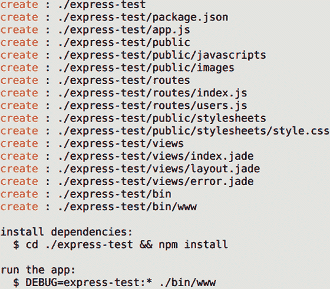
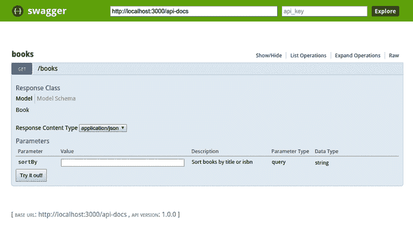
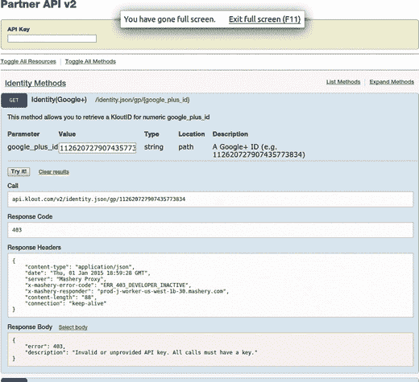
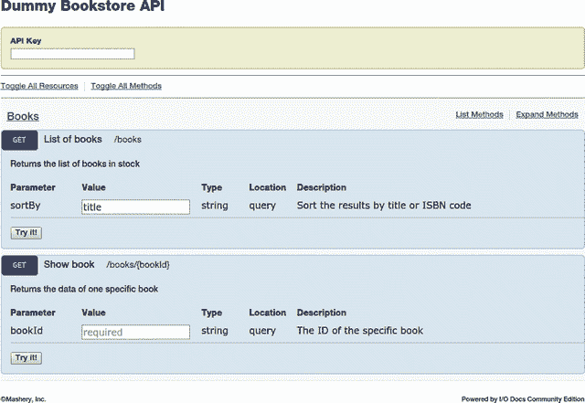

# 5.使用模块

正如我在第 3 章中所讨论的，Node.js 背后有一个巨大的开发者社区；他们愿意花费时间和精力为社区中的其他人提供高质量的模块。在这一章中，我将谈论其中的一些模块；你将看到如何使用它们来得到章节 [4](4.html) 中描述的架构。

更具体地说，您将需要以下部分的模块:

*   HTTP 请求和响应处理:这是最基本的特性。正如你将要看到的，有很多选项可供选择。
*   路由处理:除了前面提到的，请求处理是我们系统中最重要和最关键的部分之一。
*   预处理链(中间件):你可以省略后处理，因为它是一个不太常见的特性，但预处理(或中间件)是常见的，非常有用。
*   最新的文档:这不是我们架构的一部分，但是我在第 [2](2.html) 章谈到好的实践时提到了它。而且恰好有一个模块在这里会有所帮助，所以不妨添加一下。
*   超媒体的回应:同样，不是架构的一部分，而是 REST 的一部分，所以你将使用 HAL 标准来添加它。
*   响应和请求格式验证:最后，这将是一个额外的好处；作为一个良好的实践，总是验证请求和响应的格式。

## 我们的选择

您将看一下每个模块，而不是单独看每一点，我将相应地对它们进行评估。正如您将看到的，其中一些处理不止一件事情，这有时会很方便，因为让不相关的模块一起工作并不总是一件容易的事情。

### 请求/响应处理

关于请求和响应处理，它们通常都来自同一个模块。它们是您打算开发的每个 HTTP 应用程序的基础。如果你不知道如何处理 HTTP 协议，你就无法前进。

因为 Node.js 非常适合 HTTP 应用程序，所以有很多模块可以帮助您完成这项任务。您需要具备以下功能的设备:

*   在特定端口上侦听 HTTP 流量。
*   将 HTTP 消息转换成 JavaScript 对象，这样您就可以阅读和使用它，而不必担心解析它或 HTTP 协议的任何细节。
*   编写 HTTP 响应，而不必担心 HTTP 消息格式。

编写在特定端口监听 HTTP 流量的代码很简单；实际上，Node.js 提供了您需要的所有现成工具来实现前面三点。如果我们自己可以轻松完成，为什么我们需要额外的模块？这是一个非常有效的问题，老实说，这完全取决于你的需求。如果您正在构建的系统足够小，那么自己构建 HTTP 服务器可能是个好主意；否则，使用经过良好测试和尝试的模块总是好的。它们还为您解决其他相关问题，例如路线处理，因此使用第三方模块可能是一个不错的选择。

### 路线处理

路由处理与请求和响应处理紧密耦合；这是处理请求的下一步。一旦将 HTTP 消息转换成可以使用的实际 JavaScript 对象，就需要知道哪段代码需要处理它。这就是路由处理的用武之地。

这部分有两个方面。首先，您需要能够在代码中设置路由，并将处理程序的代码与一个或多个特定的路由相关联。然后，系统需要获取所请求资源的路径，并将其与您的路径进行匹配。这可能不是一件容易的事情。请记住，任何复杂系统中的大多数路由都有参数化的部分，如唯一 id 和其他参数。例如，看一下表 [5-1](#Tab1) 。

表 5-1。

Routing Example

<colgroup><col> <col></colgroup> 
| 这个… | ....需要匹配这个 |
| --- | --- |
| `/v1/books/1234412` | `/v1/books/:id` |
| `/v1/authors/jkrowling/books` | `/v1/:author_name/books` |

通常，路由框架提供某种模板语言，允许开发人员在路由模板中设置命名参数。稍后，考虑到添加的可变部分，框架将把请求的 URL 匹配到模板。不同的框架增加了不同的变化；一会儿你会看到其中一些。

### 中间件

这是预处理链在 Node.js 世界中通常得到的名字，这是因为 Connect [1](#Fn1) 框架(这是大多数其他 web 框架所基于的框架)具有这种功能。我在前一章已经谈到了这个话题，所以让我们来看一些与基于连接的框架兼容的中间件功能的例子:

`//Logs every request into the standard output`

`function logRequests(req, res, next) {`

`console.log("[", req.method, "]", req.url)`

`next()`

`}`

`/**`

`Makes sure that the body of the request is a valid json object, otherwise, it throws an error`

`*/`

`function formatRequestBody(req, res, next) {`

`if(typeof req.body == 'string') {`

`try {`

`req.body = JSON.parse(req.body)`

`} catch (ex) {`

`next("invalid data format")`

`}`

`}`

`next()`

`}`

这两个例子是不同的，但同时它们共享一个公共的函数签名。每个中间件函数都接收三个参数:请求对象、响应对象和下一个函数。这里最有趣的是最后一个参数，下一个函数，调用它是强制性的，除非你想在这里结束处理链。它调用链中的下一个中间件，除非您传入一个值，在这种情况下，它将调用它找到的第一个错误处理程序，并向它传递参数(通常是一个错误消息或对象)。

中间件的使用在认证、日志、会话处理等方面非常普遍。

### 最新文档

正如我已经讨论过的，如果您希望开发人员使用您的系统，保持 API 接口的最新文档是至关重要的。我将介绍一些对该领域有帮助的模块。当然，没有灵丹妙药；有些模块比其他模块增加了更多的开销，但是主要目标是拥有某种尽可能自动更新文档的系统。

### 超媒体在回应

如果您想不折不扣地遵循 REST 风格，您需要将它融入您的系统。这是 REST 最容易被遗忘的特性之一——也是最重要的特性，因为它允许自我发现，这是 RESTful 系统的另一个特性。

对于这个特殊的例子，您将使用一个预定义的标准 HAL(在第 [1](1.html) 章中介绍)，因此您将检查一些允许您使用这种特殊格式的模块。

### 响应和请求验证

我还将介绍一些模块，让您可以验证响应和请求格式。我们的 API 将单独使用 JSON，但是由于客户端应用程序中的错误，在请求中验证 JSON 的结构总是有用的，并且在响应中确保代码更改后服务器端没有错误。

在每个请求上添加验证可能开销太大，因此一个替代方案可能是一个测试套件，它在执行时负责验证。但是必须对每个请求进行请求格式验证，以确保系统的执行不会受到无效请求的影响。

### 模块列表

现在，让我们来看一些模块，这些模块负责所提到的一个或几个类别；对于每一个，您将列出以下属性:

*   模块的名称
*   它所属的类别
*   当前发布的版本
*   简短的描述
*   主页 URL
*   安装说明
*   代码示例

我们不会对它们进行比较，因为考虑到一些模块只处理一件事情，而另一些模块处理几件事情，这不是一件容易的事情。因此，在看完之后，我将提出这些模块的组合，但是如果它更适合您的问题，您将有足够的信息来选择不同的组合。

#### 哈皮

表 5-2。

HAPI Module Information

<colgroup><col> <col></colgroup> 
| 种类 | 请求/响应处理器、路由处理器 |
| 当前版本 | Eight point one |
| 描述 | HAPI 是一个以配置为中心的 web 框架，旨在创建任何类型的 web 应用程序，包括 API。HAPI 的主要目标是让开发人员专注于编写应用程序的逻辑，而将基础设施代码留给框架。 |
| 主页 URL | [T2`http://hapijs.com/`](http://hapijs.com/) |
| 装置 | 使用 npm 安装框架很简单:`$ npm install hapi`就是这样。HAPI 安装在您的应用程序中。您还可以运行下面的命令，将依赖项自动添加到您的`package.json`文件中:$ NPM install-–save hapi |

##### 代码示例

安装后，初始化系统并启动和运行服务器的最基本操作如下:

`var hapi = require("hapi")`

`var server = new hapi.Server()`

`server.connection({ port: 3000 })`

`server.start(function() {`

`console.log("Server running at: ", server.info.url)`

`})`

正如您所看到的，这个例子非常简单，但是初始化应用程序所需的步骤已经存在。`server.connection`行返回一个选择了新连接的服务器对象。这意味着您可以同时保持几个打开的连接，如下所示:

`var Hapi = require('hapi');`

`var server = new Hapi.Server()`

`// Create the API server with a host and port`

`var apiServer = server.connection({`

`host: 'localhost',`

`port: 8000`

`});`

`//Get list of books for normal client app`

`apiServer.route({`

`method: 'GET',`

`path: '/books',`

`handler: function(req, reply) {`

`//... code to handle this route`

`}`

`})`

`// Create the Admin server with a port`

`var adminServer = server.connection({`

`port: 3000`

`})`

`//Setup route to get full list of users for admin (with with credential information)`

`adminSever.route({`

`method: 'GET',`

`path: '/users',`

`handler: function(req, reply) {`

`//check credentials...`

`//get full list of users...`

`//reply(list)`

`}`

`})`

`server.start(function() {`

`console.log("Server started!")`

`})`

这段代码初始化应用程序，应用程序又设置了两个不同的服务器:一个用于 API 本身，另一个用于管理系统。在这段代码中，您还可以看到与 HAPI 建立路由是多么容易。尽管可以清楚地清理代码并把路由定义放到一个单独的文件中，但这是两个(或更多！)可以使用这个框架来配置具有各自路由的服务器。

HAPI 提供的另一个有趣的东西是你可以通过设置自己的路线模板来使用。有了它，您可以按以下方式使用命名参数:

`var Hapi = require('hapi');`

`var server = new Hapi.Server();`

`server.connection({ port: 3000 });`

`var getAuthor = function (request, reply) {`

`// here the author and book parameters are inside`

`// request.params`

`};`

`server.route({`

`path: '/{author}/{book?}',`

`method: 'GET',`

`handler: getAuthor`

`});`

在前面的代码中，当设置路由时，花括号内的任何内容都被视为命名参数。最后一个，添加了一个`?`，这意味着它是可选的。

Note

只有最后一个命名的参数可以设置为可选的；否则，毫无意义。

除了`?`，您可以使用另一个特殊字符告诉 HAPI 一个命名参数应该匹配的段数；该字符是*号，如果您希望它匹配任意数量的段，那么它后面应该跟一个大于 1 的数字，或者不跟任何数字。

Note

就像那个。字符，只有最后一个参数可以配置为匹配任意数量的段。

让我们看一些例子:

`server.route({`

`path: '/person/{name*2}', // Matches '/person/john/doe'`

`method: 'GET',`

`handler: getPerson`

`});`

`server.route({`

`path: '/author/{name*}', // Matches '/author/j/k/rowling' or '/author/frank/herbert' or /author/`

`method: 'GET',`

`handler: getAuthor`

`});`

`function getAuthor(req, reply) {`

`// The different segments can be obtained like this:`

`var segments = req.params.name.split('/')`

`}`

#### 快递. js

表 5-3。

Express.js Module Information

<colgroup><col> <col></colgroup> 
| 种类 | 请求/响应处理器、路由处理器、中间件 |
| 当前版本 | 4.11.2 |
| 描述 | Express 是一个成熟的 web 框架，为 HTTP 服务器提供了小而健壮的工具，使它成为各种 web 应用程序(包括 RESTful APIs)的绝佳候选。 |
| 主页 URL | `http://expressjs.com` |
| 装置 | `$ npm install –g express-generator` |

##### 代码示例

当涉及到在 Node.js 中构建 web 应用程序时，Express.js 有时被认为是事实上的解决方案，就像 Ruby on Rails 在很长一段时间内对于 Ruby 的意义一样。话虽如此，但这并不意味着 Express.js 应该是唯一的选择，或者它是每个项目的正确选择；因此，在为你的项目选择一个 web 框架之前，请确保你已经充分了解了相关信息。

这个特殊的框架已经发展了很多年，现在在版本 4 中它提供了一个生成器。要初始化整个项目，您必须使用以下代码行(按照表 [5-3](#Tab3) 中的说明安装后):

`$express ./express-test`

该行将生成如图 [5-1](#Fig1) 所示的输出。

图 5-1。

Output of the express generator command

该框架会生成许多文件夹和文件，但一般来说，它是一个通用 web 应用程序的结构，该应用程序具有视图、样式、JavaScript 文件和其他与 web 应用程序相关的资源。这不适合我们，因为我们正在构建一个 RESTful API。您需要删除这些文件夹(更具体地说，是视图和公共文件夹)。

要完成这个过程，只需进入文件夹并安装依赖项；这将为您留下一个工作的 web 应用程序。如果你想知道初始化框架需要什么，可以查看一下`app.js`文件。

现在让我们看看在 Express.js 中设置路线需要做些什么:

`//...`

`var app = express()`

`//...`

`app.get('/', function(req, res) {`

`console.log("Hello world!")`

`})`

就这样。设置路线时，您只需记住以下几点:应用程序。动词(URL 模板、处理程序函数)。处理函数将接收三个参数:请求对象、响应对象和下一个函数。最后一个参数仅在为同一路由和方法组合设置多个处理程序时有用；这样你就可以把这些方法像中间件一样链接起来。

看一下下面的例子:

`app.route('/users/:id')`

`.all(checkAuthentication)`

`.all(loadUSerData)`

`.get(returnDataHandler)`

`.put(updateUserHandler)`

在前面的代码中，发生了几件有趣的事情:

*   命名参数用于用户的 ID。
*   为每个到达`'/users/:id'`路径的动词设置了两个中间件函数。
*   它为命中 URL 的 GET 方法设置了一个处理程序，同时，它还为何时放置动词设置了一个处理程序——所有这些都在同一行代码中。

Express 提供了自己风格的命名参数(您可以在前面的代码中看到一个例子)，但是您还可以做其他事情。例如，您可以使用正则表达式:

`router.get(/^\/commit\/(\w+)(?:\.\.(\w+))?$/, function(req, res){`

`var from = req.params[0];`

`var to = req.params[1] || 'HEAD';`

`res.send('commit range ' + from + '..' + to);`

`});`

前面的代码匹配`'/commit/5bc2ab'`和`'/commit/5bc2ab..57ba31'`，您可以看到在处理程序代码中获取参数也很简单。

还可以设置一个回调函数，在收到特定的命名参数时做一些处理；例如:

`var router = express.Router()`

`router.param('user_id', function(req, res, next, id) {`

`loadUser(id, function(err, usr) {`

`if(err) {`

`next(new Error("There was an error loading the user's information")) //this will call erorr handler`

`} else {`

`req.user = usr`

`next()`

`}`

`})`

`})`

`//then on the route definition`

`app.get('/users/:user_id', function(req, res) {`

`//req.user is already defined and can be used`

`})`

如果在`user_id`回调函数上有一个错误，那么路由的处理程序将永远不会被调用，因为第一个错误处理程序将被调用。

最后，让我们看一些在 Express.js 中使用中间件的例子。我已经在前面介绍了这种类型函数的基础知识，但是您从来没有看到如何在 Express.js 中使用它。您可以通过两种方式来完成它:设置一个全局中间件或一个特定于路线的中间件。

对于全局中间件，您只需这样做:

`app.use(function(req, res, next) {`

`//your code here will be executed on every request`

`next() //remember to call next unless you want the chain to end here.`

`})`

对于特定于路由的中间件，您可以这样做:

`app.use('/books', function(req, res, next){`

`//this function will only be called on this path`

`next() //always important to call next unless you don't want the process' flow to continue.`

`})`

您甚至可以建立一个特定于路由的中间件堆栈，只需这样做:

`app.use('/books', function(req, res, next){`

`//this function will only be called on this path`

`next() //always important to call next unless you don't want the process' flow to continue.`

`}, function(req, res, next) {`

`//as long as you keep calling next, the framework will keep advancing in the chain until reaching the actual handler`

`next()`

`})`

#### 重新定义

表 5-4。

Restify Module’s Information

<colgroup><col> <col></colgroup> 
| 种类 | 请求/响应处理器、路由处理器、中间件 |
| 当前版本 | 2.8.5 |
| 描述 | Restify 是一个专门为构建 REST APIs 而设计框架。它大量借鉴了 Express.js(特别是 4.0 之前的版本)，因为 Express 被认为是构建 web 应用程序的标准。 |
| 主页 URL | `http://mcavage.me/node-restify/` |
| 装置 | `$ npm install restify` |

##### 代码示例

Restify 借用了 Express 的很多特性，所以我将重点放在它添加的东西上；其他示例，请参考前面的模块或访问 Restify 主页。

初始化比 Express 简单，尽管没有代码生成器。以下代码是启动服务器所需的全部内容:

`var restify = require('restify');`

`var server = restify.createServer({`

`name: 'MyApp',`

`});`

`server.listen(8080);`

`createServer`方法提供了一些有用的选项，将在未来简化你的工作。表 [5-5](#Tab5) 列出了 Restify 的一些选项。

表 5-5。

List of Restify Options

<colgroup><col> <col></colgroup> 
| [计]选项 | 描述 |
| --- | --- |
| 证书 | 对于构建 HTTPS 服务器，请在此处传递证书的路径。 |
| 键 | 对于构建 HTTPS 服务器，在这里传递密钥文件的路径。 |
| 原木 | 或者，您可以传入记录器的实例。它需要是 node-bunyan 的实例。 [2](#Fn2) |
| 名字 | API 的名称。用于设置服务器响应头；默认情况下，它是“restify”。 |
| 版本 | 所有路由的默认版本。 |
| 格式化程序 | 一组用于内容协商的内容格式化程序。 |

在最基本的方面，路由的处理就像 Express 一样:可以传入路径模板和路由处理程序，也可以传入正则表达式和处理程序。

以一种更高级的方式，Restify 提供了一些 Express 没有的好东西。以下小节提供了一些示例。

###### 命名路线

您可以为特定的路由设置名称，这将允许您使用该属性从一个处理程序跳转到其他处理程序。让我们先看看如何设置名称:

`server.get(``'/foo/:id'`T2】

`next('foo2');`

`});`

`server.get({`

`name: 'foo2',`

`path: '/foo/:id'`

`}, function (req, res, next) {`

`res.send(200);`

`next();`

`});`

这段代码为同一个路径设置了两个不同的处理程序，但是 Restify 只会执行它找到的第一个处理程序，所以第二个处理程序永远不会被执行，除非用第二个路径的名称调用`next`语句。

在呈现响应时，命名还用于引用路由，这提供了一个有趣的特性:响应上的超媒体。老实说，Restify 提出的解决方案有点基础，它并没有真正提供一个自动添加超媒体进行自我发现的良好机制，但它比大多数其他框架都要好。它是这样工作的:

`var restify = require("restify")`

`var server = restify.createServer()`

`server.get({`

`name: 'country-cities',`

`path: '/country/:id/cities'`

`}, function(req, res, next) {`

`res.send('cities')`

`})`

`server.get('/country/:id', function(req, res, next) {`

`res.send({`

`name: "Uruguay",`

`cities: server.router.render('country-cities', {id: "uruguay"})`

`})`

`})`

`server.listen(3000)`

###### 版本化路线

正如您前面看到的，Restify 提供了对全局版本号的支持，但是它也提供了在每条路由的基础上拥有不同版本的能力。此外，它还支持 Accept-version 标头选择正确的路线。

Note

如果缺少头，并且同一个路由有多个版本可用，Restify 将选择代码中定义的第一个。

下面是如何做到这一点:

`function respV1(req, res, next) {`

`res.send("This is version 1.0.2")`

`}`

`function respV2(req, res, next) {`

`res.send("This is version 2.1.3")`

`}`

`var myPath = "/my/route"`

`server.get({path: myPath, version: "1.0.2"}, respV1)`

`server.get({path: myPath, version: "2.1.3"}, respV2)`

现在，当点击具有不同接受版本值的路径时，表 [5-6](#Tab6) 中的信息就是您所得到的。

表 5-6。

Examples of Content Negotiation

<colgroup><col> <col> <col></colgroup> 
| 使用的版本 | 反应 | 描述 |
| --- | --- | --- |
|   | 这是版本 1.0.2 | 没有使用任何版本，所以默认情况下，服务器选择第一个定义的版本。 |
| 第一个 | 这是版本 1.0.2 | 选择了版本 1.x.x，因此这是服务器的响应。 |
| 【三】 | { "code": "InvalidVersion "，" message": "GET /my/route 支持版本:1.0.2，2.1.3" } | 当请求不支持的版本时，会返回一条错误消息。 |

###### 内容协商

Restify 提供的另一个有趣的特性是支持内容协商。要实现此功能，您只需在初始化期间提供正确的内容格式化程序，如下所示:

`restify.createServer({`

`formatters: {`

`'application/foo; q=0.9': function formatFoo(req, res, body) {`

`if (body instanceof Error)`

`return body.stack;`

`if (Buffer.isBuffer(body))`

`return body.toString('base64');`

`return util.inspect(body);`

`}`

`}`

`})`

Note

默认情况下，Restify 附带了用于 application/json、text/plain 和 application/octect-stream 的格式化程序。

Restify 还提供了其他一些我没有涉及的小特性，所以请参考官方网站获取信息。

#### 梵蒂冈. js

表 5-7。

Vatican.js Module Information

<colgroup><col> <col></colgroup> 
| 种类 | 请求/响应处理器、中间件、路由处理 |
| 当前版本 | 1.3.2 |
| 描述 | vantage . js 是一个旨在创建 RESTful APIs 的框架的又一次尝试。它不遵循快速/重新定义路径。它更关注 API 的 MVP 阶段，但是它提供了一个有趣的选择。 |
| 主页 URL | [T2`http://www.vaticanjs.info`](http://www.vaticanjs.info/) |
| 装置 | `$ npm install –g vatican` |

##### 代码示例

安装后，vantage . js 提供了一个命令行脚本来创建项目，并向其中添加资源和资源处理程序。因此，要启动项目，您需要使用以下命令:

`$ vatican new test_project`

前面的代码生成如图 [5-2](#Fig2) 所示的输出。

图 5-2。

Output of the Vatican.js generate action

主文件(`index.js`)有以下内容:

`var Vatican = require("vatican")`

`//Use all default settings`

`var app = new Vatican()`

`app.dbStart(function() {`

`console.log("Db connection stablished...")`

`//Start the server`

`app.start()`

`} )`

梵蒂冈提供了 MongoDB 集成，因此`dbStart`方法实际上是对 NoSQL 存储连接的引用。默认情况下，假设服务器位于 localhost 中，使用的数据库名称是`vatican-project`。

梵蒂冈的默认端口是 8753，但是就像梵蒂冈的所有默认端口一样，它可以在实例化阶段被覆盖。这些是可以传递给构造函数的选项，如表 [5-8](#Tab8) 所示。

表 5-8。

List of Options for the Vatican.js Constructor

<colgroup><col> <col></colgroup> 
| [计]选项 | 描述 |
| --- | --- |
| 港口 | HTTP 服务器的端口。 |
| 经理人 | 存储所有处理程序的文件夹的路径。默认是`./handlers`。 |
|  | 具有两个属性的对象:host 和 dbname。 |
| 克-奥二氏分级量表 | 这是一个布尔值，表示 API 是否支持 CORS，或者是一个对象，表示每个支持的头。 |

在梵蒂冈设置路线也和其他的有点不一样；命令行脚本提供了为实体/模型文件和控制器/处理程序文件自动生成代码的能力，其中还包括 CRUD 操作的基本代码。

要自动生成代码，请在项目文件夹中使用以下命令:

`$ vatican g Books -a title:string description:string copies:int -m newBook:post listBooks:get removeBook:delete`

该行输出类似于图 [5-3](#Fig3) 所示的内容。

图 5-3。

Output of the resource generator command

这基本上意味着梵蒂冈创建了处理程序文件和实体(在 schemas 文件夹中)。如果你检查处理程序的文件，你会注意到所有的动作都已经有了它们的代码；这是因为梵蒂冈能够通过使用它们的名称来猜测命令行中提供的操作的含义:

*   `newBook`:使用“new”假设您正在创建资源的一个新实例。
*   `listBooks`:使用“list”假设你想生成一个物品列表。
*   `removeBook`:使用“移除”假设你正试图移除一个资源。

这些词的变体也是有效的，梵蒂冈将使用它们来猜测代码。您现在可以开始启动服务器了；端点将工作并将信息保存到数据库。

关于资源生成的最后一个评论是关于路由的；您还没有指定任何路线，但梵蒂冈已经创建了它们。在处理程序文件中，您会注意到以下形式的注释:

`@endpoint (url: /books method: post)`

`BooksHdlr.prototype.newBook = function(req, res, next) {`

`var data = req.params.body`

`//...maybe do validation here?`

`this.model.create(data, function(err, obj) {`

`if(err) return next(err)`

`res.send(obj)`

`})`

`}`

方法定义上面的注释不是标准的 JavaScript，但是梵蒂冈能够解析它，并在启动时将它转换成数据。这意味着梵蒂冈没有路线文件；每个路由都是在它的相关方法之上定义的，如果您想获得系统的完整路由列表，可以使用下面的命令行:

`$ vatican list`

它将产生如图 [5-4](#Fig4) 所示的输出，其中列出了每个处理程序的所有路径，包括方法、路径、文件和相关的方法名。

图 5-4。

Output from the list command Note

注释可以用一行注释掉，以避免你的编辑抱怨这个结构；即使这样，vantage . js 也能够解析它。

最后，梵蒂冈也属于中间件类别，这是因为尽管它不是基于 Connect 或 Express，但它支持基于 Connect 的中间件。唯一的区别是使用它的方法名。

`vatican.preprocess(middlewareFunction) //generic middleware for all routes`

`vatican.preprocess(middelwareFunction, ['login', 'authentication']) //middleware for two routes: login and authentication.`

要设置路径的名称，您可以在注释中添加该参数，如下所示:

`@endpoint(url: /path method: get name: login)`

还有一些更多梵蒂冈. js 提供的功能。要了解它们，请参考官方网站。

#### 斯瓦格节点快车

表 5-9。

swagger-node-express Module Information

<colgroup><col> <col></colgroup> 
| 种类 | 最新文档 |
| 当前版本 | 2.1.3 |
| 描述 | 这是一个速成模块。它集成到一个 Express 应用程序中，并提供 Swagger [3](#Fn3) 用于记录 API 的功能，这是一个包含每种方法的文档和尝试这些方法的能力的 web 界面。 |
| 主页 URL | [T2`https://github.com/swagger-api/swagger-node-express`](https://github.com/swagger-api/swagger-node-express) |
| 装置 | `$ npm install swagger-node-express` |

##### 代码示例

安装模块后，您需要做的第一件事是将 Swagger 集成到您的 Express 应用程序中。下面是实现这一点的代码:

`// Load module dependencies.`

`var express = require("express")`

`, app = express()`

`, swagger = require("swagger-node-express").createNew(app);`

`// Create the application.`

`app.use(express.json());`

`app.use(express.urlencoded());`

集成完成后，接下来要做的事情是添加模型和处理程序。模型是 JSON 数据的形式(这是由开发人员的偏好决定的)。处理程序包含路由处理程序的实际代码，以及作为文档的其他描述性字段。

让我们看一个模型定义的例子:

`exports.models = {`

`"Book": {`

`"id": "Book",`

`"required": ["title", "isbn"],`

`"properties": {`

`"title": {`

`"type": "string",`

`"description": "The title of the book"`

`},`

`"isbn": {`

`"type": "string",`

`"description": "International Standard Book Number"`

`},`

`"copies": {`

`"type": "integer",`

`"format": "int64",`

`"description": "Number of copies of the book owned by the bookstore"`

`}`

`}`

`}`

`}`

如您所见，使用的格式是 JSON Schema [4](#Fn4) ，维护起来可能会很繁琐，但它为 Swagger 理解我们的模型是如何创建的提供了一种标准方式。

Tip

手动维护大量的模型描述可能工作量太大，并且很容易在文档中产生错误，所以使用描述来自动生成模型的代码，或者从模型的代码中自动生成描述可能是一个好主意。

一旦模型描述完成，您可以像这样将其添加到 Swagger 中:

`// Load module dependencies.`

`var express = require("express")`

`, swagger = require("swagger-node-express")`

`, models = require('./models-definitions').models`

`//....`

`swagger.addModels(models)`

现在转到处理程序的描述，它包含描述每个方法的字段，以及要执行的实际代码。

`//Book handler's file`

`exports.listBooks = {`

`"spec": {`

`"description": "Returns the list of books",`

`"path": "/books.{format}",`

`"method": "GET",`

`"type": "Book",`

`"nickname": "listBooks",`

`"produces": ["application/json"],`

`"parameters": [swagger.paramTypes.query("sortBy","Sort books by title or isbn", "string")]`

`},`

`"action": function(req, res) {`

`//...`

`}`

`}`

`//main file's code`

`var bookHandler = require("./bookHandler")`

`//...`

`swagger.addGet(bookHandler.listBooks) // adds the handler for the list action and the actual action itself`

这段代码展示了如何描述一个特定的服务(一个图书列表)。同样，这些参数中的一些(在规范对象中)可以自动生成；否则，手动维护大量规范会导致文档过时。

最后，设置 Swagger UI 的 URL(它将显示文档，还将提供测试 API 的 UI)和版本:

`swagger.configure("`[`http://myserver.com`](http://myserver.com/)T2】

现在让我们看一个主文件的完整例子，展示 Swagger 和 Swagger UI 的设置和配置。 [5](#Fn5)

`// Load module dependencies.`

`var express = require("express")`

`, models = require("./models").models`

`, app = express()`

`, booksHandler = require("./booksHandler") //load the handler's definition`

`, swagger = require("swagger-node-express").createNew(app) //bundle the app to swagger`

`// Create the application.`

`app.use(express.json());`

`app.use(express.urlencoded());`

`var static_url = express.static(__dirname + '/ui') //the swagger-ui is inside the "ui" folder`

`swagger.configureSwaggerPaths("", "api-docs", "") //you remove the {format} part of the paths, to simplify things`

`app.get(/^\/docs(\/.*)?$/ , function(req, res, next) {`

`if(req.url === '/docs') {`

`res.writeHead(302, {location: req.url + "/"})`

`res.end()`

`return`

`}`

`req.url = req.url.substr('/docs'.length)`

`return static_url(req, res, next)`

`})`

`//add the models and the handler`

`swagger`

`.addModels(models)`

`.addGet(booksHandler.listBooks)`

`swagger.configure("``http://localhost:3000`T2】

`app.listen("3000")`

图 [5-5](#Fig5) 是你通过访问`http://localhost:3000/docs`得到的结果 UI 的截图。

图 5-5。

The generated UI

#### I/odoc

表 5-10。

I/O Docs Module Information

<colgroup><col> <col></colgroup> 
| 种类 | 最新文档 |
| 当前版本 | 不适用的 |
| 描述 | I/O Docs 是一个为 RESTful APIs 设计的实时文档系统。通过使用 JSON 模式定义 API，I/O Docs 生成一个 web 接口来测试 API。 |
| 主页 URL | [T2`https://github.com/mashery/iodocs`](https://github.com/mashery/iodocs) |
| 装置 | `$ git clone` [`http://github.com/mashery/iodocs.git`](http://github.com/mashery/iodocs.git) `$ cd iodocs` |

##### 代码示例

安装完成后，测试应用程序剩下的唯一工作就是创建一个配置文件；有一个`config.json.sample`文件可以作为起点。

要启动文档服务器，请使用以下命令之一:

`$ npm start #for *nix and OSX systems`

`C:\your-project-folder> npm startwin #for Windows systems`

之后，用你的浏览器去`http://localhost:3000`开始测试文档系统。

图 [5-6](#Fig6) 是一个已经配置好的示例 API 的截图。

图 5-6。

The default UI when trying out methods

正如你在图 [5-6](#Fig6) 中看到的，当方法被测试时，一个响应显示在下面。如果您想建立自己的 API，有几件事要做:

Add your API to the list of documented APIs inside `public/data/apiconfig.json` like this:  

`{`

`"klout": {`

`"name": "Klout v2 API"`

`},`

`"egnyte": {`

`"name": "Egnyte API"`

`},`

`"usatoday": {`

`"name": "USA TODAY Census API"`

`},`

`"foursquare": {`

`"name": "Foursquare (OAuth 2.0 Auth Code)"`

`},`

`"rdio": {`

`"name": "Rdio Beta (OAuth 2.0 Client Credentials)"`

`},`

`"rdio2": {`

`"name": "Rdio Beta (OAuth 2.0 Implicit Grant)"`

`},`

`"requestbin": {`

`"name": "Requestb.in"`

`},`

`"bookstore": {`

`"name": "Dummy Bookstore API"`

`}`

`}`

Create a new file called `bookstore.json` and store it inside the public/data folder. This new JSON file will contain the description of your API and the methods in it; something like this:  

`{`

`"name": "Dummy Bookstore API",`

`"description": "Simple bookstore API",`

`"protocol": "rest",`

`"basePath": "`[`http://api.mybookstore.com`](http://api.mybookstore.com/)T2】

`"publicPath": "/v1",`

`"auth": {`

`"key": {`

`"param": "key"`

`}`

`},`

`"headers": {`

`"Accept": "application/json",`

`"Foo": "bar"`

`},`

`"resources": {`

`"Books": {`

`"methods": {`

`"listBooks": {`

`"name": "List of books",`

`"path": "/books",`

`"httpMethod": "GET",`

`"description": "Returns the list of books in stock",`

`"parameters": {`

`"sortBy": {`

`"type": "string",`

`"required": false,`

`"default": "title",`

`"description": "Sort the results by title or ISBN code"`

`}`

`}`

`},`

`"showBook": {`

`"name": "Show book",`

`"path": "/books/{bookId}",`

`"httpMethod": "GET",`

`"description": "Returns the data of one specific book",`

`"parameters": {`

`"bookId": {`

`"type": "string",`

`"required": true,`

`"default": "",`

`"description": "The ID of the specific book"`

`}`

`}`

`}`

`}`

`}`

`}`

`}`

图 5-7。

Your custom documentation translated into a web UI Start up the documentation server and point your web browser to it. You’ll see a screen that looks similar to Figure [5-7](#Fig7).  

与 Swagger 不同，这个文档系统并不打算集成到您的项目中，所以自动生成 JSON 代码可能会有点困难。

#### 哈斯顿

表 5-11。

Halson Module Information

<colgroup><col> <col></colgroup> 
| 种类 | 超媒体在回应 |
| 当前版本 | 2.3.1 |
| 描述 | Halson 是一个帮助创建符合 HAL 的 JSON 对象的模块，然后您就可以在 API 中将它作为响应的一部分。 |
| 主页 URL | `http://github.com/seznam/halson` |
| 装置 | `$ npm install halson` |

##### 代码示例

这个模块提供的 API 非常简单，如果你已经阅读了这个标准， [6](#Fn6) 你应该不难理解如何使用它。

以下是自述文件中的示例:

`var halson = require('halson');`

`var embed = halson({`

`title: "joyent / node",`

`description: "evented I/O for v8 javascript"`

`})`

`.addLink('self', '/joyent/node')`

`.addLink('author', {`

`href: '/joyent',`

`title: 'Joyent'`

`});`

`var resource = halson({`

`title: "Juraj Hájovský",`

`username: "hajovsky",`

`emails: [`

`"juraj.hajovsky@example.com",`

`"hajovsky@example.com"`

`]`

`})`

`.addLink('self', '/hajovsky')`

`.addEmbed('starred', embed);`

`console.log(JSON.stringify(resource));`

上述代码将输出以下内容:

`{`

`"title": "Juraj Hájovský",`

`"username": "hajovsky",`

`"emails": [`

`"``juraj.hajovsky@example.com`T2】

`"``hajovsky@example.com`T2】

`],`

`"_links": {`

`"self": {`

`"href": "/hajovsky"`

`}`

`},`

`"_embedded": {`

`"starred": {`

`"title": "joyent / node",`

`"description": "evented I/O for v8 javascript",`

`"_links": {`

`"self": {`

`"href": "/joyent/node"`

`},`

`"author": {`

`"href": "/joyent",`

`"title": "Joyent"`

`}`

`}`

`}`

`}`

`}`

如你所见，该模块成功地抽象出了关于 HAL 标准的细节；你只需要知道如何添加链接和什么是嵌入对象。

#### 硬件抽象层（Hardware Abstract Layer 的缩写）

表 5-12。

HAL Module Information

<colgroup><col> <col></colgroup> 
| 种类 | 超媒体在回应 |
| 当前版本 | 0.1.0 |
| 描述 | 哈尔是哈尔森的替代者。它提供了一个更简单的接口，但具有相同的底层功能:抽象出 HAL+JSON 格式，并为开发人员提供了一种简单的使用方法。 |
| 主页 URL | [T2`https://www.npmjs.com/package/hal`](https://www.npmjs.com/package/hal) |
| 装置 | `$ npm install hal` |

##### 代码示例

这个模块的 API 比 HALSON 提供的更简单，并且它还提供了 XML 编码(请记住，即使您没有关注 XML，它也可能是您的资源的第二种表示)。

让我们看一个简单的书店主题的例子:

`var hal = require('hal');`

`var books = new hal.Resource({name: "Books list"}, "/books")`

`var listOfBooks = [`

`new hal.Resource({id: 1, title: "Harry Potter and the Philosopher's stone", copies: 3}, "/books/1"),`

`new hal.Resource({id: 2, title: "Harry Potter and the Chamber of Secrets", copies: 5}, "/books/2"),`

`new hal.Resource({id: 3, title: "Harry Potter and the Prisoner of Azkaban", copies: 6}, "/books/3"),`

`new hal.Resource({id: 4, title: "Harry Potter and the Goblet of Fire", copies: 1}, "/books/4"),`

`new hal.Resource({id: 5, title: "Harry Potter and the Order of the Phoenix", copies: 8}, "/books/5"),`

`new hal.Resource({id: 6, title: "Harry Potter and the Half-blood Prince", copies: 2}, "/books/6"),`

`new hal.Resource({id: 7, title: "Harry Potter and the Deathly Hollows", copies: 7},"/books/7")`

`]`

`books.embed('books', listOfBooks)`

`console.log(JSON.stringify(books.toJSON()))`

该代码将输出以下 JSON 代码:

`{`

`"_links": {`

`"self": {`

`"href": "/books"`

`}`

`},`

`"_embedded": {`

`"books": [`

`{`

`"_links": {`

`"self": {`

`"href": "/books/1"`

`}`

`},`

`"id": 1,`

`"title": "Harry Potter and the Philosopher's stone",`

`"copies": 3`

`},`

`{`

`"_links": {`

`"self": {`

`"href": "/books/2"`

`}`

`},`

`"id": 2,`

`"title": "Harry Potter and the Chamber of Secrets",`

`"copies": 5`

`},`

`{`

`"_links": {`

`"self": {`

`"href": "/books/3"`

`}`

`},`

`"id": 3,`

`"title": "Harry Potter and the Prisoner of Azkaban",`

`"copies": 6`

`},`

`{`

`"_links": {`

`"self": {`

`"href": "/books/4"`

`}`

`},`

`"id": 4,`

`"title": "Harry Potter and the Goblet of Fire",`

`"copies": 1`

`},`

`{`

`"_links": {`

`"self": {`

`"href": "/books/5"`

`}`

`},`

`"id": 5,`

`"title": "Harry Potter and the Order of the Phoenix",`

`"copies": 8`

`},`

`{`

`"_links": {`

`"self": {`

`"href": "/books/6"`

`}`

`},`

`"id": 6,`

`"title": "Harry Potter and the Half-blood Prince",`

`"copies": 2`

`},`

`{`

`"_links": {`

`"self": {`

`"href": "/books/7"`

`}`

`},`

`"id": 7,`

`"title": "Harry Potter and the Deathly Hollows",`

`"copies": 7`

`}`

`]`

`},`

`"name": "Books list"`

`}`

#### JSON-Gate - 维基百科，自由的百科全书

表 5-13。

JSON-Gate Module Information

<colgroup><col> <col></colgroup> 
| 种类 | 请求/响应验证 |
| 当前版本 | 0.8.22 |
| 描述 | 该模块根据遵循 JSON 模式格式的预定义模式来验证 JSON 对象的结构和内容。 |
| 主页 URL | [T2`https://www.npmjs.com/package/json-gate`](https://www.npmjs.com/package/json-gate) |
| 装置 | `$ npm install json-gate` |

##### 代码示例

这个模块的用法非常简单。首先，您需要定义验证对象所依据的模式。这可以用`createSchema`方法直接完成，或者(推荐)在一个单独的文件中完成，然后传递给验证器。添加模式后，您可以根据需要验证任意数量的对象。

这里有一个简单的例子:

`var createSchema = require('json-gate').createSchema;`

`var schema = createSchema({`

`type: 'object',`

`properties: {`

`title: {`

`type: 'string',`

`minLength: 1,`

`maxLength: 64,`

`required: true`

`},`

`copies: {`

`type: 'integer',`

`maximum: 20,`

`default: 1`

`},`

`isbn: {`

`type: 'integer',`

`required: true`

`}`

`},`

`additionalProperties: false`

`});`

`var invalidInput = {`

`title: "This is a valid long title for a book, it might not be the best choice!",`

`copies: "3"`

`}`

`try {`

`schema.validate(invalidInput);`

`} catch(err) {`

`return console.log(err)`

`}`

上述代码将输出以下错误:

`[Error: JSON object property 'title': length is 71 when it should be at most 64]`

这里有两点需要注意:

*   一方面，错误消息非常“人性化”JSON-Gate 报告的所有错误信息都是这样的，很容易理解你做错了什么。
*   另一方面，正如您可能注意到的,`invalidInput`对象在格式上有两个错误；验证会在第一个错误时停止，因此纠正多个问题可能会很慢，因为您必须一次纠正一个问题。

如果您不喜欢捕捉异常(为什么要在 Node.js 中捕捉呢？)，对于`validate`方法还有一个替代方法，即传入第二个参数——一个回调函数，有两个参数:错误对象和原始输入对象。

#### TV4

表 5-14。

TV4 Module Information

<colgroup><col> <col></colgroup> 
| 种类 | 请求/响应验证 |
| 当前版本 | 1.1.9 |
| 描述 | 该模块提供了针对 JSON 模式版本 4 的验证。 [7](#Fn7) |
| 主页 url | [T2`https://www.npmjs.com/package/tv4`](https://www.npmjs.com/package/tv4) |
| 装置 | `$ npm install tv4` |

##### 代码示例

这个验证器和 JSON-Gate 的主要区别在于，它是针对 JSON 模式草案的第 4 版的。它还允许您在验证过程中收集多个错误并引用其他模式，因此您可以在不同的部分中重用部分模式。

让我们看一些例子:

`var validator = require("tv4")`

`var schema ={`

`"title": "Example Schema",`

`"type": "object",`

`"properties": {`

`"firstName": {`

`"type": "string"`

`},`

`"lastName": {`

`"type": "string"`

`},`

`"age": {`

`"description": "Age in years",`

`"type": "integer",`

`"minimum": 0`

`}`

`},`

`"required": ["firstName", "lastName"]`

`}`

`var invalidInput = {`

`firstName: 42,`

`age: "100"`

`}`

`var results = validator.validateMultiple(invalidInput, schema)`

`console.log(results)`

前面的示例将输出以下错误对象:

`{ errors:`

`[ { message: 'Missing required property: lastName',`

`params: [Object],`

`code: 302,`

`dataPath: '',`

`schemaPath: '/required/1',`

`subErrors: null,`

`stack: ‘...  ...’},`

`{ message: 'Invalid type: number (expected string)',`

`params: [Object],`

`code: 0,`

`dataPath: '/firstName',`

`schemaPath: '/properties/firstName/type',`

`subErrors: null,`

`stack: ‘......’},`

`{ message: 'Invalid type: string (expected integer)',`

`params: [Object],`

`code: 0,`

`dataPath: '/age',`

`schemaPath: '/properties/age/type',`

`subErrors: null,`

`stack: '......'}]`

`missing: [],`

`valid: false }`

输出比 JSON-Gate 的输出大得多，在使用它之前需要进行一些解析，但是除了简单的错误消息之外，它还提供了相当多的信息。

关于这个验证器提供的 API 的完整参考，请访问它的主页。要了解使用 JSON 模式可以完成的所有可能的验证，请访问在线草稿。

## 摘要

这一章涵盖了许多模块，它们将帮助你创建完美的 API 架构。在挑选工作工具的选项上，每个类别至少有两个模块。

在下一章中，你将定义你将在接下来的章节中开发的 API，有了这个定义，你也将挑选你将用来开发它的模块集(从本章的列表中)。

Footnotes [1](#Fn1_source)

[`https://www.npmjs.com/package/connect`见](https://www.npmjs.com/package/connect)。

  [2](#Fn2_source)

[`https://github.com/trentm/node-bunyan`见](https://github.com/trentm/node-bunyan)。

  [3](#Fn3_source)

[`http://swagger.io/`见](http://swagger.io/)。

  [4](#Fn4_source)

[`http://json-schema.org/`见](http://json-schema.org/)。

  [5](#Fn5_source)

[`https://github.com/swagger-api/swagger-ui`见](https://github.com/swagger-api/swagger-ui)。

  [6](#Fn6_source)

[`http://stateless.co/hal_specification.html`见](http://stateless.co/hal_specification.html)。

  [7](#Fn7_source)

[`http://json-schema.org/latest/json-schema-core.html`见](http://json-schema.org/latest/json-schema-core.html)。